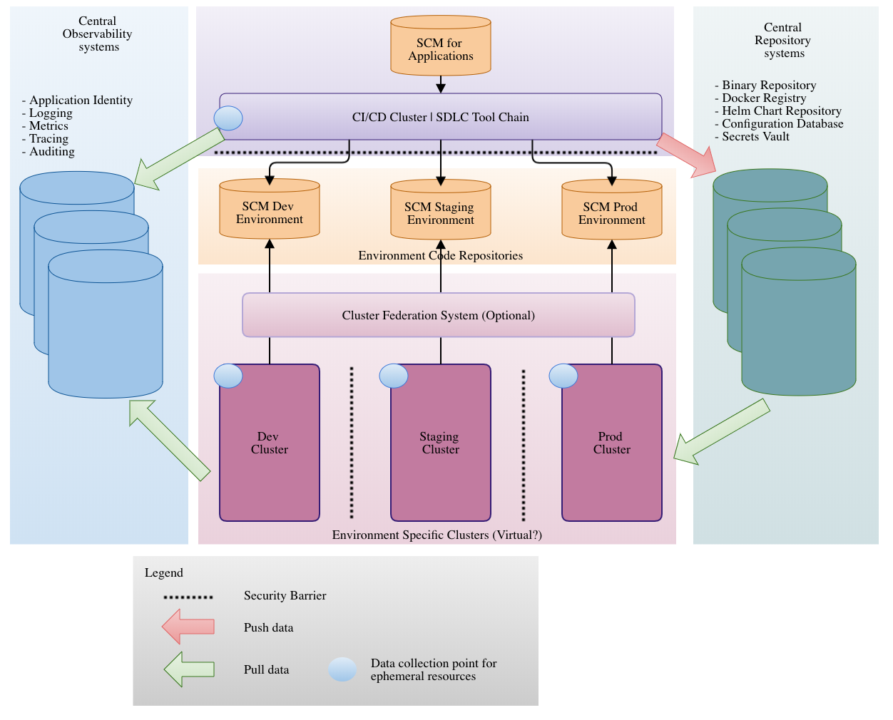

# The Next Chapter In The SDLC Tool Chain Evolution

NOTE: Overal, this is great!!! However, I sense as if you started great, and then got tired in the second half and rushed it.

To understand Jenkins X better, we'll start by exploring the (recent) history of building and deploying software. For the sake of brevity, we will not go all the way back to writing software on punch cards. Instead, we'll start at the advent of Jenkins that rose to prominence in the late 00s as Hudson the build server of choice within the Java community.

Hadson solved a growing need for a reliable, consistent and programmable way of building and testing software. In many organizations, it formed the heart of an emerging system, the Software Development Lifecycle processes and toolchain that accompany them.

As software started eating the world, companies began to rely on this toolchain for more and more of their core business success. As the reliance grew, so did the dependence on this toolchain to provide more information than "green build" or "red build". To accommodate this need for more information, the number of tools in the toolchain grew. Test tools, static code analysis, security testing, and lint tools are only a few of the types that emerged.

Once we understood that quality of code can be measured and that we can design gates that will precent us from moving further, we turned our attention to deployment. The more the of the steps proceeding it were automated, the more our focus shifted to the deployment. As a result, many organizations moved from continuous integration (CI) that deals mostly with building and partial testing, to continuous delivery (CD), that adds the latter parts of software development lifecycle. As a result, continuous delivery tries to define and automated the whole lifecycle of an application, from a commit to a code repository, all the way until a new release is deployed to production.

With the increase in adoption of CI/CD, the race for "delivering more software faster" started. Soon it become obvious that the key was in collaboration. As a result, tools that facilitate it sprouted like mushrooms.

The demand on the software increased with the number of people and speed of delivery. To combat this, some opted for High Availability, others - such as Git - chose for Decentralization. 

NOTE: I'm not sure I understand the previous paragraph. It's as if you started saying something and then gave up.

## New Challenges

NOTE: I wouldn't put a new sub-chapter/title here. The previous looks unfinished, and this one seem to continue the thoughts from it.

The rapid increase in the number of tools, the number of people working on software and the increasing need for collaboration created several essential challenges.

1. scale the toolchain to fit demand
1. track all the changes going on within the SDLC toolchain
1. simplify deployment across platforms/languages/frameworks
1. include infrastructure/platform in the CI cycle of the application
1. every tool must be automatable from scratch with either an API or (preferred) declarative configuration
1. only take resources when being used (ScaleToZero)
1. can define workflow from beginning to end (programmable/declarative definition)
1. allows the creation of opinionated workflows that allows overrides and enables extensions
1. can recreate the environment from a source definition
1. will enable you to get started right away with delivering applications

NOTE: I believe that each of the points from above deserve an explanation. I would convert them into text. At the end of it, there could be buller points that would serve more as a summary of that text. My guess is that those bullet points and the text that follows are still only your notes or that they come from slides that accompany voice of a speaker. Is that it?

These are critical challenges to be met by any SDLC toolchain. And as we will see, Jenkins X can help you tackle most if not all of them with great ease.

## Anatomy Of The New Chain

Look below of the anatomy of the new SDLC toolchain.

We'll dissect the model into a few parts. Mind you, while tools might intersect, the idea is to look at the SDLC. So "data" refers to the data produced by the SDLC, not by the applications themselves.

* **Workflow**: how does a change in SCM end up as it intended effect in the correct environment
* **Information**: we need continuous information about the state of our SDLC toolchain and application landscape. Monitoring, logging, auditing, etc.
* **Data**:  we need to permanently - or at least for an X amount of time - artifact generated within the SDLC. Docker images, Java Jar's, Helm Charts, etc.
* **Environments**: we will manage environments via the SDLC as well. With the advent of GitOps, this will be done via X as Code via our Git repository.

### Expectation table

| Component    	| Runtime Type 	| Storage Type 	| Sizing               	|
|--------------	|--------------	|--------------	|----------------------	|
| Workflow     	| Event Based  	| Ephemeral    	| Autoscale            	|
| Information  	| Permanent    	| Temporary    	| Autoscale            	|
| Data         	| Event Based  	| Permanent    	| Autoscale            	|
| Environments 	| Permanent    	| Permanent    	| Predictive Autoscale 	|

### GitOps Model

