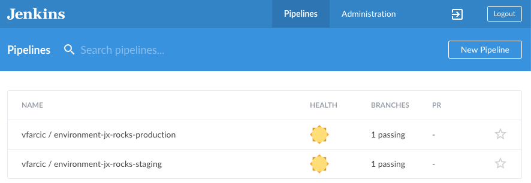

# What Is Jenkins X?

To understand Jenkins X, we need to understand Kubernetes. But, this is not the place where you will learn Kubernetes, but rather extend your knowledge. So, I will assume that you already know what Kubernetes is and how to use it. If you do not, Jenkins X might be overwhelming, and I suggest you learn at least basic Kubernetes features and get a bit of hands-on practice. You might want to fetch **The DevOps 2.3 Toolkit: Kubernetes** book before proceeding with this one. Yet, we all know that Kubernetes has a very steep learning curve. I do not expect you to be a Kubernetes ninja and to know everything there is to know about Kubernetes. No one does. As a matter a fact, Jenkins X helps us by simplifying complex processes into concepts that can be adopted quickly and without spending months in trying to figure out "the right way to do stuff." It helps to elevate some of the problems based on the overall complexity of Kubernetes and its ecosystem.

I'll skip telling you that Kubernetes is a container orchestrator, how it manages our deployments, and how it took over the world by the storm. You hopefully already know all that. Instead, I'll define Kubernetes as a platform to rule them all. Today, most software vendors are building their next generation of software to be Kubernetes-native or, at least, to work better inside it. A whole ecosystem is emerging and treating Kubernetes as a blank canvas. As a result, new tools are being added on a daily basis, and it is becoming evident that Kubernetes offers near-limitless possibilities. However, with that comes increased complexity. It is harder than ever to choose which tools to use. How are we going to develop our applications? How are we going to manage different environments? How are we going to package our applications? Which process are we going to apply for application lifecycles? And so on and so forth. Assembling a Kubernetes cluster with all the tools and processes takes time, and learning how to use what we assembled feels like a never-ending story. Jenkins X aims to remove those and quite other obstacles.

Jenkins X is opinionated. It defines many aspects of the software development lifecycle, and it makes decisions for us. It tells us what to do and how. It is like a tour guide on your vacations that shows you where to go, what to look at, when to take a photo, and when it's time to take a break. At the same time, it is flexible and allows power users to tweak it to fit their own needs.

The real power behind Jenkins X is the process, the selection of tools, and the glue that wraps everything into one cohesive unit that is easy to learn and use. We (people working in the software industry) tend to reinvent the wheel all the time. We spend countless hours trying to figure out how to develop our applications faster and how to have a local environment that is as close to production as possible. We dedicate time searching for tools that will allow us to package and deploy our applications more efficiently. We design the steps that form a continuous delivery pipeline. We write scripts that automate repetitive tasks. And yet, we cannot escape the feeling that we are likely reinventing things that were already done by others. Jenkins X is designed to help us with those decisions, and it helps us to pick the right tools for a job. It is a collection of industry's best practices. In some cases, Jenkins X is the one defining those practices, while in others it helps us adopting those made by others.

If we are about to start working on a new project, Jenkins X will create the structure and the required files. If we need a Kubernetes cluster with all the tools selected, installed, and configured, Jenkins X will do that. If we need to create Git repositories, set webhooks, and create continuous delivery pipelines, all we need to do is execute a single `jx` command. The list of what Jenkins X does is vast, and it grows every day.

I won't go into details of everything Jenkins X does. That will come later. For now, I hope I got your attention. The critical thing to note is that you need to clear your mind from any Jenkins experience you might already have. Sure, Jenkins is there, but it is only a part of the package. Jenkins X is very different from the "traditional Jenkins". The differences are so massive that the only way for you to embrace it is to forget what you know about Jenkins and start from scratch.

I don't want to overwhelm you from the start. There's a lot of ground to cover, and we'll take one step at a time. For now, we need to install a few things.

## Installing Prerequisites

Before we jump into Jenkins X, we'll need a few tools that will be used throughout this book. I'm sure that you already have most (if not all) of them, but I'll list them anyway.

I'm sure that you already have [git](https://git-scm.com/). If you don't, you and I are not living in the same century. I would not even mention it, if not for GitBash. If you are using Windows, please make sure that you have GitBash (part of the Git setup) and to run all the commands from it. Other shells might work as well. Still, I tested all the commands on Windows with GitBash, so that's your safest bet. If, on the other hand, you are a MacOS or Linux user, just fire up your favorite terminal.

Jenkins X CLI (we'll install it soon) will do its best to install [kubectl](https://kubernetes.io/docs/tasks/tools/install-kubectl/) and [Helm](https://docs.helm.sh/using_helm/#installing-helm). However, the number of permutations of what we have on our laptops is close to infinite, and you're better of installing those two yourself.

We'll need a Kubernetes cluster, and I'll assume that you already have CLIs provided by your hosting vendor. You should be able to use (almost) any Kubernetes flavor to run Jenkins X, so the choice is up to you. I won't force you to use a particular vendor. Just as with kubectl and Helm, Jenkins X will try to install appropriate CLI, but you might be better of installing it yourself. If you're planning to use AWS EKS cluster, you probably already have [AWS CLI](https://aws.amazon.com/cli/) and [eksctl](https://github.com/weaveworks/eksctl). If your preference is with Google GKE, I'm sure that you have [gcloud](https://cloud.google.com/sdk/docs/quickstarts). Similarly, if you prefer Azure, you likely have [Azure CLI](https://docs.microsoft.com/en-us/cli/azure/install-azure-cli) on your laptop. Finally, if you prefer something else, I'm sure you know which CLI fits your situation.

There is one restriction though. You can use (almost) any Kubernetes cluster, but it needs to be publicly accessible. The main reason for that lies in GitHub triggers. Jenkins X relies heavily on GitOps principles. Most of the events will be triggered by GitHub webhooks. If your cluster cannot be accessed from GitHub, you won't be able to trigger those events, and you will have difficulty following the examples. Now, that might pose two significant issues. You might prefer to practice locally using minikube or Docker Desktop. Neither of the two is accessible from outside your laptop. Or you might have a corporate cluster that is inaccessible to the outside world. In those cases, I suggest you use a service from AWS, GCP, Azure, or from anywhere else. Each chapter will start with the instructions to create a new cluster, and it will end with instructions on how to destroy it (if you choose to do so). That way, the costs will be kept to a bare minimum. If you sign up to one of the Cloud providers, they will give you much more credit than what you will spend on the exercises from this book, even if you are the slowest reader in the world. If you're not sure which one to pick, I suggest [Google Cloud Platform (GCP)](https://console.cloud.google.com). At the time of this writing, their managed Kubernetes offering called Google Kubernetes Engine (GKE) is the best cluster on the market.

Moving on to the final set of requirements...

A few examples will use [jq](https://stedolan.github.io/jq/download/) to filter and format JSON output. Please install it.

Finally, we'll perform some GitHub operations using [hub](https://hub.github.com/). Install it, if you don't have it already.

That's it. I'm not forcing you to use anything but the tools you should have anyway.

For your convenience, the list of all the tools we'll use is as follows.

* [git](https://git-scm.com/)
* GitBash (if using Windows)
* [kubectl](https://kubernetes.io/docs/tasks/tools/install-kubectl/)
* [Helm](https://docs.helm.sh/using_helm/#installing-helm)
* [AWS CLI](https://aws.amazon.com/cli/) and [eksctl](https://github.com/weaveworks/eksctl) (if using AWS EKS)
* [gcloud](https://cloud.google.com/sdk/docs/quickstarts) (if using Google GKE)
* [Azure CLI](https://docs.microsoft.com/en-us/cli/azure/install-azure-cli) (if using Azure AKS)
* [jq](https://stedolan.github.io/jq/download/)
* [hub](https://hub.github.com/)

Now, let's install Jenkins X CLI.

## Installing Jenkins X CLI

I> All the commands from this chapter are available in the [02-intro.sh](https://gist.github.com/8cef206b4df0b1bbec3060d1d45c2a80) Gist.

If you are a **MacOS** user, please install `jx` using `brew`.

```bash
brew tap jenkins-x/jx

brew install jx
```

If you are a **Linux** user, the instructions are as follows.

```bash
mkdir -p ~/.jx/bin

curl -L https://github.com/jenkins-x/jx/releases/download/v1.3.634/jx-linux-amd64.tar.gz \
    | tar xzv -C ~/.jx/bin

export PATH=$PATH:~/.jx/bin

echo 'export PATH=$PATH:~/.jx/bin' \
    >> ~/.bashrc
```

Finally, Windows users can install the CLI using [Chocolatey](https://chocolatey.org/install).

```bash
choco install jenkins-x
```

Now we are ready to install Jenkins X.

## To Create A Cluster Or Not To Create A Cluster

I already mentioned that Jenkins X is much more than a tool for continuous integration or continuous delivery. One of the many features it has is to create a fully operational Kubernetes cluster and install the tools we might need to operate it efficiently. On the other hand, `jx` allows us to install Jenkins X inside an existing Kubernetes cluster as well. So, we need to make a choice. Do we want to let `jx` create a cluster for us, or are we going to install Jenkins X inside an existing cluster? The decision will largely depend on your current situation, as well as the purpose of the cluster.

If you plan to create a cluster only for the purpose of the exercises in this book, I recommend using `jx` to create a cluster, assuming that your favorite hosting vendor is one of the supported ones. Another reason for letting `jx` handle creation of the cluster lies in potential desire to have a dedicated cluster for continuous delivery. In both cases, we can use `jx create cluster` command.

On the other hand, you might already have a cluster where other applications are running and might want to add Jenkins X to it. In that case, all we have to do is install Jenkins X by executing `jx install`.

Let's go through the help of both `jx create cluster` and `jx install` commands and see what we've got.

```bash
jx create cluster help
```

Judging from the output, we can see that Jenkins X works with quite a few different providers. We can use it inside Azure AKS, AWS with kops, AWS EKS, Google GKE, Oracle OKE, IBM ICP, IBM IKS, minikube, minishift, OpenShift, and Kubernetes. Now, the last provider I mentioned is curious. Aren't all other providers just different flavors of Kubernetes? If they are, why do we have a provider called `kubernetes` on top of more specific providers (e.g., GKE)? The `kubernetes` provider allows us to run Jenkins X in (almost) any Kubernetes flavor. The difference between the `kubernetes` provider and all the others lies in additions that are useful only for those providers. Nevertheless, you can run Jenkins X in (almost) any Kubernetes flavor. If your provider is on the list, use it. Otherwise, pick `kubernetes` provider instead.

As a side note, do not trust the list I presented as being final. By the time you read this, Jenkins X might have added more providers to the list.

It is worthwhile mentioning that `jx` cannot create a cluster in all those providers, but that it can run there. A few of those cannot be created dynamically. Namely, OKE, ICP, and OpenShift. If you prefer one of those, you'll have to wait until we reach the part with the instructions to install Jenkins X in an existing cluster.

You'll also notice that `jx` will install some of the local dependencies if you do not have them already on your laptop. Which ones will be installed depends on your choice of the provider. For example, `gcloud` is installed only if you choose GKE as your provider. On the other hand, `kubectl` will be installed no matter the choice, as long as you do not have it already in your laptop.

So, if you do choose to use one of the cloud providers, `jx create cluster` is an excellent option, unless you already have a cluster where you'd like to install Jenkins X. If that's the case, or if you cannot use one of the cloud providers, you should be exploring the `jx install` command instead. It is a subset of `create cluster`. If we take a look at the supported providers in the `install` command, we'll see that they are the same as those we saw in `create cluster`.

```bash
jx install --help | grep "provider="
```

The output is as follows.

```
--provider='': Cloud service providing the Kubernetes cluster.  Supported providers: aks, aws, eks, gke, icp, iks, jx-infra, kubernetes, minikube, minishift, oke, openshift, pks
```

I'll show you how to use Jenkins X to create a GKE, EKS, and AKS cluster. If you do have access to one of those providers, I suggest you do follow the instructions. Even if you're already planning to install Jenkins X inside an existing cluster, it would be beneficial to see the benefits we get with the `jx create cluster` command. Further on, I'll show you how to install Jenkins X inside any existing cluster. It's up to you to choose which path you'd like to follow. Ideally, you might want to try them all, and get more insight into the differences between cloud providers and Kubernetes flavors.

No matter the choice, I will make sure that all four combinations are supported through the rest of the chapters. We'll always start with the instructions how to create a new cluster in GKE, EKS, and AKS, as well as how to install Jenkins X and everything else we might need in an existing cluster.

Before we proceed, please note that we'll specify most of the options through arguments. We could have skipped them and let `jx` ask us questions (e.g., how many nodes do you want?). Nevertheless, I believe that using arguments is a better way since it results in a documented and reproducible process to create something. Ideally, `jx` should not ask us any questions. We can indeed accomplish that by running in the batch mode. I'll reserve that for the next chapter, and our first attempt will use a combination of arguments and questions.

For your convenience, bookmarks to the relevant sub-chapters are as follows.

* [Creating A Google Kubernetes Engine (GKE) Cluster With jx](#jx-create-cluster-gke)
* [Creating An Amazon Elastic Container Service for Kubernetes (EKS) Cluster With jx](#jx-create-cluster-eks)
* [Creating An Azure Kubernetes Service (AKS) Cluster With jx](#jx-create-cluster-aks)
* [Is Your Existing Cluster Ready For Jenkins X?](#jx-compliance)

I> You'll notice that some of the text in the before mentioned sections is repeated. That's intentional since I wanted each set of instructions to be self-sufficient, even though such repetition might annoy those who try multiple Kubernetes flavors or want to experience both the process of creating the cluster as well as installing Jenkins X inside an existing one.

If you prefer to create the cluster in one of the other providers, I recommend reading the instructions for one of the "big three" (AWS, Azure, or Google) since the requirements and the steps are very similar.
 
## Creating A Google Kubernetes Engine (GKE) Cluster With jx {#jx-create-cluster-gke}

Everything we do inside a Google Cloud Platform (GCP) is inside a project. That includes GKE clusters. If we are to let `jx` create a cluster for us, we need to know the name of the GCP project where we'll put it. If you do not have a project you'd like to use, please visit the [Manage Resources](https://console.cloud.google.com/cloud-resource-manager) page to create a new one. Make sure to enable billing for that project.

No matter whether you created a new project specifically for Jenkins X, or you chose to reuse one that you already have, we'll need to know its name. To simplify the process, we'll store it in an environment variable.

Please make sure to replace `[...]` with the name of the GCP project before executing the command that follows.

```bash
PROJECT=[...]
```

Now we're ready to create a GKE cluster with all the tools installed and configured. We'll name it `jx-rocks` (`-n`) and let it reside inside the project we just defined (`-p`). It'll run inside `us-east1-b` zone (`-z`) and on `n1-standard-2` (2 CPUs and 7.5 GB RAM) machines (`-m`). Feel free to reduce that to `n1-standard-1` if you're concerned about the cost. Since GKE auto-scales nodes automatically, the cluster will scale up if we need more.

While at the subject of scaling, we'll have a minimum of three nodes (`--min-num-nodes`) and we'll cap it to five (`--max-num-nodes`).

We'll also set the default Jenkins X password to `admin` (`--default-admin-password`). Otherwise, the process would create a random one. Finally, we'll set `jx-rocks` as the default environment prefix (`--default-environment-prefix`). A part of the process will create a few repositories (one for staging and the other for production), and that prefix will be used to form their names. We won't go into much detail about those environments and repositories just yet. That's reserved for one of the follow-up chapters.

Feel free to change any of the values in the command that follows to suit your needs better. Or, keep them as they are. After all, this is only a practice, and you'll be able to destroy the cluster and recreate it later with different values.

```bash
jx create cluster gke \
    -n jx-rocks \
    -p $PROJECT \
    -z us-east1-b \
    -m n1-standard-2 \
    --min-num-nodes 3 \
    --max-num-nodes 5 \
    --default-admin-password admin \
    --default-environment-prefix jx-rocks
```

Let's explore what we're getting with that command. You should be able to correlate my explaination with the console output.

First, GCP authentication screen should open asking you to confirm that you are indeed who you claim you are. If that does not happen, please open the link provided in the output manually.

Next, `jx` will ensure that all the GCP services we need (`container` and `compute`) are enabled.

Once we're authenticated and the services are enabled, `jx` will create a cluster. It should take only a few minutes.

Once the GKE cluster is up and running, the process will create a `jx` Namespace. It will also modify your local `kubectl` context and create a ClusterRoleBinding that will give you the administrative permissions.

At this point, `jx` will try to deduce your Git name and email. If it fails to do so, it'll ask you for that info.

Once the cluster is up-and-running and configured, `jx` will install `tiller` (Helm server), since that is the preferred mechanism for installing and upgrading applications in Kubernetes.

The next in line is Ingress. The process will try to find it inside the `kube-system` Namespace. If it's not there (as it isn't), it'll ask you whether you'd like to install it. Type `y` or merely press the enter key since that is the default answer. You'll notice that we'll use the default answers for all the subsequent questions, since they are sensible and provide a set of best practices.

Once we chose to install Ingress, the process proceeded and installed it through a Helm chart. As a result, Ingress will create a load balancer that will provide an entry point into the cluster. This is the step that might fail our setup. GCP default quotas are very low, and you might not be allowed to create additional load balancers. If that's the case, please open the [Quotas](https://console.cloud.google.com/iam-admin/quotas) page, select those that are at the maximum, and click the *Edit Quotas* button. Increasing a quota is a manual process. Nevertheless, they do it relatively fast so you should have to wait for long.

Once the load balancer is created, `jx` will use its hostname to deduce the IP.

Since we did not specify a custom domain for our cluster, the process will combine the IP of the load balancer with [nip.io](http://nip.io/) service to create a fully qualified domain, and we'll be asked whether we want to proceed using it. Type `y` or merely press the enter key to continue.

Next, we'll be asked a few questions related to Git and GitHub. You should be able to answer those. In most cases, all you have to do is confirm the suggested answer by pressing the enter key. As a result, `jx` will store the credentials internally so that it can continue interacting with GitHub on our behalf. It will also install the software necessary for correct functioning of those environments (Namespaces) inside our cluster.

Further on, the installation of Jenkins X itself and a few other applications (e.g., ChartMuseum for storing Helm charts) will start. The exact list of apps that will be installed depends on Kubernetes flavor, the type of the setup, and the hosting vendor. But, before it proceeds, it'll ask us a few additional questions. Which kind do we want to install? Static or serverless? Please answer with `Static Master Jenkins` (the default value). We'll explore the serverless option later. The next question is whether we want `Kubernetes Workloads: Automated CI+CD with GitOps Promotion` or `Library Workloads: CI+Release but no CD`. Choose the default value (Kubernetes Workloads).

A few moments later, Jenkins & friends will be up and running, and you should see the password in the output (it should be `admin`). You'll also notice that Jenkins is now accessible through `http://jenkins.jx.[THE_IP_OF_YOUR_LB].nip.io`.

We're almost done. Only one question is pending. You'll be asked to `select the organization where you want to create the environment repository`. Choose one from the list.

The process will create two GitHub repositories; `environment-jx-rocks-staging` and `environment-jx-rocks-production`. Those repositories will hold the definitions of those environments. When, for example, you decide to promote a release to production, your pipelines will not install anything directly. Instead, they will push changes to `environment-jx-rocks-production` which, in turn, will trigger another job that will comply with the updated definition of the environment. That's GitOps. Nothing is done without recording a change in Git. Of course, for that process to work, we need new jobs in Jenkins, so the process created two that correspond to those repositories. We'll discuss the environments in greater detail later.

Finally, the `kubectl` context was changed to point to the `jx` Namespace, instead of the `default`.

We'll get back to the new cluster and the tools that were installed and configured in the [What Did We Get?](#intro-what-did-we-get) section. Feel free to jump there if you have no interest in other Cloud providers or how to install Jenkins X inside an existing cluster.

EKS is coming next.

## Creating An Amazon Elastic Container Service for Kubernetes (EKS) Cluster With jx {#jx-create-cluster-eks}

To interact with AWS through its CLI, we need environment variables `AWS_ACCESS_KEY_ID`, `AWS_SECRET_ACCESS_KEY`, and `AWS_DEFAULT_REGION` (there are other ways, but I'll ignore them).

```bash
export AWS_ACCESS_KEY_ID=[...]

export AWS_SECRET_ACCESS_KEY=[...]

export AWS_DEFAULT_REGION=us-west-2
```

Please replace the first `[...]` with the AWS Access Key ID, and the second with the AWS Secret Access Key. I am assuming that you are already familiar with AWS and you know how to create those keys, or that you already have them. If that's not the case, please follow the instructions from the [Managing Access Keys for Your AWS Account Root User](https://docs.aws.amazon.com/general/latest/gr/managing-aws-access-keys.html) page.

Now we're ready to create an EKS cluster. We'll name it `jx-rocks` (`-n`). It will run inside `us-west-2` region (`-r`) and on `t2.medium` (2 CPUs and 4 GB RAM) machines (`--node-type`). Unlike with GKE, we won't get Cluster Autoscaler out of the box, but we'll fix that later. For now, you can assume that there will eventually be autoscaling, so there's no need to worry whether the current capacity is enough. If anything, it is likely more than we need from the start. Still, even though autoscaling will come later, we'll set the current (`--nodes`) and the minimum (`--nodes-min`) number of nodes to three, and the maximum to six ( `--nodes-max`). That will be converted into AWS Auto-Scaling Groups and, in case of a misstep, it'll protect us from ending up with more nodes than we can afford.

We'll also set the default Jenkins X password to `admin` (`--default-admin-password`). Otherwise, the process would create a random one. Finally, we'll set `jx-rocks` as the default environment prefix (`--default-environment-prefix`). A part of the process will create a few repositories (one for staging and the other for production), and that prefix will be used to form their names. We won't go into much detail about those environments and repositories just yet. That's reserved for one of the follow-up chapters.

Feel free to change any of the values in the command that follows to suit your needs better. Or, keep them as they are. After all, this is only a practice, and you'll be able to destroy the cluster and recreate it later on with different values.

```bash
jx create cluster eks -n jx-rocks \
    -r $AWS_DEFAULT_REGION \
    --node-type t2.medium \
    --nodes 3 \
    --nodes-min 3 \
    --nodes-max 6 \
    --default-admin-password admin \
    --default-environment-prefix jx-rocks
```

Let's explore what we're getting with that command. You should be able to correlate my explaination with the console output.

W> Do not be too hasty answering `jx` questions. For all other types of Kubernetes clusters, we can safely use the default answers (enter key). But, in the case of EKS, there is one question that we'll answer with a non-default value. I'll explain it in more detail when we get there. For now, keep an eye on the "`would you like to register a wildcard DNS ALIAS to point at this ELB address?`" question.

The process started creating an EKS cluster right away. That should take around ten minutes, during which you won't see any movement in `jx` console output. It uses CloudFormation to set up EKS as well as worker nodes so you can monitor the progress by visiting the [CloudFormation page](https://console.aws.amazon.com/cloudformation/).

Once the cluster is fully operational, `jx` will try to deduce your Git name and email. If it fails to do so, it'll ask you for that info. After that, `jx` will install `tiller` (Helm server) since that is the preferred mechanism for installing and upgrading applications in Kubernetes.

The next in line is Ingress. The process will try to find it inside the `kube-system` Namespace. If it's not there (as it isn't), it'll ask you whether you'd like to install it. Type `y` or merely press the enter key since that is the default answer.

Once we chose to install Ingress, the process proceeded and installed it through a Helm chart. As a result, Ingress will create a load balancer that will provide an entry point into the cluster.

Jenkins X recommends using a custom DNS name to access services in your Kubernetes cluster. However, I could not be sure whether you do have a domain at hand or not. Instead, we'll use [nip.io](http://nip.io/) service to create a fully qualified domain. To do that, we'll have to answer with `n` to the question "`would you like to register a wildcard DNS ALIAS to point at this ELB address?`". As a result, we'll be presented with another question. "`Would you like to wait and resolve this address to an IP address and use it for the domain?`". Answer with `y` (or press the enter key since that is the default answer). The process will wait until Elastic Load Balancer (ELB) is created and use its hostname to deduce its IP.

Next, we'll be asked a few questions related to Git and GitHub. You should be able to answer those. In most cases, all you have to do is confirm the suggested answer by pressing the enter key. As a result, `jx` will store the credentials internally so that it can continue interacting with GitHub on our behalf. It will also install the software necessary for correct functioning of those environments (Namespaces) inside our cluster.

Further on, the installation of Jenkins X itself and a few other applications (e.g., ChartMuseum for storing Helm charts) will start. The exact list of apps that will be installed depends on Kubernetes flavor, the type of the setup, and the hosting vendor. But, before it proceeds, it'll need to ask us a few other questions. Which kind do we want to install? Static or serverless? Please answer with `Static Master Jenkins` (the default value). We'll explore the serverless option later. The next question is whether we want `Kubernetes Workloads: Automated CI+CD with GitOps Promotion` or `Library Workloads: CI+Release but no CD`. Choose the default value (Kubernetes Workloads).

A few moments later, Jenkins & friends will be up and running, and you should see the password in the output (it should be `admin`). You'll also notice that Jenkins is now accessible through `http://jenkins.jx.[THE_IP_OF_YOUR_LB].nip.io`.

We're almost done. Only one question is pending. `Select the organization where you want to create the environment repository?` Choose one from the list.

The process will create two GitHub repositories; `environment-jx-rocks-staging` and `environment-jx-rocks-production`. Those repositories will hold the definitions of those environments. When, for example, you decide to promote a release to production, your pipelines will not install anything directly. Instead, they will push changes to `environment-jx-rocks-production` which, in turn, will trigger another job that will comply with the updated definition of the environment. That's GitOps. Nothing is done without recording a change in Git. Of course, for that process to work, we need new jobs in Jenkins, so the process created two that correspond to those repositories. We'll discuss the environments in greater detail later.

Finally, the `kubectl` context was changed to point to the `jx` Namespace, instead of the `default`.

As you can see, a single `jx create cluster` command did a lot of heavy lifting. Nevertheless, there is one piece missing. It did not create Cluster Autoscaler (it's not part of EKS). We'll add it ourselves so that we don't need to worry whether the cluster needs more nodes.

We'll add a few tags to the Autos-Scaling Group dedicated to worker nodes. To do that, we need to discover the name of the group. Fortunately, names follow a pattern which we can use to filter the results.

First, we'll retrieve the list of the AWS Autoscaling Groups, and filter the result with `jq` so that only the name of the matching group is returned.

```bash
ASG_NAME=$(aws autoscaling \
    describe-auto-scaling-groups \
    | jq -r ".AutoScalingGroups[] \
    | select(.AutoScalingGroupName \
    | startswith(\"eksctl-jx-rocks-nodegroup\")) \
    .AutoScalingGroupName")

echo $ASG_NAME
```

We retrieved the list of all the groups and filtered the output with `jq` so that only those with names that start with  `eksctl-$NAME-nodegroup` are returned. Finally, that same `jq` command retrieved the `AutoScalingGroupName` field and we stored it in the environment variable `ASG_NAME`. The last command output the group name so that we can confirm (visually) that it looks correct.

Next, we'll add a few tags to the group. Kubernetes Cluster Autoscaler will work with the one that has the `k8s.io/cluster-autoscaler/enabled` and `kubernetes.io/cluster/[NAME_OF_THE_CLUSTER]` tags. So, all we have to do to let Kubernetes know which group to use is to add those tags.

```bash
aws autoscaling \
    create-or-update-tags \
    --tags \
    ResourceId=$ASG_NAME,ResourceType=auto-scaling-group,Key=k8s.io/cluster-autoscaler/enabled,Value=true,PropagateAtLaunch=true \
    ResourceId=$ASG_NAME,ResourceType=auto-scaling-group,Key=kubernetes.io/cluster/jx-rocks,Value=true,PropagateAtLaunch=true
```

The last change we'll have to do in AWS is to add a few additional permissions to the role. Just as with the Autoscaling Group, we do not know the name of the role, but we do know the pattern used to create it. Therefore, we'll retrieve the name of the role, before we add a new policy to it.

```bash
IAM_ROLE=$(aws iam list-roles \
    | jq -r ".Roles[] \
    | select(.RoleName \
    | startswith(\"eksctl-jx-rocks-nodegroup-0-NodeInstanceRole\")) \
    .RoleName")

echo $IAM_ROLE
```

We listed all the roles and we used `jq` to filter the output so that only the one with the name that starts with `eksctl-jx-rocks-nodegroup-0-NodeInstanceRole` is returned. Once we filtered the roles, we retrieved the `RoleName` and stored it in the environment variable `IAM_ROLE`.

Next, we need JSON that describes the new policy that will allow a few additional actions related to `autoscaling`. I already prepared one and stored it in the [vfarcic/k8s-specs](https://github.com/vfarcic/k8s-specs/blob/master/scaling/eks-autoscaling-policy.json) repository.

Now, let's `put` the new policy to the role.

```bash
aws iam put-role-policy \
    --role-name $IAM_ROLE \
    --policy-name jx-rocks-AutoScaling \
    --policy-document https://raw.githubusercontent.com/vfarcic/k8s-specs/master/scaling/eks-autoscaling-policy.json
```

Now that we added the required tags to the Autoscaling Group and that we created the additional permissions that will allow Kubernetes to interact with the group, we can install the *cluster-autoscaler* Helm Chart from the stable channel. If you followed the logs from `jx cluster create`, you noticed that it already installed `tiller` (Helm server), so all we have to do now is execute `helm install stable/cluster-autoscaler`

```bash
helm install stable/cluster-autoscaler \
    --name aws-cluster-autoscaler \
    --namespace kube-system \
    --set autoDiscovery.clusterName=jx-rocks \
    --set awsRegion=us-west-2 \
    --set sslCertPath=/etc/kubernetes/pki/ca.crt \
    --set rbac.create=true \
    --wait
```

Once the Deployment is rolled out, the autoscaler should be fully operational.

You can see from the Cluster Autoscaler (CA) example how much `jx` helps. It took us a single `jx` command to create a cluster, to configure it, to install a bunch of tools, and so on. For the only thing that `jx` did not do, we had to execute five or six commands, not counting the effort I had to put to figure them out. Hopefully, EKS CA will be part of `jx` soon.

We'll get back to the new cluster and the tools that were installed and configured in the [What Did We Get?](#intro-what-did-we-get) section. Feel free to jump there if you have no interest in other Cloud providers or how to install Jenkins X inside an existing cluster.

AKS is coming next.

## Creating An Azure Kubernetes Service (AKS) Cluster With jx {#jx-create-cluster-aks}

We'll create an AKS cluster with all the tools installed and configured. We'll name the cluster `jxrocks` (`-c`) and let it reside inside its own group `jxrocks-group` (`-n`). It'll run inside `eastus` location (`-l`) and on `Standard_B2s` (2 CPUs and 4 GB RAM) machines (`-s`). The number of nodes will be set to three (`--nodes`).

We'll also set the default Jenkins X password to `admin` ( `--default-admin-password`). Otherwise, the process would create a random one. Finally, we'll set `jx-rocks` as the default environment prefix (`--default-environment-prefix`). A part of the process will create a few repositories (one for staging and the other for production), and that prefix will be used to form their names. We won't go into much detail about those environments and repositories just yet. That's reserved for one of the follow-up chapters.

Feel free to change any of the values in the command that follows to suit your needs better. Or, keep them as they are. After all, this is only a practice, and you'll be able to destroy the cluster and recreate it later with different values.

```bash
jx create cluster aks \
    -c jxrocks \
    -n jxrocks-group \
    -l eastus \
    -s Standard_B2s \
    --nodes 3 \
    --default-admin-password admin \
    --default-environment-prefix jx-rocks
```

Let's explore what we're getting with that command. You should be able to correlate my explaination with the console output.

First, Azure authentication screen should open asking you to confirm that you are indeed who you claim you are. If that does not happen, please open the link provided in the output manually.

Once we're authenticated, `jx` will create a cluster. It should take around ten minutes.

Once the AKS cluster is up and running, the process will create a `jx` Namespace. It will also modify your local `kubectl` context.

At this point, `jx` will try to deduce your Git name and email. If it fails to do so, it'll ask you for that info.

Once the cluster is up-and-running and configured, `jx` will install `tiller` (Helm server) since that is the preferred mechanism for installing and upgrading applications in Kubernetes.

The next in line is Ingress. The process will try to find it inside the `kube-system` Namespace. If it's not there (as it isn't), it'll ask you whether you'd like to install it. Type `y` or merely press the enter key since that is the default answer. You'll notice that we'll use the default answers for all the subsequent questions, since they are sensible and provide a set of best practices.

Once we chose to install Ingress, the process proceeded and installed it through a Helm chart. As a result, Ingress will create a load balancer that will provide an entry point into the cluster.

Once the load balancer is created, `jx` will use its hostname to deduce its IP.

Since we did not specify a custom domain for our cluster, the process will combine that IP with the [nip.io](http://nip.io/) service to create a fully qualified domain, and we'll be asked whether we want to proceed using it. Type `y` or merely press the enter key to continue.

Next, we'll be asked a few questions related to Git and GitHub. You should be able to answer those. In most cases, all you have to do is confirm the suggested answer by pressing the enter key. As a result, `jx` will store the credentials internally so that it can continue interacting with GitHub on our behalf. It will also install the software necessary for correct functioning of those environments (Namespaces) inside our cluster.

Further on, the installation of Jenkins X itself and a few other applications (e.g., ChartMuseum for storing Helm charts) will start. The exact list of apps that will be installed depends on Kubernetes flavor, the type of the setup, and the hosting vendor. But, before it proceeds, it'll need to ask us a few other questions. Which kind do we want to install? Static or serverless? Please answer with `Static Master Jenkins` (the default value). We'll explore the serverless option later. The next question is whether we want `Kubernetes Workloads: Automated CI+CD with GitOps Promotion` or `Library Workloads: CI+Release but no CD`. Choose the default value (Kubernetes Workloads).

A few moments later, Jenkins & friends will be up and running, and you should see the password in the output (it should be `admin`). You'll also notice that Jenkins is now accessible through `http://jenkins.jx.[THE_IP_OF_YOUR_LB].nip.io`.

We're almost done. Only one question is pending. `Select the organization where you want to create the environment repository?` Choose one from the list.

The process will create two GitHub repositories; `environment-jx-rocks-staging` and `environment-jx-rocks-production`. Those repositories will hold the definitions of those environments. When, for example, you decide to promote a release to production, your pipelines will not install anything directly. Instead, they will push changes to `environment-jx-rocks-production` which, in turn, will trigger another job that will comply with the updated definition of the environment. That's GitOps. Nothing is done without recording a change in Git. Of course, for that process to work, we need new jobs in Jenkins, so the process created two that correspond to those repositories. We'll discuss the environments in greater detail later.

Finally, the `kubectl` context was changed to point to the `jx` Namespace, instead of the `default`.

We'll get back to the new cluster and the tools that were installed and configured in the [What Did We Get?](#intro-what-did-we-get) section. Feel free to jump there if you have no interest in how to install Jenkins X inside an existing cluster.

## Is Your Existing Cluster Ready For Jenkins X? {#jx-compliance}

If you're reading this, the chances are that you do not want to use `jx cluster create` to create a new cluster that will host Jenkins X. That is OK, or even welcome. That likely means that you are already experienced with Kubernetes and that you already have applications running in some cluster. That's a sign of maturity and your desire to add Jenkins X to the mix of whichever applications you are already running there. After all, it would be silly to create a new cluster for each set of applications.

However, using an existing Kubernetes cluster is risky. Does it have everything we need? Does it comply with standards, or did you tweak it to meet your corporate restrictions? Did you choose to remove StorageClass because all your applications are stateless? Were you forced by your security department to restrict communication between Namespaces? Is the Kubernetes version too old? We can answer those and many other questions by running compliance tests.

However, before we proceed, we'll verify whether the cluster we're hoping to use meets the requirements. Fortunately, `jx` has a command that can help us. We can run compliance tests and check whether there is anything "suspicious" in the results. Among many other things, `jx` has its own implementation of the [sonobuoy](https://github.com/heptio/sonobuoy) SDK.

So, what is sonobuoy? It is a diagnostic tool that makes it easier to understand the state of a Kubernetes cluster by running a set of Kubernetes conformance tests in an accessible and non-destructive manner.

Sonobuoy supports Kubernetes versions 1.11, 1.12 and 1.13, so bear that in mind before running it in your cluster.

Given that I do not know whether your cluster complies with Kubernetes specifications and best practices, I cannot guarantee that Jenkins X installation will be successful. Compliance tests should give us that kind of comfort.

Before we proceed with compliance, I must warn you that the execution lasts for over an hour. Is it worth it? That depends on your cluster. Jenkins X does not need anything "special". It assumes that your Kubernetes cluster has some bare minimums and that it complies with Kubernetes standards. If you created it with one of the Cloud providers and you did not go astray from the default setup and configuration, you can probably skip running the compliance tests.

On the other hand, if you baked your own Kubernetes cluster, or if you customized it to comply with some corporate restrictions, running compliance tests might be well worth the wait. Even if you're sure that your cluster is ready for Jenkins X, it's still a good idea to run them. You might find something you did not know exists or, to be more precise, you might see that you are missing things you might want to have.

Anyway, the choice is yours. You can run the compliance tests and wait for over an hour, or you can be brave and skip right into [Installing Jenkins X In An Existing Kubernetes Cluster](#jx-install).

```bash
jx compliance run
```

Once the compliance tests are running, we can check their status to see whether they finished executing.

```bash
jx compliance status
```

The output is as follows.

```
Compliance tests are still running, it can take up to 60 minutes.
```

If you got `no compliance status found` message instead, you were too hasty, and the tests did not yet start. If that's the case, re-execute the `jx compliance status` command.

We can also follow the progress by watching the logs.

```bash
jx compliance logs -f
```

After a while, it'll start churning a lot of logs. If it's stuck, you executed the previous command too soon. Cancel with *ctrl+c* and repeat the `jx compliance logs -f` command.

Once you get bored looking at endless logs entries, stop following logs by pressing *ctrl+c*.

The best thing you can do right now is to find something to watch on Netflix since there's at least an hour left until the tests are finished.

We'll know whether the compliance testing is done by executing `jx compliance status`. If the output is the same as the one that follows, the execution is finished.

```
Compliance tests completed. Use `jx compliance results` to display the results.
```

Let's see the results.

```bash
jx compliance results
```

If the statuses of all the tests are `PASSED`, you're probably good to go. I used the word "probably" since there is an infinite number of things you might have done to your cluster that are not covered by the compliance tests. Nevertheless, with everything `PASSED`, it is very likely that everything will run smoothly. By "everything", I don't mean only Jenkins X, but whatever else you're planning to deploy to your cluster.

What happens if one of the tests failed? The obvious answer is that you should fix the issue first. A little less obvious response would be that it might or might not affect Jenkins X and whatever else we'll do in that cluster. Still, no matter whether the issue is going to affect us or not, you should fix it because you should have a healthy and conformant Kubernetes cluster.

We don't need compliance tests anymore, so let's remove them from the system and free some resources.

```bash
jx compliance delete
```

## Installing Jenkins X In An Existing Kubernetes Cluster {#jx-install}

I will assume that your cluster passed compliance tests or, in case you did not execute them, that you are confident that it works according to Kubernetes specifications and best practices. Also, I hope that it is accessible from outside. To be more precise, the cluster needs to be reachable from GitHub, so that it can send webhook notifications whenever we push some code changes. Please note that the accessibility requirement is valid only for the purpose of the exercises. In a "real world" situation you might use a Git server that is inside your network (e.g., GitLab, BitBucket, GitHub Enterprise, etc.).

Now that we (might have) run the compliance tests and that they showed that our cluster complies with Kubernetes, we can proceed and install Jenkins X.

We'll need a few pieces of information before we install the tools we need. The first in line is the IP.

Typically, your cluster should be accessible through an external load balancer. Assuming that we can guarantee its availability, an external load balancer provides a stable entry point (IP) to the cluster. At the same time, its job is to ensure that the requests are forwarded to one of the healthy nodes of the cluster. That's, more or less, all we need an external load balancer for.

If you do have an external LB, please get its IP. If you don't, you can use the IP of one of the worker nodes of the cluster, as long as you understand that a failure of that node would make everything inaccessible.

Please replace `[...]` with the IP of your load balancer or one of the worker nodes before you execute the command that follows.

```bash
LB_IP=[...]
```

Next, we need a domain. If you already have one, make sure that its DNS records are pointing to the cluster. Please replace `[...]` with the domain before you execute the command that follows.

```bash
DOMAIN=[...]
```

If you do NOT have a domain, we can use combine the IP with the [nip.io](http://nip.io/) service to create a fully qualified domain. If that's the case, please execute the command that follows.

```bash
DOMAIN=jenkins.$LB_IP.nip.io
```

We need to find out which provider to use. The available providers are the same as those you saw through the `jx create cluster help` command. For your convenience, we'll list them again through the `jx install` command.

```bash
jx install --help | grep "provider="
```

The output is as follows.

```
--provider='': Cloud service providing the Kubernetes cluster.  Supported providers: aks, aws, eks, gke, icp, iks, jx-infra, kubernetes, minikube, minishift, oke, openshift, pks
```

As you can see, we can install Jenkins in AKS, AWS (created with kops), EKS, GKE, ICP, IKS, minikube, minishift, OKE, OpenShift, and PKS. The two I skipped from that list are `jx-infra` and `kubernetes`. The former is used mostly internally by the maintainers of the project, while the latter (`kubernetes`) is a kind of a wildcard provider. We can use it if our Kubernetes cluster does not match any of the available providers (e.g., Rancher, DigitalOcean, etc.).

All in all, if your Kubernetes is among one of the supported providers, use it. Otherwise, choose the `kubernetes` provider. There are two exceptions though. Minikube and minishift run locally and are not accessible from GitHub. Please avoid them since some of the features will not be available. The main ones missing are GitHub webhook notifications. While that might sound like a minor issue, they are a crucial element of the system we're trying to build. Jenkins X relies heavily on GitOps which assumes that any change is stored in Git and that every push might potentially initiate some processes (e.g., deployment to the staging environment).

Please replace `[...]` with the selected provider in the command that follows.

```bash
PROVIDER=[...]
```

You do have an nginx Ingress running in your cluster? If you don't, `jx` will install it for you. In that case, feel free to skip the commands that declare the `INGRESS_*` variables. Also, when we come to the `jx install` command, remove the arguments `--ingress-namespace` and `--ingress-deployment`.

On the other hand, if you do have nginx Ingress, we need to find out in which Namespace you installed it. Let's list them and see which one hosts Ingress.

```bash
kubectl get ns
```

```
NAME          STATUS AGE
default       Active 10m
ingress-nginx Active 6m
kube-public   Active 10m
kube-system   Active 10m
```

In my case, it's `ingress-nginx`. In yours, it might be something else. Or, it might be inside the `kube-system` Namespace. If that's the case, list the Pods with `kubectl -n kube-system get pods` to confirm that it's there.

Before executing the command that follows, please replace `[...]` with the Namespace where Ingress resides.

```bash
INGRESS_NS=[...]
```

Next, we need to find out the name of the Ingress Deployment.

```bash
kubectl -n $INGRESS_NS get deployments
```

The output, in the case of my cluster, is as follows (yours might differ).

```
NAME                     DESIRED CURRENT UP-TO-DATE AVAILABLE AGE
nginx-ingress-controller 1       1       1          1         7m
```

In my case, the Deployment is called `nginx-ingress-controller`. Yours is likely named the same. If it isn't, please modify the command that follows accordingly.

```bash
INGRESS_DEP=nginx-ingress-controller
```

There's only one more thing missing. I promise that this is the last one.

We need to know the Namespace in which `tiller` (Helm server) is running. Just as with Ingress, if you do NOT have `tiller`, `jx` will install it for you.

So, if you do have `tiller`, replace `[...]` with the Namespace where it's running. Otherwise, skip the command that follows and make sure to remove the `--tiller-namespace` argument from the `jx install` command.

```bash
TILLER_NS=[...]
```

Now we are finally ready to install Jenkins X into your existing Kubernetes cluster. Please make sure to remove `--ingress-*` arguments if you do not have nginx Ingress in your cluster and you want `jx` to install it. Similarly, remove `--tiller-namespace` if you do not have tiller and you prefer `jx` to set it up for you.

```bash
jx install \
    --provider $PROVIDER \
    --external-ip $LB_IP \
    --domain $DOMAIN \
    --default-admin-password admin \
    --ingress-namespace $INGRESS_NS \
    --ingress-deployment $INGRESS_DEP \
    --tiller-namespace $TILLER_NS \
    --default-environment-prefix jx-rocks
```

If, by any chance, you followed the instructions for GKE, EKS, or AKS, you'll notice that `jx install` executes the same steps as those performed by `jx cluster create`, except that the latter creates a cluster first. You can think of `jx install` as a subset of `jx cluster create`.

The process will create a `jx` Namespace. It will also modify your local `kubectl` context.

At this point, `jx` will try to deduce your Git name and email. If it fails to do so, it'll ask you for that info.

Further on, if you did not specify `--tiller-namespace`, `jx` will install `tiller` (Helm server), since that is the default mechanism for installing and upgrading applications in Kubernetes.

The next in line is Ingress. The process will try to find it inside the Namespace specified as `--ingress-namespace`. If you did not set that argument, it'll ask you whether you'd like to install it. Type `y` or merely press the enter key since that is the default answer. You'll notice that we'll use the default answers for all the subsequent questions, since they are sensible and provide a set of best practices.

If we did choose to install Ingress, the process proceeded and installed it through a Helm chart.

Next, we'll be asked a few questions related to Git and GitHub. You should be able to answer those. In most cases, all you have to do is confirm the suggested answer by pressing the enter key. As a result, `jx` will store the credentials internally so that it can continue interacting with GitHub on our behalf. It will also install the software necessary for correct functioning of those environments (Namespaces) inside our cluster.

Further on, the installation of Jenkins X itself and a few other applications (e.g., ChartMuseum for storing Helm charts) will start. The exact list of apps that will be installed depends on Kubernetes flavor, the type of the setup, and the hosting vendor. But, before it proceeds, it'll need to ask us a few other questions. Which kind do we want to install? Static or serverless? Please answer with `Static Master Jenkins` (the default value). We'll explore the serverless option later. The next question is whether we want `Kubernetes Workloads: Automated CI+CD with GitOps Promotion` or `Library Workloads: CI+Release but no CD`. Choose the default value (Kubernetes Workloads).

A few moments later, Jenkins & friends will be up and running, and you should see the password in the output (it should be `admin`). You'll also notice that Jenkins is now accessible through `http://jenkins.jx.[THE_IP_OF_YOUR_LB].nip.io`.

We're almost done. Only one question is pending. `Select the organization where you want to create the environment repository?` Choose one from the list.

The process will create two GitHub repositories; `environment-jx-rocks-staging` and `environment-jx-rocks-production`. Those repositories will hold the definitions of those environments. When, for example, you decide to promote a release to production, your pipelines will not install anything directly. Instead, they will push a change to `environment-jx-rocks-production` which, in turn, will trigger another job that will comply with the updated definition of the environment. That's GitOps. Nothing is done without recording a change in Git. Of course, for that process to work, we need new jobs in Jenkins, so the process created two that correspond to those repositories. We'll discuss the environments in greater detail later.

Finally, the `kubectl` context was changed to point to the `jx` Namespace, instead of the `default`.

## What Did We Get? {#intro-what-did-we-get}

No matter whether you executed `jx cluster create` or `jx install`, it was a single command (Cluster Autoscaler in AWS is an exception). With that single command, we accomplished a lot.

We create a Kubernetes cluster (unless you executed `jx install`). We got a few Namespaces, a few GitHub repositories. We got Ingress (unless it already existed in the cluster). We got a bunch of ConfigMaps and Secrets that are essential for what we're trying to accomplish, and yet we will not discuss them just yet. Most importantly, we got quite a few applications that are essential for our yet-to-be-discovered goals. What are those applications? Let's check it out.

```bash
kubectl -n jx get pods
```

The output is as follows.

Note:
```
NAME                                 READY STATUS  RESTARTS AGE
jenkins-...                          1/1   Running 0        7m
jenkins-x-chartmuseum-...            1/1   Running 0        7m
jenkins-x-controllercommitstatus-... 1/1   Running 0        7m
jenkins-x-controllerrole-...         1/1   Running 0        7m
jenkins-x-controllerteam-...         1/1   Running 0        7m
jenkins-x-controllerworkflow-...     1/1   Running 0        7m
jenkins-x-docker-registry-...        1/1   Running 0        7m
jenkins-x-heapster-...               2/2   Running 0        7m
jenkins-x-mongodb-...                1/1   Running 1        7m
jenkins-x-monocular-api-...          1/1   Running 3        7m
jenkins-x-monocular-prerender-...    1/1   Running 0        7m
jenkins-x-monocular-ui-...           1/1   Running 0        7m
jenkins-x-nexus-...                  1/1   Running 0        7m
```

As you can see, there are quite a few tools in that Namespace. We got Jenkins. Now, that's not simply yet-another-Jenkins. It's much more. For now, I'll keep you in suspense. Then, there is ChartMuseum. That's where we'll store our Helm charts. Further on, we got a few controllers that are not relevant to this discussion. What else is there? We got Docker Registry that we'll use to store our container images. Heapster is mostly deprecated, so I'll ignore it. Further on, we have Monocular with its MongoDB. We can use it as a UI that allows us to browse the charts we'll store in ChartMuseum. Finally, there is Nexus, that we can use to store dependencies of our apps.

Is that all? Not even close. But, it should be enough until we get into actual usage and more advanced topics. What matters for now is that we got everything we need to manage a full lifecycle of our applications. More importantly, we got a process to guide us through that lifecycle. We'll explore the tools and the process in the follow-up chapters. For now, let's just say that this is awesome. We got a lot (much more than what I shared with you so far) from the execution of a single command.

Before we leave, let's validate whether we can access those applications. We won't go through all of them just yet, but pick only one. It'll be Jenkins. But, what is its address? Should we take a peek at Ingress to see the host under which Jenkins is accessible? There's no need for that. We can open Jenkins UI with yet another `jx` command.

```bash
jx console
```

Please login using `admin` as the username and password.



What you see in front of you is Jenkins, alive and kicking. It already has two jobs, each being in charge with one of the two environments we have right now (staging and production). They are an essential part of the process we'll explore later. For now, just note that those two repositories will hold all the information about their respective environments.

## What Now?

Now you know how to create a Jenkins X cluster or how to install it inside an existing Kubernetes cluster. We're ready to start exploring its features. But, before we get there, I'd like to share with you the commands to destroy your cluster or, if that's your preference, to uninstall Jenkins X. That way, you can undo what we did, or you can take a break at the end of each chapter without paying your hosting vendor for unused resources. Each chapter will start with the instructions that will get you up and running in no time.

In other words, if you are not planning to jump into the next chapter right away, you can use the commands that follow to undo what we did (destroy the cluster or uninstall Jenkins X). On the other hand, jump into the next chapter right away if you are still full of energy and want to continue reading.

If you do plan to delete the cluster or to uninstall Jenkins X, you should probably remove the GitHub repositories and a few local files. When we install Jenkins X again, those repositories and files will be recreated.

Please replace `[...]` with your GitHub user before executing the commands that follow.

```bash
GH_USER=[...]

hub delete -y \
  $GH_USER/environment-jx-rocks-staging

hub delete -y \
  $GH_USER/environment-jx-rocks-production

rm -rf ~/.jx/environments/$GH_USER/environment-jx-rocks-*

rm -f ~/.jx/jenkinsAuth.yaml
```

We deleted the two repositories dedicated to environments, even though we did not explore them just yet. Environments are critical, and we will go into details in one of the next chapters.

We also removed `jenkinsAuth.yaml` file. While it is not mandatory to delete it, it can cause problems the next time we install Jenkins X.

The rest of the instructions depend on the Kubernetes flavor you used and whether you chose to create a cluster with `jx cluster create` or you installed Jenkins X in an existing cluster.

## Deleting GKE Cluster And Unused Resources

Please use the instructions that follow to delete your GKE cluster if it's dedicated exclusively to the exercises from this book and if you're not planning to jump into the next chapter right away. That way, you won't be paying for resources you're not using. The next chapter will provide Gists with the instructions on how to recreate the cluster in a matter of minutes.

```bash
gcloud container clusters \
    delete jx-rocks \
    --zone us-east1-b \
    --quiet
```

With the cluster gone, there are still some resources that were not removed. Namely, the disks are now unused, but they still exist. We can remove them with the command that follows.

```bash
gcloud compute disks delete \
    $(gcloud compute disks list \
    --filter="-users:*" \
    --format="value(id)")
```

That command listed all disks that do not have a user assigned (not used). The list of those disks is then passed to the `disks delete` command that removed them one by one if you confirmed the action.

## Deleting EKS Cluster And Related Resources

If we try to delete our EKS cluster right away, the process will fail due to dependencies between the Elastic Load Balancer (ELB) created by Ingress, and the resources of the cluster. Therefore, the first thing we need to do is to remove the ELB.

W> The commands that follow will remove the first ELB in the region specified through the environment variable `AWS_DEFAULT_REGION`. Execute them only if the EKS cluster used for the exercises is the only thing running in that region. Otherwise, open AWS console (Web UI) and remove the ELB manually.

```bash
LB_ARN=$(aws elbv2 \
    describe-load-balancers | jq -r \
    ".LoadBalancers[0].LoadBalancerArn")

echo $LB_ARN

aws elbv2 delete-load-balancer \
    --load-balancer-arn $LB_ARN
```

We described the load balancers and filtered the output so that ARN of the first load balancer is retrieved. Further on, we used the ARN to delete the ELB.

When we created Cluster Autoscaler, we had to add a policy that will allow it to manipulate AWS Auto-Scaling Groups. Just as with the ELB, we need to delete that policy before we delete the EKS cluster. Otherwise, cluster removal would fail.

```bash
IAM_ROLE=$(aws iam list-roles \
    | jq -r ".Roles[] \
    | select(.RoleName \
    | startswith(\"eksctl-jx-rocks-nodegroup-0-NodeInstanceRole\")) \
    .RoleName")

echo $IAM_ROLE

aws iam delete-role-policy \
    --role-name $IAM_ROLE \
    --policy-name jx-rocks-AutoScaling
```

We retrieved the name of the role by filtering the results with `jq`. Once we got the role, we used it to delete the policy we created while we were setting up Cluster Autoscaler.

Now we are ready to delete the EKS cluster.

```bash
eksctl delete cluster -n jx-rocks
```

## Deleting AKS Cluster And Related Resources

AKS cluster is by far the easiest one to remove thanks to Azure Resource Groups. Instead of trying to figure out what needs to be deleted besides the cluster itself, we can just delete the whole group.

```bash
az group delete \
    --name jxrocks-group \
    --yes
```

Unfortunately, we are still left with entries in our `kubectl` config, so let's delete those as well.

```bash
kubectl config delete-cluster jxrocks

kubectl config delete-context jxrocks

kubectl config unset \
    users.clusterUser_jxrocks-group_jxrocks
```

## Uninstalling Jenkins X

If you chose to install Jenkins X in an existing Kubernetes cluster, you can remove it with a single `jx uninstall` command.

```bash
jx uninstall \
  --context $(kubectl config current-context) \
  -b
```
