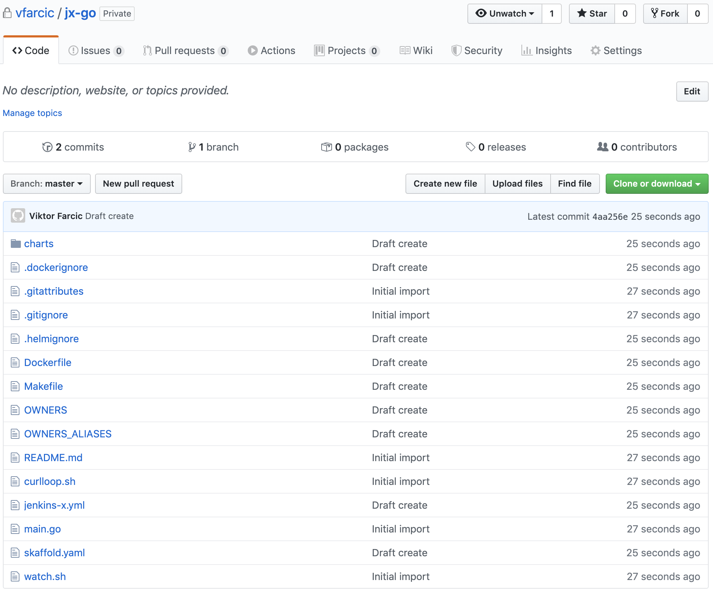
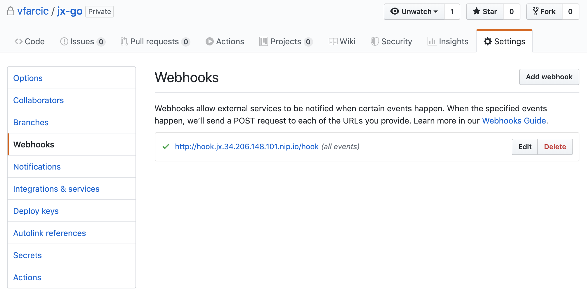
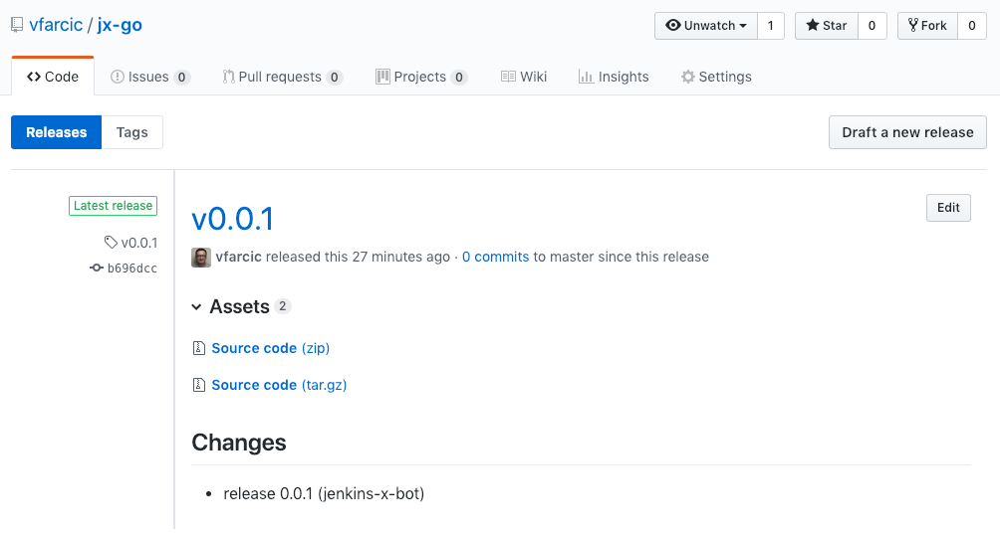

# Exploring Quickstart Projects

Starting a new Jenkins X project is easy. The first time we create one, it looks and feels like magic. All we have to do is answer a few questions, and a few moments later we have:

* a full-blown continuous delivery pipeline
* GitHub webhook that triggers the pipeline
* a mechanism to promote a release to different environments
* a way to preview pull requests

...and quite a few other things.

However, that "magic" might be overwhelming if we accept it without understanding what's going on behind the scenes. Our goal is to leverage the power we're given. We need to get a grip on the tools involved in the process, and we need to understand the intricacies of the flow that will ultimately lead to a fast, reliable, and (mostly) hands-free approach to delivering our applications.

We'll create a new cluster with Jenkins X (unless you already have one) and create a quickstart project. We'll use it as an enabler that will allow us to explore some of the essential components provided by Jenkins X. That will give us base knowledge we'll need later (in the next chapters) when we examine how to set up projects that will perform exactly what we need. We will not go into details of the process and the tools involved just yet. For now, the objective is to get a very high-level overview and an overall understanding of how Jenkins X works. More detailed descriptions will follow.

For that, we need a Kubernetes cluster with Jenkins X.

## Creating A Kubernetes Cluster With Jenkins X

Jenkins X runs on (almost) any Kubernetes cluster, so I'll let you choose whether you want to use one you already have, or create a new one. As long as Jenkins X is running and is accessible, you should be good to go.

I> All the commands from this chapter are available in the [03-quickstart.sh](https://gist.github.com/8d1f6e34ba9fdecb5eea49fe6b80979e) Gist.

For your convenience, I have created a few Gists that you can use. Feel free to use them as they are, adapt them to your own needs, or skip them altogether and create your cluster and install Jenkins X on your own.

W> The gists that follow use `-b` to run in the batch mode and they assume that this is not the first time you have created a cluster with `jx`. If that's not the case and this is indeed the first time you're creating a `jx` cluster, it will not have some of the default values like GitHub user, and the installation might fail.
W> Make sure to remove `-b` from the `jx create cluster` command inside the Gists if this is NOT the first time you're creating a cluster with `jx`.

* Create a new **GKE** cluster: [gke-jx-serverless.sh](https://gist.github.com/fe18870a015f4acc34d91c106d0d43c8)
* Create a new **EKS** cluster: [eks-jx-serverless.sh](https://gist.github.com/f4a1df244d1852ee250e751c7191f5bd)
* Create a new **AKS** cluster: [aks-jx-serverless.sh](https://gist.github.com/b07f45f6907c2a1c71f45dbe0df8d410)
* Use an **existing** cluster: [install-serverless.sh](https://gist.github.com/7b3b3d90ecd7f343effe4fff5241d037)

W> Please note that the Gists have the section to "destroy the cluster". Do not execute the commands from there until you're finished with this chapter and you do not plan to continue using it for the next.

Now that we have a cluster and that Jenkins X is up and running, we can proceed and create our first quickstart project.

## Creating A Quickstart Project

Quickstart projects provide an easy way to start development of a new application.

Traditionally, creating a new project is a tedious process that involves many different components. Obviously, we need to write the code of our new application, as well as tests. On top of that, we need a mechanism to compile the code, to run the tests, to create a distribution, and so on and so forth. But it does not end there. Local development is only the beginning. We need to run performance, integration, and other types of tests that are too cumbersome to run locally. We need to deploy our application to different environments so that we can validate its readiness. We need to deal with branches and pull requests. A lot of things need to happen before a new release is deployed to production.

Quickstarts help us with those and some other tasks. They allow us to skip the tedious process and be up-and-running with a new project in a matter of minutes. Later on, once we get a better understanding of what we need, we might need to modify the code and the configurations provided by quickstarts. That will be the subject of the follow-up writings. For now, our objective is to start a new project with the least possible effort, while still getting most of the things we need for local development as well as for the application's lifecycle that ends with the deployment to production.

That was enough of an introduction to Jenkins X quickstarts. We'll explore details through practical examples.

Like most other `jx` commands, we can create a quickstart project using through the interactive or the batch mode. We'll take a look at the former first.

```bash
jx create quickstart
```

First, we will be asked to confirm our Git user name as well as the organization. Next, we need to type the name of the new repository that `jx` will create for us. After those questions, the output is as follows.

```
? select the quickstart you wish to create  [Use arrows to move, type to filter]
> android-quickstart
  angular-io-quickstart
  aspnet-app
  dlang-http
  golang-http
  jenkins-cwp-quickstart
  jenkins-quickstart
  node-http
  node-http-watch-pipeline-activity
  open-liberty
  python-http
  rails-shopping-cart
  react-quickstart
  rust-http
  scala-akka-http-quickstart
  spring-boot-http-gradle
  spring-boot-rest-prometheus
  spring-boot-watch-pipeline-activity
  vertx-rest-prometheus
```

We can see that there are quite a few types of projects we can create. All we have to do is select one of those. While that is helpful at the beginning, I prefer running all the commands in the batch mode. If we'd proceed, we'd need to answer a few questions like the name of the project and a few others. In the batch mode,  instead of answering questions, we specify a few values as command arguments and, as a result, we end up with a documented way to reproduce our actions. It's easier and more reliable to have a README file with self-contained commands than to document the steps by saying things like "answer with this for the first question, with that for the second, and so on."

Please cancel the current command by pressing *ctrl+c*. We'll execute `jx create quickstart` again, but with a few additional arguments. We'll choose `golang-http` as the template, we'll name the project `jx-go`, and we'll use `-b` (short for batch mode) argument to let `jx` know that there is no need to ask us any questions. That does not mean that we will specify all the arguments we need, but rather those that differ from one project to another. When running in batch mode, `jx` will use the default values or those from previous executions.

Don't worry if you do not work with Go. We'll use it only as an example. The principles we'll explore through practical exercises apply to any programming language.

Here we go.

```bash
jx create quickstart \
    --filter golang-http \
    --project-name jx-go \
    --batch-mode
```

The output is too big to be presented here, so I'll walk you through the steps `jx` performed while you're looking at your screen.

We got the `jx-go` directory for our new Go application. Later on, it was converted into a Git repository, and `jx` copied the files from the pack (quickstart) dedicated to Go. Once it finished, it pushed the files to GitHub, and it created a project in Jenkins. As a result, the first build of the new Jenkins pipeline started running immediately. We'll explore Jenkins projects in more detail later.

If you're wondering where do those quickstart projects come from, the answer is GitHub. The community created an organization called *jenkins-x-quickstarts* that contains the repositories hosting the quickstarts.

W> ## A note to Windows users
W> 
W> Git Bash might not be able to use the `open` command. If that's the case, replace `open` with `echo`. As a result, you'll get the full address that should be opened directly in your browser of choice.

```bash
open "https://github.com/jenkins-x-quickstarts"
```

Jenkins X also made a local copy of the repository in the *~/.jx/draft/packs/github.com/jenkins-x-buildpacks* directory. Let's see what's inside.

```bash
ls -1 ~/.jx/draft/packs/github.com/jenkins-x-buildpacks/jenkins-x-kubernetes/packs
```

The output is as follows.

```
C++
D
apps
appserver
charts
csharp
custom-jenkins
cwp
docker
docker-helm
dropwizard
environment
git
go
go-mongodb
gradle
helm
imports.yaml
javascript
jenkins
liberty
maven
maven-java11
ml-python-gpu-service
ml-python-gpu-training
ml-python-service
ml-python-training
nop
php
python
ruby
rust
scala
swift
typescript
```

We can see that it matches the output we got from the `jx create quickstart` command, even though the names of the directories are not the same.

Since we used the quickstart for Go language, we might just as well take a look at its template files.

```bash
ls -1 ~/.jx/draft/packs/github.com/jenkins-x-buildpacks/jenkins-x-kubernetes/packs/go
```

The output is as follows.

```
Dockerfile
Makefile
charts
pipeline.yaml
preview
skaffold.yaml
watch.sh
```

I'll let you explore those files on your own. Just remember that they are not used as-is, but rather serve as templates that are processed by `jx create quickstart` command in an attempt to create usable, yet customized, projects. Later on, we'll also learn how to create custom quickstart packs.

## Exploring Quickstart Project Files

Let's see what did Jenkins X create and push to GitHub.

W> Please replace `[...]` with your GitHub username before executing the commands that follow.

```bash
GH_USER=[...]

open "https://github.com/$GH_USER/jx-go"
```

We can see that Jenkins X created quite a few files.



The repository was also created locally, so let's take a closer look at the generated files.

```bash
cd jx-go

ls -1
```

The output is as follows.

```
Dockerfile
Makefile
OWNERS
OWNERS_ALIASES
README.md
charts
curlloop.sh
jenkins-x.yml
main.go
skaffold.yaml
watch.sh
```

Let's go through each of those files and directories and explore what we got. The first in line is *Makefile*.

```bash
cat Makefile
```

I won't go into much detail about the Makefile since it is made specifically for Go applications and that might not be your favorite language. Not all quickstart packs use Makefile. Instead, each tends to leverage methods appropriate for the given language and programming framework to accomplish the required tasks. In this case, the Makefile has targets to perform operations to `build`, `test`, `install`, and so on.

The next in line is Dockerfile.

```bash
cat Dockerfile
```

The output is as follows.

```
FROM scratch
EXPOSE 8080
ENTRYPOINT ["/jx-go"]
COPY ./bin/ /
```

In the case of Go, there's not much needed. It uses a very lightweight base image (`scratch`), it exposes a port, it creates an entrypoint that will execute the binary (`jx-go`), and, finally, it copies that binary.

Unlike Dockerfile that I'm sure you're already familiar with, [Skaffold](https://github.com/GoogleContainerTools/skaffold) might be one of the tools you haven't used before.

Skaffold handles the workflow for building, pushing, and deploying applications to Kubernetes clusters, as well as for local development. We'll explore it in more detail later. For now, we'll take a brief look at the *skaffold.yaml* file.

```bash
cat skaffold.yaml
```

What matters, for now, is the `build` section that defines the `template` with the tag of the image we'll build in our pipelines. It consists of variables `DOCKER_REGISTRY` and `VERSION` whose values will be set by our pipeline at runtime.

Next, we have the *charts* directory that contains Helm definitions that will be used to deploy our application to Kubernetes. We won't go into much detail about Helm, but only the bits necessary to understand what Jenkins X does. If you never used Helm, I recommend consulting the [official documentation](https://helm.sh/) or read **The DevOps 2.4 Toolkit: Continuous Deployment To Kubernetes** book I published previously. For now, I'll only summarize it by stating that Helm is a package manager for Kubernetes.

Let's take a look at what's inside the *charts* folder.

```bash
ls -1 charts
```

The output is as follows.

```
jx-go
preview
```

There are two subdirectories. The one with the name of the application (`jx-go`) contains Helm definition of the application we'll deploy to different environments (e.g., staging, production). `preview`, on the other hand, is mostly used with pull requests. The reason for such separation lies in the ability to differentiate one from the other. We might need to customize `preview` with different variables or to add temporary dependencies. We'll explore the `preview` charts in more depth later. Right now, we'll focus on the `jx-go` chart.

```bash
ls -1 charts/jx-go
```

```
Chart.yaml
Makefile
README.md
charts
templates
values.yaml
```

If you used Helm, the structure should be familiar. If that's not the case, you might want to stop here and explore Helm in more detail. **The DevOps 2.4 Toolkit: Continuous Deployment To Kubernetes** book might be a good read if you have time, otherwise, check the official docs.

The last file in that directory is *jenkins-x.yml*.

```bash
cat jenkins-x.yml
```

Just as with the other files generated with Jenkins X quickstart, we'll go into more detail later. For now, think of it as a pipeline definition that points to the pipeline `go` defined in a different repository and used with all applications written in GoLang.

Jenkins X did not create only a Git project, but also a pipeline in the cluster, as well as GitHub webhook that will trigger it.

```bash
open "https://github.com/$GH_USER/jx-go/settings/hooks"
```



From now on, every time we push a change to the repository, that webhook will trigger a build in Jenkins X.

## Retrieving Jenkins X Activities, Logs, Pipelines, Applications, And Environments

While UIs are nice to look at, I am a firm believer that nothing beats command line concerning speed and repeatability. Fortunately, we can retrieve (almost) any information related to Jenkins X through `jx` executable. We can, for example, get the last activities (builds) of those jobs.

```bash
jx get activities
```

The output is as follows.

```
STEP                                              STARTED AGO DURATION STATUS
vfarcic/environment-jx-rocks-staging/master #1          5m17s      59s Succeeded 
  meta pipeline                                         5m17s      14s Succeeded 
    Credential Initializer Cd47r                        5m17s       0s Succeeded 
    Working Dir Initializer N5vv7                       5m17s       1s Succeeded 
    Place Tools                                         5m16s       1s Succeeded 
    Git Source Meta Vfarcic Environment Jx Roc ...      5m15s       4s Succeeded https://github.com/vfarcic/environment-jx-rocks-staging.git
    Git Merge                                           5m11s       1s Succeeded 
    Merge Pull Refs                                     5m10s       0s Succeeded 
    Create Effective Pipeline                           5m10s       2s Succeeded 
    Create Tekton Crds                                   5m8s       5s Succeeded 
  from build pack                                        5m2s      44s Succeeded 
    Credential Initializer Q4qvj                         5m2s       0s Succeeded 
    Working Dir Initializer Gtj86                        5m2s       1s Succeeded 
    Place Tools                                          5m1s       1s Succeeded 
    Git Source Vfarcic Environment Jx Rocks St ...       5m0s       5s Succeeded https://github.com/vfarcic/environment-jx-rocks-staging.git
    Git Merge                                           4m55s       1s Succeeded 
    Setup Jx Git Credentials                            4m54s       1s Succeeded 
    Build Helm Apply                                    4m53s      35s Succeeded 
vfarcic/environment-jx-rocks-staging/PR-1 #1            6m22s      47s Succeeded 
  meta pipeline                                         6m22s      12s Succeeded 
    Credential Initializer Jdbwq                        6m22s       0s Succeeded 
    Working Dir Initializer T54b2                       6m22s       0s Succeeded 
    Place Tools                                         6m22s       1s Succeeded 
    Git Source Meta Vfarcic Environment Jx Roc ...      6m21s       5s Succeeded https://github.com/vfarcic/environment-jx-rocks-staging.git
    Git Merge                                           6m16s       0s Succeeded 
    Merge Pull Refs                                     6m16s       1s Succeeded 
    Create Effective Pipeline                           6m15s       3s Succeeded 
    Create Tekton Crds                                  6m12s       2s Succeeded 
  from build pack                                        6m7s      32s Succeeded 
    Credential Initializer Ntjdr                         6m7s       0s Succeeded 
    Working Dir Initializer 86qgm                        6m7s       1s Succeeded 
    Place Tools                                          6m6s       1s Succeeded 
    Git Source Vfarcic Environment Jx Rocks St ...       6m5s       4s Succeeded https://github.com/vfarcic/environment-jx-rocks-staging.git
    Git Merge                                            6m1s       1s Succeeded 
    Build Helm Build                                     6m0s      25s Succeeded 
vfarcic/jx-go/master #1                                 7m24s    2m26s Succeeded Version: 0.0.1
  meta pipeline                                         7m24s      18s Succeeded 
    Credential Initializer J9wnj                        7m24s       0s Succeeded 
    Working Dir Initializer Fs82g                       7m24s       2s Succeeded 
    Place Tools                                         7m22s       2s Succeeded 
    Git Source Meta Vfarcic Jx Go Master ...            7m20s       3s Succeeded https://github.com/vfarcic/jx-go.git
    Git Merge                                           7m17s       1s Succeeded 
    Merge Pull Refs                                     7m16s       0s Succeeded 
    Create Effective Pipeline                           7m16s       3s Succeeded 
    Create Tekton Crds                                  7m13s       7s Succeeded 
  from build pack                                        7m4s     2m6s Succeeded 
    Credential Initializer Fmc45                         7m4s       0s Succeeded 
    Working Dir Initializer Vpjff                        7m4s       3s Succeeded 
    Place Tools                                          7m1s       2s Succeeded 
    Git Source Vfarcic Jx Go Master ...                 6m59s      11s Succeeded https://github.com/vfarcic/jx-go.git
    Git Merge                                           6m48s       1s Succeeded 
    Setup Jx Git Credentials                            6m47s       0s Succeeded 
    Build Make Build                                    6m47s       6s Succeeded 
    Build Container Build                               6m41s       2s Succeeded 
    Build Post Build                                    6m39s       1s Succeeded 
    Promote Changelog                                   6m38s       4s Succeeded 
    Promote Helm Release                                6m34s       5s Succeeded 
    Promote Jx Promote                                  6m29s    1m31s Succeeded 
  Promote: staging                                      6m24s    1m26s Succeeded 
    PullRequest                                         6m24s    1m26s Succeeded  PullRequest: https://github.com/vfarcic/environment-jx-rocks-staging/pull/1 Merge SHA: ...
    Update                                              4m58s       0s Succeeded 
```

We can see that there were activities with each of the three jobs. We had one deployment to the production environment (`environment-jx-rocks-production`), and two deployments to staging (`environment-jx-rocks-staging`). The first build (activity) is always performed when a job is created. Initially, environments only contain a few applications necessary for their correct operation. The reason for the second build of the staging environment lies in the creation of the *jx-go* project. One of the steps in its pipeline is in charge of promoting a successful build to the staging environment automatically. When we explore jenkins-x.yml in more detail, you'll get a better understanding of the process, including promotions.

The last activity is of the *jx-go* pipeline. So far, we did not push any change to the repository, so we have only one build that was run when the job itself was generated through the quickstart process.

While listing the most recent activities is very useful since we have only a few pipelines, when their number grows, we'll need to be more specific. For example, we might want to retrieve only the activities related to the *jx-go* pipeline.

```bash
jx get activities --filter jx-go --watch
```

This time, the output is limited to all the activities related to *jx-go* which, in our case, is a single build of the *master* branch.

```
STEP                                        STARTED AGO DURATION STATUS
vfarcic/jx-go/master #1                           9m53s    2m26s Succeeded Version: 0.0.1
  meta pipeline                                   9m53s      18s Succeeded 
    Credential Initializer J9wnj                  9m53s       0s Succeeded 
    Working Dir Initializer Fs82g                 9m53s       2s Succeeded 
    Place Tools                                   9m51s       2s Succeeded 
    Git Source Meta Vfarcic Jx Go Master ...      9m49s       3s Succeeded https://github.com/vfarcic/jx-go.git
    Git Merge                                     9m46s       1s Succeeded 
    Merge Pull Refs                               9m45s       0s Succeeded 
    Create Effective Pipeline                     9m45s       3s Succeeded 
    Create Tekton Crds                            9m42s       7s Succeeded 
  from build pack                                 9m33s     2m6s Succeeded 
    Credential Initializer Fmc45                  9m33s       0s Succeeded 
    Working Dir Initializer Vpjff                 9m33s       3s Succeeded 
    Place Tools                                   9m30s       2s Succeeded 
    Git Source Vfarcic Jx Go Master ...           9m28s      11s Succeeded https://github.com/vfarcic/jx-go.git
    Git Merge                                     9m17s       1s Succeeded 
    Setup Jx Git Credentials                      9m16s       0s Succeeded 
    Build Make Build                              9m16s       6s Succeeded 
    Build Container Build                         9m10s       2s Succeeded 
    Build Post Build                               9m8s       1s Succeeded 
    Promote Changelog                              9m7s       4s Succeeded 
    Promote Helm Release                           9m3s       5s Succeeded 
    Promote Jx Promote                            8m58s    1m31s Succeeded 
  Promote: staging                                8m53s    1m26s Succeeded 
    PullRequest                                   8m53s    1m26s Succeeded  PullRequest: https://github.com/vfarcic/environment-jx-rocks-staging/pull/1 Merge SHA: 078c131331ccf7460b32f54e979b8797ae4e55e7
    Update                                        7m27s       0s Succeeded 
```

This time, we used the `--watch` flag to tell Jenkins X that we'd like to *watch* the activities. Since there are no pending builds, the output will stay intact, so please press *ctrl+c* to stop the watch and return to the prompt.

I> Internally, Jenkins X activities are stored as Kubernetes Custom Resources (CRDs). If you're curious, you can see them by executing `kubectl --namespace jx get act`.

Activities provide only a high-level overview of what happened. When everything is successful, that is often all the information we need. However, when things go wrong (e.g., some of the tests fail), we might need to dig deeper into a build by retrieving the logs.

```bash
jx get build logs
```

Since we did not specify from which build we'd like to retrieve logs, we are faced with the prompt to select the pipeline from which we'd like to extract the output. We could choose one of the pipelines, but we won't do that since I want to show you that we can be more specific in our request for logs.

Please press *ctrl+c* to return to the prompt.

We can use `--filter` argument to retrieve logs from the last build of a specific pipeline.

```bash
jx get build logs --filter jx-go
```

The output should show the logs of the last build of *jx-go*, no matter the branch.

We can be even more specific than that and request logs from the specific GitHub user, of the specific pipeline, from the last build of a specific branch.

```bash
jx get build logs \
    --filter $GH_USER/jx-go/master
```

The output should show the logs of the last build of the *jx-go* pipeline initiated by a commit to the *master* branch.

Being able to retrieve logs from a specific pipeline is not of much use if we do not even know which pipelines we have. Fortunately, we can extract the list of all the pipelines as well.

```bash
jx get pipelines
```

We can see that there are three pipelines named *environment-jx-rocks-production*, *environment-jx-rocks-staging*, and *jx-go* (I'll ignore the existence of the `dummy` pipeline). The first two are in charge of deploying applications to staging and production environments. Since we are using Kubernetes, those environments are separate namespaces. We'll discuss those two later. The third job is related to the *jx-go* project we created as a quickstart.

Similarly, we can also retrieve the list of applications currently managed by Jenkins X.

```bash
jx get applications
``` 

The output is as follows.

```
APPLICATION STAGING PODS URL
jx-go       0.0.1   1/1  http://jx-go.jx-staging.34.206.148.101.nip.io
```

For now, retrieving the applications is uneventful since we have only one deployed to the staging environment.

So far, we talked about the staging and the production environments. Are those the only ones we have? Let's check it out.

```bash
jx get env
```

The output is as follows.

```
NAME       LABEL       KIND        PROMOTE NAMESPACE     ORDER CLUSTER SOURCE                                                         REF PR
dev        Development Development Never   jx            0
staging    Staging     Permanent   Auto    jx-staging    100           https://github.com/vfarcic/environment-jx-rocks-staging.git
production Production  Permanent   Manual  jx-production 200           https://github.com/vfarcic/environment-jx-rocks-production.git
```

As you can see, there is the third environment named `dev`. We'll explore it later. For now, remember that its purpose is true to its name. It is meant to facilitate development.

Now that we know which environments we have, we can combine that information and list only the applications in one of them. Let's see which ones are running in the staging environment.

```bash
jx get applications --env staging
```

The output is as follows.

```
APPLICATION STAGING PODS URL
jx-go       0.0.1   1/1  http://jx-go.jx-staging.34.206.148.101.nip.io
```

We already knew from before that the *jx-go* application is running in staging and we already know that nothing is installed in production. Nevertheless, we can confirm that with the command that follows.

```bash
jx get applications --env production
```

It should come as no surprise that the output states that `no applications` were `found in environments production`. We did not promote anything to production yet. We'll do that later.

Finally, Jenkins X also created a GitHub release for us. We can confirm that by going to project releases.

```bash
open "https://github.com/$GH_USER/jx-go/releases"
```

For now, we have only one release that is not very descriptive, since we did not create any issues that should be listed in release notes. The release you see in front of you is only the initial one created by pushing the quickstart files to Git.



Finally, we did not yet confirm whether the new application is indeed deployed and can be accessed.

```bash
ADDR=$(kubectl --namespace jx-staging \
    get ingress jx-go \
    -o jsonpath="{.spec.rules[0].host}")

curl "http://$ADDR"
```

We retrieved the host from `jx-go` Ingress and used it to send a `curl` request. As a result, the output is `Hello from: Jenkins X golang http example`. We confirmed that the application created as a quickstart was deployed to the staging environment. All we did was execute `jx create quickstart` and Jenkins X did most of the heavy lifting for us.

## What Now?

I hope that your head is not spinning too much after this introduction to quickstart projects and Jenkins X in general. The goal was not to present you with details nor to explain the process and the tools in depth. I wanted you to get the general feeling of how Jenkins X works before we dive deeper into details.

I find it challenging to understand detailed concepts without having at least a high-level practical introduction to how things work. Now that we saw Jenkins X in action, we can dive into more specific topics. The next one we'll explore is the way to import existing projects into Jenkins X. Unless your company was created yesterday, it is almost sure that you already have some code repositories that you might want to move over to Jenkins X.

All in all, this was a very quick introduction, and the real fun is coming next.

Now is a good time for you to take a break.

Please go out (back) of the `jx-go` directory.

```bash
cd ..
```

If you created a cluster only for the purpose of the exercises we executed, please destroy it. We'll start the next, and each other chapter from scratch as a way to save you from running your cluster longer than necessary and pay more than needed to your hosting vendor. If you created the cluster or installed Jenkins X using one of the Gists from the beginning of this chapter, you'll find the instructions on how to destroy the cluster or uninstall everything at the bottom.

If you did choose to destroy the cluster or to uninstall Jenkins X, please remove the repositories we created as well as the local files. You can use the commands that follow for that.

```bash
hub delete -y \
  $GH_USER/environment-jx-rocks-staging

hub delete -y \
  $GH_USER/environment-jx-rocks-production

hub delete -y $GH_USER/jx-go

rm -rf ~/.jx/environments/$GH_USER/environment-jx-rocks-*

rm -rf jx-go
```

Finally, you might be planning to move into the next chapter right away. If that's the case, there are no cleanup actions to do. Just keep reading.
