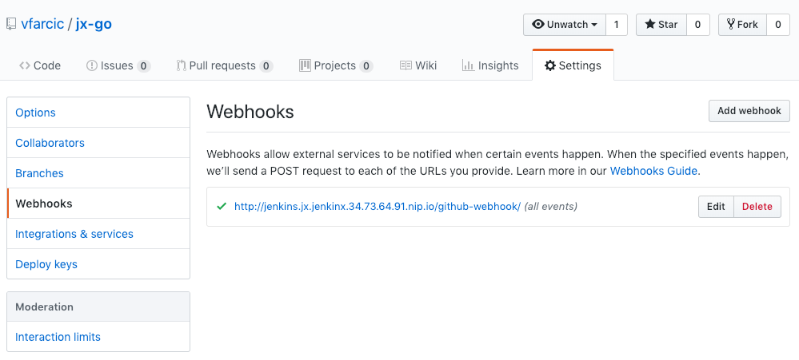

## TODO

- [X] Code
- [X] Write
- [X] Code review
- [ ] Text review
- [ ] Highlights
- [ ] Quote (https://www.theloop.ca/words-of-wisdom-from-leonard-nimoys-iconic-mr-spock-2/, https://www.hollywoodreporter.com/heat-vision/star-trek-quotes-leonard-nimoy-778305)
- [ ] Diagrams
- [ ] Gist
- [ ] Review titles
- [ ] Proofread
- [ ] Add to slides
- [ ] Publish on TechnologyConversations.com
- [ ] Add to Book.txt
- [ ] Publish on LeanPub.com

# Creating Quickstart Projects

Starting a new Jenkins X project is easy. The first time we create one it looks like magic. All we have to do is answer a few questions, and a few moments later we have a full blown ccontinuous delivery pipeline, GitHub webhook that triggers it, a mechanism to promote a release to different environments, a way to preview a pull request, and quite a few other things. However, that "magic" might become overwhelming if we accept it without questioning. We need to understand what is going on behind thee scene, if we are eto truly leverage the power we're given. We need to get a grip on the tools involved in the process, and we need to understand the intricacies of the flow that will ultimatelly lead to a fast, reliable, and (mostly) hands-free approach to delivering our applications.

We'll create a new cluster with Jenkins X (unless you already have one) and create a quick start project. We'll use it as an enabler that will allow us to explore some of the basic components provided by Jenkins X. That will give us base knowledge we'll need later (in next chapters) when we explore how to set up projects that will do exactly what we need. We will not go into details of the process and the tools involved just yet. For now, the goal is to get a very high overview and an overall overview of how Jenkins X works. More detailed descriptions will follow.

First things first. We need a Kubernetes cluster with Jenkins X.

## Creating A Kubernetes Cluster With Jenkins X

Jenkins X runs on (almost) any Kubernetes cluster, so I'll let you choose whether you want to use one you already have, or crete a new one. As long as Jenkins X is running, you should be good to go.

For your convenience, I created a few Gists. Feel free to use them as they are, adapt them to your own needs, or skip them altogether and create your cluster and install Jenkins X differently.

W> ## A note to GKE and AKS users
W> 
W> The gists that follow use `-b` to run in the batch mode and they assume that this is not the first time you create a cluster with `jx`. If that's not the case and this is indeed the first time you're creating a `jx` cluster, it will not have some of the default values like GitHub user and the installation might fail.
W> Make sure to remove `-b` from the `jx create cluster` command inside the Gists if this is NOT the first time you're creating a cluster with `jx`.

* Create new **GKE** cluster: [gke-jx.sh](https://gist.github.com/86e10c8771582c4b6a5249e9c513cd18)
* Create new **EKS** cluster: [eks-jx.sh](https://gist.github.com/dfaf2b91819c0618faf030e6ac536eac)
* Create new **AKS** cluster: [aks-jx.sh](https://gist.github.com/6e01717c398a5d034ebe05b195514060)
* In an **existing** cluster: [jx.sh](https://gist.github.com/3dd5592dc5d582ceeb68fb3c1cc59233)

I> Please note that the Gists have the section to "destroy the cluster". Do not execute the commands from there until you're finished with this chapter and do not plan to continue using it for the next.

Now that we have a cluster and that Jenkins X is up and running, we can proceed and create our first quickstart project.

To be on the safe side, we'll confirm that Jenkins X is indeed running and accessible by opening the UI console in browser.

```bash
jx console
```

If you used one of the Gists, both the username and the password are `admin`. Otherwise, please use the value you specified as the value of the `--default-admin-password` argument in the `jx create cluster` command. If you did not set it, Jenkins X assigned you a random password that you should be able to see in the output.

## Creating A Quickstart Project

Quickstart projects provide an easy way to start development of a new application.

Traditionally, creating a new project is a tedious process, that involves many different components. Obviously, we need to write the code of our new application, as well as tests. On top of that we need a mechanism to compile the code, to run the tests, to create a distribution, and so on and so forth. But it does not end there. Local development is only the beginning. We need to run performance, integration, and other types of tests that are too cumbersome to run locally. We need to deploy our application to different environments so that we can validate its readyness. We need to deal with branches and pull requests. A lot of things need to happen before a new release is deployed to production.

Quickstarts help us with those and some other tasks. They allow us to skip the tedious process and be up-and-running with a new project in a matter of minutes. Later on, once we get a better understanding of what we need, we might need to modify the code and the configurations provided by quickstarts. That will be the subject of the follow-up writings. For now, our objective is to start a new project with the least possible effort, while still getting most of the things we need for local development as well as for the application's lifecycle that ends with the deployment to production.

That was enough of an introduction to Jenkins X quickstarts. We'll explore details through practical examples.

Like most other `jx` commands, we can create a quickstart using through the interactive or the batch mode. We'll take a look at the former first.

```bash
jx create quickstart
```

The output is as follows.

```
? select the quickstart you wish to create  [Use arrows to move, type to filter]
> android-quickstart
  angular-io-quickstart
  aspnet-app
  dlang-http
  golang-http
  jenkins-cwp-quickstart
  jenkins-quickstart
  node-http
  node-http-watch-pipeline-activity
  open-liberty
  python-http
  rails-shopping-cart
  react-quickstart
  rust-http
  scala-akka-http-quickstart
  spring-boot-http-gradle
  spring-boot-rest-prometheus
  spring-boot-watch-pipeline-activity
  vertx-rest-prometheus
```

We can see that there are quite a few types of projects we can create. All we have to do is select one of those. While that is helpful at the beginning, I prefer running all the commands in the batch mode. If we'd proceed, we'd need to answer a few questions like the name of the project and a few others. While that is great at the beginning, I prefer running the commmands in batch mode. Instead of answering questions, we specify a few values as command arguments and, as a result, end up with a documented way to reproduce our actions. It's easier and more reliable to have a README file with self-contained commands than to document the steps by saying things like "answer with this for the first question, with that for the second, and so on".

Please cancel the current command by pressing *ctrl+c*. We'll execute `jx create quickstart` again, but with a few additional arguments. We'll choose `go` as the language, we'll name the project `jx-go`, and we'll use `-b` (short for batch mode) argument to let `jx` know that there is no need to ask us any questions. When running in batch mode, `jx` will use the default values or those from previous executions.

Don't worry if you do not work with Go. We'll use it only as an example. The principles we'll explore through practical examples apply to any programming language.

Here we go.

```bash
jx create quickstart \
  -l go \
  -p jx-go \
  -b
```

The output is too big to be presented here, so I'll walk you through the steps `jx` performed while you're looking at your screen.

We got the `jx-go` directory for our new Go application. Later on, it was converted into a Git repository and `jx` copied the files the pack (quickstart) dedicated to Go. Once it finished, it pushed the files to GitHub and it created a related project in Jenkins. As a result, the first build of the new Jenkins project started running immediatelly. We'll explore Jenkins projects in more detail later. If you are impatient and do not want to wait, you can execute the commands provided near the bottom of the output.

If you're wondering where do those quickstart projects come from, the answer is GitHub. The community created an organization called *jenkins-x-quickstarts* that contains the repositories hosting the quickstarts.

```bash
open "https://github.com/jenkins-x-quickstarts"
```

Jenkins X also made a local copy of the repository in the *~/.jx/draft/packs/github.com/jenkins-x-buildpacks* directory. 

```bash
ls -1 ~/.jx/draft/packs/github.com/jenkins-x-buildpacks/jenkins-x-kubernetes/packs
```

The output is as follows.

```
D
appserver
csharp
dropwizard
go
gradle
imports.yaml
javascript
liberty
maven
php
python
ruby
rust
scala
swift
```

We can see that it matches the output we got from the `jx create quickstart` command, even though the names of the directories are not exactly the same.

Since we used the quickstart for Go language, we might just as well take a look at its template files.

```bash
ls -1 ~/.jx/draft/packs/github.com/jenkins-x-buildpacks/jenkins-x-kubernetes/packs/go
```

The output is as follows.

```
Dockerfile
Makefile
charts
pipeline.yaml
preview
skaffold.yaml
watch.sh
```

I'll let you explore those files on your own. Just remember that they are not used as-is, but rather serve as templates that are processed by the `jx create quickstart` command in an attempt to create usable, yet customized project.

## Exploring Quickstart Project Files

Let's see what did Jenkins X create and push to GitHub.

W> Please replace `[...]` with your GitHub username before executing the commands that follow.

```bash
GH_USER=[...]

open "https://github.com/$GH_USER/jx-go"
```

We can see that Jenkins X created quite a few files.


The repository was also created locally, so let's take a closer look at the generated files.

```bash
cd jx-go

ls -1
```

The output is as follows.

```
Dockerfile
Jenkinsfile
Makefile
OWNERS
OWNERS_ALIASES
README.md
charts
curlloop.sh
main.go
skaffold.yaml
watch.sh
```

Let's go through each of those files and directories and explore what we got in more detail. The first in line is *Makefile*

```bash
cat Makefile
```

I won't go into much detail about the Makefile since it is made specifically for Go applications and that might not be your favorite language. Not all quickstart packs use Makefile. Instead, each tends to leverage methods appropriate for the given language and framework to accomplish the required tasks. In this case, the Makefile has targets to perform operations to `build`, `test`, `install`, and so on.

The next in line is Dockerfile.

```bash
cat Dockerfile
```

The output is as follows.

```
FROM scratch
EXPOSE 8080
ENTRYPOINT ["/jx-go"]
COPY ./bin/ /
```

In case of Go, there's not much needed. It uses a very lighweight base image (`scratch`), exposes a port, creates an entrypoint that will execute the binary (`jx-go`), and, finally, it copies that binary.

Unlike Dockerfile that I'm sure you're already familiar with, [Skaffold](https://github.com/GoogleContainerTools/skaffold) might be a tool you haven't used before. It handles the workflow for building, pushing and deploying applications to Kubernetes clusters as well as for local development. We'll explore Skaffold in more detail later. For now, we'll take a brief look at the *skaffold.yaml* file.

```bash
cat skaffold.yaml
```

What matters, for now, is the `build` section that defines the the `template` with the tag of the image we'll build in our pipelines. It consists of variables `DOCKER_REGISTRY` and `VERSION` that will be set by our pipeline at runtime.

Next, we got the *charts* directory that contains Helm definitions that will be used to deploy our application to Kubernetes. We won't go into much detail about Helm, but only the bits necessary to understand what Jenkin X does. If you never used Helm, I recommend consulting the [official documentation](https://helm.sh/) or read **The DevOps 2.4 Toolkit: Continuous Deployment To Kubernetes** book I published previously. For now, I'll only summarize it by stating that Helm is a package manager for Kubernetes.

Let's take a look what's inside the *charts* folder.

```bash
ls -1 charts
```

The output is as follows.

```
jx-go
preview
```

There are two subdirectories. The one with the name of the application (`jx-go`) contains Helm definition of the application we'll deploy to different environments (e.g., staging, production). Preview, on the other hand, is mostly used with pull requests. The reason for such separation lies in the ability to differentiate one from the other. We might need to further customize preview with different variables or to add temporary dependencies. We'll explore preview charts in more depth later. Right now, we'll focus on the `jx-go` chart.

```bash
ls -1 charts/jx-go
```

```
Chart.yaml
Makefile
README.md
charts
templates
values.yaml
```

If you are familiar with Helm, the structure should be familiar. If that's not the case, you might want to stop here and explore Helm in more detail. **The DevOps 2.4 Toolkit: Continuous Deployment To Kubernetes** book might be a good read if you have time, otherwise, check the official docs.

The last file in line is *Jenkinsfile*.

```bash
cat Jenkinsfile
```

Just as with other files generated with Jenkins X quickstart, we'll go in more detail later. For now, focus on the `stages`. We got three out of the box.

The `CI Build and push snapshot` stage is used only with pull requests. Its job is to validate each PR and gives us sufficient information so that we can decide whether to merge it or not. It also deploys the application so that we can preview it manually, if needed.

The `Build Release` stage is limited to commits to the `master` branch with the assumption that all others will become pull requests. As the name indicates, this stage builds the release. That, in this case, means building the binary, building a container image, pushing it to the registry, and performing post-build actions.

The last stage is `Promote to Environments`. It creates GitHub release notes, and it deploy the application to the staging environment (namespace).

Jenkins X did not create only a Git project, but also a project in Jenkins, as well as GitHub webhook that will trigger it.

```bash
open "https://github.com/$GH_USER/jx-go/settings/hooks"
```



From now on, every time we push a change to the repository, that webhook will trigger a build in Jenkins X.

## Retrieving Jenkins X Activities, Logs, Pipelines, Applications, And Environments

Now that we created a new project, we should check the jobs we have in Jenkins.

```bash
jx console
```

We can see that there are three jobs named *environment-jx-rocks-production*, *environment-jx-rocks-staging*, and *jx-go*. The first two are in charge of deploying applications to staging and production environments. Since we are using Kubernetes, those environments are separate namespaces. We'll discuss those two later. The third job is related to the *jx-go* project we created through quickstart. Feel free to enter inside any of those jobs to see more detail or, to be more precise, the builds they run as well as the logs of the steps they performed.


While UIs are nice, I am a strong believer that nothing beats command line in terms of speed and repeatability. Fortunatelly, we can retrieve (almost) any information related to Jenkins X through `jx` executable. We can, for example, retrieve the last activities (builds) of those jobs.

```bash
jx get activities
```

The output is as follows.

```
STEP                                           STARTED AGO DURATION STATUS
vfarcic/environment-jx-rocks-production/master #1   25m13s    3m46s Succeeded 
  Checkout Source                                   22m20s       5s Succeeded 
  Validate Environment                              22m15s      20s Succeeded 
  Update Environment                                21m55s      28s Succeeded 
vfarcic/environment-jx-rocks-staging/master #1      25m23s    2m35s Succeeded 
  Checkout Source                                   23m45s       6s Succeeded 
  Validate Environment                              23m38s      20s Succeeded 
  Update Environment                                23m18s      30s Succeeded 
vfarcic/environment-jx-rocks-staging/master #2      18m11s    1m14s Succeeded 
  Checkout Source                                   17m52s       5s Succeeded 
  Validate Environment                              17m47s      21s Succeeded 
  Update Environment                                17m26s      29s Succeeded 
vfarcic/jx-go/master #1                             21m12s    4m17s Succeeded Version: 0.0.1
  Checkout Source                                   20m35s       7s Succeeded 
  CI Build and push snapshot                        20m28s          NotExecuted 
  Build Release                                     20m27s      46s Succeeded 
  Promote to Environments                           19m41s    2m46s Succeeded 
  Promote: staging                                  19m22s    2m26s Succeeded 
    PullRequest                                     19m22s    1m25s Succeeded PullRequest: https://github.com/vfarcic/environment-jx-rocks-staging/pull/1 Merge SHA: 563c73b772066fe5ef76ed247de6a6d87ea64288
    Update                                          17m57s     1m1s Succeeded Status: Success at: http://jenkins.jx.jenkinx.34.73.64.91.nip.io/job/vfarcic/job/environment-jx-rocks-staging/job/master/2/display/redirect
    Promoted                                        17m57s     1m1s Succeeded Application is at: http://jx-go.jx-staging.jenkinx.34.73.64.91.nip.io
```

We can see that there were activities with each of the three jobs. We had one deployment to the production environment (`environment-jx-rocks-production`), and two deployments to staging (`environment-jx-rocks-staging`). The first build (activity) is always performed when a job is created. Initially, environments deployments only contain a few applications necessary for their correct operations. The reason for the second build of the staging environment lies in creation of the *jx-go* project. Part of its pipeline is to automatically promote a successfull build to the staging environment. When we explore Jenkinsfile in more detail, you'll get a better understanding of the process, including promotions.

The last activity is of the *jx-go* pipeline. So far, we did not push any change to the repository, so we have only one build that was run when the job itself was generated through the quickstart process.

While listing the most recents activities is very useful now that we have only a few pipelines, when their number grows we'll need to be more specific. For example, we might want to retrieve only the activities related to the *jx-go* pipeline.

```bash
jx get activities -f jx-go -w
```

This time, the output is limited to all the activities related to *jx-go* which, in our case, is a single build of the *master* branch.

```
STEP                         STARTED AGO DURATION STATUS
vfarcic/jx-go/master #1           21m46s    4m17s Succeeded Version: 0.0.1
  Checkout Source                  21m9s       7s Succeeded
  CI Build and push snapshot       21m2s          NotExecuted
  Build Release                    21m1s      46s Succeeded
  Promote to Environments         20m15s    2m46s Succeeded
  Promote: staging                19m56s    2m26s Succeeded
    PullRequest                   19m56s    1m25s Succeeded  PullRequest: https://github.com/vfarcic/environment-jx-rocks-staging/pull/1 Merge SHA: 563c73b772066fe5ef76ed247de6a6d87ea64288
    Update                        18m31s     1m1s Succeeded  Status: Success at: http://jenkins.jx.jenkinx.34.73.64.91.nip.io/job/vfarcic/job/environment-jx-rocks-staging/job/master/2/display/redirect
    Promoted                      18m31s     1m1s Succeeded  Application is at: http://jx-go.jx-staging.jenkinx.34.73.64.91.nip.io
```

This time, we used the `-w` flag to tell Jenkins X that we'd like to *watch* the activities. Please press *ctrl+c* to stop the watch and return to the prompt.

Activities provide only a high-level overview of what happened. When everything is successful, that is often all the information we need. However, when things go wrong (e.g., some of the tests failed), we might need to dig deeper into a build by retriving the logs.

```bash
jx get build logs
```

Since we did not specify from which build we'd like to retrieve logs, we are faced with the prompt to select the pipeline from which we'd like to retrieve the output. We could select one of the pipelines, but we won't do that, since I want to show you that we can be more specific in our request for logs.

Please press *ctrl+c* to return to the prompt.

We can use `-f` argument to retrieve logs from the last build of a specific pipeline.

```bash
jx get build logs -f jx-go
```

The output should show the logs of the last build of *jx-go*, no matter the branch.

We can be even more specific than that and request logs from the specific GitHub user, of the specific pipeline, from the last build of a specific branch.

```bash
jx get build logs $GH_USER/jx-go/master
```

The output should show the logs of the last build of the *jx-go* pipeline initiated by a commit to the *master* branch.

Being able to retrieve logs from a specific pipeline is not of much use if we do not even know which pipelines we have. Fortunatelly, we can retrieve the list of all the pipelines as well.

```bash
jx get pipelines
```

The output should show that there are three pipelines, two related to the environments, and one for the *jx-go* project.

Similarly we can also retrieve the list of applications currently managed by Jenkins X.

```bash
jx get apps
``` 

The output is as follows.

```
APPLICATION STAGING PODS URL
jx-go       0.0.1   1/1  http://jx-go.jx-staging.34.73.155.90.nip.io
```

For now, retrieving the applications is uneventful since we have only one deployed only to the staging environment.

So far, we talked about the staging and the production environments. Are those the only ones we have? Let's check it out.

```bash
jx get env
```

The output is as follows.

```
NAME       LABEL       KIND        PROMOTE NAMESPACE     ORDER CLUSTER SOURCE                                                         REF PR
dev        Development Development Never   jx            0
staging    Staging     Permanent   Auto    jx-staging    100           https://github.com/vfarcic/environment-jx-rocks-staging.git
production Production  Permanent   Manual  jx-production 200           https://github.com/vfarcic/environment-jx-rocks-production.git
```

As you can see, there is the third environment called `dev`. We'll explore it later. For now, remember that its purpose is true to its name. Its meant to facilitate development.

Now that we know which environments we have, we can combine that information and list only the applications in one of them. Let's see which ones are running in the staging environment.

```bash
jx get apps -e staging
```

The output is as follows.

```
APPLICATION STAGING PODS URL
jx-go       0.0.1   1/1  http://jx-go.jx-staging.jenkinx.34.73.64.91.nip.io
```

We already knew from before that the *jx-go* application is running in staging and we already know that nothing is installed in production. Nevertheless, we can confirm that with the command that follows.

```bash
jx get apps -e production
```

It should come as no surprise that the output states that `no applications` were `found in environments production`. We did not yet promote anything to production. We'll do that later.

Finally, Jenkins X also created a GitHub release for us. We can confirm that by going to project releases.

```bash
open "https://github.com/$GH_USER/jx-go/releases"
```

For now, for have only one release that is not very descriptive, since we did not create any issues that should be listed in release notes. The release you see in front of you is only the initial release created by pushing the quickstart files to Git.


## What Now?

I hope that your head is not spinning too much after this introduction to quickstart projects and Jenkins X in general. The goal was not to present you with details nor to explain the process and the tools in depth. Rather, I wanted you to get the general feeling of how Jenkins X works before we dive deeper. I find it difficult to understand detailed concepts without having at least the feeling of how things work. Now that we saw Jenkins X in action, we can dive into more specific topics. The next one we'll explore is the way to import existing projects into Jenkins X. Unless your company was created yesterday, it is almost certain that you already have some code repositories that you might want to move over to Jenkins X.

All in all, this was a very quick introduction, and the real fun is coming next.

Now is a good time for you to take a break. If you created a cluster only for the purpose of the exercises we executed, please destroy it. We'll start the next, and each other chapter from scratch as a way to save you from running your cluster longer than necessary and pay more than needed to your hosting vendor. If you created the cluster using one of the Gists from the beginning of this chapter, you'll find the instructions how to destroy the cluster at the bottom.

If, on the other hand, you used a cluster that hosts other things and do not want to destroy it, feel free to execute the command that follows to uninstall Jenkins X and the applications we deployed.

```bash
jx uninstall -b

# TODO: Delete the charts
```

If you did choose to destroy the cluster or to uninstall Jenkins X, please remove the repositories we created as well as the local repositories and files. You can use the commands that follow for that.

```bash
hub delete -y \
  $GH_USER/environment-jx-rocks-staging

hub delete -y \
  $GH_USER/environment-jx-rocks-production

hub delete -y \
  $GH_USER/jx-go

rm -rf ~/.jx/environments/$GH_USER/environment-jx-rocks-*

cd ..

rm -rf jx-go

rm -f ~/.jx/jenkinsAuth.yaml
```

Finally, you might be planning to move into the next chapter right away. If that's the case, there are no cleanup actions for you to do. Just keep reading.
