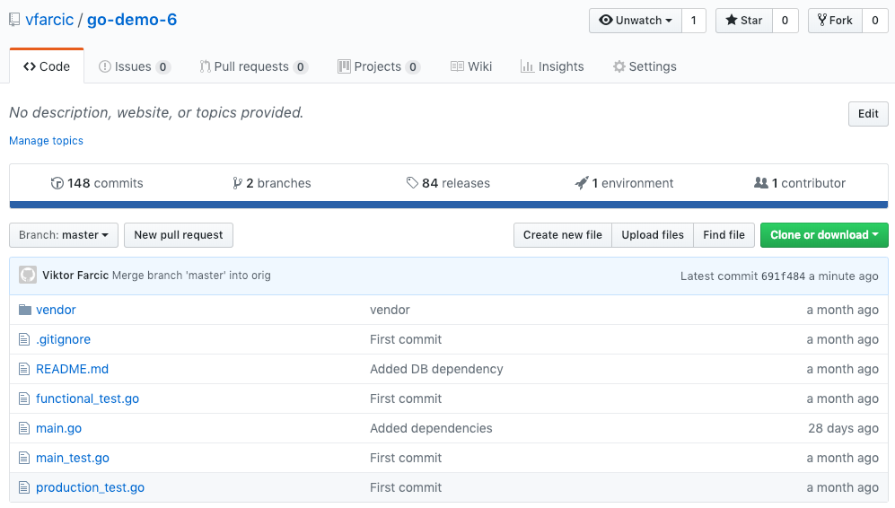
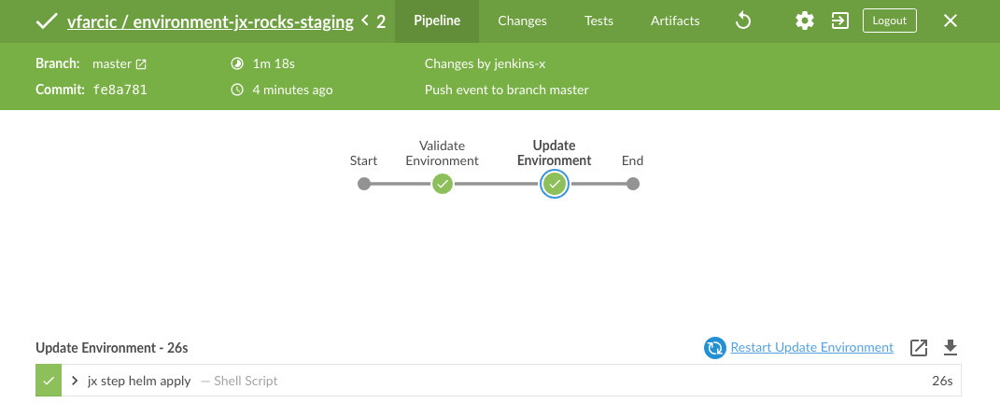

# Importing Existing Projects Into Jenkins X

We saw how we can fast-track development and continuous delivery of new applications with Jenkins X quickstarts. However, it is likely that your company was not formed yesterday. That means that you already have some apps and hopefully you'd like to move them to Jenkins X.

From a Jenkins X perspective, importing an existing project is relatively straightforward. All we have to do is execute `jx import`, and Jenkins X will do its magic. It will create the files we need. If we do not yet have `skaffold.yml`, it'll generate it for us. If we did not create a Helm chart, it would create that as well. No Dockerfile? No problem. We'll get that as well. Never wrote Jenkins pipeline for that project? Again, that is not an issue. We'll get a Jenkinsfile. Jenkins X will reuse the things we already have, and create those that we're missing.

The import process does not limit itself to creating missing files and pushing them to Git. It'll also create a job in Jenkins, webhooks in GitHub, and quite a few other things.

Nevertheless, we'll go beyond a simple import process since you're bound to have to tweak the results. Maybe your application needs a database, and the chart that will be created through Jenkins X does not include it. Or, maybe your application has a different path which should be used for Kubernetes health checks. There are many things that your application requires, and not all of them will be detected by the Jenkins X import process.

All in all, we'll go through the exercise of importing a project and trying to figure out whether we are missing something specific to our application. If we are, we'll fix it. Once we understand which application-specific things are missing, we'll create a new build pack so that the next time we import an application based on similar technology, the process will be streamlined and consist of a single command. On top of that, we'll be able to use that same build pack for any new application we might start developing in the future since it'll be available as yet another quickstart option.

For now, we'll focus on importing a project and solving potential problems we might encounter. Later on, in the next chapter, we'll dive into build packs and try to create our own based on the experience we'll obtain by importing an existing application.

## Creating A Kubernetes Cluster With Jenkins X

We'll start from the beginning. We need a Kubernetes cluster with Jenkins X up-and-running. You can continue using the cluster from the previous chapter if you did not destroy it. Otherwise, you'll need to create a new cluster or install Jenkins X if you already have one. 

I> All the commands from this chapter are available in the [04-import.sh](https://gist.github.com/c9f0b67b1f3c77c08b05eaa3d1ccfc7a) Gist.

For your convenience, the Gists from the previous chapter are available below as well.

* Create new **GKE** cluster: [gke-jx.sh](https://gist.github.com/86e10c8771582c4b6a5249e9c513cd18)
* Create new **EKS** cluster: [eks-jx.sh](https://gist.github.com/dfaf2b91819c0618faf030e6ac536eac)
* Create new **AKS** cluster: [aks-jx.sh](https://gist.github.com/6e01717c398a5d034ebe05b195514060)
* Use an **existing** cluster: [install.sh](https://gist.github.com/3dd5592dc5d582ceeb68fb3c1cc59233)

Without further ado, we are about to import a project into Jenkins X.

## Importing A Project

We'll import the application stored in the [vfarcic/go-demo-6](https://github.com/vfarcic/go-demo-6) repository. We'll use it as a guinea pig for testing the import process as well as to flesh out potential problems we might encounter.

But, before we import the repository, you'll have to fork the code. Otherwise, you won't be able to push changes since you are not (yet) a collaborator on that specific repository.

```bash
open "https://github.com/vfarcic/go-demo-6"
```

Please make sure that you are logged in and click the *Fork* button located in the top-right corner. Follow the on-screen instructions.

Next, we need to clone the repository you just forked.

W> Please replace `[...]` with your GitHub user before executing the commands that follow.

```bash
GH_USER=[...]

git clone \
  https://github.com/$GH_USER/go-demo-6.git

cd go-demo-6
```

The chances are that I did not leave the master branch in the state I intended it to be or that I'm doing something with it while you're reading this. I might be testing some recently released Jenkins X feature, or maybe I'm trying to fix a problem from one of the examples. To be sure that you're having the correct version of the code, we'll replace the `master` branch with the `orig` branch, and push it back to GitHub.

```bash
git pull

git checkout orig

git merge -s ours master --no-edit

git checkout master

git merge orig

rm -rf charts

git push
```

Now you should have the intended code in the master branch of the repository you forked. Feel free to take a look at what we have by opening the repository in a browser. Fortunately, there is a `jx` command that does just that.

```
jx repo -b
```



Let's us quickly explore the files of the project, before we import it into Jenkins X.

```bash
ls -1
```

The output is as follows.

```
README.md
functional_test.go
main.go
main_test.go
production_test.go
vendor
```

As you can see, there's (almost) nothing in that repository but Go code (`*.go`) and libraries (`vendor`).

That project is one extreme of the possible spectrum of projects we might want to import to Jenkins X. It only has the code of the application. There is no Dockerfile, and there is no Helm chart. Heck, there is not even a script for building a binary, nor there is a mechanism to run tests, and there is definitely no Jenkinsfile that defines a continuous delivery pipeline for the application. There's only code, and (almost) nothing else.

Such a situation might not be your case. Maybe you do have scripts for running tests or building the code. Or perhaps you do have Dockerfile, and maybe you are already a heavy Kubernetes user, and you do have a Helm chart. You might have other files as well. We'll discuss those situations later. For now, we'll work on the case when there is nothing but a code of an application.

Let's see what happens when we try to import that repository into Jenkins X.

```bash
jx import --batch-mode
```

The output is as follows.

```
No username defined for the current Git server!
performing pack detection in folder /Users/vfarcic/code/go-demo-6
--> Draft detected Go (100.000000%)
selected pack: /Users/vfarcic/.jx/draft/packs/github.com/jenkins-x-buildpacks/jenkins-x-kubernetes/packs/go
replacing placeholders in directory /Users/vfarcic/code/go-demo-6
app name: go-demo-6, git server: github.com, org: vfarcic, Docker registry org: vfarcic
skipping directory "/Users/vfarcic/code/go-demo-6/.git"
Created Jenkins Project: http://jenkins.jx.35.229.111.85.nip.io/job/vfarcic/job/go-demo-6/

Watch pipeline activity via:    jx get activity -f go-demo-6 -w
Browse the pipeline log via:    jx get build logs vfarcic/go-demo-6/master
Open the Jenkins console via    jx console
You can list the pipelines via: jx get pipelines
When the pipeline is complete:  jx get applications

For more help on available commands see: https://jenkins-x.io/developing/browsing/

Note that your first pipeline may take a few minutes to start while the necessary images get downloaded!

Creating GitHub webhook for vfarcic/go-demo-6 for url http://jenkins.jx.35.229.111.85.nip.io/github-webhook/
```

We can see from the output that Jenkins X detected that the project is `100.000000%` written in Go, so it selected the `go` build pack. It applied it to the local repository and pushed the changes to GitHub. Further on, it created a Jenkins project as well as a GitHub webhook that will trigger builds whenever we push changes to one of the selected branches. Those branches are by default `master`, `develop`, `PR-.*`, and `feature.*`. We could have changed the pattern by adding the `--branches` flag. But, for our purposes, and many others, those branches are just what we need.

Now, let's take another look at the files in the local copy of the repository.

```bash
ls -1
```

The output is as follows.

```
Dockerfile
Jenkinsfile
Makefile
OWNERS
OWNERS_ALIASES
README.md
charts
functional_test.go
main.go
main_test.go
production_test.go
skaffold.yaml
vendor
watch.sh
```

We can see that quite a few new files were added to the project through the import process. We got `Dockerfile` that will be used to build container images and got `Jenkinsfile` that defines all the steps of our pipeline.

Further on, `Makefile` is new as well. It, among others, defines targets to build, test, and install the application. Then, there is now the `charts` directory that contains files in Helm format. We'll use it to package, install, and upgrade our application. Then, there is `skaffold.yaml` that contains instructions on how to build container images. Finally, we got `watch.sh`. It allows us to compile the binary and create a container image every time we change a file in that project. It is a handy script for local development. There are a few other new files (e.g., `OWNERS`) added to the mix.

Do not think that is the only explanation you'll get about those files. We'll explore them in much more detail later in one of the follow-up chapters. For now, what matters is that we imported our project into Jenkins X and that it should contain everything the project needs both for local development as well as for continuous delivery pipeline.

Now that the project is in Jenkins X, we should see it as one of the activities and observe the first build in action. You already know that we can limit the retrieval of Jenkins X activities to a specific project and that we can use `-w` to watch the progress.

```bash
jx get activities \
    --filter go-demo-6 \
    --watch
```

By the time the build is finished, the output, without the entries repeated due to changes in statuses, should be as follows.

```
STEP                         STARTED AGO DURATION STATUS
vfarcic/go-demo-6/master #1        6m46s    5m44s Succeeded Version: 0.0.80
  Checkout Source                  6m20s       5s Succeeded
  CI Build and push snapshot       6m14s          NotExecuted
  Build Release                    6m14s      53s Succeeded
  Promote to Environments          5m21s    4m18s Succeeded
  Promote: staging                 4m59s    3m48s Succeeded
    PullRequest                    4m59s     2m9s Succeeded  PullRequest: https://github.com/vfarcic/environment-jx-rocks-staging/pull/5 Merge SHA: af9a841ba4ec59c6e90e972115d34779c3dd4481
    Update                         2m50s    1m39s Succeeded  Status: Success at: http://jenkins.jx.34.73.73.222.nip.io/job/vfarcic/job/environment-jx-rocks-staging/job/master/2/display/redirect
    Promoted                       2m50s    1m39s Succeeded  Application is at: http://go-demo-6.jx-staging.34.73.73.222.nip.io
```

Please stop watching the activities by pressing *ctrl+c*.

So far, the end result looks similar to the one we got when we created a quickstart. Jenkins X created the files it needs, it created a GitHub webhook, it created a job in Jenkins, and it pushed changes to GitHub. As a result, we got our first build and, by the look of it, it was successful.

Since I have a paranoid nature, we'll double check whether everything indeed looks ok.

Please open the `PullRequest` link from the activity output.

So far so good. The *go-demo-6* job created a pull request to the *environment-jx-rocks-staging* repository. As a result, the webhook from that repository should have initiated a build in the related Jenkins job, and the result should be a new release of the application in the staging environment. We won't go through that part of the process just yet. For now, just note that the application should be running, and we'll check that soon.

If we click on the `Update` link from the activity output, we should see the build of the *environment-jx-rocks-staging* environment I just mentioned. The same comment stands. We'll explore environments in one of the next chapters. For now, think of it as "magic".



The information we need to confirm that the application is indeed running is in the `Promoted` link. That's the address through which our application should be accessible. Please copy it, and use it instead of `[...]` in the command that follows.

```bash
STAGING_ADDR=[...]

curl "$STAGING_ADDR/demo/hello"
```

The output is as follows.

```
<html>
<head><title>503 Service Temporarily Unavailable</title></head>
<body>
<center><h1>503 Service Temporarily Unavailable</h1></center>
<hr><center>nginx/1.15.6</center>
</body>
</html>
```

Now that was unexpected. Everything looks ok from Jenkins X perspective, but the application is not accessible. Did we fail to do something, or did Jenkins X fail to do the right thing?

When in doubt, we can always take a look at the logs.

```bash
kubectl --namespace jx-staging logs \
    -l app=jx-staging-go-demo-6
```

The output is as follows.

```
2019/01/24 23:16:52 Starting the application
2019/01/24 23:16:52 Configuring DB localhost
panic: no reachable servers
...
```

The problem is in the database. To be more precise, it's missing. The application tried to connect to MongoDB, and it couldn't find it.

In retrospect, that makes sense. While Jenkins X does the right thing most of the time, it could not know that we need a database and especially that we need MongoDB. There is no such information in the repository, except inside the Go code. Excluding the possibility of scanning the whole code and figuring out that MongoDB is needed based on imported libraries, it's normal that Jenkins X did not add it to the Helm chart it generated when we imported the project.

The only sensible thing we can do is to modify the Helm chart and add YAML files Kubernetes will need to spin up a database together with the application.

I> Please note that we'll explore how to fix the issues that occurred from importing a specific application into Jenkins X. Your problems will likely be different. Nevertheless, I believe that the exercises that follow will give you an insight into what to expect when importing projects as well as to watch out for auto-generated Helm charts as being the most common culprit.

## Fixing The Auto-Generated Helm Chart

Even though the code of the application is small, I will save you from going through it, especially since you might not be proficient with Go. Instead, I'll let you know right away what's missing and which parts of the chart need to be added or modified.

First of all, the application requires an environment variable called `DB`. The code is using it to obtain the address of the database. That brings us to the first thing missing in the chart generated by Jenkins X. There is no definition for MongoDB.

So, the first step is to open *charts/go-demo-6/templates/deployment.yaml* in your favorite editor. That's where the Deployment for the application is defined, and that's where we need to add the variable.

Please locate the code that follows.

```yaml
...
        imagePullPolicy: {{ .Values.image.pullPolicy }}
        ports:
...
```

Now, add the `env` section with the `name` set to `DB` and the value `{{ template "fullname" . }}-db`. The final version of the snippet listed above should be as follows.

```yaml
...
        imagePullPolicy: {{ .Values.image.pullPolicy }}
        env:
        - name: DB
          value: {{ template "fullname" . }}-db
        ports:
...
```

Save the file.

Next, we need to add MongoDB to the Helm chart that was created for us. Now, we could start writing Helm templates for MongoDB StatefulSet and a Service. We could spend time trying to figure out how to replicate data between its replicas, and probably a few other things that might not be obvious from the start. However, we should know better. We should know that there is already a Helm chart that does just that, and much more. There are quite a few charts we could use, but we'll go with [mongodb from the stable channel](https://github.com/helm/charts/tree/master/stable/mongodb).

So, how can we add MongoDB chart to the one we already have? The answer in `dependencies`. We can make our application depend on MongoDB chart by creating a `requirements.yml` file.

```bash
echo "dependencies:
- name: mongodb
  alias: go-demo-6-db
  version: 5.3.0
  repository:  https://kubernetes-charts.storage.googleapis.com
  condition: db.enabled
" | tee charts/go-demo-6/requirements.yaml
```

The only thing worth noting in that file are `alias` and `condition`. The former (`alias`) is set to the value that will create a Service with the same name as the environment variable `DB` that we just added to `deployment.yaml`. The latter (`condition`) will allow us to disable this dependency. We'll see later why we might want to do that.

There's only one more thing missing. We should probably customize the MongoDB chart to fit our use case. I won't go through all the values we could set. You can explore them yourself by executing `helm inspect values stable/mongodb` or by visiting [project README](https://github.com/helm/charts/tree/master/stable/mongodb). Instead, we'll define only one, mostly as an exercise how to define values for the dependencies.

So, let's add a few new entries to `values.yaml`.

```bash
echo "go-demo-6-db:
  replicaSet:
    enabled: true
" | tee -a charts/go-demo-6/values.yaml
```

We set only `replicaSet.enabled` to `true`. The important thing to note is that it is nested inside `go-demo-6-db`. That way, Helm will know that the variable is not meant for our application (*go-demo-6*), but for the dependency called (aliased) `go-demo-6-db`.

Now, that we learned how to add dependencies to our applications, we should push the changes to GitHub, and check whether that solved our issue.

```bash
git add .

git commit \
    --message "Added dependencies"

git push
```

Next, we need to wait until the new release is deployed to the staging environment. We'll monitor the activity of the new build and wait until its finished.

```bash
jx get activity -f go-demo-6 -w
```

The output, limited to the new build, is as follows:

```
STEP                         STARTED AGO DURATION STATUS
...
vfarcic/go-demo-6/master #2         5m7s    4m40s Succeeded Version: 0.0.81
  Checkout Source                  4m48s       5s Succeeded
  CI Build and push snapshot       4m43s          NotExecuted
  Build Release                    4m43s      54s Succeeded
  Promote to Environments          3m49s    3m22s Succeeded
  Promote: staging                 3m22s    2m46s Succeeded
    PullRequest                    3m22s     1m5s Succeeded  PullRequest: https://github.com/vfarcic/environment-jx-rocks-staging/pull/6 Merge SHA: 71a5ca4ab2a3d139ec5ba471453c2457e86ec945
    Update                         2m17s    1m41s Succeeded  Status: Success at: http://jenkins.jx.34.73.73.222.nip.io/job/vfarcic/job/environment-jx-rocks-staging/job/master/3/display/redirect
    Promoted                       2m17s    1m41s Succeeded  Application is at: http://go-demo-6.jx-staging.34.73.73.222.nip.io
```

The `Promoted` step is the last one in that build. Once we reach it, we can stop monitoring the activity by pressing *ctrl+c*.

Let's see whether we got the Pods that belong to the database and, more importantly, whether the application is indeed running.

```bash
kubectl --namespace jx-staging get pods
```

The output is as follows.

```
NAME                                READY STATUS  RESTARTS AGE
jx-staging-go-demo-6-...            0/1   Running 5        5m
jx-staging-go-demo-6-db-arbiter-0   1/1   Running 0        5m
jx-staging-go-demo-6-db-primary-0   1/1   Running 0        5m
jx-staging-go-demo-6-db-secondary-0 1/1   Running 0        5m
```

The good news is that the database is indeed running. The bad news is that the application is still not operational. In my case, it already restarted five times, and `0` containers are available.

Given that the problem is this time probably not related to the database, the logical course of action is to describe the Pod and see whether we can get a clue about the issue from the events.

```bash
kubectl --namespace jx-staging \
    describe pod \
    -l app=jx-staging-go-demo-6
```

The output, limited to the message of the events, is as follows.

```
...
Events:
... Message
... -------
... Successfully assigned jx-staging-go-demo-6-fdd8f6644-xx68f to gke-jx-rocks-default-pool-119fec1e-v7p7
... MountVolume.SetUp succeeded for volume "default-token-cxn5p"
... Readiness probe failed: Get http://10.28.2.17:8080/: dial tcp 10.28.2.17:8080: getsockopt: connection refused
... Back-off restarting failed container
... Container image "10.31.245.243:5000/vfarcic/go-demo-6:0.0.81" already present on machine
... Created container
... Started container
... Liveness probe failed: HTTP probe failed with statuscode: 404
... Readiness probe failed: HTTP probe failed with statuscode: 404
```

This time, liveness and readiness probes are failing. Either the application inside that Pod is not responding to the probes, or there's some other problem we did not yet discover.

Now, unless you went through the code, you cannot know that the application does not respond to requests on the root path. If we take a look at the Pod definition, we'll see that `probePath` is set to `/`. Jenkins X could not know which path could be used for the probe of our application. So, it set it to the only sensible default it could, and that's `/`.

We'll have to modify the `probePath` entry. There is already a variable that allows us to do that instead of fiddling with the Deployment template.

```bash
cat charts/go-demo-6/values.yaml
```

If you go through the values, you'll notice that one of them is `probePath` and that it is set to `/`.

Please edit the *charts/go-demo-6/values.yaml* file by changing `probePath: /` entry to `probePath: /demo/hello?health=true`. Feel free to use your favorite editor for that and make sure to save the changes once you're done. Next, we'll push the changes to GitHub.

```bash
git add .

git commit \
    --message "Added dependencies"

git push
```

Now it's another round of waiting until the activity of the new build is finished.

```bash
jx get activity -f go-demo-6 -w
```

Once the new build is finished, we can stop watching the activity by pressing *ctrl+c*. You'll know its done when you see the `Promoted` entry in the `Succeeded` status or simply when there are no `Pending` and `Running` steps.

What do you think? Is our application finally up-and-running? Let's check it out.

```bash
kubectl --namespace jx-staging get pods
```

The output is as follows.

```
NAME                                READY STATUS  RESTARTS AGE
jx-staging-go-demo-6-...            1/1   Running 0        39s
jx-staging-go-demo-6-db-arbiter-0   1/1   Running 0        11m
jx-staging-go-demo-6-db-primary-0   1/1   Running 0        11m
jx-staging-go-demo-6-db-secondary-0 1/1   Running 0        11m
```

To be on the safe side, we'll send a request to the application. If we are greeted back, we'll know that it's working as expected.

```bash
curl "$STAGING_ADDR/demo/hello"
```

The output shows `hello, world`, thus confirming that the application is up-and-running and that we can reach it.

## Why Did We Do All That?

You might not be using MongoDB, and your application might be responding to `/` for health checks. If that's the case, you might be wondering why did I take you through the exercise of fixing those things in *go-demo-6*. Was that useful to you?

Here's the secret. Jenkins X does not do magic. It does some very clever work in the background, and it helps a lot by simplifying things, by installing and configuring tools, and by joining them all into a single easy to use process. It does a lot of heavy lifting for us, and a part of that is by importing projects into its own brace.

When we import a project, Jenkins X creates a lot of things. They are not a blind copy of files from a repository. Instead, it creates solutions tailored to our needs. The real question is how does Jenkins X know what we need? The answer is hugely related to our work. It evaluates what we did so far by scanning files in a repository where our application resides. In our example, it figured out that we are using Go, and it created a bunch of files that provide the definitions for various tools (e.g., Helm, Skaffold, Docker, etc.). Yet, Jenkins X could not read our mind. It failed to figure out that we needed a MongoDB and it did not know that our application requires a "special" address for Kubernetes health checks. We had to reconfigure some of the files created through the import process.

The real question is whether a person who imports a project has the skills to discover the cause of an issue created by missing entries in configuration files generated during the import process. If the answer is "yes, he knows how to find out what's missing in Kubernetes definitions", "yes, he uses Helm", and many other yeses, then that person should not have a hard time figuring out things similar to those we did together. Nevertheless, Jenkins X is not made to serve only people who are Kubernetes ninjas, and who know Helm, Skaffold, Docker, KNative Build, and other amazing tools Jenkins X packages. It is designed to ease the pain caused by the complexity of today's solutions. As such, it is silly to expect that everyone will go through the same process as we did. Someone often must, but the end result should not be what we just did. Instead, the solution lies in the creation of build packs. We'll explore them in the next chapter. We'll try to create a solution that will allow anyone with an application written in Go and dependant on MongoDB to import it into Jenkins X and expect everything to work from the first attempt.

The application we imported is on one extreme of the spectrum. It had nothing but Go code. There was no Dockerfile, no Jenkinsfile, no Makefile, no skaffold.yaml, and certainly no Helm chart. Your applications might not be in such a state. Maybe you already created a Dockerfile, but you're missing the rest. Or, perhaps you have all those except skaffold.yaml.

When your project has some of the files, but not all, the import process will generate only those that are missing. It does not matter much what you do and what you don't have. Jenkins X will fill in the missing pieces.

## What Now?

Now is a good time for you to take a break.

You might be planning to move into the next chapter right away. If that's the case, there are no cleanup actions to do. Just continue on to the next chapter.

However, if you created a cluster only for the purpose of the exercises we executed, please destroy it. We'll start the next, and each other chapter from scratch as a way to save you from running your cluster longer than necessary and pay more than needed to your hosting vendor. If you created the cluster or installed Jenkins X using one of the Gists from the beginning of this chapter, you'll find the instructions on how to destroy the cluster or uninstall everything at the bottom.

If you did choose to destroy the cluster or to uninstall Jenkins X, please remove the repositories we created as well as the local files. You can use the commands that follow for that. Just remember to replace `[...]` with your GitHub user.

```bash
hub delete -y \
  $GH_USER/environment-jx-rocks-staging

hub delete -y \
  $GH_USER/environment-jx-rocks-production

rm -rf ~/.jx/environments/$GH_USER/environment-jx-rocks-*
```
