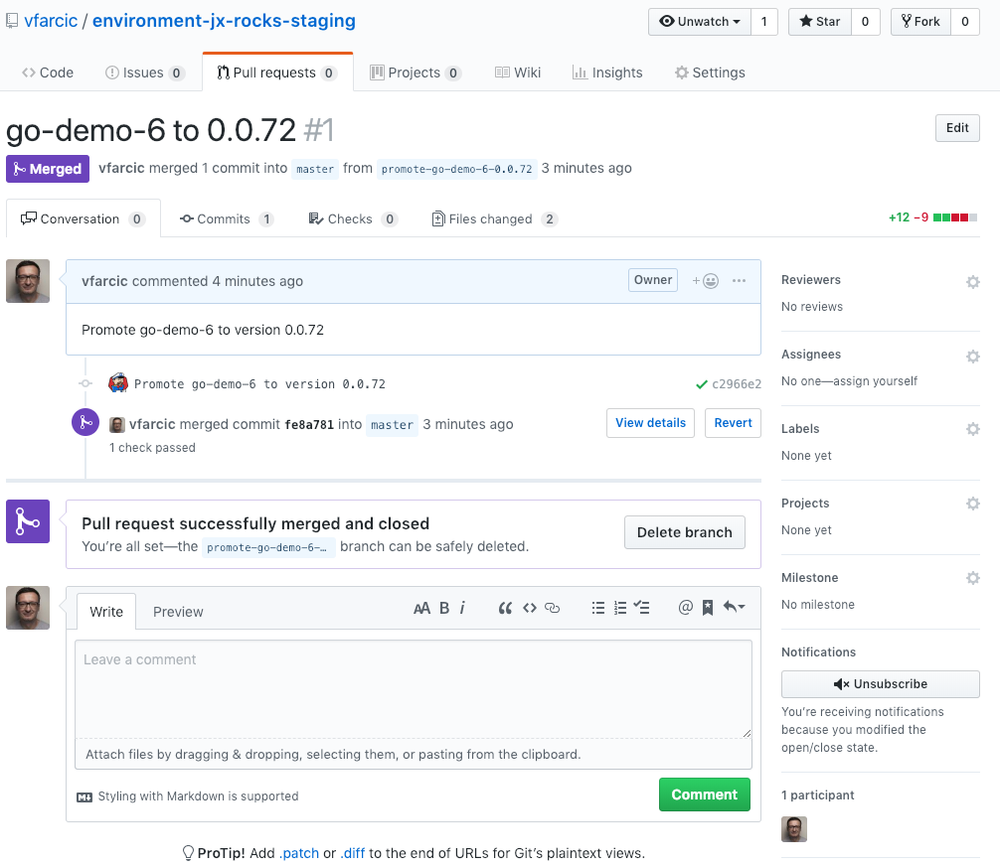

## TODO

- [ ] Code
- [ ] Write
- [ ] Code review GKE
- [ ] Code review EKS
- [ ] Code review AKS
- [ ] Code review existing cluster
- [ ] Text review
- [ ] Highlights
- [ ] Diagrams
- [ ] Gist
- [ ] Review titles
- [ ] Proofread
- [ ] Add to slides
- [ ] Publish on TechnologyConversations.com
- [ ] Add to Book.txt
- [ ] Publish on LeanPub.com

# Importing Existing Projects Into Jenkins X

We saw how we can fasttrack development and continous delivery of new applications with Jenkins X quickstarts. However, it is likely that your company was not formed yesterday. That means that you already have some applications and hopefullly you'd like to move them to Jenkins X. From Jenkins X perspective, importing an existing project is fairly straightfoward. All we have to do is execute `jx import` and Jenkins X will do its magic. It will create the files we need. If we do not yet have `skaffold.yml`, it'll create it for us. If we did not create Helm chart, it will create that as well. No Dockerfile? No problem. We'll get that as well. Never created Jenkins pipeline for that project? Again, that not an issue. We'll get Jenkinsfile. Jenkins X will reuse the things we already have, and create those we're missing.

The import process does not limit itself to creating missing files and pushing them to Git. It'll also create a job in Jenkins, webhooks in GitHub, and quite a few other things.

Nevertheless, we'll go beyond a simple import process simply because you're bound to have to tweak the results. Maybe your application needs a database and the chart that will be created through Jenkins X does not include it. Or, maybe your application has a different path which should be used for Kubernetes healthchecks. 

All in all, we'll go through the exercise of importing a project and trying to figure out whether we are missing something specific to our application. If we are, we'll fix it. Once we understand which application-specific things are missing, we'll create a new build pack so that the next time we import an application based on similar technology, the process will be streamlined and consist of a single command. On top of that, we'll be able to use that same buildpack for any new application we might start developing in the future since it'll be available as yet another quickstart option.

For now, we'll focus on importing a project and solving potential problems we might encounter. Later on, in the next chapter, we'll dive into buildpacks and try to create our own based on the experience we'll obtain by importing an existing application.

## Cluster

First things first. We need a Kubernetes cluster with Jenkins X up-and-running. You can continue using the cluster from the previous chapter, if you did not destroy it. Otherwise, you'll need to create a new cluster and/or install Jenkins X. 

For your convenience, the Gists from the previous chapter are available below as well.

* Create new **GKE** cluster: [gke-jx.sh](https://gist.github.com/86e10c8771582c4b6a5249e9c513cd18)
* Create new **EKS** cluster: [eks-jx.sh](https://gist.github.com/dfaf2b91819c0618faf030e6ac536eac)
* Create new **AKS** cluster: [aks-jx.sh](https://gist.github.com/6e01717c398a5d034ebe05b195514060)
* Use an **existing** cluster: [jx.sh](https://gist.github.com/3dd5592dc5d582ceeb68fb3c1cc59233)

Without further ado, we are about to import a project into Jenkins X.

## Importing A Project

We'll import the application stored in the [vfarcic/go-demo-6](https://github.com/vfarcic/go-demo-6) repository. We'll use it as a guinea pig for testing importing process and to flash out potential problems we might encounter.

But, before we import the repository, you'll have to fork the code. Otherwise, you won't be able to push changes since you are no (yet) collaborator on that specific repository.

```bash
open "https://github.com/vfarcic/go-demo-6"
```

Please click the *Fork* button in the top-right corner of the screen and follow the instructions.

Next, we need to clone the repository you just forked.

Please replace `[...]` with your GitHub user before executing the commands that follows.

```bash
GH_USER=[...]

git clone \
  https://github.com/$GH_USER/go-demo-6.git

cd go-demo-6
```

The chances are that I did not leave the master branch in the state I inteded it to be or that I'm doing something with it while you're reading this. I might be testing recently released Jenkins X feature or maybe I'm trying to fix a problem. To be certain that you're having the correct version of the code, we'll replace the `master` branch with the `orig` branch, and push it back to GitHub.

```bash
git checkout orig

git merge -s ours master

git checkout master

git merge orig

rm -rf charts

git push
```

Now you should have the intended code in the master branch of the repository you forked. Feel free to take a look at what we have by opening the repository in browser.

```
jx repo
```

As you can see

TODO: Screenshot

```bash
jx import --pack go -b
```

```
No username defined for the current Git server!
trying to use draft pack: go
selected pack: /Users/vfarcic/.jx/draft/packs/github.com/jenkins-x-buildpacks/jenkins-x-kubernetes/packs/go
replacing placeholders in directory /Users/vfarcic/code/go-demo-6
app name: go-demo-6, git server: github.com, org: vfarcic, Docker registry org: vfarcic
skipping directory "/Users/vfarcic/code/go-demo-6/.git"
Created Jenkins Project: http://jenkins.jx.35.227.82.26.nip.io/job/vfarcic/job/go-demo-6/

Watch pipeline activity via:    jx get activity -f go-demo-6 -w
Browse the pipeline log via:    jx get build logs vfarcic/go-demo-6/master
Open the Jenkins console via    jx console
You can list the pipelines via: jx get pipelines
When the pipeline is complete:  jx get applications

For more help on available commands see: https://jenkins-x.io/developing/browsing/

Note that your first pipeline may take a few minutes to start while the necessary images get downloaded!

Creating GitHub webhook for vfarcic/go-demo-6 for url http://jenkins.jx.35.227.82.26.nip.io/github-webhook/
```

```bash
jx get activity -f go-demo-6 -w
```

```
STEP                             STARTED AGO DURATION STATUS
vfarcic/go-demo-6/master #0.0.72                      Running Version: 0.0.72
  Release                              4m33s     1m0s Succeeded 
  Promote: staging                     3m33s    2m46s Succeeded 
    PullRequest                        3m33s    1m25s Succeeded  PullRequest: https://github.com/vfarcic/environment-jx-rocks-staging/pull/1 Merge SHA: fe8a781814d4ac58869bd011cf88f0e55ed9f988
    Update                              2m8s    1m21s Succeeded  Status: Success at: http://jenkins.jx.34.73.253.168.nip.io/job/vfarcic/job/environment-jx-rocks-staging/job/master/2/display/redirect
    Promoted                            2m8s    1m21s Succeeded  Application is at: http://go-demo-6.jx-staging.34.73.253.168.nip.io
vfarcic/go-demo-6/master #1            5m31s    4m51s Succeeded Version: 0.0.72
  Checkout Source                      4m57s       7s Succeeded 
  CI Build and push snapshot           4m50s          NotExecuted 
  Build Release                        4m50s      56s Succeeded 
  Promote to Environments              3m54s    3m14s Succeeded 
```

* Stop the watch with `ctrl+c`
* Open the `PullRequest` link



* Open the `Update` link


* Copy the `Promoted` link

```bash
STAGING_ADDR=[...]

curl "$STAGING_ADDR/demo/hello"
```

```
<html>
<head><title>503 Service Temporarily Unavailable</title></head>
<body>
<center><h1>503 Service Temporarily Unavailable</h1></center>
<hr><center>nginx/1.15.6</center>
</body>
</html>
```

```bash
kubectl -n jx-staging logs \
    -l app=jx-staging-go-demo-6
```

```
2019/01/24 23:16:52 Starting the application
2019/01/24 23:16:52 Configuring DB localhost
panic: no reachable servers

goroutine 1 [running]:
main.setupDb()
	/home/jenkins/go/src/github.com/vfarcic/go-demo-6/main.go:70 +0x349
main.main()
	/home/jenkins/go/src/github.com/vfarcic/go-demo-6/main.go:48 +0x78

```

```bash
kubectl -n jx-staging get pods
```

```
NAME                                    READY   STATUS             RESTARTS   AGE
jx-staging-go-demo-6-7b65dfb47d-wn7wp   0/1     CrashLoopBackOff   6          8m
```

```bash
helm ls
```

```
NAME         	REVISION	UPDATED                 	STATUS  	CHART                      	APP VERSION	NAMESPACE    
jenkins-x    	1       	Thu Jan 24 23:59:31 2019	DEPLOYED	jenkins-x-platform-0.0.3286	           	jx           
jx-production	1       	Fri Jan 25 00:06:29 2019	DEPLOYED	env-1                      	           	jx-production
jx-staging   	2       	Fri Jan 25 00:09:50 2019	DEPLOYED	env-2                      	           	jx-staging   
jxing        	1       	Thu Jan 24 23:57:10 2019	DEPLOYED	nginx-ingress-1.1.5        	0.21.0     	kube-system 
```

## Adding Dependencies

---

Open *charts/go-demo-6/templates/deployment.yaml* in your favorite editor

Before:

```yaml
...
imagePullPolicy: {{ .Values.image.pullPolicy }}
ports:
...
```

After:

```yaml
...
imagePullPolicy: {{ .Values.image.pullPolicy }}
env:
- name: DB
  value: {{ template "fullname" . }}-db
ports:
...
```

* Save it

```bash
cat charts-orig/go-demo-6/templates/sts.yaml
```

```yaml
apiVersion: apps/v1beta2
kind: StatefulSet
metadata:
  name: {{ template "fullname" . }}-db
  labels:
    app: {{ template "name" . }}-db
spec:
  serviceName: {{ template "fullname" . }}-db
  replicas: 3
  selector:
    matchLabels:
      app: {{ template "name" . }}-db
  template:
    metadata:
      labels:
        app: {{ template "name" . }}-db
    spec:
      serviceAccountName: {{ template "fullname" . }}-db
      terminationGracePeriodSeconds: 10
      containers:
      - name: db
        image: mongo:3.3
        command:
          - mongod
          - "--replSet"
          - rs0
          - "--smallfiles"
          - "--noprealloc"
        resources:
          limits:
            memory: 200Mi
            cpu: 100m
          requests:
            memory: 100Mi
            cpu: 10m
        ports:
          - containerPort: 27017
        volumeMounts:
        - name: {{ template "fullname" . }}-db
          mountPath: /data/db
      - name: db-sidecar
        image: cvallance/mongo-k8s-sidecar
        env:
        - name: MONGO_SIDECAR_POD_LABELS
          value: app={{ template "name" . }}-db
        - name: KUBE_NAMESPACE
          value: {{ .Release.Namespace }}
        - name: KUBERNETES_MONGO_SERVICE_NAME
          value: {{ template "fullname" . }}-db
  volumeClaimTemplates:
  - metadata:
      name: {{ template "fullname" . }}-db
      labels:
        app: {{ template "name" . }}-db
    spec:
      accessModes:
      - ReadWriteOnce
      resources:
        requests:
          storage: 2Gi
```

```bash
cp charts-orig/go-demo-6/templates/sts.yaml \
  charts/go-demo-6/templates/

cat charts-orig/go-demo-6/templates/rbac.yaml
```

```yaml
apiVersion: v1
kind: ServiceAccount
metadata:
  name: {{ template "fullname" . }}-db
  labels:
    app: {{ template "name" . }}-db
    chart: {{ .Chart.Name }}-{{ .Chart.Version | replace "+" "_" }}
    release: {{ .Release.Name }}
    heritage: {{ .Release.Service }}

---

kind: Role
apiVersion: rbac.authorization.k8s.io/v1beta1
metadata:
  name: {{ template "fullname" . }}-db
  labels:
    app: {{ template "name" . }}-db
    chart: {{ .Chart.Name }}-{{ .Chart.Version | replace "+" "_" }}
    release: {{ .Release.Name }}
    heritage: {{ .Release.Service }}
rules:
- apiGroups: [""]
  resources: ["pods"]
  verbs: ["list"]

---

apiVersion: rbac.authorization.k8s.io/v1beta1
kind: RoleBinding
metadata:
  name: {{ template "fullname" . }}-db
  labels:
    app: {{ template "name" . }}-db
    chart: {{ .Chart.Name }}-{{ .Chart.Version | replace "+" "_" }}
    release: {{ .Release.Name }}
    heritage: {{ .Release.Service }}
roleRef:
  apiGroup: rbac.authorization.k8s.io
  kind: Role
  name: {{ template "fullname" . }}-db
subjects:
- kind: ServiceAccount
  name: {{ template "fullname" . }}-db
```

```bash
cp charts-orig/go-demo-6/templates/rbac.yaml \
  charts/go-demo-6/templates/
```


## Adding Dependencies

---

```bash
echo "
---
" | tee -a charts/go-demo-6/templates/service.yaml

cat charts-orig/go-demo-6/templates/service.yaml
```

```yaml
apiVersion: v1
kind: Service
metadata:
  name: {{ template "fullname" . }}-db
  labels:
    app: {{ template "name" . }}-db
    chart: {{ .Chart.Name }}-{{ .Chart.Version | replace "+" "_" }}
    release: {{ .Release.Name }}
    heritage: {{ .Release.Service }}
spec:
  ports:
  - port: 27017
  clusterIP: None
  selector:
    app: {{ template "name" . }}-db
```

```
cat charts-orig/go-demo-6/templates/service.yaml \
  | tee -a charts/go-demo-6/templates/service.yaml

git add .

git commit -m "Added dependencies"

git push

jx get activity -f go-demo-6 -w
```

```
STEP                             STARTED AGO DURATION STATUS
vfarcic/go-demo-6/master #0.0.72                      Running Version: 0.0.72
  Release                             28m52s     1m0s Succeeded
  Promote: staging                    27m52s    2m46s Succeeded
    PullRequest                       27m52s    1m25s Succeeded  PullRequest: https://github.com/vfarcic/environment-jx-rocks-staging/pull/1 Merge SHA: fe8a781814d4ac58869bd011cf88f0e55ed9f988
    Update                            26m27s    1m21s Succeeded  Status: Success at: http://jenkins.jx.34.73.253.168.nip.io/job/vfarcic/job/environment-jx-rocks-staging/job/master/2/display/redirect
    Promoted                          26m27s    1m21s Succeeded  Application is at: http://go-demo-6.jx-staging.34.73.253.168.nip.io
vfarcic/go-demo-6/master #1           29m50s    4m51s Succeeded Version: 0.0.72
  Checkout Source                     29m16s       7s Succeeded
  CI Build and push snapshot           29m9s          NotExecuted
  Build Release                        29m9s      56s Succeeded
  Promote to Environments             28m13s    3m14s Succeeded
vfarcic/go-demo-6/master #2            8m36s    1m35s Failed Version: 0.0.73
  Checkout Source                      8m16s       5s Succeeded
  CI Build and push snapshot           8m11s          NotExecuted
  Build Release                        8m11s      56s Succeeded
  Promote to Environments              7m15s      14s Failed
```

```bash
kubectl -n jx-staging get pods
```

```
NAME                                    READY   STATUS             RESTARTS   AGE
jx-staging-go-demo-6-7b65dfb47d-wn7wp   0/1     CrashLoopBackOff   9          25m
```

```bash
kubectl -n jx-staging \
    describe pod \
    -l app=jx-staging-go-demo-6
```

```
Name:           jx-staging-go-demo-6-7b65dfb47d-wn7wp
Namespace:      jx-staging
Node:           gke-jx-rocks-default-pool-cb49a21b-tv9c/10.142.15.230
Start Time:     Fri, 25 Jan 2019 00:09:51 +0100
Labels:         app=jx-staging-go-demo-6
                draft=draft-app
                pod-template-hash=3621896038
Annotations:    <none>
Status:         Running
IP:             10.28.1.20
Controlled By:  ReplicaSet/jx-staging-go-demo-6-7b65dfb47d
Containers:
  go-demo-6:
    Container ID:   docker://7b20bc2a5cab204c6e7420b6d5de2776d4a69dcb4608bc2f5d33133365092a54
    Image:          10.31.249.33:5000/vfarcic/go-demo-6:0.0.72
    Image ID:       docker-pullable://10.31.249.33:5000/vfarcic/go-demo-6@sha256:5f65db9820f669089e1294e4e59a52419350d7fde445d101f2b9a21e453af9e9
    Port:           8080/TCP
    Host Port:      0/TCP
    State:          Waiting
      Reason:       CrashLoopBackOff
    Last State:     Terminated
      Reason:       Error
      Exit Code:    2
      Started:      Fri, 25 Jan 2019 00:32:33 +0100
      Finished:     Fri, 25 Jan 2019 00:32:43 +0100
    Ready:          False
    Restart Count:  9
    Limits:
      cpu:     100m
      memory:  256Mi
    Requests:
      cpu:        80m
      memory:     128Mi
    Liveness:     http-get http://:8080/ delay=60s timeout=1s period=10s #success=1 #failure=3
    Readiness:    http-get http://:8080/ delay=0s timeout=1s period=10s #success=1 #failure=3
    Environment:  <none>
    Mounts:
      /var/run/secrets/kubernetes.io/serviceaccount from default-token-7sxww (ro)
Conditions:
  Type           Status
  Initialized    True 
  Ready          False 
  PodScheduled   True 
Volumes:
  default-token-7sxww:
    Type:        Secret (a volume populated by a Secret)
    SecretName:  default-token-7sxww
    Optional:    false
QoS Class:       Burstable
Node-Selectors:  <none>
Tolerations:     node.kubernetes.io/not-ready:NoExecute for 300s
                 node.kubernetes.io/unreachable:NoExecute for 300s
Events:
  Type     Reason                 Age                  From                                              Message
  ----     ------                 ----                 ----                                              -------
  Normal   Scheduled              26m                  default-scheduler                                 Successfully assigned jx-staging-go-demo-6-7b65dfb47d-wn7wp to gke-jx-rocks-default-pool-cb49a21b-tv9c
  Normal   SuccessfulMountVolume  26m                  kubelet, gke-jx-rocks-default-pool-cb49a21b-tv9c  MountVolume.SetUp succeeded for volume "default-token-7sxww"
  Normal   Pulling                26m                  kubelet, gke-jx-rocks-default-pool-cb49a21b-tv9c  pulling image "10.31.249.33:5000/vfarcic/go-demo-6:0.0.72"
  Normal   Pulled                 26m                  kubelet, gke-jx-rocks-default-pool-cb49a21b-tv9c  Successfully pulled image "10.31.249.33:5000/vfarcic/go-demo-6:0.0.72"
  Normal   Pulled                 25m (x3 over 26m)    kubelet, gke-jx-rocks-default-pool-cb49a21b-tv9c  Container image "10.31.249.33:5000/vfarcic/go-demo-6:0.0.72" already present on machine
  Normal   Created                25m (x4 over 26m)    kubelet, gke-jx-rocks-default-pool-cb49a21b-tv9c  Created container
  Normal   Started                25m (x4 over 26m)    kubelet, gke-jx-rocks-default-pool-cb49a21b-tv9c  Started container
  Warning  Unhealthy              25m (x4 over 26m)    kubelet, gke-jx-rocks-default-pool-cb49a21b-tv9c  Readiness probe failed: Get http://10.28.1.20:8080/: dial tcp 10.28.1.20:8080: getsockopt: connection refused
  Warning  BackOff                78s (x111 over 26m)  kubelet, gke-jx-rocks-default-pool-cb49a21b-tv9c  Back-off restarting failed container
```

## Updating Values

---

Edit *charts/go-demo-6/values.yaml*

Change `probePath: /` value to `probePath: /demo/hello?health=true`

```bash
git add .

git commit -m "Added dependencies"

git push

jx get activity -f go-demo-6 -w
```

```
STEP                             STARTED AGO DURATION STATUS
vfarcic/go-demo-6/master #0.0.72                      Running Version: 0.0.72
  Release                              42m0s     1m0s Succeeded 
  Promote: staging                     41m0s    2m46s Succeeded 
    PullRequest                        41m0s    1m25s Succeeded  PullRequest: https://github.com/vfarcic/environment-jx-rocks-staging/pull/1 Merge SHA: fe8a781814d4ac58869bd011cf88f0e55ed9f988
    Update                            39m35s    1m21s Succeeded  Status: Success at: http://jenkins.jx.34.73.253.168.nip.io/job/vfarcic/job/environment-jx-rocks-staging/job/master/2/display/redirect
    Promoted                          39m35s    1m21s Succeeded  Application is at: http://go-demo-6.jx-staging.34.73.253.168.nip.io
vfarcic/go-demo-6/master #0.0.75                      Running Version: 0.0.75
  Release                              3m54s     1m0s Succeeded 
  Promote: staging                     2m54s          Running 
    PullRequest                        2m54s    1m26s Succeeded  PullRequest: https://github.com/vfarcic/environment-jx-rocks-staging/pull/2 Merge SHA: d14329eff11d7e617af4942f00b5cc7c0b0df6fb
    Update                             1m28s          Running  Status: Pending at: http://jenkins.jx.34.73.253.168.nip.io/job/vfarcic/job/environment-jx-rocks-staging/job/master/3/display/redirect
vfarcic/go-demo-6/master #1           42m58s    4m51s Succeeded Version: 0.0.72
  Checkout Source                     42m24s       7s Succeeded 
  CI Build and push snapshot          42m17s          NotExecuted 
  Build Release                       42m17s      56s Succeeded 
  Promote to Environments             41m21s    3m14s Succeeded 
vfarcic/go-demo-6/master #2           21m44s    1m35s Failed Version: 0.0.73
  Checkout Source                     21m24s       5s Succeeded 
  CI Build and push snapshot          21m19s          NotExecuted 
  Build Release                       21m19s      56s Succeeded 
  Promote to Environments             20m23s      14s Failed 
vfarcic/go-demo-6/master #3            4m37s          Running Version: 0.0.75
  Checkout Source                      4m15s       5s Succeeded 
  CI Build and push snapshot           4m10s          NotExecuted 
  Build Release                        4m10s      55s Succeeded 
  Promote to Environments              3m15s          Pending 
```

```bash
kubectl -n jx-staging get pods
```

```
NAME                                    READY   STATUS    RESTARTS   AGE
jx-staging-go-demo-6-57f6cd5694-4dv87   1/1     Running   2          3m
jx-staging-go-demo-6-db-0               2/2     Running   0          3m
jx-staging-go-demo-6-db-1               2/2     Running   0          2m
jx-staging-go-demo-6-db-2               2/2     Running   0          1m
```

```bash
kubectl -n jx-staging \
    describe pod \
    -l app=jx-staging-go-demo-6
```

```
Name:           jx-staging-go-demo-6-57f6cd5694-4dv87
Namespace:      jx-staging
Node:           gke-jx-rocks-default-pool-cb49a21b-xhmq/10.142.15.229
Start Time:     Fri, 25 Jan 2019 00:47:53 +0100
Labels:         app=jx-staging-go-demo-6
                draft=draft-app
                pod-template-hash=1392781250
Annotations:    <none>
Status:         Running
IP:             10.28.2.18
Controlled By:  ReplicaSet/jx-staging-go-demo-6-57f6cd5694
Containers:
  go-demo-6:
    Container ID:   docker://3f22948e5a4e9e35833697a780509e0761292132075e661442c0847f5cb42f4f
    Image:          10.31.249.33:5000/vfarcic/go-demo-6:0.0.75
    Image ID:       docker-pullable://10.31.249.33:5000/vfarcic/go-demo-6@sha256:5f65db9820f669089e1294e4e59a52419350d7fde445d101f2b9a21e453af9e9
    Port:           8080/TCP
    Host Port:      0/TCP
    State:          Running
      Started:      Fri, 25 Jan 2019 00:48:36 +0100
    Last State:     Terminated
      Reason:       Error
      Exit Code:    2
      Started:      Fri, 25 Jan 2019 00:48:07 +0100
      Finished:     Fri, 25 Jan 2019 00:48:18 +0100
    Ready:          True
    Restart Count:  2
    Limits:
      cpu:     100m
      memory:  256Mi
    Requests:
      cpu:      80m
      memory:   128Mi
    Liveness:   http-get http://:8080/demo/hello%3Fhealth=true delay=60s timeout=1s period=10s #success=1 #failure=3
    Readiness:  http-get http://:8080/demo/hello%3Fhealth=true delay=0s timeout=1s period=10s #success=1 #failure=3
    Environment:
      DB:  jx-staging-go-demo-6-db
    Mounts:
      /var/run/secrets/kubernetes.io/serviceaccount from default-token-7sxww (ro)
Conditions:
  Type           Status
  Initialized    True 
  Ready          True 
  PodScheduled   True 
Volumes:
  default-token-7sxww:
    Type:        Secret (a volume populated by a Secret)
    SecretName:  default-token-7sxww
    Optional:    false
QoS Class:       Burstable
Node-Selectors:  <none>
Tolerations:     node.kubernetes.io/not-ready:NoExecute for 300s
                 node.kubernetes.io/unreachable:NoExecute for 300s
Events:
  Type     Reason                 Age                    From                                              Message
  ----     ------                 ----                   ----                                              -------
  Normal   Scheduled              3m56s                  default-scheduler                                 Successfully assigned jx-staging-go-demo-6-57f6cd5694-4dv87 to gke-jx-rocks-default-pool-cb49a21b-xhmq
  Normal   SuccessfulMountVolume  3m55s                  kubelet, gke-jx-rocks-default-pool-cb49a21b-xhmq  MountVolume.SetUp succeeded for volume "default-token-7sxww"
  Warning  BackOff                3m24s (x2 over 3m30s)  kubelet, gke-jx-rocks-default-pool-cb49a21b-xhmq  Back-off restarting failed container
  Normal   Pulled                 3m13s (x3 over 3m54s)  kubelet, gke-jx-rocks-default-pool-cb49a21b-xhmq  Container image "10.31.249.33:5000/vfarcic/go-demo-6:0.0.75" already present on machine
  Normal   Created                3m13s (x3 over 3m54s)  kubelet, gke-jx-rocks-default-pool-cb49a21b-xhmq  Created container
  Normal   Started                3m13s (x3 over 3m54s)  kubelet, gke-jx-rocks-default-pool-cb49a21b-xhmq  Started container
  Warning  Unhealthy              3m6s (x3 over 3m46s)   kubelet, gke-jx-rocks-default-pool-cb49a21b-xhmq  Readiness probe failed: Get http://10.28.2.18:8080/demo/hello?health=true: dial tcp 10.28.2.18:8080: getsockopt: connection refused
```

```bash
curl "$STAGING_URL/demo/hello"

GH_USER=[...]

# NOTE: There is an infinite number of other issues we might encounter.

hub delete -y \
  $GH_USER/environment-jx-rocks-staging

hub delete -y \
  $GH_USER/environment-jx-rocks-production

rm -rf ~/.jx/environments/$GH_USER/environment-jx-rocks-*

cd ..

rm -f ~/.jx/jenkinsAuth.yaml
```