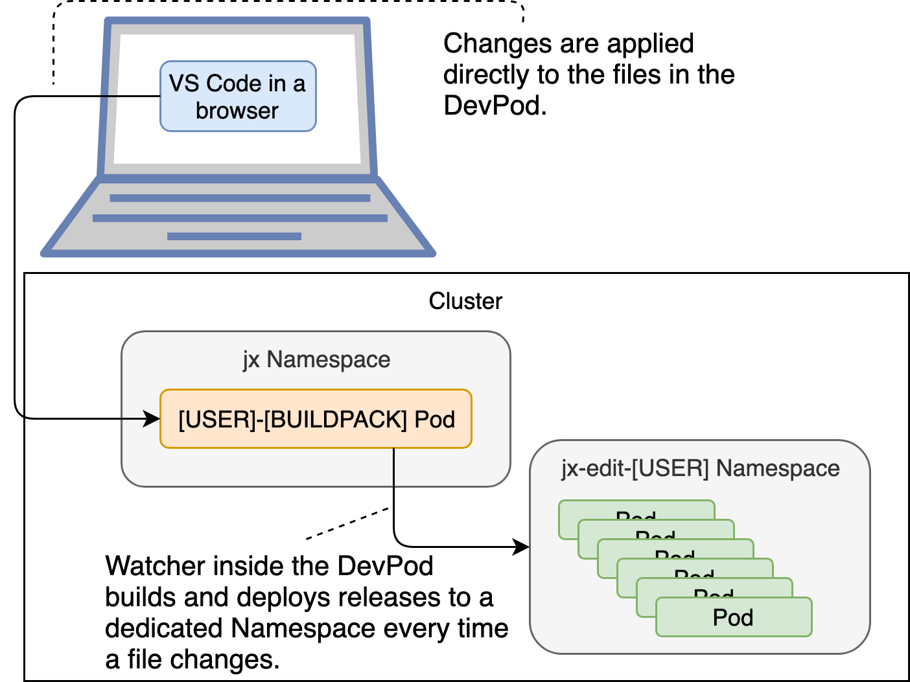

# Improving And Simplifying Software Development {#dev}

Software development is hard. It takes years to become a proficient developer, and the tech and the processes change every so often. What was effective yesterday, is not necessarily effective today. The number of languages we code in is increasing. While in the past, most developers would work in the same language throughout their whole carreer, today it is not uncommon for a developer to work on multiple projects written in different languages. We might, for example, work on a new project and code in Go, while we still need to maintain some other project written in Java. For us to be efficient, we need to install compilers, helper libraries, and quite a few other things.

No matter whether we write all the code in a single language or not, our applications will have different dependencies. One might need MySQL, while the other might use MongoDB as the data storage. We might also depend on applications developed by other teams working in parallel with us. No matter how good we become at writing mocks and stubs that replace those dependencies, eventually we'll need them running and accessible from our laptops. Historically, we've been solving those problems by having a shared development environment, but that proved to be inefficient. Sharing development environments results is too much overhead. We'd need to coordinate changes, and those that we make would often break something and cause everyone to suffer. Instead, we need each developer to have the option to have its own environment where dependencies required for an application are running.

For the dependencies to be useful, we should run them in (almost) the same way we're running them in production, that means we should deploy them to Kubernetes as well. For that, we can choose minikube or Docker Desktop if we prefer a local cluster, or get a segment (Namespace) of a remote cluster.

Unfortunately, compilers and dependencies are not everything we need to develop efficiently. We also need tools. Today that means that we need Docker or kaniko to build container images. We need `helm` and `kubectl` to deploy applications to Kubernetes. We need `skaffold` that combines the process of building images with deployment. There are quite a few other tools specific to a language and a framework that would need to be installed and configured as well.

Even if we do set up all those things, we are still missing more. We need to be able to push and pull artifacts from container registry, ChartMuseum, Nexus, or any other registry that might be in use in our organization.

As you can imagine, installing and configuring all that is not trivial. It is not uncommon for a new hire to spend a week, or even more, on setting up its own development environment. And what happens if that person should move to a different project or if he should work on multiple projects in parallel?

We can continue with business as usual and install all the compilers and the tools on our laptops. We can dedicate time setting them up and connecting them with the system (e.g., with the registries). We can continue giving new hires long Word documents that walk them through all the actions they need to perform to be able to develop our applications. Or, we can take a different approach. We might be able to create a full-blown development environment on demand and for each person. We can even make those environments application specific. And we might be able to make it so fast and straightforward that anyone can do it with a single command and in only a couple of minutes.

Jenkins X allows us to spin up a project-based private development environment with all the tools, configurations, and environment variables we might need to work on any of our applications. That feature is called DevPod.

## Exploring The Requirements Of Efficient Development Environment

Let's discuss what we need from a development environment while taking into account the technology we have at our disposal.

In an ideal situation, we should be able to clone a repository of a project and execute a single command that would set up everything we need. That setup should be as close to the production environment as possible. Otherwise, we'd risk discrepancies between local results and those deployed to staging, production, and other permanent environments. Since we need to cooperate with other people in our team, as well as with those working on other projects, such an environment would need to be connected with the registries from which we could pull container images and Helm charts. Finally, the development environment would need to have a compiler of the language used in the project, as well as all the tools we need (e.g., skaffold, Helm, Docker, etc.). As a bonus, it would be great if we would not need to run commands that build, test, and deploy our application. Every time we change a file, the environment itself should build a binary, run the tests, and deploy a new version. That way, we could concentrate on coding, while letting everything else happening in the background.

All in all, we need to be able to create a project-specific environment easily (with a single command) and fast, and such an environment needs to have everything we might need, without us installing or configuring (almost) anything on our laptop. The environment should automatically do all the tedious work like compilation, testing, and deployment. Wouldn't that be a very productive setup?

Here's how my development environment for the *go-demo-6* project looks like.


Everything I need is inside Visual Studio Code IDE. On the top-left side is the list of the project files. The bottom-left side contains all the Jenkins X activities related to the project. By clicking on a specific step, I can view the logs, open the application, open Jenkins, and so on.

The top-right corner contains the code, while the bottom-right is the terminal screen with useful output. Every time I make a change to any file of the project, the process in the terminal will build a new binary, execute tests, build container image, and deploy the new release. All that is happening inside the cluster and the only tools I use are Visual Studio Code and `jx`.

To create such a development environment, we'll need a Jenkins X cluster.

## Creating A Kubernetes Cluster With Jenkins X And Importing The Application

You know what to do. Create a new Jenkins X cluster unless you kept the one from before.

I> All the commands from this chapter are available in the [07-dev.sh](https://gist.github.com/50fac90cc10ebc67b36ea07687e8df75) Gist.

For your convenience, the Gists from the previous chapter are available below as well.

* Create a new serverless **GKE** cluster: [gke-jx-serverless.sh](https://gist.github.com/fe18870a015f4acc34d91c106d0d43c8)
* Create a new serverless **EKS** cluster: [eks-jx-serverless.sh](https://gist.github.com/f4a1df244d1852ee250e751c7191f5bd)
* Create a new serverless **AKS** cluster: [aks-jx-serverless.sh](https://gist.github.com/b07f45f6907c2a1c71f45dbe0df8d410)
* Use an **existing** serverless cluster: [install-serverless.sh](https://gist.github.com/7b3b3d90ecd7f343effe4fff5241d037)

We'll continue using the *go-demo-6* application. Please enter the local copy of the repository, unless you're there already.

```bash
cd go-demo-6
```

I> The commands that follow will reset your master branch with the contents of the `buildpack` branch that contains all the changes we did so far. Please execute them only if you are unsure whether you did all the exercises correctly.

```bash
git pull

git checkout buildpack-tekton

git merge -s ours master --no-edit

git checkout master

git merge buildpack

git push
```

If you restored the branch, the chances are that there is a reference to my user (`vfarcic`). We'll change that to Google project since that's what is the expected location of container images.

W> Please execute the commands that follow only if you are using **GKE** and if you ever restored a branch at the beginning of a chapter (like in the snippet above).

```bash
cat charts/go-demo-6/Makefile \
    | sed -e \
    "s@vfarcic@$PROJECT@g" \
    | tee charts/go-demo-6/Makefile

cat charts/preview/Makefile \
    | sed -e \
    "s@vfarcic@$PROJECT@g" \
    | tee charts/preview/Makefile

cat skaffold.yaml \
    | sed -e \
    "s@vfarcic@$PROJECT@g" \
    | tee skaffold.yaml
```

I> If you destroyed the cluster at the end of the previous chapter, we'll need to import the *go-demo-6* application again. Please execute the commands that follow only if you created a new cluster specifically for the exercises from this chapter.

```bash
jx import --pack go --batch-mode

jx get activities \
    --filter go-demo-6 \
    --watch
```

Please wait until the activity of the application shows that all the steps were executed successfully, and stop the watcher by pressing *ctrl+c*.

Now we can explore how to leverage Jenkins X for our development environments.

## Creating a Remote Development Environment

Let's say that we want to change the *go-demo-6* code.

Once we finish making changes to the code, we'll need to compile it and test it, and that might require additional installations as well as configuration. Once our code is compiled, we'd need to run the application to confirm that it behaves as expected. For that, we need Docker to build a container image, and we need Helm to deploy it. We'd also need to create a personal Namespace in our cluster, or create a local one. Given that we adopted Skaffold as a tool that builds images and deploys them, we'd need to install it as well. But that's not the end of our troubles. Before we deploy our application, we'll need to push the new container image, as well as the Helm chart, to the registries running inside our cluster. To do that, we need to know their addresses, and we need credentials with sufficient permissions.

Even when we do all that, we need a repeatable process that will build, test, release, and deploy our work whenever we make a significant change. Or, even better, whenever we make any change.

Here's the task for you. Change anything in the code, compile it, build an image, release it together with the Helm chart, deploy it inside the cluster, and confirm that the result is what you expect it to be. I urge you to stop reading and do all those things. Come back when you're done.

How much did it take you to have a new feature up-and-running? The chances are that you failed. Or, maybe, you used Jenkins X and the knowledge from the previous chapters to do all that. If that's the case, was it really efficient? I bet that it took more than a few minutes to set up the whole environment. Now, make another change to the code and do not touch anything else. Did your change compile? Were your tests executed? Was your change rolled out? Did that take more than a few seconds?

If you failed, we'll explore how to make you succeed the next time. If you didn't, we'll explore how to make the processes much easier, more efficient, and faster. We'll use Jenkins X, but not in the way you expect.

Please enter into the *go-demo-6* directory, if you're not already there.

```bash
cd go-demo-6
```

We'll create a whole development environment that will be custom tailored for the *go-demo-6* project. It will be the environment for a single user (a developer, you), and it will run inside our cluster. And we'll do that through a single command.

```bash
jx create devpod --label go --batch-mode
```

Right now, a Jenkins X DevPod is being created in the batch mode (no questions asked), and we can deduce what's happening from the output.

First, Jenkins X created the `jx-edit-YOUR_USER` Namespace in your cluster. That'll be your personal piece of the cluster where we'll deploy your changes to *go-demo-6*.

Next, Jenkins X installed the `ExposecontrollerService`. It will communicate with Ingress and make the application accessible for viewing and testing.

Further on, it updated the Helm repository in the DevPod so that we can utilize the charts available in ChartMuseum running inside the cluster.

It also ran Visual Studio Code. We'll keep it a mystery for now.

Finally, it cloned the *go-demo-6* code inside the Pod.

Many other things happened in the background. We'll explore them in due time. For now, assuming that the process finished, we'll enter inside the Pod and explore the newly created development environment.

```bash
jx rsh --devpod
```

The `jx rsh` command opens a terminal inside a Pod. The `-d` argument indicated that we want to connect to the DevPod we just created.

Before we proceed, we'll confirm that the *go-demo-6* code was indeed cloned inside the Pod.

```bash
cd go-demo-6

ls -1
```

The output is as follows.

```
charts
Dockerfile
functional_test.go
go.mod
jenkins-x.yml
main.go
main_test.go
Makefile
OWNERS
OWNERS_ALIASES
production_test.go
README.md
skaffold.yaml
vendor
watch.sh
```

Since we created the DevPod while inside our local copy of the *go-demo-6* repository, Jenkins X knew that we want to work with that code, so it cloned it for us.

Next, we should check whether our development environment indeed contains everything we need. Was Jenkins X intelligent enough to figure out needs just by knowing the repository we're using to develop our application? We can (partly) check that by trying to compile it.

```bash
make linux
```

We created the initial module definition with `go mod init` and executed `make linux` to compile the binary. It was a success, so we proved that, as a minimum, our new environment contains Go compiler.

Jenkins X pipelines use skaffold to create container images and deploy our applications. We won't go into all the details behind skaffold just yet, but only through the parts that matter for our current goals. So, let's take a quick look at `skaffold.yaml`.

```bash
cat skaffold.yaml
```

The output is as follows.

```yaml
apiVersion: skaffold/v1beta2
kind: Config
build:
  artifacts:
  - image: vfarcic/go-demo-6
    context: .
    docker: {}
  tagPolicy:
    envTemplate:
      template: '{{.DOCKER_REGISTRY}}/{{.IMAGE_NAME}}:{{.VERSION}}'
  local: {}
deploy:
  kubectl: {}
profiles:
- name: dev
  build:
    tagPolicy:
      envTemplate:
        template: '{{.DOCKER_REGISTRY}}/{{.IMAGE_NAME}}:{{.DIGEST_HEX}}'
    local: {}
  deploy:
    helm:
      releases:
      - name: go-demo-6
        chartPath: charts/go-demo-6
        setValueTemplates:
          image.repository: '{{.DOCKER_REGISTRY}}/{{.IMAGE_NAME}}'
          image.tag: '{{.DIGEST_HEX}}'
```

This might be the first time you're going through `skaffold.yaml`, so let us briefly describe what we have in front of us.

The two main sections of `skaffold.yaml` are `build` and `deploy`. As their names indicate, the former defines how we build container images, while the latter describes how we deploy them. 

We can see that images are built with `docker`. The interesting part of the `build` section is `tagPolicy.envTemplate.template` that defines the naming scheme for our images. It expects environment variables `DOCKER_REGISTRY` and `VERSION`.

The `deploy` section is uneventful and only defines `kubectl` as the deployment mechanism.

We won't be using root `build` and `deploy` sections of the config. They are reserved for the Jenkins pipeline. There are slight differences when building and deploying images to permanent and development environments. Our target is the `dev` profile. It overwrites the `build` and the `deploy` targets.

During the development builds, we won't be passing `VERSION`, but let it be autogenerated through skaffold's "special" variable `DIGEST_HEX`. Through it, every build will be tagged using a unique string (e.g., `27ffc7f...`). Unfortunately, as of this writing (May 2019), this variable is now deprecated and removed. We will have to replace it as there is no fix for this in Jenkins X's buildpacks yet.

```bash
cat skaffold.yaml \
  | sed -e 's@DIGEST_HEX@UUID@g' \
  | tee skaffold.yaml
```

We replaced the `DIGEST_HEX` with a `UUID`, which will has the same function and a similar format.

The `deploy` section of the `dev` profile changes the type from `kubectl` to `helm`. It sets the `chartPath` to `charts/go-demo-6` so that it deploys whatever we defined as the application chart in the repository. Further down, it overwrites `image.repository` and `image.tag` Helm values so that they match those of the image we just built.

The only unknown left in that YAML is the `DOCKER_REGISTRY`. It should point to the registry where we store container images. Should we define it ourselves? If we should, what is the address of the registry?

I already stated that DevPods contain everything we need to develop applications. So, it should come as no surprise that `DOCKER_REGISTRY` is already defined for us. We can confirm that by outputting its value.

```bash
echo $DOCKER_REGISTRY
```

The output will vary depending on the type of the Kubernetes cluster you're running and whether Docker registry is inside it or you're using a service. In GKE with the default setup it should be an IP and a port (e.g., `10.31.253.125:5000`), in AKS it should be the name of the cluster followed with `azurecr.io` (e.g., `THE_NAME_OF_YOUR_CLUSTER.azurecr.io`), and in EKS it is a combination of a unique ID ending with `amazonws.com` (e.g., `036548781187.dkr.ecr.us-west-2.amazonaws.com`). The exact address does not matter since all we need to know is that it is stored in the environment variable `DOCKER_REGISTRY`.

Speaking of variables, it might be useful to know that many others were created for us.

```bash
env
```

The output should display over a hundred variables. Some of them were created through Kubernetes services, while others were injected through the process of creating the DevPod. I'll let you explore them yourself. We'll be using some of them soon.

Next, we should initialize Helm client residing in the DevPod so that we can use it to deploy charts.

```bash
kubectl create \
    -f https://raw.githubusercontent.com/vfarcic/k8s-specs/master/helm/tiller-rbac.yml \
    --record --save-config

helm init --service-account tiller
```

Is> We are using `tiller` only to simplify the development. For a more secure cluster, you should consider using Helm with `tiller` (server-side Helm) by executing `helm template` command.

Now we're ready to build and deploy our application in the personal development environment. As Skaffold does not generate the `DIGEST_HEX` nor our replacement `UUID`, we will have to create one before we run the dev profile. So we will prefix our skaffold run with `export UUID=$(uuidgen)`.

```bash
export UUID=$(uuidgen)

skaffold run --profile dev
```

We run skaffold using the `dev` profile.

If you inspect the output, you'll see that quite a few things happened. It built a new container image using the *go-demo-6* binary we built earlier. Afterward, it installed the application chart. But, where was that chart installed? We could find that out from the output, but there is an easier way. The Namespace where Skaffold installs applications is also defined as an environment variable.

```bash
echo $SKAFFOLD_DEPLOY_NAMESPACE
```

In my case, the output is `jx-edit-vfarcic` (yours will use a different user). That's the personal Namespace dedicated to my development of the *go-demo-6* application. If I'd work on multiple projects at the same time, I would have a Namespace for each. So, there will be as many `jx-edit-*` Namespaces as there are developers working in parallel, multiplied with the number of projects they are working on. Of course, those Namespaces are temporary, and we should delete them together with DevPods once we're finished working on a project (or when we're ready to go home). It would be a waste to keep them running permanently. We'll keep our DevPod for a while longer so that we can explore a few other goodies it gives us.

Let's confirm that the application and the associated database were indeed installed when we executed `skaffold run`.

```bash
kubectl -n $SKAFFOLD_DEPLOY_NAMESPACE \
    get pods
```

The output is as follows.

```
NAME                               READY STATUS  RESTARTS AGE
exposecontroller-service-...       1/1   Running 0        16m
go-demo-6-go-demo-6-...            1/1   Running 3        4m
go-demo-6-go-demo-6-db-arbiter-0   1/1   Running 0        4m
go-demo-6-go-demo-6-db-primary-0   1/1   Running 0        4m
go-demo-6-go-demo-6-db-secondary-0 1/1   Running 0        4m
```

I hope that you can already see the benefits of using DevPod. If you are, you'll be pleased that there's quite a lot left to discover and quite a few benefits we did not yet explore.

When we import a project, or when we create a new one using one of the quickstarts, one of the files created for us is `watch.sh`. It is a simple yet handy script that combines the commands we run so far, and it adds a twist you can probably guess from its name. Let's take a look what's inside.

```bash
cat watch.sh
```

The output is as follows.

```bash
#!/usr/bin/env bash

# watch the java files and continuously deploy the service
make linux
skaffold run -p dev
reflex -r "\.go$" -- bash -c 'make linux && skaffold run -p dev'
```

We can see that the first two lines (excluding misplaced comments) are the same as those we executed. It's building the binary (`make linux`) and executing the same `skaffold` we run. The last line is the one that matters.

As you can see, it is missing the `UUID` variable, so let's add that to the `watch.sh`

```bash
cat watch.sh | sed -e \
  's@skaffold@UUID=$(uuidgen) skaffold@g' \
  | tee watch.sh
```

[Reflex](https://github.com/cespare/reflex) is a nifty tool that watches a directory and reruns commands when specific files change. In our case, it'll rerun `make linux && skaffold run -p dev` whenever any of the `.go` files are changed. That way, we'll build a binary and a container image, and we'll deploy a Helm chart with that image every time we change any of the source code files ending with `.go`. In other words, we'll always have the application running the latest code we're working on. Isn't that nifty?

Let's try it out.

```bash
chmod +x watch.sh

nohup ./watch.sh &
```

To be on the safe side, we assigned executable permissions to the script before we executed it. Since we used `nohup` in the second command, it'll run even if we end our session, and `&` will make sure that the watcher is running in the background. Please press the enter key to go back to the terminal.

We run the script in the background so that we can execute a few commands that will validate whether everything works as expected. The downside is that we won't see the output of the script. We'll fix that later when we start working with multiple terminals. For now, please note that the script will run `make linux` and `skaffold run -p dev` commands every time we change any of the `.go` files.

Now, let's exit the DevPod and confirm that what's happening inside it indeed results in new builds and installations every time we change our Go source code.

```bash
exit
```

Before we change our code, we'll confirm that the application indeed runs. For that, we'll need to know the address `exposecontroller` assigned to it. We could do that by retrieving JSON of the associated Ingress, or we can introduce yet another `jx` helper command. We'll go with the former.

```bash
jx get applications
```

The output is as follows.

```
APPLICATION EDIT     PODS URL                                                   STAGING PODS URL
go-demo-6   SNAPSHOT 1/1  http://go-demo-6.jx-edit-vfarcic.35.196.94.247.nip.io 0.0.159 1/1  http://go-demo-6.jx-staging.35.196.94.247.nip.io
```

We listed all the applications installed through Jenkins X. For now, there's only one, so the output is rather sparse.

We can see that the `go-demo-6` application is available as a `SNAPSHOT` as well as a specific release in the `STAGING` environment (e.g., `0.0.159`). `SNAPSHOT` is the release running in our personal development environment (DevPod). Please copy its `URL`, and paste it instead of `[...]` in the command that follows.

```bash
URL=[...]

curl "$URL/demo/hello"
```

The result of the `curl` command should output `hello, world!` thus confirming that we are still running the initial version of the application. Our next mission is to change the source code and confirm that the new release gets deployed in the personal development environment.

I> If the output is HTML with `503 Service Temporarily Unavailable`, you were too fast, and you did not give the process enough time. Please wait for a few moments until the application is up-and-running, and repeat the `curl` command.


Now we need to figure out how to change the source code running inside the DevPod so that the process of building and deploying is repeated. As you will soon see, there is more than one way to do that.

## Working With The Code In The DevPod Using Browser-Based IDE

We could go back to the DevPod and modify the code from a terminal. We could use `vi` or a similar editor for that. While I do use terminal editors quite often, I find them sub-optimum when working on a project. I believe that `vi`, `emacs`, `nano`, and similar editors are useful when working on individual scripts, but not that great when working on a full-fledged project. Call me lazy, but I need an IDE like Visual Studio Code, IntelliJ, Eclipse, or something similar. I need syntax highlighting, code complete, the ability to jump into a function with a single click, and other goodies provided by IDEs.

The problem is that the code we're interested is in a DevPod running inside our cluster. That means that we need to synchronize our local files from a laptop to the DevPod or we can work with the code remotely. For now, we're interested in the latter option (we'll explore the former later). If we are to work with remote files, and we are not (yet) going to synchronize files between our laptop and the DevPod, the only available option is to use a remote IDE (unless you want to stick to `vi` or some other terminal-based editor).

If you remember, I already stated a couple of times that Jenkins X hopes to give you everything you might need to develop your applications. That even includes an IDE. We only need to figure out where it is or, to be more precise, how to access it. We'll do that by introducing yet another `jx` command.

```bash
jx open
```

The output is as follows.

```
NAME                  URL
deck                  http://deck.jx.34.206.148.101.nip.io
hook                  http://hook.jx.34.206.148.101.nip.io
jenkins-x-chartmuseum http://chartmuseum.jx.34.206.148.101.nip.io
tide                  http://tide.jx.34.206.148.101.nip.io
vfarcic-go-ide        http://vfarcic-go-ide.jx.34.206.148.101.nip.io
vfarcic-go-port-2345  http://vfarcic-go-port-2345.jx.34.206.148.101.nip.io
vfarcic-go-port-8080  http://vfarcic-go-port-8080.jx.34.206.148.101.nip.io
```

The `open` command lists all the applications managed by Jenkins X and running inside our cluster. We can see that one of them is `ide` prefixed with our username and the programming language we're using. In my case that's `vfarcic-go-ide`.

If we add the name of the application as an argument to the `jx open` command, it'll (surprise, surprise) open that application in the default browser. Let's try it out.

Please replace `[...]` with the name of the `*-ide` application before executing the command that follows.

```bash
jx open [...]
```

What you see in front of you is Visual Studio Code. It is a browser-based IDE (it can run as a desktop app as well). It is, in my experience, the best browser-based IDE today (March 2019). If you've already used Visual Studio Code on your laptop, what you see should feel familiar. If you haven't, it's intuitive and straightforward, and you'll have no problem adopting it (if you think it's useful).

Let's give Visual Studio Code a spin.

Our next mission is to modify a few Go files and observe that the changes are build and deployed without us executing any additional commands. Remember that the watcher (`watch.sh`) is still running.

Please open the *Files* section located in the left-hand menu, expand the *go-demo-6* directory, and double-click the *main.go* file to open it in the main body of the IDE. Next, change `hello, world` (or whatever else you changed it to previously) to `hello, devpod`.

Since we have tests that validate that the correct message is returned, we'll need to change them as well. Open the *main_test.go* file next, search for `hello, world` (or whatever else you changed it to previously), and change it to `hello, devpod`.

Make sure to save the changes.

Now we can confirm that our changes are automatically built and deployed every time we change a Go source code.

```bash
curl "$URL/demo/hello"
```

The output should be `hello, devpod!`



We saw how we can work using personal development environments and modifying them from a browser.

I used Visual Studio Code quite a few times. It is beneficial when we do not have all the tools running inside our laptops (except `jx` CLI). But, a browser-based editor might not be your cup of tea. You might find a desktop IDE easier and faster. Or, maybe you are emotionally attached to a desktop version of Visual Studio Code, IntelliJ, or whatever else is your coding weapon of choice. Fear not, we can use them as well. Our next mission is to connect your favorite IDE with DevPods. But, before we do that, we'll delete the DevPod we're currently running and start a new one with a twist.

```bash
jx delete devpod
```

Please type `y` when asked whether you want `to delete the DevPods` and press the enter key.

The DevPod is no more.

The problem is that we did not push the code changes to GitHub. If we did that, we could pull them to our local hard disk. Since we forgot that vital step, our changes were lost the moment we deleted the DevPod. That was silly of me, wasn't it? Or maybe I did that intentionally just to show you that we can also synchronize files from your laptop into the DevPod, and vice versa.

## Synchronizing Code From A Laptop Into A DevPod

I hope that you liked the idea of using a browser-based IDE like Visual Studio Code. On the other hand, the chances are that you believe that it might be useful in some scenarios, but that the bulk of your development will be done using desktop-based IDE. In other words, I bet that you prefer to work with local files. If that's the case, we need to figure out how to sync them with DevPod. But, before we do that, we'll add a critical component to our development process. We're missing tests, and that is, as I'm sure you already know, unacceptable.

Given that we are using Makefile to specify our targets (at least when working with Go), that's the place where we'll add unit tests. I assume that you want to run unit tests every time you change your code and that you'll leave slower types of tests (e.g., functional and integration tests) to Jenkins. If that's not the case, you should have no problem extending our examples to run a broader set of validations.

W> Remember what we said before about `Makefile`. It expects tabs as indentation. Please make sure that the command that follows is indeed using tabs and not spaces, if you're typing the commands instead of copying and pasting from the Gist.

```bash
echo 'unittest: 
	CGO_ENABLED=$(CGO_ENABLED) $(GO) \\
	test --run UnitTest -v
' | tee -a Makefile
```

We added a `unittest` target with `go test` command limited to functions that contain `UnitTest` in their names.

Next, we need to modify `watch.sh` so that it executes the new target.

```bash
cat watch.sh |
    sed -e \
    's@linux \&\& skaffold@linux \&\& make unittest \&\& skaffold@g' \
    | sed -e \
    's@skaffold@UUID=$(uuidgen) skaffold@g' \
    | tee watch.sh
```

Now that we added unit tests both to `Makefile` and `watch.sh`, we can go back to our original objective and figure out how to synchronize local files with those in a DevPod.

We'll use [ksync](https://github.com/vapor-ware/ksync). It transparently updates containers running inside a cluster from a local checkout. That will enable us to use our favorite IDE to work with local files that will be synchronized with those inside the cluster.

To make things simpler, `jx` has its own implementation of ksync that will connect it with a DevPod. Let's fire it up.

```bash
jx sync --daemon
```

We executed `jx sync` in `daemon` mode. That will allow us to run it in the background instead of blocking a terminal session.

It'll take a few moments until everything is up and running. The final message should state that `it looks like 'ksync watch' is already running so we don't need to run it yet...` When you see it, you'll know that it is fully operational, and all that's left is to press *ctrl+c* to go back to the terminal session. Since we specified `--daemon`, `ksync` will continue running in the background.

Now we can create yet another DevPod. This time, however, we'll add `--sync` argument. That will give it a signal that we want to use `ksync` to synchronize our local file system with the files in the DevPod.

```bash
jx create devpod \
    --label go \
    --sync \
    --batch-mode
```

Now we need to repeat the same commands as before to start the watcher inside the DevPod. However, this time we will not run it in the background since it might be useful to see the output in case one of our tests fail and we might need to apply a fix before we proceed with the development. For that reason, we'll open a second terminal. I recommend that you resize two terminals so that both occupy half of the screen. That way you can see them both.

Open a second terminal session.

W> If you are using EKS, you'll need to recreate the environment variables `AWS_ACCESS_KEY_ID`, `AWS_SECRET_ACCESS_KEY`, and `AWS_DEFAULT_REGION`. Otherwise, your second terminal will not be able to authenticate against Kube API.

Next, we'll enter the DevPod and execute the same commands that will end with running the `watch.sh` script.

```bash
jx rsh --devpod

unset GOPATH

go mod init

helm init --client-only

chmod +x watch.sh

./watch.sh
```

Now that `watch.sh` is running in the foreground, we can see the results of building, testing, and deploying development releases created every time we change our source code.

The last time we modified the files in the DevPod, we did not push them to Git. Since we did not have synchronization, they were lost when we deleted the Pod. Let's confirm that we are still at square one by sending a request to the application.

Please return to the first terminal.

```bash
curl "$URL/demo/hello"
```

The output is `hello, world!` thus confirming that our source code is indeed intact and that the watcher did its job by deploying a new release based on the original code. If the output is `hello, devpod!`, the new deployment did not yet roll out. In that case, wait for a few moments and repeat the `curl` command.

Next, we'll make a few changes to the files on our laptop.

```bash
cat main.go | sed -e \
    's@hello, world@hello, devpod with tests@g' \
    | tee main.go

cat main_test.go | sed -e \
    's@hello, world@hello, devpod with tests@g' \
    | tee main_test.go
```

Since we changed the file, and if you are quick, we should see the result of the new iteration of `watch.sh`. Please go back to the second terminal. In there, you should see that the binary is built, that the unit tests are executed, and that skaffold built a new image and upgraded the development release using Helm.

Now that we observed that the process run through yet another iteration, we can send a request to the application and confirm that the new release indeed rolled out. Please go to the first terminal to execute the `curl` command that follows.

```bash
curl "$URL/demo/hello"
```

This time, the output is `hello, devpod with tests!`. From now on, every time we change any of the local Go files, the process will repeat. We will be notified if something (e.g., tests) fail by the output from the second terminal. Otherwise, the application running in our personal environment (Namespace) will always be up-to-date.


Next, we'll imagine that we continued making changes to the code until the new feature is done. The only thing left is to push them back to the GitHub repository. We'll ignore the fact that we should probably make a pull request (explanation is coming in the next chapter), and push directly to the master branch.

```bash
git add .

git commit \
    --message "devpod"

git push
```

You should be familiar with the rest of the process. Since we pushed a change to the master branch, Jenkins will pick it up and run all the steps defined in the pipeline. As a result, it will deploy a new release to the staging environment. As always, we can monitor the activity of the Jenkins build.

```bash
jx get activity \
    --filter go-demo-6 \
    --watch
```

The new release should be available in the staging environment once all the steps `Succeeded` and we can cancel the activity watcher by pressing *ctrl+c*.

Let's take another look at the available applications.

```bash
jx get applications
```

The output should be the same as before. However, this time we're interested in URL of the staging environment since that's where the new release was rolled out after we pushed the changes to the master branch.

Please copy the URL of the staging release (the second one) and paste it instead of `[...]` in the commands that follow.

```bash
STAGING_URL=[...]

curl "$STAGING_URL/demo/hello"
```

As expected, the output is `hello, devpod with tests!` thus confirming that the new release (the same one we have in the private development environment) is now rolled out to staging.

We're done with our DevPod combined with ksync synchronization so we can delete it from the system. We're not going to make any more changes to the code, so there is no need for us to waste resources on the DevPod.

```bash
jx delete devpod
```

Please press `y` followed with the enter key to confirm the deletion.

There's still one more development-related topic we should explore.

## Integrating IDEs With Jenkins X

We saw that we can work with local files and let ksync synchronize them with DevPod. That allows us to work with our favorite IDE while ripping the benefits of having a full environment somewhere else. But that's not all. We can integrate IDEs with Jenkins X.

Do you remember the screenshot from the beginning of the chapter? That was Visual Studio Code setup I used when working on the examples in this book. It's repeated below in case you're forgetful and you do not want to go back to see it again.


Let's see if we can configure it in the same way on your laptop.

I> I'll show how to integrate Visual Studio Code with Jenkins X. If you prefer IntelliJ instead, the steps are very similar and I hope you will not have trouble setting it up. On the other hand, if you do not like either of the two, you're in tough luck since those are the only ones supported so far (March 2019). Nevertheless, I strongly recommend Visual Studio Code, and I urge you to try it out. It is my favorite and, in my opinion, it is superior to any other IDE.

W> I could not configure Jenkins X extension to Visual Studio Code to work with EKS. As far as I know, there is no place where we can define the environment variables required for authentication. Truth be told, I did not try too hard since I tend to work with GKE most of the time. I would appreciate if you let me know if you solve that issue.

If you do not already use Visual Studio Code, but you do want to try it out, please download it and install it from the [official site](https://code.visualstudio.com/). 

With Visual Studio Code up-and-running, navigate to *File* > *Open*, select the *go-demo-6* directory, and click the *Open* button.

Next, we need to install the *jx* extension. To do that, go to *View* > *Extensions*, search for *jx*, click the *Install* button in *jx-tools*. Once it is installed, click the *Reload* button.

Now that the extension is installed, we can display some useful information opening *View* > *Explorer*, and expanding the *JENKINS X* tab.

You will see a few general options by clicking the *...* button. Feel free to explore them.

More interesting information is available in the *Pipelines* section. Inside it should be your user. Expand it, and you'll see *go-demo-6*, with the *master* branch inside. Inside the master branch, you should see the builds executed for that project. If you expand one of them, you should notice the same steps as those we see when we execute `jx get activity` command. Some of them provide additional actions by clicking the right mouse button or two-finger click on Mac. They should be self-explanatory, so I'll let you explore them on your own.

Finally, I would typically open a terminal session inside Visual Studio Code. You can do that by opening *View* > *Integrated Terminal*. Inside that terminal, I would execute the command that would create a DevPod for that project.

Now you have everything in one place. You can write your Code and see the Jenkins X activities as well as the output of `watch.sh` running in a DevPod. Isn't that awesome?

Before we proceed, we'll go out of the `go-demo-6` directory.

```bash
cd ..
```

## What Now?

We're done with yet another chapter, and you are once again forced to decide whether to continue using the cluster or to destroy it. If the destruction is what you crave for, you'll find the instructions at the bottom of the Gist you chose at the beginning of this chapter.

If you destroyed the cluster or you uninstalled Jenkins X, please remove the repositories and the local files we created. You can use the commands that follow for that.

W> Please replace `[...]` with your GitHub user before executing the commands that follow.

```bash
GH_USER=[...]

hub delete -y \
  $GH_USER/environment-jx-rocks-staging

hub delete -y \
  $GH_USER/environment-jx-rocks-production

rm -rf ~/.jx/environments/$GH_USER/environment-jx-rocks-*
```
