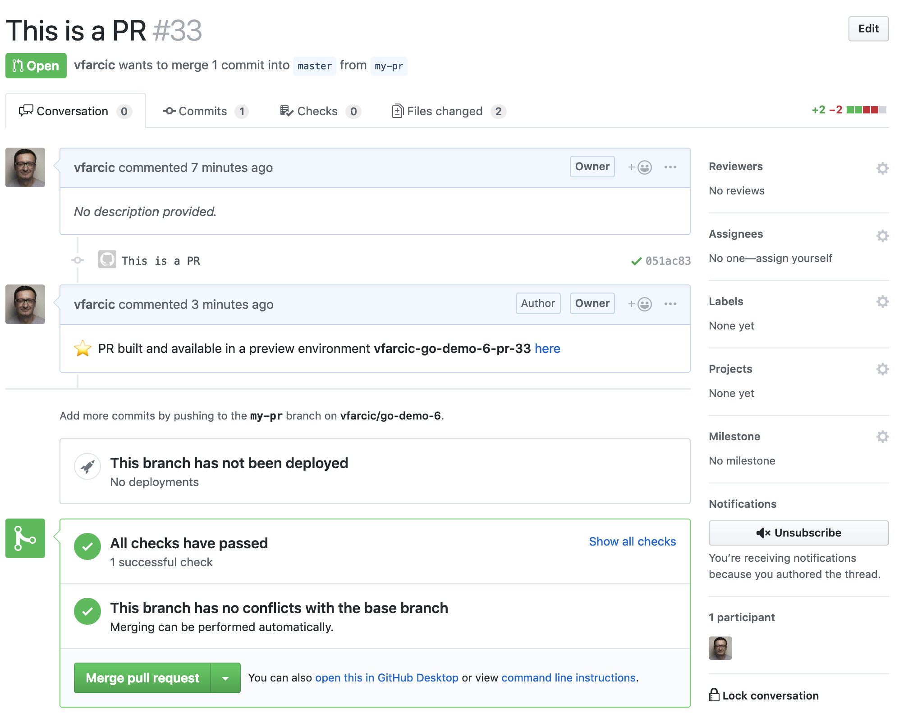

## TODO

- [X] Code
- [ ] Write
- [X] Code review GKE
- [ ] Code review EKS
- [ ] Code review AKS
- [ ] Code review existing cluster
- [ ] Diagrams
- [ ] Text review
- [ ] Gist
- [ ] Review titles
- [ ] Proofread
- [ ] Add to slides
- [ ] Publish on TechnologyConversations.com
- [ ] Add to Book.txt
- [ ] Publish on LeanPub.com

# Working With Pull Requests And Previews

Pull Requests (or whatever their equivalents are called in your favorite Git distribution) are a norm. Most of us adopted them as the primary way of reviewing and accepting changes that will ultimately be deployed to production. They work hand-in-hand with feature branches. A common (and recommended) workflow is to create a new branch for each feature or a change we want to release. Once we create a branch dedicated to a feature or a change, we work locally or in DevPods until we are satisfied with the outcome. From there on, we make a pull request which should execute a set of automated steps that will validate it. If all the steps are successful, we might have some manual actions like code review. Once finished, we merge the pull request and that, as you already saw, results in yet another round of automated tests that finish with the deployment to one or more environments (those set to receive new releases automatically). Finally, the last step is to promote a release to production whenever we feel we're ready (unless the promotion to production is set to be automatic). Hopefully, the whole process from craeeting a branch all the way until it is deployed to permanent environments (e.g., staging, production) is measured in days or even hours.

So, a high level process of a lifecycle of an application, usually contains the steps that follow.

1. Create a feature branch
2. Work on the feature locally or through DevPods
3. Create a pull request when the feature is ready
4. Execute a set of automated validations that will confirm that the pull request works as expected
5. Review and approve the pull request
6. Create, deploy, and validate a new release in permanent environments (e.g., staging)
7. Promote the release to production (unless that part is automated as well)

TODO: Diagram

In you case, there might be variations to the process. Still, at a very high level, the process works fairly well and is widely adopted. The problem is that the process based on feature branches is in stark contrast to how we were developing applications in the past.

Long time ago in a galaxy far, far away, we used to have long application lifecycles, cumbersome and mostly manual processes, and infinite number of gates with silly approval mechanisms. That reflected in our branching strategies. We'd have project or development branches that lived for months. Moving from one environment to another usually meant merging from one branch to another (e.g., from development to staging to integration to pre-production to production). We do not live in 1999 any more. Those practices are obsoolete. We split projects into features. We reduced lifecycles from months to weeks to days to hours. And, more importantly, we learned that it is pointless to test one set of binaries and deploy to production another. All that resulted in feauture branches model. Each feature gets a branch, and each branch is merged back to master. There's nothing in between. There are no staging, integration, pre-production and other branches. The reason for that lies in the build something once and move the same artifact through environments. With such approach, there is no reason for existence of all those branches. You develop in a feature branch, you merge it to the master, you build the artefacts as part of the merge process, and you move them through environments until the reach production. Even that can be questioned and many are now pushing directly to master without feature or any other branches and without pull requests. We won't go that far and I'll assume that if you are that advanced, you should be able to adapt the process we'll use. What I do NOT expect you to do is to create a complicated branching schema only because you're used to it. Move on and travel forward from whichever year you live in to the present time (2019 at the time of this writing).

We already explored how to *work on the feature locally or through DevPods*. In this chapter, we'll cover all the other steps, except the promotion to production (that's coming later). We'll go through most of the lifecycle of an application and see how we can add pull requests into the GitOps and Jenkins X processes we explored so far.

## Creating A Kubernetes Cluster With Jenkins X And Importing The Application

This part is getting boring, but it might be necessary if you destroyed the cluster or uninstalled Jenkins X at the end of the previous chapter. Long story short, create a new Jenkins X cluster unless you kept the one from before.

I> All the commands from this chapter are available in the [07-dev.sh](https://gist.github.com/39c3fe9bbe693f9072e9e41980b9337e) Gist.

For your convenience, the Gists from the previous chapter are available below as well.

* Create new **GKE** cluster: [gke-jx.sh](https://gist.github.com/86e10c8771582c4b6a5249e9c513cd18)
* Create new **EKS** cluster: [eks-jx.sh](https://gist.github.com/dfaf2b91819c0618faf030e6ac536eac)
* Create new **AKS** cluster: [aks-jx.sh](https://gist.github.com/6e01717c398a5d034ebe05b195514060)
* Use an **existing** cluster: [install.sh](https://gist.github.com/3dd5592dc5d582ceeb68fb3c1cc59233)

Next, update your `jx` version so that we are sure that the examples do not use features that do not exist in your version.

```bash
jx version
```

We'll continue using the *go-demo-6* application. Please enter the local copy of the repository, unless you're there already.

```bash
cd go-demo-6
```

I> The commands that follow will reset your master branch with the contents of the `dev` branch that contains all the changes we did so far. Please execute them only if you are unsure whether you did all the exercises correctly.

```bash
git checkout dev

git merge -s ours master --no-edit

git checkout master

git merge dev

git push
```

I> If you destroyed the cluster at the end of the previous chapter, we'll need to import the *go-demo-6* application again. Please execute the commands that follow only if you created a new cluster specifically for the exercises from this chapter.

```bash
jx import -b
```

Now we can create some pull requests.

## Exploring Jenkinsfile

Before we dive into pull requests, we might want to take another look at the Jenkinsfile created when we imported the *go-demo-6* project.

W> Make sure that you are inside the *go-demo-6* directory before proceeding further.

```bash
cat Jenkinsfile
```

The output is as follows.

```groovy
pipeline {
  agent {
    label "jenkins-go"
  }
  environment {
    ORG = 'vfarcic'
    APP_NAME = 'go-demo-6'
    CHARTMUSEUM_CREDS = credentials('jenkins-x-chartmuseum')
  }
  stages {
    stage('CI Build and push snapshot') {
      when {
        branch 'PR-*'
      }
      environment {
        PREVIEW_VERSION = "0.0.0-SNAPSHOT-$BRANCH_NAME-$BUILD_NUMBER"
        PREVIEW_NAMESPACE = "$APP_NAME-$BRANCH_NAME".toLowerCase()
        HELM_RELEASE = "$PREVIEW_NAMESPACE".toLowerCase()
      }
      steps {
        container('go') {
          dir('/home/jenkins/go/src/github.com/vfarcic/go-demo-6') {
            checkout scm
            sh "make linux"
            sh "export VERSION=$PREVIEW_VERSION && skaffold build -f skaffold.yaml"
            sh "jx step post build --image $DOCKER_REGISTRY/$ORG/$APP_NAME:$PREVIEW_VERSION"
          }
          dir('/home/jenkins/go/src/github.com/vfarcic/go-demo-6/charts/preview') {
            sh "make preview"
            sh "jx preview --app $APP_NAME --dir ../.."
          }
        }
      }
    }
    stage('Build Release') {
      when {
        branch 'master'
      }
      steps {
        container('go') {
          dir('/home/jenkins/go/src/github.com/vfarcic/go-demo-6') {
            checkout scm

            // ensure we're not on a detached head
            sh "git checkout master"
            sh "git config --global credential.helper store"
            sh "jx step git credentials"

            // so we can retrieve the version in later steps
            sh "echo \$(jx-release-version) > VERSION"
            sh "jx step tag --version \$(cat VERSION)"
            sh "make build"
            sh "export VERSION=`cat VERSION` && skaffold build -f skaffold.yaml"
            sh "jx step post build --image $DOCKER_REGISTRY/$ORG/$APP_NAME:\$(cat VERSION)"
          }
        }
      }
    }
    stage('Promote to Environments') {
      when {
        branch 'master'
      }
      steps {
        container('go') {
          dir('/home/jenkins/go/src/github.com/vfarcic/go-demo-6/charts/go-demo-6') {
            sh "jx step changelog --version v\$(cat ../../VERSION)"

            // release the helm chart
            sh "jx step helm release"

            // promote through all 'Auto' promotion Environments
            sh "jx promote -b --all-auto --timeout 1h --version \$(cat ../../VERSION)"
          }
        }
      }
    }
  }
}
```

Jenkinsfile from the *go-demo-6* project is split into three `stages`. The first one (`CI Build and push snapshot`) is limited to PRs through the `when { branch 'PR-*' }` condition. In other words, the steps inside that `stage` will be executed only when we create a pull request, and ignored in all other cases.

Inside the `CI Build and push snapshot` stage are the default `steps` generated by Jenkins X when we imported the project. We can see that the first one checks out the code (`checkout scm`). Then we build a binary (`make linux`) and a container image (`skaffold build`). Further on, we're running any post build steps we might have (`jx step post build`). At the moment there are none, so that step is not doing much. We'll deal with them later.

All the steps we mentioned so far are running in the project's root directory. For the last two, we're switching to `charts/preview` since that's where we have Makefile specific to the `preview` chart that will be deployed every time we create a pull request. Once inside the `preview` directory, we're executing `make preview`. If you take a look at the Makefile over there, you'll see that its purpose is to change a few files by injecting auto-generated unique version. Once those files are modified, we're executing `jx preview` command. It creates or updates the preview environment. You'll see what that means in more detail soon. For now, please note that each pull request results in a new (and temporary) environment with a release of our software and the dependencies running inside it. The purpose of such environments is to provide a place where we can see our application in action before approving the merge to the master branch.

We are missing something very important inside the `CI Build and push snapshot` stage. We are not running any tests. We'll fix that soon.

Further on we have the `Build Release` and `Promote to Environments` stages. Both are executed only if the `branch` is `master`. We already experienced the effects of those stages, so we'll go through them without going into details.

The `Build Release` is in charge of building a release with "proper" versioning schema (semantic versioning). Functionally, it is very similar to what we're doing with pull requests. The major difference is that it is using the chart from  `charts/go-demo-6` while for pull requests we're using the one defined in `charts/preview`. The reason for such separation lies in the common need to specify additional dependencies when deploying pull requests in temporary environments. If our application depends on others, they should be already available in permanent environments (e.g,. staging and production). Everything ends up there sooner or later since those environments are based on the idea that their whole definition is stored in separate repositories. Permanent environments are similar and staging should reflect what will be in production a while later. But, in case of pull requests, each gets its own environment. So, if our application depends on others, we need to specify them in `charts/preview/requirements.yaml`. We'll discuss the `preview` chart in more detail later.

The `Promote to Environments` stage is true to its name. TODO: Continue

    stage('Promote to Environments') {
      when {
        branch 'master'
      }
      steps {
        container('go') {
          dir('/home/jenkins/go/src/github.com/vfarcic/go-demo-6/charts/go-demo-6') {
            sh "jx step changelog --version v\$(cat ../../VERSION)"

            // release the helm chart
            sh "jx step helm release"

            // promote through all 'Auto' promotion Environments
            sh "jx promote -b --all-auto --timeout 1h --version \$(cat ../../VERSION)"
          }
        }
      }
    }

## Creating a PR

---

```bash
git checkout -b my-pr

# Double check that the current message is indeed `hello, devpod with tests!`
cat main.go | sed -e \
    "s@hello, devpod with tests@hello, PR@g" \
    | tee main.go

cat main_test.go | sed -e \
    "s@hello, devpod with tests@hello, PR@g" \
    | tee main_test.go

git add .

git commit -m "This is a PR"

git push --set-upstream origin my-pr

jx create pr \
  -t "My PR" \
  --body "This is the text that describes the PR
and it can span multiple lines" \
  -b
```

```
Created PullRequest #33 at https://github.com/vfarcic/go-demo-6/pull/33
```

* Open the link in browser

* Wait for a while



* Click the *here* link
* Add */demo/hello* to the newly opened address
* Return to the browser tab with the PR in GitHub
* Click the *Show all checks* link


* Click the *Details* link

```bash
jx get previews
```

```
PULL REQUEST                                 NAMESPACE                  APPLICATION
https://github.com/vfarcic/go-demo-6/pull/33 jx-vfarcic-go-demo-6-pr-33 http://go-demo-6.jx-vfarcic-go-demo-6-pr-33.35.196.59.141.nip.io
```

```bash
PR_ADDR=[...] # Copy the address from the `APPLICATION` column

curl "$PR_ADDR/demo/hello"
```

```
hello, PR!
```

```bash
helm ls
```

```
NAME                       REVISION UPDATED                  STATUS   CHART                          APP VERSION NAMESPACE
jenkins-x                  1        Wed Mar 13 11:27:06 2019 DEPLOYED jenkins-x-platform-0.0.3535                jx
jx-production              1        Wed Mar 13 11:33:25 2019 DEPLOYED env-1                                      jx-production
jx-staging                 3        Wed Mar 13 11:40:16 2019 DEPLOYED env-3                                      jx-staging
jx-vfarcic-go-demo-6-pr-33 1        Wed Mar 13 11:41:07 2019 DEPLOYED preview-0.0.0-SNAPSHOT-PR-33-1             jx-vfarcic-go-demo-6-pr-33
jxing                      1        Wed Mar 13 11:23:34 2019 DEPLOYED nginx-ingress-1.3.1            0.22.0      kube-system
```

```bash
jx get build log
```

```
? Which pipeline do you want to view the logs of?:   [Use arrows to move, type to filter]
> vfarcic/environment-jx-rocks-production/master
  vfarcic/environment-jx-rocks-staging/master
  vfarcic/go-demo-6/PR-33
  vfarcic/go-demo-6/master
```

* Select the pipeline of the PR and press the enter key

## Adding Unit Tests

---

```bash
jx create issue -t "Add unit tests" \
    --body "Add unit tests to the CD process" \
    -b
```

```
Created issue #35 at https://github.com/vfarcic/go-demo-6/issues/35
```

* Open the link in browser

```bash
ISSUE_ID=[...] # e.g. 35

vim Jenkinsfile
```

* Exit and save (e.g., *esc + :wq + enter*)
* Add `sh "make unittest"` after `checkout scm`

```bash
git add .

git commit -m "Added unit tests (fixes #$ISSUE_ID)"

git push
```

* Go back to the PR in GitHub, refresh the screen, and wait until the checks are finished

```bash
jx get issues -b
```

```
ISSUE                                          TITLE
https://github.com/vfarcic/go-demo-6/issues/35 Add unit tests
```

* Open the issue in a browser


## Adding Functional Tests

```bash
echo '
functest: 
	CGO_ENABLED=$(CGO_ENABLED) $(GO) test -test.v --run FunctionalTest --cover' \
    | tee -a Makefile

vim Jenkinsfile
```

* Add the code that follows after the last instruction in the `CI Build and push snapshot` stage

```groovy
          dir('/home/jenkins/go/src/github.com/vfarcic/go-demo-6') {
            script {
              sleep 10
              addr=sh(script: "kubectl -n jx-$CHANGE_AUTHOR-$HELM_RELEASE get ing $APP_NAME -o jsonpath='{.spec.rules[0].host}'", returnStdout: true).trim()
              sh "ADDRESS=$addr make functest"
            }
          }
```

* Change `vfarcic` to your own username
* Save and exit (e.g., *esc + :wq + enter*)

TODO: Add the link to the complete Jenkinsfile

```bash
git add .

git commit -m "Added functional tests"

git push
```

* Go back to the PR in GitHub, refresh the screen, and wait until the checks are finished.

## Adding Production Tests

```bash
echo '
prodtest: 
	DURATION=1 CGO_ENABLED=$(CGO_ENABLED) $(GO) test -test.v --run ProductionTest --cover' \
    | tee -a Makefile

vim Jenkinsfile
```

* Add the code that follows at the end of the `Promote to Environments` stage

```groovy
          dir('/home/jenkins/go/src/github.com/vfarcic/go-demo-6') {
            script {
              sleep 10
              addr=sh(script: "kubectl -n jx-staging get ing $APP_NAME -o jsonpath='{.spec.rules[0].host}'", returnStdout: true).trim()
              sh "ADDRESS=$addr make functest"
              sh "ADDRESS=$addr make prod-test"
            }
          }
```

* Change `vfarcic` to your own username
* Save and exit (e.g., *esc + :wq + enter*)

## Adding Production Tests

```bash
git add .

git commit -m "Added production tests"

git push
```

* Go back to the PR in GitHub, refresh the screen, and wait until the checks are finished. It should state that *All checks have failed*.

```bash
jx get build logs
```

* Select the PR and press the enter key

```
=== RUN   TestFunctionalTestSuite/Test_Person_ReturnsStatus200
2019/03/13 11:27:52 Sending a request to http://go-demo-6.jx-vfarcic-go-demo-6-pr-34.35.196.59.141.nip.io/demo/person
--- FAIL: TestFunctionalTestSuite (0.23s)
    --- PASS: TestFunctionalTestSuite/Test_Hello_ReturnsStatus200 (0.11s)
    --- FAIL: TestFunctionalTestSuite/Test_Person_ReturnsStatus200 (0.10s)
        functional_test.go:48:
                Error Trace:    functional_test.go:48
                Error:          Not equal:
                                expected: 200
                                actual  : 502
                Test:           TestFunctionalTestSuite/Test_Person_ReturnsStatus200
                Messages:       ADDR: http://go-demo-6.jx-vfarcic-go-demo-6-pr-34.35.196.59.141.nip.io/demo/person
FAIL
coverage: 1.4% of statements
exit status 1
```

```bash
# TODO: Comment on `charts/preview/requirements.yaml`

echo "
  usePassword: false" \
  | tee -a charts/go-demo-6/values.yaml

echo "

preview-db:
  usePassword: false" \
  | tee -a charts/preview/values.yaml 

git add .

git commit -m "Removed MongoDB password"

git push
```

## Post-Preview Jobs

---

```bash
# Explain the option of using `jx create post preview job` and `jx get post preview`
```

## Merging a PR


* Open the PR in GitHub
* Confirm that *All checks have passed*
* Click the *Merge pull request* button
* Click the *Confirm merge* button

```bash
jx get activity -f go-demo-6 -w
```

* Wait until all the steps of the new build are `Succeeded`

```bash
jx get applications
```

```
APPLICATION STAGING PODS URL
go-demo-6   0.0.169 1/1  http://go-demo-6.jx-staging.35.196.59.141.nip.io
```

```bash
STAGING_ADDR=[...] # Replace `[...]` with the URL

curl "$STAGING_ADDR/demo/hello"
```

```
hello, PR!
```

NOTE: There’s a Kubernetes `cronjob` that runs every 3hrs by default to cleanup preview environments for closed PRs

Every 3 hours Jenkins X runs a Kubernetes a cron job to clean up preview environments associated with closed or merged pull request.

```bash
jx get previews
```

```
PULL REQUEST                                 NAMESPACE                  APPLICATION
https://github.com/vfarcic/go-demo-6/pull/33 jx-vfarcic-go-demo-6-pr-33 http://go-demo-6.jx-vfarcic-go-demo-6-pr-33.35.196.59.141.nip.io
```

```bash
jx gc previews
```

```
Deleting helm release: jx-vfarcic-go-demo-6-pr-34
Deleting preview environment: vfarcic-go-demo-6-pr-34
Deleted environment vfarcic-go-demo-6-pr-34
```

```bash
jx get previews
```

```
PULL REQUEST NAMESPACE APPLICATION
```

* Could have deleted a specific preview through the `jx delete preview` command.

## What Now?

```bash
cd ..

GH_USER=[...]

hub delete -y \
  $GH_USER/environment-jx-rocks-staging

hub delete -y \
  $GH_USER/environment-jx-rocks-production

rm -rf ~/.jx/environments/$GH_USER/environment-jx-rocks-*

rm -f ~/.jx/jenkinsAuth.yaml
```