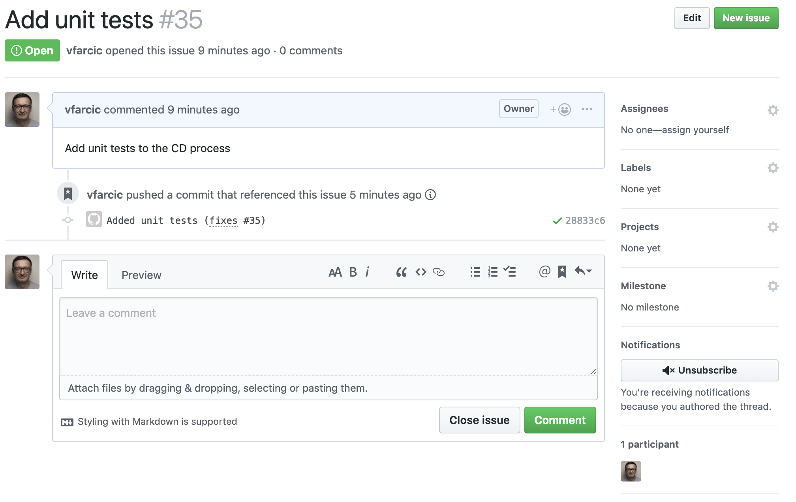

# Working With Pull Requests And Preview Environments {#pr} 

Pull Requests (or whatever their equivalents are called in your favorite Git distribution) are a norm. Most of us have adopted them as the primary way of reviewing and accepting changes that will ultimately be deployed to production. They work hand-in-hand with feature branches.

Some of you might cringe thinking about Pull Requests, preferring to use Trunk Based Development, and work directly on master. Even if that is your paradigm, I still recommend you go through this chapter and do all the exercises. If processes were manual and getting a Pull Request merged would be a slow, hands-on, and time-consuming effort Pull Requests are a terrible idea. If you use Pull Requests, you should use automation to speed up the process, and reduce the human effort required. It's precisely that, what Jenkins X is doing for us. So put your reservations of Pull Requests aside, and follow along.

A common (and recommended) workflow is to create a new branch for each feature or change we want to release. Once we create a branch dedicated to a feature or change, we either work locally or in DevPods until we are satisfied with the outcome. From there on, we make a pull request, which should execute a set of automated steps that will deploy the preview and validate it. If all the steps are successful, we might have some manual actions like code review. Once finished, we merge the pull request and that, as you already saw, results in yet another round of automated tests that end with the deployment to one or more environments (those set to receive new releases automatically). Finally, the last step is to promote a release to production whenever we feel we're ready (unless the promotion to production is set to be automatic). Hopefully, the whole process from creating a branch all the way until it is deployed to permanent environments (e.g., staging, production) is measured in days or even hours.

So, a high-level process of a lifecycle of an application usually contains the steps that follow.

1. Create a feature branch
2. Work on the feature locally or through DevPods
3. Create a pull request when the feature is ready
4. Deploy the preview
5. Execute a set of automated validations that will confirm that the pull request works as expected
6. Review and approve the pull request
7. Create, deploy, and validate a new release in permanent environments (e.g., staging)
8. Promote the release to production (unless that part is automated as well)


In your case, there might be variations to the process. Still, at a very high level, the process works reasonably well and is widely adopted. The problem is that the process based on feature branches is in stark contrast to how we were developing applications in the past.

*A long time ago in a galaxy far, far away*, we used to have long application lifecycles, cumbersome and mostly manual processes, and an infinite number of gates with silly approval mechanisms. That reflected in our branching strategies. We'd have project or development branches that lived for months. Moving from one environment to another usually meant merging from one branch to another (e.g., from development to staging to integration to pre-production to production). We do not live in 1999 anymore, and those practices are today obsolete.

We split projects into features. We reduced lifecycles from months to weeks to days to hours. And, more importantly, we learned that it is pointless to test one set of binaries and deploy another to production. All that resulted in feature branches model. Each feature gets a branch, and each branch is merged back to master. There's nothing in between. There are no staging, integration, pre-production and other branches. The reason for that lies in the process that tells us that we should build something only once and move the same artifact through environments. With such an approach, there is no reason for the existence of all those branches. You develop in a feature branch, you merge it to the master, you build the artifacts as part of the merge process, and you move them through environments until they reach production. Even that can be questioned, and many are now pushing directly to the master branch without feature or any other branches and without pull requests. We won't go that far, and I'll assume that, if you do want to push directly to master, you should be able to adapt the process we'll use. What I do NOT expect you to do is create a complicated branching schema only because you're used to it. Move on and travel forward from whichever year you live into the present time (2019 at the time of this writing).

We already explored how to *work on a feature locally or through DevPods*. In this chapter, we'll cover all the other steps except for the promotion to production (that's coming later). We'll go through most of the lifecycle of an application and see how we can add pull requests into the GitOps and Jenkins X processes we explored so far.

## Creating A Kubernetes Cluster With Jenkins X And Importing The Application

This part is getting boring, but it might be necessary if you destroyed the cluster or uninstalled Jenkins X at the end of the previous chapter. Long story short, create a new Jenkins X cluster unless you kept the one from before.

I> All the commands from this chapter are available in the [08-pr.sh](https://gist.github.com/9756d98bb0a0d71bebc8281f8b699145) Gist.

For your convenience, the Gists from the previous chapter are available below as well.

* Create new **GKE** cluster: [gke-jx.sh](https://gist.github.com/86e10c8771582c4b6a5249e9c513cd18)
* Create new **EKS** cluster: [eks-jx.sh](https://gist.github.com/dfaf2b91819c0618faf030e6ac536eac)
* Create new **AKS** cluster: [aks-jx.sh](https://gist.github.com/6e01717c398a5d034ebe05b195514060)
* Use an **existing** cluster: [install.sh](https://gist.github.com/3dd5592dc5d582ceeb68fb3c1cc59233)

We'll continue using the *go-demo-6* application. Please enter the local copy of the repository, unless you're there already.

```bash
cd go-demo-6
```

I> The commands that follow will reset your `master` with the contents of the `dev` branch that contains all the changes we did so far. Please execute them only if you are unsure whether you did all the exercises correctly.

```bash
git pull

git checkout dev

git merge -s ours master --no-edit

git checkout master

git merge dev

git push
```

I> If you destroyed the cluster at the end of the previous chapter, you'll need to import the *go-demo-6* application again. Please execute the commands that follow only if you created a new cluster specifically for the exercises from this chapter.

```bash
jx import --batch-mode

jx get activities \
    --filter go-demo-6 \
    --watch
```

Please wait until the activity of the application shows that all the steps were executed successfully, and stop the watcher by pressing *ctrl+c*.

Now we can create some pull requests.

## Exploring Jenkinsfile

Before we dive into pull requests, we might want to take another look at the Jenkinsfile created when we imported the *go-demo-6* project.

W> Make sure that you are inside the *go-demo-6* directory before proceeding further.

```bash
cat Jenkinsfile
```

The output is as follows.

```groovy
pipeline {
  agent {
    label "jenkins-go"
  }
  environment {
    ORG = 'vfarcic'
    APP_NAME = 'go-demo-6'
    CHARTMUSEUM_CREDS = credentials('jenkins-x-chartmuseum')
  }
  stages {
    stage('CI Build and push snapshot') {
      when {
        branch 'PR-*'
      }
      environment {
        PREVIEW_VERSION = "0.0.0-SNAPSHOT-$BRANCH_NAME-$BUILD_NUMBER"
        PREVIEW_NAMESPACE = "$APP_NAME-$BRANCH_NAME".toLowerCase()
        HELM_RELEASE = "$PREVIEW_NAMESPACE".toLowerCase()
      }
      steps {
        container('go') {
          dir('/home/jenkins/go/src/github.com/vfarcic/go-demo-6') {
            checkout scm
            sh "make linux"
            sh "export VERSION=$PREVIEW_VERSION && skaffold build -f skaffold.yaml"
            sh "jx step post build --image $DOCKER_REGISTRY/$ORG/$APP_NAME:$PREVIEW_VERSION"
          }
          dir('/home/jenkins/go/src/github.com/vfarcic/go-demo-6/charts/preview') {
            sh "make preview"
            sh "jx preview --app $APP_NAME --dir ../.."
          }
        }
      }
    }
    stage('Build Release') {
      when {
        branch 'master'
      }
      steps {
        container('go') {
          dir('/home/jenkins/go/src/github.com/vfarcic/go-demo-6') {
            checkout scm

            // ensure we're not on a detached head
            sh "git checkout master"
            sh "git config --global credential.helper store"
            sh "jx step git credentials"

            // so we can retrieve the version in later steps
            sh "echo \$(jx-release-version) > VERSION"
            sh "jx step tag --version \$(cat VERSION)"
            sh "make build"
            sh "export VERSION=`cat VERSION` && skaffold build -f skaffold.yaml"
            sh "jx step post build --image $DOCKER_REGISTRY/$ORG/$APP_NAME:\$(cat VERSION)"
          }
        }
      }
    }
    stage('Promote to Environments') {
      when {
        branch 'master'
      }
      steps {
        container('go') {
          dir('/home/jenkins/go/src/github.com/vfarcic/go-demo-6/charts/go-demo-6') {
            sh "jx step changelog --version v\$(cat ../../VERSION)"

            // release the helm chart
            sh "jx step helm release"

            // promote through all 'Auto' promotion Environments
            sh "jx promote -b --all-auto --timeout 1h --version \$(cat ../../VERSION)"
          }
        }
      }
    }
  }
}
```

Jenkinsfile from the *go-demo-6* project is split into three `stages`. The first one (`CI Build and push snapshot`) is limited to PRs through the `when { branch 'PR-*' }` condition. The steps inside that `stage` will be executed only when we create a pull request, and they will be ignored in all other cases.

Inside the `CI Build and push snapshot` stage are the default `steps` generated by Jenkins X when we imported the project. We can see that the first one checks out the code (`checkout scm`). Then it builds a binary (`make linux`) and a container image (`skaffold build`). Further on, it's running any post-build steps we might have (`jx step post build`). At the moment there are none, so that step is not doing much. We'll deal with it later.

All the steps we mentioned so far are running in the project's root directory. For the last two, we're switching to `charts/preview` since that's where we have Makefile specific to the `preview` chart that will be deployed every time we create a pull request. Once inside the `preview` directory, we're executing `make preview`. If you take a look at the Makefile over there, you'll see that its purpose is to change a few files by injecting auto-generated unique version. Once those files are modified, we're executing `jx preview` command. It creates or updates the preview environment. You'll see what that means in more detail soon. For now, please note that each pull request results in a new (and temporary) environment with a release of our software and the dependencies running inside it. The purpose of such environments is to provide a place where we can see our application in action before approving the merge to the master branch.

We are missing something essential inside the `CI Build and push snapshot` stage. We are not running any tests. We'll fix that soon.

Further on we have the `Build Release` and `Promote to Environments` stages. Both are executed only if the `branch` is `master`. We already experienced the effects of those stages, so we'll go through them without going into details.

The `Build Release` is in charge of building a release with "proper" versioning schema (semantic versioning). Functionally, it is very similar to what we're doing with pull requests. The significant difference is that it is using the chart from  `charts/go-demo-6` while for pull requests we're using the one defined in `charts/preview`. The reason for such separation lies in the frequent need to specify additional dependencies or to modify existing ones when deploying pull requests in temporary environments. If our application depends on others, they should be already available in permanent environments (e.g., staging and production). Everything ends up there sooner or later since those environments are based on the idea that their whole definition is stored in separate repositories. Permanent environments are similar. Staging should reflect what will be in production a while later. But, in case of pull requests, each gets its own environment. So, if our application depends on others, we need to specify them in `charts/preview/requirements.yaml`. We'll discuss the `preview` chart in more detail later.

The `Promote to Environments` stage is true to its name. It creates Git release notes based on tags and commits (`jx step changelog`), a Helm release (`jx step helm release`), and it promotes the release to all the environments set to receive automatic promotions (`jx promote`). The promotion (the last step) pushes changes to the repositories related to the environments (e.g., `environment-jx-rocks-staging`). That, in turn, initiates separate Jenkins builds. After that, the `jx promote` step waits until environment-specific builds are finished and reports back their status.

Now that we have an understanding of how the *go-demo-6* Jenkinfile works, we can go back to our initial goal of exploring pull requests and preview environments.

## Creating Pull Requests

What is the first thing a developer should do when starting to work on a new feature? If that developer is used to the "old processes", he might wait until someone creates a set of branches, a few environments, infinite approvals, and a bunch of other silly things no one should need today. We already saw that creating a development environment is very easy and fast with DevPods. I'm going to ignore talking about the approvals, so the only thing left are branches.

Today, no self-respecting developer needs others to create branches. Since we are not developing against a common "development" branch any more but using feature branches, we can create one ourselves and start developing a new feature.

```bash
git checkout -b my-pr
```

We created a branch called `my-pr`.

We'll skip the steps that create a personal project-specific development environment with DevPods. That would lead us astray from the main topic. Instead, we'll use the commands that follow to make a few simple changes. Our goal here is not to develop something complex, but rather to make just enough changes to help us distinguish the new from the old release while moving it through the process of creating a pull request and a preview environment.

So, we'll change our `hello` message to something else. I'll save you from opening your favorite IDE and changing the code yourself by providing a few simple `cat`, `sed`, and `tee` commands that will do the changes for us.

```bash
cat main.go | sed -e \
    "s@hello, devpod with tests@hello, PR@g" \
    | tee main.go

cat main_test.go | sed -e \
    "s@hello, devpod with tests@hello, PR@g" \
    | tee main_test.go
```

We changed the code of the application and the tests so that the output message is `hello, PR` instead of `hello, devpod with tests`. Those changes are not much different than the changes we did in the previous chapters. The only notable difference is that this time we're not working with the `master`, but rather with a feature branch called `my-pr`.

There's one more change we'll make.

Right now, MongoDB is defined in `charts/go-demo-6/requirements.yaml` and it will run as a replica set. We do not need that for previews. A single replica DB should be more than enough. We already added a non-replicated MongoDB as a dependency of the preview (`charts/preview/requirements.yaml`) when we created a custom build pack. Since we have the DB defined twice (once in the app chart, and once in the preview), we'd end up with two DBs installed. We don't need that, so we'll disable the one defined in the application chart and keep only the one from the preview chart (the single replica DB).

To speed things up, we'll also disable persistence of the DB. Since previews are temporary and used mostly for testing and manual validations, there is no need to waste time creating a persistent volume.

Please execute the command that follows.

```bash
echo "

db:
  enabled: false
  
preview-db:
  persistence:
    enabled: false" \
  | tee -a charts/preview/values.yaml
```

The next steps should be no different than what you're already doing every day at your job. We'll commit and push the changes to the upstream.

```bash
git add .

git commit \
    --message "This is a PR"

git push --set-upstream origin my-pr
```

What comes next should also be something you're (hopefully) doing all the time. We'll create a pull request. But we might do it slightly differently than what you're used to.

Typically, you would open GitHub UI and click a few buttons that would create a pull request. If you prefer UIs and the "common" way of creating PRs, please do so. On the other hand, if you'd like to do it using CLI, you'll be glad to know that `jx` allows us to create PRs as well. If a terminal is your weapon of choice, please execute the command that follows to create a PR.

```bash
jx create pullrequest \
  --title "My PR" \
  --body "This is the text that describes the PR
and it can span multiple lines" \
  --batch-mode
```

The output should show the ID of the pull request as well as a link to see the pull request in a browser. Please open the link.

The moment we created the PR, GitHub notified Jenkins X through a webhook. It, in turn, started running a new build (activity) based on the Jenkinsfile. As we already saw, only the first stage will be executed since it is the only one that matches the `branch` condition (`when { branch 'PR-*' }`).

When the build started, Jenkins X notified GitHub that the validation is in progress and you should be able to confirm that from the GitHub UI. If you do not see any progress, the build probably did not yet start, and you might need to refresh your screen after a while. Similarly, when the build is finished and if it is successful, we should see a new comment stating that the *PR* is *built and available in a preview environment *[USER]-go-demo-6-pr-[PR_ID]*. Bear in mind that you might need to refresh your browser to see the change of the pull request status.

What that comment tells us is that Jenkins X created a new environment (Namespace) dedicated to that PR and it will keep it up-to-date. If we push additional changes to the pull request, the process will repeat, and it will end with a new deployment to the same environment.

The end of the comment is a link (*here*). You can use it to open your application. Feel free to click the link and do not be confused if you see *503* or a similar error message. Remember that the *go-demo-6* application does not respond to requests to the root and that you need to add */demo/hello* to the address opened through the *here* link.

You should also see a link *Show all checks* in the pull request screen in GitHub next to the *all checks have passed* text near the bottom. Click it, and you'll see a single check coming from Jenkins.


Click the *details* link, and you will be redirected to Jenkins UI. You'll see the graphical representation of the finished build associated with the PR.

If you are like me and you prefer CLIs, you might be wondering how to retrieve similar information from your terminal. How can we see which previews we have in the cluster, what are the associated pull requests, in which Namespaces they are running, and what are the addresses we can use to access the previews?

Just like `kubectl get` command allows you to retrieve any Kubernetes resource, `jx get` does the same but limited to the resources related to Jenkins X. We just need to know the name of the resource. The one we're looking for should be easy to guess.

```bash
jx get previews
```

The output is as follows.

```
PULL REQUEST                                 NAMESPACE                  APPLICATION
https://github.com/vfarcic/go-demo-6/pull/33 jx-vfarcic-go-demo-6-pr-33 http://go-demo-6.jx-vfarcic-go-demo-6-pr-33.35.196.59.141.nip.io
```

We can see from the output the address of the pull request in GitHub, the Namespace where the application and its dependencies were deployed, and the address through which we can access the application (through auto-generated Ingress).

Next, we'll confirm that the preview was indeed installed and that it is working by sending a simple request to `/demo/hello`.

W> Before executing the commands that follow, please make sure to replace `[...]` with the address from the `APPLICATION` column from the output of the previous command.

```bash
PR_ADDR=[...]

curl "$PR_ADDR/demo/hello"
```

The output should reflect the changes to the code we made before creating the pull request. It should display `hello, PR!`

The critical thing to understand is that every pull request will be deployed to its own environment unless we change the default behavior.

I will let you "play" a bit with `jx` CLI. Explore the logs of the pull request, output the activities, and run the other commands we learned so far. Once you're done, we'll try to fill in a huge hole we have in our Jenkinsfile.

## Adding Unit Tests

In the previous chapter, we added the `unittest` target to Makefile. We needed it so that the tests are executed every time we make changes to the code. However, we did not modify Jenkinsfile so that the same tests are executed as part of our pipeline. We'll do that next but, before we start editing files, we'll create an issue. That way our examples will be closer to the "real world" situation in which we associate our work to one or more issues, requests for change, or new features.

```bash
jx create issue -t "Add unit tests" \
    --body "Add unit tests to the CD process" \
    -b
```

We used yet another `jx` command. This time we created a GitHub issue. The response of the command should contain the ID of the issue as well as the link we can use to open it in a browser. Feel free to open the link and confirm that the issue was indeed created correctly.

We'll need the issue ID later, so let's store it in an environment variable instead of trying to memorize it.

W> Before executing the command that follows, please make sure you replace `[...]` with the ID of the issue from the output of the previous command.

```bash
ISSUE_ID=[...]
```

Now that we have an issue that describes the work we are about to do, we can proceed and add unit tests to Jenkinsfile.

Since unit tests do not require a live application, we can run them as one of the first steps inside our pipeline. That way we'll quickly discover whether one of the tests fail. The only step that must be executed before the unit tests is `checkout scm`. Without it, there would be no code, and without code, there are no tests.

Please open *Jenkinsfile* in your favorite editor and add the step that follows after `checkout scm`.

```groovy
sh "make unittest"
```

Make sure to save the changes.

I> If you're unsure about the changes you should make or if you're not sure where to add them, please take a look at [Jenkinsfile in my GitHub repository](https://github.com/vfarcic/go-demo-6/blob/pr/Jenkinsfile#L24).

All that's left is to commit and push the changes to GitHub. This time we'll reference the issue so that GitHub and Jenkins X can use that information to generate relevant messages and artifacts. Specifically, we want the issue to be available in the history of the pull request as well as in release notes later when we merge the PR.

```bash
git add .

git commit \
    --message "Added unit tests (fixes #$ISSUE_ID)"

git push
```

Now we need to wait until the new build is finished, this time with unit tests.

Feel free to go back to the pull request in GitHub or refresh the screen if you're already there, and wait until the checks are finished.

I already mentioned that we can use `jx get` to retrieve any type of resource related to Jenkins X, no matter whether that is something running in Kubernetes, GitHub, or anywhere else. If it's done by or related to Jenkins X, we can retrieve it with the CLI. Issues are not an exception.

```bash
jx get issues -b
```

In my case, the output is as follows.

```
ISSUE                                          TITLE
https://github.com/vfarcic/go-demo-6/issues/35 Add unit tests
```

Now you can copy the address of the issue and open it in a browser or, even better, double click the link if your terminal permits it.



## Adding Functional Tests

Unit tests are essential since they are (usually) fast and they cover a much bigger number of permutations than other types of tests. They provide validations on a low level, and they (often) do not need a live application so they can be executed very early. But, unit tests are rarely enough by themselves. We still need at least functional and some kind of integration tests. While it probably does not make sense to run integration tests in preview environments (there's not much to integrate with), that cannot be said for the functional tests. We can, and we should execute them whenever someone makes a pull request. The process will deploy a new release to a PR-specific preview environment, so why not run a set of functional tests against that deployment.

Before we add functional tests to the Jenkinsfile, we'll create yet another target in Makefile.

W> Remember that `Makefile` expects tabs as indentation. Please make sure that the command that follows is indeed using tabs and not spaces if you're typing the commands instead of copying and pasting from the Gist.

```bash
echo '
functest: 
	CGO_ENABLED=$(CGO_ENABLED) $(GO) \\
	test -test.v --run FunctionalTest \\
	--cover
' | tee -a Makefile
```

The `functest` target is almost the same as `unittest`. The only difference is in the value of the `--run` argument that limits the tests to those in functions with names that contain `FunctionalTest`.

Now's the time to add the new target as a step (or two) in the pipeline. Please open *Jenkinsfile* in your favorite IDE.

Add the code that follows after the last `dir` block in the `CI Build and push snapshot` stage.

```groovy
          dir('/home/jenkins/go/src/github.com/vfarcic/go-demo-6') {
            script {
              sleep 15
              addr=sh(script: "kubectl -n jx-$ORG-$HELM_RELEASE get ing $APP_NAME -o jsonpath='{.spec.rules[0].host}'", returnStdout: true).trim()
              sh "ADDRESS=$addr make functest"
            }
          }
```

I> If you're unsure about the changes you should make or if you're not certain where to add them, please take a look at [Jenkinsfile in my GitHub repository](https://github.com/vfarcic/go-demo-6/blob/pr/Jenkinsfile#L33).

W> Make sure that you replace `vfarcic` with your user. If you're not sure who you are, you can check it from the previous `dir` instruction.

This time, the steps are slightly more complex than with unit tests. First, we added `sleep` of fifteen seconds to ensure that the new release is fully up-and-running (database takes a while). Then, we retrieved the address of the new release by querying Ingress and storing the output in the variable `addr`. We could have simplified that by sending requests directly to the associated service, but then we would not verify whether our application is accessible from outside Kubernetes' internal network. Finally, we're running the `functest` target from Makefile.

Please save the changes before proceeding.

We're still missing one more change to the source code before we go back to the pull request lifecycle.

## Adding Integration Tests

We do not have integration tests. Preview environments are not the right place to run such tests. Instead, permanent environments like staging are much better candidates for running them. But, even though integration tests are not in the scope of what we're trying to do here, we are going to merge our pull request to master, and we should add them before we do that.

The pattern for integration tests is the same as for the functional tests. We'll modify Makefile and invoke them from Jenkinsfile by adding a few more steps. Let's start with the Makefile.

W> Remember that `Makefile` expects tabs as indentation. Please make sure that the command that follows is indeed using tabs and not spaces if you're typing the commands instead of copying and pasting from the Gist.

```bash
echo '
integtest: 
	DURATION=1 \\
	CGO_ENABLED=$(CGO_ENABLED) $(GO) \\
	test -test.v --run ProductionTest \\
	--cover
' | tee -a Makefile
```

Now we need to figure out where to put integration tests. Since they should run when we deploy a new release to permanent environments, we cannot add the steps to the `'CI Build and push snapshot'` stage. The steps in there are executed only when we create a pull request, while deployment to permanent environments is done when we merge (or push) something to the *master* branch. Since those tests need to run only after the deployment, a good candidate is the `Promote to Environments` or in a new stage after it. We'll go with the former.

Since a merge to the master will result in new artifacts (new container image), we should rerun the functional tests as well. So, we'll add both to the `Promote to Environments` stage.

Please open *Jenkinsfile* in your favorite editor. Add the code that follows after the last `dir` block in the `Promote to Environments` stage.

```groovy
          dir('/home/jenkins/go/src/github.com/vfarcic/go-demo-6') {
            script {
              sleep 15
              addr=sh(script: "kubectl -n jx-staging get ing $APP_NAME -o jsonpath='{.spec.rules[0].host}'", returnStdout: true).trim()
              sh "ADDRESS=$addr make functest"
              sh "ADDRESS=$addr make integtest"
            }
          }
```

I> If you're unsure about the changes you should make or if you're not certain where to add them, please take a look at [Jenkinsfile in my GitHub repository](https://github.com/vfarcic/go-demo-6/blob/pr/Jenkinsfile#L82).

W> Make sure that you replace `vfarcic` with your user. If you're not sure who you are, you can check it from the previous `dir` instruction.

The only thing left is to push the files to GitHub. Remember to save the changes before we do that.

```bash
git add .

git commit \
    --message "Added integration tests"

git push
```

Go back to the PR in GitHub, refresh the screen, and wait until the checks are finished. It should state that *All checks have failed*. Do not panic. Things fail, and it's our job to find the cause and fix it.

Let's take a look at the logs and try to figure out why did the latest build fail?

```bash
jx get build logs
```

Select the PR and press the enter key.

The relevant part of the output is as follows.

```
...
=== RUN   TestFunctionalTestSuite/Test_Person_ReturnsStatus200
2019/03/13 11:27:52 Sending a request to http://go-demo-6.../demo/person
--- FAIL: TestFunctionalTestSuite (0.23s)
    --- PASS: TestFunctionalTestSuite/Test_Hello_ReturnsStatus200 (0.11s)
    --- FAIL: TestFunctionalTestSuite/Test_Person_ReturnsStatus200 (0.10s)
        functional_test.go:48:
                Error Trace:    functional_test.go:48
                Error:          Not equal:
                                expected: 200
                                actual  : 502
                Test:           TestFunctionalTestSuite/Test_Person_ReturnsStatus200
                Messages:       ADDR: http://go-demo-6.../demo/person
FAIL
...
```

We can see that the test `Test_Hello_ReturnsStatus200` failed. I'll save you from going through the code and reveal that the problem is that the application cannot authenticate with MongoDB. But, how did we get this far without noticing that? The answer is simple. This is the first time we're executing functional tests. Those we run previously (e.g., unit tests) did not validate whether our application integrates with others (in this case MongoDB). The application fails if it cannot connect to MongoDB so we know that the problem is not that it cannot establish the connection, but that it cannot authenticate. This was the prime example that we cannot rely only on a single type of tests.

Fear not. The fix to the issue is straightforward. We can either provide the credentials to our application, or we can disable authentication altogether. We'll go with the latter option since MongoDB is not exposed outside the cluster. Our solution will allow any application inside the cluster to access the database and, by not exposing it to the outside world, deny access to anyone else. That might not be secure enough for many, and we should probably also restrict which applications inside the cluster can access the database. That would likely involve something like Istio. Since service mesh is not in our scope, we'll skip it and keep things simple.

If you go through MongoDB Helm chart values, you'll notice that one of them is `usePassword`. All we have to do is set it to `false`, both for previews as well as for the "official" application chart deployed to permanent environments. We'll start with the latter by taking a quick look at the chart's `values.yaml` file.

```bash
cat charts/go-demo-6/values.yaml
```

The output, limited to the relevant parts, is as follows.

```yaml
...
go-demo-6-db:
  replicaSet:
    enabled: true
```

We already have a set of values dedicated to `go-demo-6-db`. It's the alias of the `mongodb` dependency we defined earlier in `requirements.yaml`. All we have to do is add `usePassword: false`.

```bash
echo "
  usePassword: false" \
  | tee -a charts/go-demo-6/values.yaml
```

We'll repeat the same in the preview Chart's `values.yaml` file.

Please execute the command that follows.

```bash
echo "
  usePassword: false" \
  | tee -a charts/preview/values.yaml
```

We're done with changes, and we should push them to GitHub.

```bash
git add .

git commit \
    --message "Removed MongoDB password"

git push
```

The only thing left is to wait until the Jenkins build initiated by the push to the pull request is finished. This time it should be successful, and I'll leave it to you to confirm that it is indeed green. Feel free to observe the outcome from the PR screen in GitHub or through one of the `jx` commands.

## Merging a PR

Now that we finished all the changes we wanted to make and that the PR is validated, we should probably let others in our team review the changes so that knowledge is spread. We'll skip that part because I assume you know how to review code, but also because we'll explore that in more detail later when we discuss GitChat principles. So, we'll skip code review and proceed with the merge of the pull request to the master branch.

Please open the pull request screen in GitHub (unless you already have it in front of you) and click *Merge pull request*, followed with the *Confirm merge* button.

You already know what happens when we push or merge code into the master branch, so we'll just relax for a moment or two while watching the activity of the newly initiated build.

```bash
jx get activity -f go-demo-6 -w
```

Please press *ctrl+c* to stop watching the progress when all the steps of the new build are reported as `Succeeded`.

The only thing left is to confirm that the new release was indeed deployed correctly to the staging environment. First, we'll list the applications managed by Jenkins X.

```bash
jx get applications
```

The output is as follows.

```
APPLICATION STAGING PODS URL
go-demo-6   0.0.169 1/1  http://go-demo-6.jx-staging.35.196.59.141.nip.io
```

Next, we'll send a request to the application in the staging environment to confirm that the output is indeed correct.

W> Make sure to replace `[...]` with the address from the `URL` column from the previous output before executing the commands that follow.

```bash
STAGING_ADDR=[...] # Replace `[...]` with the URL

curl "$STAGING_ADDR/demo/hello"
```

The output should be the `hello, PR!` message.

Even though we merged the pull request to the master branch, we did not yet see all the phases. We still have some cleaning to do.

## Exploring Jenkins X Garbage Collection

It would be silly if each preview environment would run forever. That would be a waste of resources. So, we need to figure out how to remove everything deployed as part of the pull request process for those that are already merged or closed. We could manually delete previews, but that would result in too much human involvement in something repetitive and predictable. We could create a script that would do that for us, and that would be executed periodically (e.g., cronjob). But, before we do that, we should check whether Jenkins X already created some Kubernetes CronJobs.

```bash
kubectl get cronjobs
```

The output is as follows.

```
NAME                   SCHEDULE       SUSPEND ACTIVE LAST SCHEDULE AGE
jenkins-x-gcactivities 0/30 */3 * * * False   0      1h            3h
jenkins-x-gcpods       0/30 */3 * * * False   0      1h            3h
jenkins-x-gcpreviews   0 */3 * * *    False   0      2h            3h
```

At the time of this writing (March 2019), there are three Jenkins X CronJobs. All three are garbage collectors (`gc`) that are executed periodically (every three hours). The names of the CronJobs should give you an idea of their purpose. The first removes old Jenkins X activities (`jenkins-x-gcactivities`), the second deals with completed or failed Pods (`jenkins-x-gcpods`), while the third eliminates preview environments associated with merged or closed pull requests (`jenkins-x-gcpreviews`).

Given that we have a CronJob that deletes completed pull requests, the most we would wait before they are removed from the system is three hours. If that's too long (or too short) of a wait, we can change the schedule of the CronJob to some other value. In some cases, we might not want to wait at all. For that, we have a `jx` command that runs the same process as the CronJob. But, before we run it, we'll confirm that the preview is indeed still available.

```bash
jx get previews
```

The output is as follows.

```
PULL REQUEST                                 NAMESPACE                  APPLICATION
https://github.com/vfarcic/go-demo-6/pull/33 jx-vfarcic-go-demo-6-pr-33 http://go-demo-6...nip.io
```

If in your case the output is empty, it means that an iteration of the CronJob was executed since you merged the pull request and, as a result, the preview was removed from the cluster. If that's not the case (if the preview is indeed still available), we'll run garbage collector manually.

```bash
jx gc previews
```

The output is as follows.

```
Deleting helm release: jx-vfarcic-go-demo-6-pr-34
Deleting preview environment: vfarcic-go-demo-6-pr-34
Deleted environment vfarcic-go-demo-6-pr-34
```

We can see from the output that both the Helm chart of the preview as well as the Namespace were removed. We can confirm that by listing the previews one more time.

```bash
jx get previews
```

This time the output should be empty.

In some other cases, we might want to remove only a specific preview and leave the others intact. We could have used the `jx delete preview` command for that.

In most cases, there is no need for us to run Jenkins X garbage collectors manually. That's what the CronJobs are for. I showed you that it can be done, but that does not mean that it should. I'm sure you have more exciting things to do than to waste your time removing unused applications, given that the system already does that for us.

## What Now?

There are still quite a few other features related to pull requests that we did not yet explore. Specifically, we did not dive into GitChat-related functionalities. The reason for that is technical. The type of Jenkins X installation we performed does not allow GitChat. We'll fix that later on. For now, you should have a solid base to deal with your pull request.

We're done with yet another chapter, and you are once again forced to decide whether to continue using the cluster or to destroy it. If the destruction is what you crave for, you'll find the instructions at the bottom of the Gist you chose at the beginning of this chapter.

If you destroyed the cluster or you uninstalled Jenkins X, please remove the repositories and the local files we created. You can use the commands that follow for that.

W> Please replace `[...]` with your GitHub user before executing the commands that follow.

```bash
cd ..

GH_USER=[...]

hub delete -y \
  $GH_USER/environment-jx-rocks-staging

hub delete -y \
  $GH_USER/environment-jx-rocks-production

rm -rf ~/.jx/environments/$GH_USER/environment-jx-rocks-*
```
