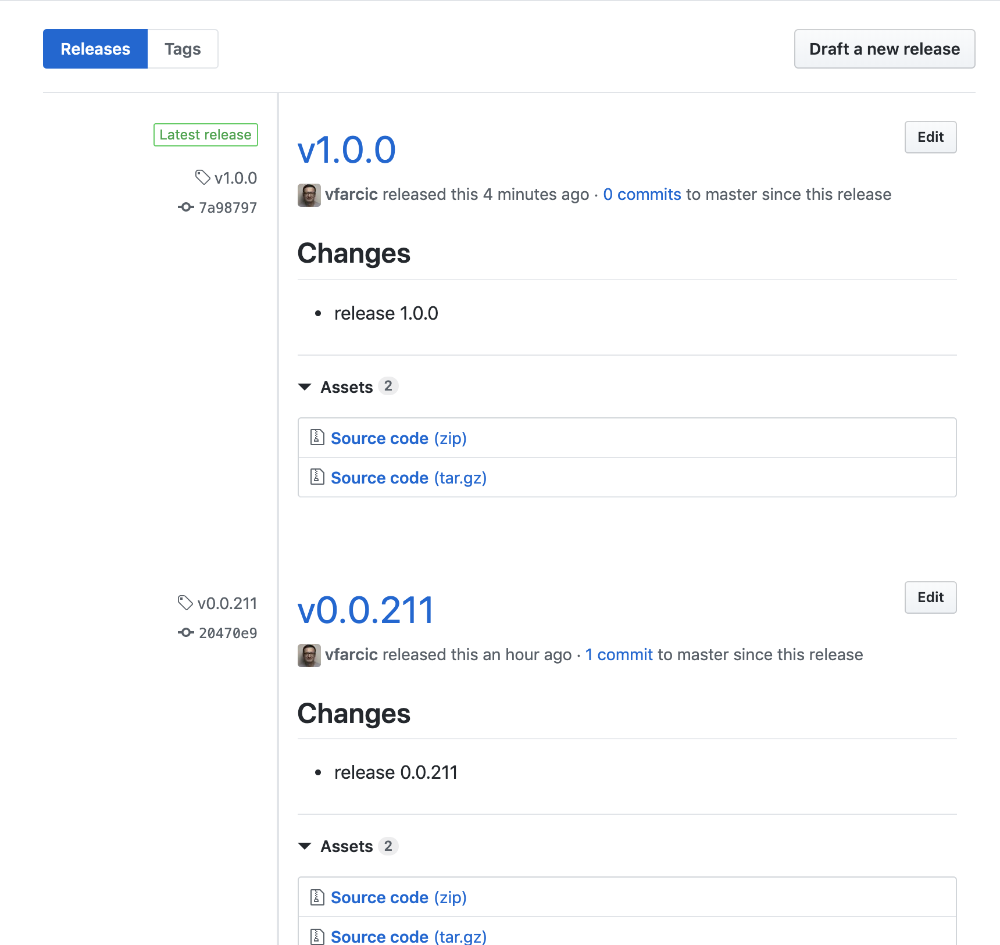

# Versioning Releases

Versioning is one of those things that can be done in many different ways. Almost every team I worked with came up with their own versioning schema. When starting a new project, quite often we would spend time debating how we are going to version our releases. And yet, coming up with our own versioning schema is usually a waste of time. The goals of versioning are simple. We need a unique identifier of a release as well as an indication of whether a change breaks backward compatibility. Given that others already agreed on the format that fulfills those objectives, the best we can do, just as with many other things related to software development, is to use the convention. Otherwise, we are probably wasting our time reinventing the wheel without understanding that a few things are likely going to go wrong down the line.

First of all, our users might need to know whether our release is production ready and whether it breaks compatibility with the previous releases. To be honest, most users do not even want to know that, and they will merely expect our applications always to work, but for now, we'll assume that they do care about those things. Somebody always does. If the end users don't, the internal ones (e.g., engineers from the same or from other teams) do. They will assume that you, just as most of the others, follow one of the few commonly accepted naming schemes. If you do, your users should be able to deduce the readiness and backward compatibility through a simple glance at the release ID, and without any explanation how your versioning works.

Just as users expect specific versioning scheme, many tools expect it as well. If we focus on the out-of-the-box experience, tools can implement only a limited number of variations, and their integration expectations cannot be infinite. If we take Jenkins X as an example, we can see that it contains a lot of assumptions. It assumes that every Go project uses Makefile, that versioning control system is one of the Git flavors, that Helm is used to package Kubernetes applications, and so on. Over time, the assumptions are growing. For example, Jenkins X initially assumed that Docker is the only way to build container images, and kaniko was added to the list later. In some other cases, none of the assumptions will fit your use case, and you will have to extend the solution to suit your needs. That's OK. What is not a good idea is to confuse specific needs with those generated by us not following a commonly adopted standard for no particular reason. Versioning is often one of those cases.

By now, you can safely assume that I am in favor of naming conventions. They help us have a common understanding. When I see a release identifier, I assume that it is using semantic versioning simply because that is the industry standard. If most of the applications use it, I should not be judged by assuming that yours are using it as well, unless you have a good reason not to. If that's the case, make sure that it is indeed justified to change a convention that is good enough for most of the others in the industry. In other words, if you do not use a commonly accepted versioning scheme, you are a type of the company that is hoping to redefine a standard, or you are just silly for no particular reason (other than not knowing the standards).

So, what are the commonly used and widely accepted versioning schemes? The answer to that question depends on who the audience is. Are we creating a release for humans or machines? If it's the former, are they engineers or the end users?

We'll take a quick look at some of the software I'm running. That might give us a bit of insight into how others treat versioning, and it might help us answer a few of the questions.

I'm writing this on my MacBook running macOS *Mojave*. My Pixel 3 phone is running *Android Pie*. My "playground" cluster is running Jenkins X *Next Generation* (we did not explore it yet). The list of software releases with "strange" names can go on and on, and the only thing that they all have in common is that they have exciting and intriguing names that are easy to remember. Mojave, Pie, and Next Generation are names good for marketing purposes because they are easy to remember. For example, macOS Mojave is more catchy and easier to memorize than macOS 10.14.4. Those are releases for end users that probably do not care about details like a specific build they're running. Those are not even releases, but rather significant milestones.

For technical users, we need something more specific and less random, so let's take a look at the release identifiers of some of the software we are already using.

I am currently running `kubectl` version `v1.13.2`, and my Kubernetes cluster is `1.12.6-gke.10`. My Helm client and server (tiller) are both at the version `v2.12.1`. I have `jx` CLI version `1.3.1074` and Git `2.17.2`. What do all those versions have in common? They all contain three numbers, with an optional prefix (e.g., `v`) or a suffix (e.g., `-gke.10`). All those tools are using semantic versioning. That's the versioning engineers should care about. That's the versioning most of us should use.

## Semantic Versioning Explained

Semantic versioning is very easy to explain and leaves very little to interpretation. We have three numbers called *major*, *minor*, and *patch*. If we increment *minor*, *patch* is reset to zero (or one). Similarly, if *major* is incremented, both the *minor* and the *patch* are set to zero (or one). Which number is incremented depends on the type of the change we're releasing.

Given a version number `MAJOR.MINOR.PATCH`, increment each of the segments using the rules that follow.

* *PATCH* is incremented when we release bug fixes.
* *MINOR* is incremented when new functionality is added in a backward-compatible manner.
* *MAJOR* is incremented when changes are not backward compatible.

If, for example, our application has an API, incrementing the major version would be a clear signal to our users that they would need to adapt or continue using the previous (older) major version (assuming we keep both, as we should). A change in the minor version would mean that users do not need to adapt, even though there are new features included in the release. All other cases would increment only the patch version.

Deducing which version to increment for an application that does not contain an API is a bit harder. When a change to a client-side web application is backward compatible or not largely depends on how humans (the only users of a web app) perceive backward compatibility. If, for example, we change the location of the fields in the login screen, we are likely backward compatible. However, if we add a new required field, we are not and, therefore, we should increase the major version. That might sound confusing and hard to figure out for non-API based applications. But there is a more reliable way if we have automated testing. If one of the existing tests fail, we either introduced a bug, or we made a change that is not backward compatible and therefore needs to increment major version.

I believe that semantic versioning should be used (almost) always. I cannot think of a reason why we shouldn't. It contains a clear set of rules that everyone can apply, and it allows everyone to know which type of change is released. However, I've seen too many times teams that do not want to follow those rules. For example, some want to increment a number at the end of each sprint. Others want to use dates, quarters, project numbers, or any other versioning system they are used to. I believe that in most of those cases the problem is in accepting change and not a "real" need for custom versioning. We tend to be too proud of what we did, even when the rest of the industry tells us that its time to move on.

The problem with using our own versioning schema is in expectations. New developers joining your company likely expect semantic versioning since it is by far the most commonly used. Developers working on applications that communicate with your application expect semantic versioning because they need to know whether you released a new feature and whether it is backward compatible. The end users (e.g., people visiting your Web site) generally do not care about versioning, so please don't use them as an excuse to "reinvent the wheel".

I would say that there two significant reasons why you should use semantic versioning. First of all, something or someone depends on your application. Those who depend on it need to know when an incompatibility is introduced (a change of the major version). Even if that's not the case, the team developing the application should have an easy way to distinguish types of releases.

Now, you might say that you do not care for any of the reasons for using semantic versioning, so let me give additional motivation. Many of the tools you are using expect it. That's the power of conventions. If most of the teams use semantic versioning, many of the tools that interact with releases will assume it. As a result, by choosing a different versioning schema, you might not be able to benefit from "out-of-the-box" experience. Jenkins X is one of those tools. It assumes that you do want to use semantic versioning because that is the most commonly used schema. We'll see that in practice soon.

Before we proceed, I must make it clear that I am not against you using some other versioning schema. Please do if you have a very good reason for it and if the benefits outweigh the effort you might need to invest in overcoming hurdles created by not using something that is widely adopted. Coming up with your own way to do stuff is truly great, as long as the reason for deviation is based on the hope that you can do something better than others, not only because you like it more. When we do things differently for no good reason, we are likely going to pay a potentially high price later in maintenance and investment that you'll have to make in tweaking the tools you're using. The need to comply with standards and conventions is not unique to versioning, but to almost everything we do. So, the short version of what I'm trying to say is that *you should use standards and conventions unless you have a good reason not to*. What that means is that you should be able to defend why you are not using an industry-defined convention, and not to seek a reason why you should jump into something most of the others already adopted.

That was enough of theory. We'll explore through practical hands-on examples how Jenkins X helps us to version our releases.

## Creating A Kubernetes Cluster With Jenkins X And Importing The Application

If you kept the cluster from the previous chapter, you can skip this section. Otherwise, we'll need to create a new Jenkins X cluster.

I> All the commands from this chapter are available in the [10-versioning.sh](https://gist.github.com/a9dc4b033aadedb460c92381d27ecffc) Gist.

For your convenience, the Gists from the previous chapter are available below as well.

* Create new **GKE** cluster: [gke-jx.sh](https://gist.github.com/86e10c8771582c4b6a5249e9c513cd18)
* Create new **EKS** cluster: [eks-jx.sh](https://gist.github.com/dfaf2b91819c0618faf030e6ac536eac)
* Create new **AKS** cluster: [aks-jx.sh](https://gist.github.com/6e01717c398a5d034ebe05b195514060)
* Use an **existing** cluster: [install.sh](https://gist.github.com/3dd5592dc5d582ceeb68fb3c1cc59233)

We'll continue using the *go-demo-6* application. Please enter the local copy of the repository, unless you're there already.

```bash
cd go-demo-6

git checkout master
```

I> If you destroyed the cluster at the end of the previous chapter, you'll need to import the *go-demo-6* application again. Please execute the commands that follow only if you created a new cluster specifically for the exercises from this chapter.

```bash
jx import -b

jx get activities -f go-demo-6 -w
```

Please wait until the activity of the application shows that all the steps were executed successfully, and stop the watcher by pressing *ctrl+c*.

Now we can promote our last release to production.

# Versioning Releases Through Tags

Before we start "playing" with versions, we'll take a look at what we're currently running in the staging environment.

```bash
jx get applications
```

```
APPLICATION STAGING PODS URL
go-demo-6   0.0.211 1/1  http://go-demo-6.jx-staging.52.42.36.56.nip.io
```

In my case, `go-demo-6` version `0.0.211` is running in the staging environment. Your version is likely going to be different, and if you did not destroy the cluster at the end of the previous chapter, you are likely going to see that a release is running in production as well.

I> If you forked *go-demo-6* after I wrote this chapter (April 2019), your version is likely going to be `1.x.x`. That's OK. It does not matter which version you're running right now.

Before we see how we can control versions through Jenkins X pipelines, we'll take a quick look at the `jx-release-version` CLI. It is already used inside our pipelines and understanding how it works will help us get a better grip at how we can combine it with our processes.

There are two ways we can proceed with the examples that involve `jx-release-version`. You can visit the [releases](https://github.com/jenkins-x/jx-release-version/releases) and install one that matches your operating system. You are free to do that, but I will not provide a more detailed walkthrough. Since I don't know whether you are using macOS, Linux, or Windows, I would need to prepare instructions for all three. The alternative is to create a DevPod. Since that is simpler in the sense that the same commands will work no matter the operating system you're using, the instructions that follow assume that you prefer to use a DevPod. At the same time, that will act as a refresher of what we learned in the [Improving And Simplifying Software Development](#dev) chapter.

W> Please make sure that you are inside the local copy of the *go-demo-6* repository before executing the commands that follow.

```bash
jx create devpod -b

jx rsh -d

cd go-demo-6
```

We created a DevPod, entered inside it, and navigated to the `go-demo-6` directory that contains the source code of our application. Next, we'll install `jx-release-version-linux`.

```bash
curl -L \
  -o /usr/local/bin/jx-release-version \
  https://github.com/jenkins-x/jx-release-version/releases/download/v1.0.17/jx-release-version-linux

chmod +x \
  /usr/local/bin/jx-release-version
```

We downloaded the `jx-release-version-linux` binary into the `/usr/local/bin/` directory so that it is inside the `PATH`, and we added the executable permissions.

Now, let's take a look at the Git tags we made so far.

```bash
git tag
```

Depending on when you forked the *go-demo-6* repository and how many tags you created so far, the list of the existing tags might be quite extensive. Please note that you can scroll through the tags using arrow keys. In my case, the output limited to the few latest entries, is as follows.

```
...
v0.0.210
v0.0.211
...
```

We can see that the last tag I created is `v0.0.211`. Yours is likely going to be different.

Please press *q* to exit the list of the tags.

Now that we know the version of the last release we made, let's see what we'll get if we execute `jx-release-version`.

```bash
jx-release-version
```

In my case, the output is `0.0.212`. `jx-release-version` examined the existing tags, found which is the latest one, and incremented the patch version. If we made a change that is not a new functionality and if we did not break compatibility with the previous release, the result is correct since only the patch version was incremented.

Now that we know that `jx-release-version` increments patch versions, we might wonder how to increase minor or major versions. After all, not everything we do consists of fixing bugs.

Let's say that we did make a breaking change and therefore we want to increase the major version. Since we already know that `jx-release-version` will find what the latest tag is, we can accomplish our goal by creating a tag manually.

W> Please do not run the command that follows as-is. Instead, increment the major version. If the current major is `0`, the new tag should be `v1.0.0`. If the current major is `1`, the new tag should be `v2.0.0`. And so on, and so forth. The command that follows works in my case because my current major version is `0`. However, if you forked the repository after I wrote this chapter (April 2019), you are likely having the major version `1`.

```bash
git tag v1.0.0
```

Now that we created a new *dummy* tag, we'll take another look at the output of `jx-release-version`.

```bash
jx-release-version
```

In my case, the output is `1.0.1`. The result is still an increment of the patch version. Since the last tag was `v1.0.0`s, the new release should be `v1.0.1s`.

Please note that we could accomplish a similar effect by creating a tag that bumps a minor version instead.

Typically, our next step would be to push the newly created tag `v1.0.0` and let future build of the *go-demo-6* pipeline continue generating new releases based on the new major version. However, we won't push the new tag because there is a better way to increment our major and minor versions.

We do not need the DevPod any more, so we'll exit and remove it.

```bash
exit

jx delete devpod
```

Please make sure to type `y` and press the enter key when you are asked whether you want to delete the DevPod.

There are two potential problems we encountered so far. Creating dummy tags only for the sake of bumping future major and minor releases is not very elegant. On top of that, we cannot have a bump with patch version `0`. For example, we can have a release `v1.0.1`, but we cannot have `v1.0.0` because that version is reserved for the dummy tag. We'll fix that next.

## Controlling Release Versioning From Jenkins X Pipelines

One way to take better control of versioning is to add variable `VERSION` to the project's Makefile. Please open it in your favorite editor and add the snippet that follows as the first line.

```
VERSION := 1.0.0
```

W> Just as before, do not use `1.0.0` blindly. Make sure that the major version is higher than the current version.

Please save the changes before proceeding.

Let's see what will be the output of `jx-release-version` now.

```bash
jx-release-version
```

This time, my output is `1.0.0`. `jx-release-version` read the value of `VERSION` in Makefile and filtered the Git tags so that only those belonging to the major version `1` and minor version `0` are retrieved. Since it found none, it deduced that it should be the first release of the new major version and set the patch version to `0`.

By now, you might be wondering why we are exploring `jx-release-version`. What is its relation to Jenkins X pipelines? If you paid close attention to Jenkinsfile we've been using so far, you probably already know the answer. Nevertheless, we'll take another look at the project's Jenkinsfile.

Since previews and releases to permanent environments use different versioning logic, we'll explore each separately, starting with the previews.

```bash
cat Jenkinsfile
```

The output, limited to the relevant parts, is as follows.

```groovy
pipeline {
  ...
  stages {
    stage('CI Build and push snapshot') {
      when {
        branch 'PR-*'
      }
      environment {
        PREVIEW_VERSION = "0.0.0-SNAPSHOT-$BRANCH_NAME-$BUILD_NUMBER"
        ...
      }
      steps {
        container('go') {
          dir('/home/jenkins/go/src/github.com/vfarcic/go-demo-6') {
            ...
            sh "export VERSION=$PREVIEW_VERSION && skaffold build -f skaffold.yaml"
            sh "jx step post build --image $DOCKER_REGISTRY/$ORG/$APP_NAME:$PREVIEW_VERSION"
          }
          dir('/home/jenkins/go/src/github.com/vfarcic/go-demo-6/charts/preview') {
            sh "make preview"
            sh "jx preview --app $APP_NAME --dir ../.."
          }
          ...
```

When previews are concerned, the key is in the environment variable `PREVIEW_VERSION`. It's set to `0.0.0-SNAPSHOT-$BRANCH_NAME-$BUILD_NUMBER`. It is using semantic versioning, even though all three versions are set to `0`. We can also observe that it contains a suffix comprised of the name of the branch and the build number. The reason in setting all three versions to `0` lies in the purpose of previews. They are not "real" releases but serve only limited testing and validation purposes. In our current setup, "real" releases are created when we merge pull requests to the master branch. So, you can ignore the details of how we generate versions of the previews. The only important thing to note is that the combination of the branch name and the build number makes each preview unique. Another essential thing to understand is that `jx preview` command expects us to have either the environment variable `PREVIEW_VERSION` or `VERSION`.

Let's move away from previews and jump into the stages executed when we push a change to the master branch.

```bash
cat Jenkinsfile
```

The output, limited to the relevant parts, is as follows.

```groovy
pipeline {
  ...
  stages {
    ...
    stage('Build Release') {
      when {
        branch 'master'
      }
      steps {
        container('go') {
          dir('/home/jenkins/go/src/github.com/vfarcic/go-demo-6') {
            ...
            sh "echo \$(jx-release-version) > VERSION"
            sh "jx step tag --version \$(cat VERSION)"
            sh "make build"
            sh "export VERSION=`cat VERSION` && skaffold build -f skaffold.yaml"
            sh "jx step post build --image $DOCKER_REGISTRY/$ORG/$APP_NAME:\$(cat VERSION)"
          }
        }
      }
    }
    stage('Promote to Environments') {
      when {
        branch 'master'
      }
      steps {
        container('go') {
          dir('/home/jenkins/go/src/github.com/vfarcic/go-demo-6/charts/go-demo-6') {
            sh "jx step changelog --version v\$(cat ../../VERSION)"
            // release the helm chart
            sh "jx step helm release"
            // promote through all 'Auto' promotion Environments
            sh "jx promote -b --all-auto --timeout 1h --version \$(cat ../../VERSION)"
          ...
```

We can see that the output of `jx-release-version` is stored in the file `VERSION`. From there on, contents of that file are used to create a Git tag (`jx step tag`), to build a container image (`skaffold build`), to generate release notes (`jx step changelog`), and to promote the release to all environments set to receive automatic promotions (`jx promote`). As a result, every time we push a change to the master or merge a pull request, a new release based on increments of the patch version is created and deployed. At least, that's how it worked until now. Since we just added `VERSION` to `Makefile`, next release should use the new major version and reset patch counter to zero. Let's confirm that.

```bash
git add .

git commit -m "Finally 1.0.0"

git push

jx get activities -f go-demo-6 -w
```

We pushed the change to Makefile, and now we are watching *go-demo-6* activities. Soon, a new activity will start, and the output should be similar to the one that follows.

```
...
vfarcic/go-demo-6/master #2  1m20s  Running Version: 1.0.0
...
```

We can almost immediately see that in my case the `go-demo-6` activity `#2` is using version `1.0.0`. Since I'm paranoid by nature, we'll make a couple of other validations to confirm that versioning indeed works as expected.

Please wait until the new release is promoted to staging and press *ctrl+c* to stop the activity watcher.

Next, we'll list the applications and confirm that the correct version was deployed to the staging environment.

```bash
jx get applications
```

The output is as follows.

```
APPLICATION STAGING PODS URL
go-demo-6   1.0.0   1/1  http://go-demo-6.jx-staging.52.42.36.56.nip.io
```

We can see that in my case the `go-demo-6` release running in the staging environment is `1.0.0`. Finally, the last thing we'll do is to validate that the release stored in GitHub is also based on the new major version.

W> Please replace `[...]` with your GitHub user before executing the commands that follow.

```bash
GH_USER=[...]

open "https://github.com/$GH_USER/go-demo-6/releases"
```

We can see that the release in GitHub is also based on the new major version, and we can conclude that everything works as expected.



Let's make one more change and confirm that only the patch version will increase.

```bash
echo "A silly change" | tee README.md

git add .

git commit -m "A silly change"

git push

jx get activity -f go-demo-6 -w
```

In my case, the output of the new activity showed that the new release is `1.0.1`. Please stop the activity watcher by pressing *ctrl+c*.

The next change would be `1.0.2`, the one after that `1.0.3`, and so on and so forth until the minor or the major version change again in Makefile. It's elegant and straightforward, isn't it? 

But what should we do when we do not want to use semantic versioning?

## Customizing Versioning Logic

Sometimes we do want to use semantic versioning, but we want to add additional information. We usually do that by adding prefixes or suffixes to the three versions (major, minor, and patch). As a matter of fact, we are already doing that. So far, our pipelines use "pure" semantic versioning, except for GitHub releases. As a refresher, the step that creates release notes is `jx step changelog --version v\$(cat ../../VERSION)`. You can see that `v` is added as a prefix to the version.

If we look at [Kubernetes releases](https://github.com/kubernetes/kubernetes/releases), we can see those like `v1.14.0-rc.1`, `v1.14.0-beta.2`, `v1.14.0-alpha.3`, and `v1.14.0-alpha.2`. They are using a variation of semantic versioning. Instead of increasing patch version with each release, Kubernetes community is creating `alpha`, `beta`, and release candidate (`rc`) releases leading to the final `v1.14.0` release. Once `v1.14.0` is released, batch versions are incremented following semantic versioning rules until a new minor or major release. Jenkins X does not support such a versioning scheme out of the box. Nevertheless, it should be a relatively simple change to Jenkinsfile to accomplish that or some other variation of semantic versioning. We won't go into practical exercises that would demonstrate that since I assume that you should be able to make the necessary changes on your own.

One of the ways we could modify how versioning works is by changing Makefile. Instead of having a fixed entry like `VERSION := 1.0.0`, we could use a function as a value. Many of the variable declarations in the existing Makefile are getting dynamically generated values, and I encourage you to explore them. As long as you can script generation of the version, you should have no problem implementing your own logic. Just as with custom prefixes and suffixes, we won't go into practical examples.

Finally, you might choose to ignore the existence of `jx-release-version` and replace the parts of your pipeline that use it with something completely different.

The choice of whether to adopt Jenkins X implementation of semantic versioning as-is, to modify it to suit your needs, or to change the logic to an entirely different versioning scheme is up to you. Just remember that the more you move away from a standard, the more difficulty you will have in adopting tools and their out-of-the-box behavior. Sometimes there is a good reason not to use conventions, while in others we invent our own for no particular reason. If you do choose not to use semantic versioning, I hope you are in the former group.

## Versioning With Maven, NodeJS, And Other Build Tools

The chances are that your applications are not written in Go. Even if some are, that's probably not the case with all of them. You might have applications written in Java, NodeJS, Python, Ruby, or a myriad of other languages. You might be using Maven, Gradle, or any other build and packaging tool. What should you do in that case?

If you are using Maven, everything we explored so far is applicable with a difference that the version is defined in *pom.xml* instead of Makefile. Just as we added `VERSION := 1.0.0` to Makefile, you'd need to add `<version>` inside `<project>` in *pom.xml*. Everything else stays the same.

In the case of NodeJS, `jx-release-version` is not used at all. Instead, pipelines rely on the [semantic-release plugin](https://www.npmjs.com/package/semantic-release) to determine the next version number by fetching information from commit messages.

What about other build tools? You can still add Makefile that would serve only for versioning, or you can control major and minor version increments by creating dummy Git tags. We explored both, so you should have no problem adopting one of those. Or you might choose to adopt versioning through a plugin in your favorite build tool (e.g., Gradle) or to roll out your own. Finally, you might want to contribute to [jx-release-version](https://github.com/jenkins-x/jx-release-version) by adding support for your favorite build tool. That would be the best option. After all, it is open source, and it relies on the community of volunteers.

## What Now?

We saw how Jenkins X approaches releases by adopting semantic versioning. We also explored a few strategies we can employ to control increments of major and minor versions. It's up to you to either adopt semantic versioning or to adapt your pipelines to the versioning type you prefer instead.

Now you need to decide whether to continue using the cluster or to destroy it. If you choose to destroy it or to uninstall Jenkins X, you'll find the instructions at the bottom of the Gist you chose at the beginning of this chapter.

If you destroyed the cluster or you uninstalled Jenkins X, please remove the repositories and the local files we created. You can use the commands that follow for that.

W> Please replace `[...]` with your GitHub user before executing the commands that follow.

```bash
cd ..

GH_USER=[...]

hub delete -y \
  $GH_USER/environment-jx-rocks-staging

hub delete -y \
  $GH_USER/environment-jx-rocks-production

rm -rf environment-jx-rocks-production

rm -rf ~/.jx/environments/$GH_USER/environment-jx-rocks-*

rm -f ~/.jx/jenkinsAuth.yaml
```