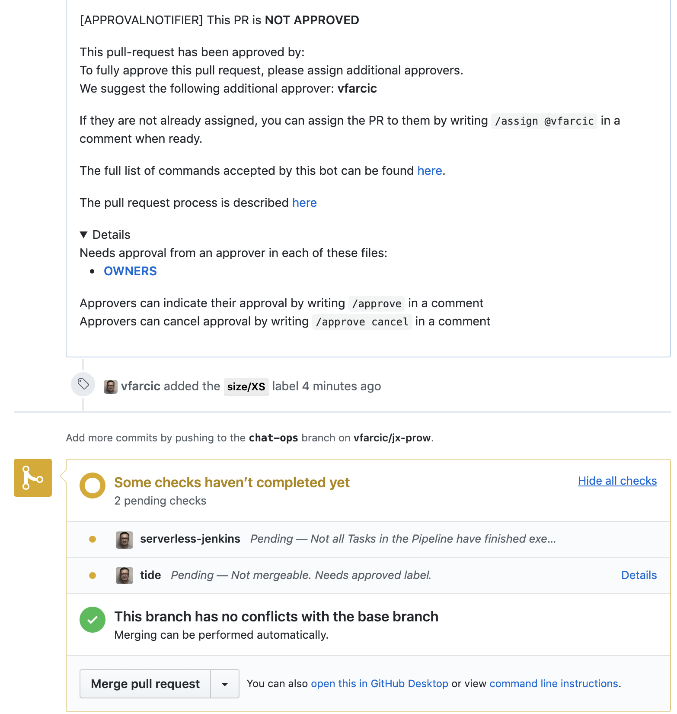
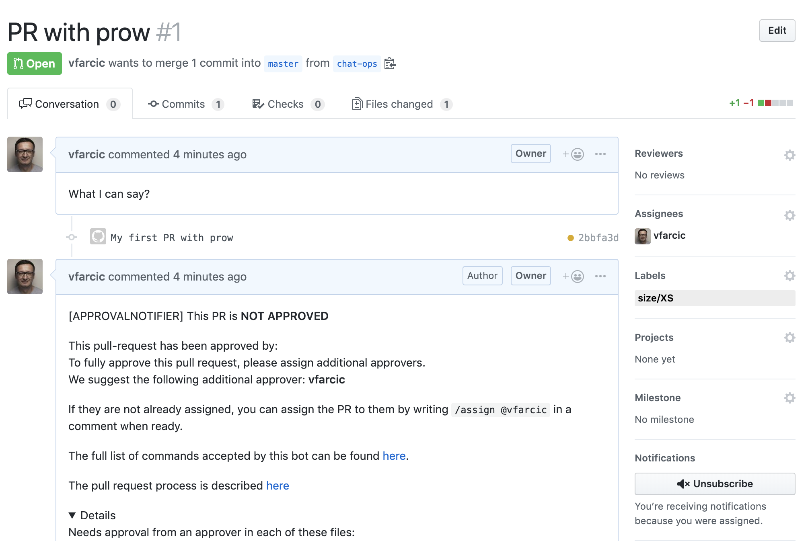
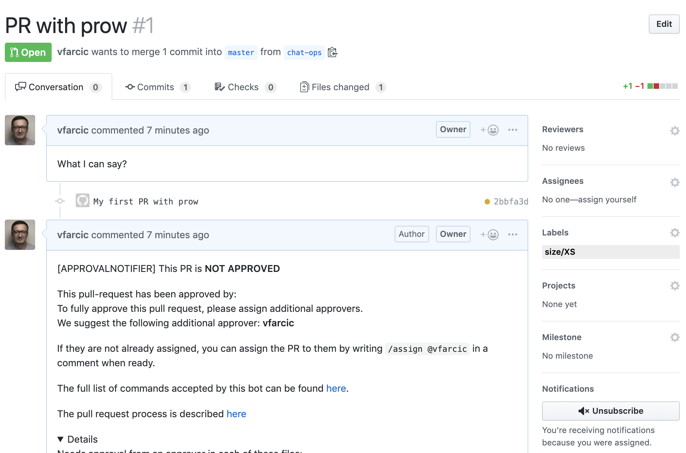
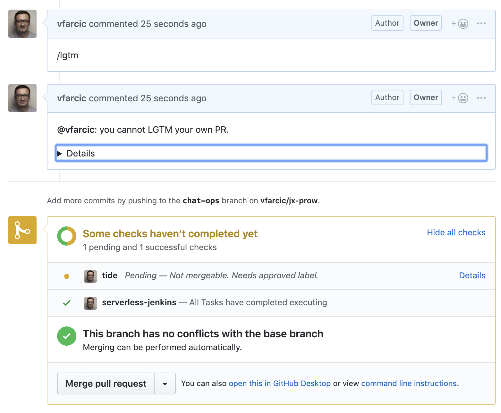
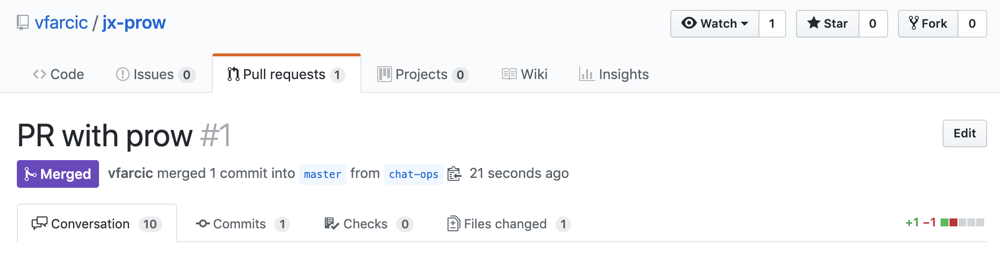
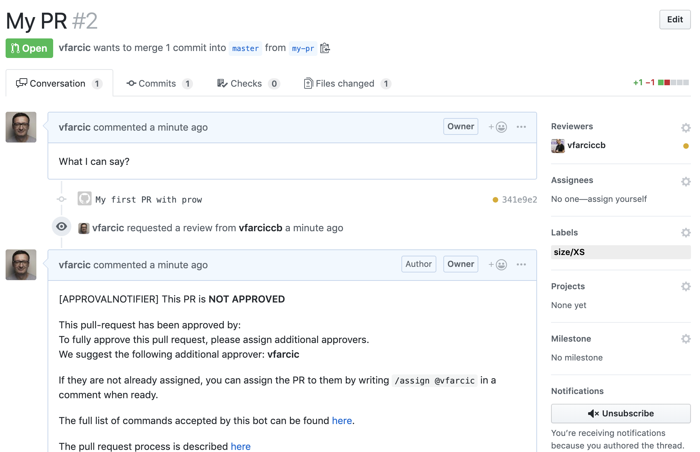
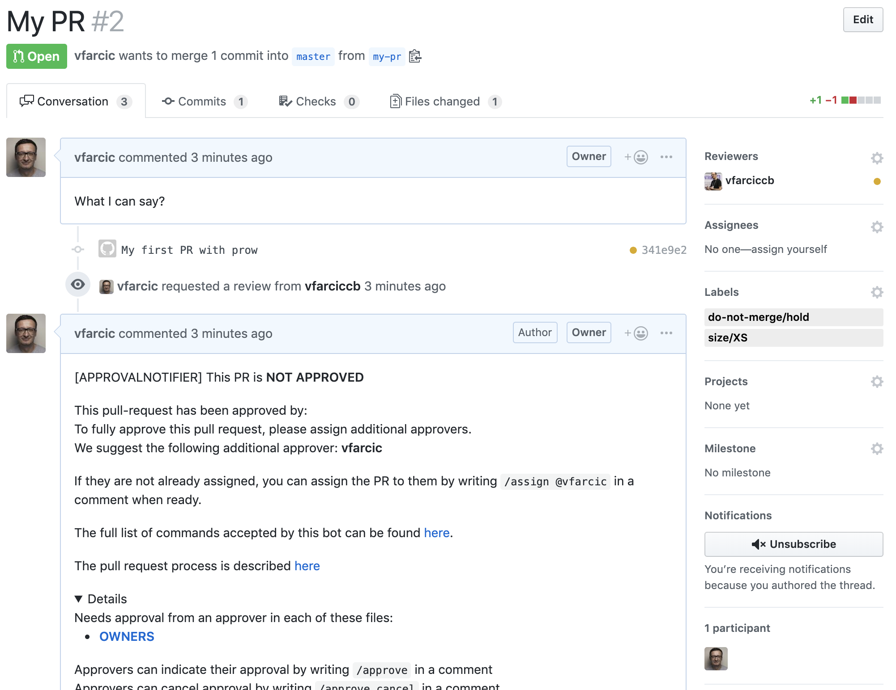
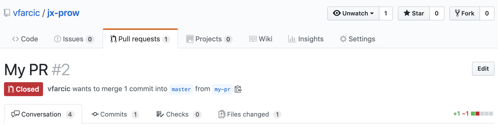
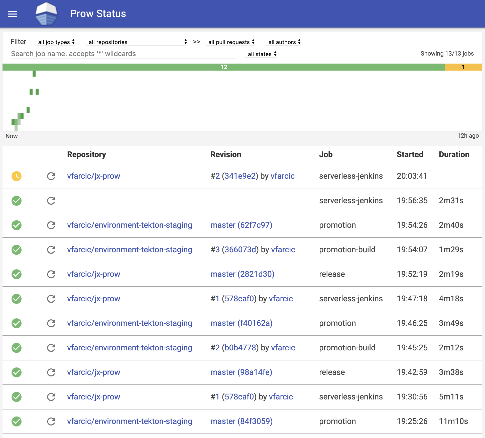

## TODO

- [X] Code
- [ ] Write
- [X] Code review GKE
- [X] Code review EKS
- [X] Code review AKS
- [-] Code review existing cluster
- [ ] Text review
- [ ] Gist
- [ ] Review titles
- [ ] Proofread
- [ ] Diagrams
- [ ] Add to slides
- [ ] Publish on TechnologyConversations.com
- [ ] Add to Book.txt
- [ ] Publish on LeanPub.com

## Implementing ChatOps

W> The examples in this chapter work only with serverless Jenkins X.

Jenkins X main logic is based on applying GitOps principles. Every change must be recorded in Git and only Git is allowed to initiate events that result in changes in our clusters. That logic logic is the corner stone of Jenkins X and it served us well so far. However, there are actions we might need to perform that do not result in changes to source code or configurations.

We might need to assign a pull request to someone for review. That someone might need to review the changes and might need to run some manual tests if they are not fully automated. A pull request might need additonal commits and the commiter might need to be notified about that need. Someone might need to approve and merge a pull request or choose to cancel it altogether. The list of the actions that we might need to do once a pull request is created can be quite extensive and many of them do not result in changes to source code. The period starting with creationg of a pull request and until it is merged to master is mostly filled with communication, rather than changes to the project in question. As such, we need an effective way to facilitate that communication.

The communication and decision making that surrounds a pull request needs to be recorded. We need to be able to track who said what and who made which decision. Otherwise, we woould not be able to capture the events that lead to a merge of a pull request to master. We'd be running blind. That means that verbal communication must be discarded. Given that such communication should be closely related to the pull request, we can discard emails and wiki pages as well, thus leading us back to Git. Almost every Git platform has a mechanism to create comments tied to pull requests (or a similar concept). We can certainly use those comments to record the communication. But, communication by itself is useless if it does not result in tangible actions.

If we do need to document the communication surrounding a pull request, it would be a waste of effort to have to perform equivalent actions separately. Ideally, the communication should result in ccertain actions.

When we write a comment that a pull request should be assigned to a reviewer, it should trigger an action that will do the actual assignment and notify that person that there is a pending action. If we comment that a pull request should be labeled as "urgent", that comment should add the label. If a reviewer choose writes that a pull request should be cancelled, that comment should close the pull request. Similarly, if a person with sufficient permissions might comment that the pull request is approved and, as a result, it should be merged.

There are a couple of concepts that need to be tied together for our process surrounding pull request to be effective. We need to be able to communicate, and we already have comments for that. People with sufficient privileges need to be able to perform certain actions (e.g. merge a pull request). Git platform already implement some form of RBAC (Role Based Authentication), so that part is already solved. Furthermore, we need to be notified when there is a pending action we should perform as well as when an important milestone is reached. This is solved as well. Every Git flavor provides a notification mechanism. What we're missing is a process that will tie all that together by executing actions based on our comments.

If we manage to convert comments into actions controlled by RBAC and receive notifications, we would be able to implement ChatOps principles.

The idea behind ChatOps is to unify communication about the work that should be done with the history of what has been done. The expression of a desire (e.g., approve this pull request) becomes an action (execution of the approval process), and is at the same time recorded. ChatOps is similar to verbal communication or, to be more precise, commands we might give if we would have a butler. "Please make me a meal" is an expression of a desire. Your butler would transmit your desire to a cook, wait until the meal is ready, and bring it back to you. Given that we are obsessed (for a good reason) to record everything we do when developing software, verbal expressions are not good enough, so we need to write them down. Hence the idea of ChatOps. It converts parts of communication into commands that are automatically executed and provides feedback of the results.

In ChatOps environment, a chat client is the primary source of communication for ongoing work. However, since we adopted Git as the only source of truth, it should come as no surprise that the role of a chat client is given to Git. After all, it has comments, and that can be considered chat (or sorts). It should come as no surprise that ChatOps became GitChat. If we assume that only Git should be able to initiate a change in our clusters, it stands to reason that such changes can be initiated either by change in source code, by writing comments in Git, or by creating an issue. According to some sources, the term ChatOps was coined by folks at GitHub.

We can define ChatOps as conversation driven development. Conversation is essential for all but single-person teams. We need to communicate to others when the feature we're developing is ready. We need to ask others to review our changes. We might need to ask for permission to merge to the master branch. The list of the things we might need to communicate is infinite. That does not mean that all communication becomes ChatOps, but rather that parts of our communication does. It's up to the system to figure out what is a communication that should result in actions, and what is a pure human-to-human messaging without tangible outcomes.

sAs we already saw, there are three elements that need to be combined into a process. We need communication (comments), permissions (RBAC), notifications (email), and actions. All but the last are already solved in every Git platform. We just need to figure out how to combine comments, permissions, and notifications into tangible actions. We'll do that by introducting Prow to our solution.

[Prow](https://github.com/kubernetes/test-infra/tree/master/prow) is a project created by the team managing continuous delivery processes for the [Kubernetes](https://kubernetes.io/) projects. It does quite a few things, but we will not use everything it offers, simply because there are better ways to accomplish some of its tasks. The parts of Prow we are primarily interested in are those related to communication between Git and processes running in our cluster. We'll use it to capture Git events created thrrough slash commands written in comments. When such events are captured, Prow will either forward them to other processes running in the cluster (e.g., execute pipeline builds), or perform Git actions (e.g., merge a pull request).

This might be the first time you hear the term slash commands, so a short explanation might be in order.

Slash commands act as shortcuts for specific actions. Type a slash command in the Git comment field, click the button, and that's it. You executed a task or a command. Ofcourse, our comments are not limited to slash commands. Instead, they are often combined with "conversational" text. We could, for example, write "this PR looks OK, I will `/approve` it". Prow, in turn, parses each comment and will deduce that there is a slash command (e.g., `/approve`).

Slash commands are by no means specific to Git and are widely used in other tools. Slack, for example, is known for its wide range of supported slash commands and the ability to extend them. But, since we are focused on Git, we'll limit our ChatOps experience with Slash commands to what Prow offers as the mechanism adopted by Jenkins X (and Kubernetes community).

All in all, Prow will be our only entry point to the cluster. Since it accepts only requests from Git (webhooks or slash commands), the only way we will be able to change something in our cluster is by changing source code or by writing commands in Git comments. At the same time, Prow is highly available (unlike static Jenkins), so we'll use it to solve yet another problem.

I> Prow works only with serverless Jenkins X. At the time of this writing (April 2019), it only supports GitHub. The community is working hard on adding the support for other Git platforms. Until that is finished, we are restricted to GitHub. If you do use a different Git platform (e.g., GitLab), I still recomment going through the exercises in this chapter. They will provide learning experience. The chances are that, by the time you start using Jenkins X in production, the support for other Git flavors will be finished.

W> Due to the current limitation, you cannot use Prow with anything but GitHub, and serverless Jenkins X doesn't work without Prow. Please take that into account if you are planning to use it in your organization.

As always, we need a cluster with Jenkins X to explore things through hands-on exercises.

## Creating A Kubernetes Cluster With Jenkins X

W> You might be used to the fact that until now we were always using the same Gists to create a cluster or install Jenkins X in an existing one. Those that follow are different.

If you kept the cluster from the previous chapter and it contains serverless Jenkinss X, you can skip this section. Otherwise, we'll need to create a new Jenkins X cluster.

I> All the commands from this chapter are available in the [12-prow.sh](TODO:) Gist.

For your convenience, the Gists that will create a new Jenkins X cluster or install it inside an existing one are as follows.

* Create new **GKE** cluster: [gke-jx-serverless.sh](TODO:)
* Create new **EKS** cluster: [eks-jx-serverless.sh](TODO:)
* Create new **AKS** cluster: [aks-jx-serverless.sh](TODO:)
* Use an **existing** cluster: [install-serverless.sh](TODO:)

We will not need the `jx-serverless` project we created in the previous chapter. If you are reusing the cluster and Jenkins X installation, you might want to remove it and same a bit of resources.

W> Please replace `[...]` with your GitHub user before executing the commands that follow.

```bash
GH_USER=[...]

jx delete application \
    $GH_USER/jx-serverless \
    -b
```

Now we can explore Prow.

## Exploring The Basic Pull Request Process

The best way to explore thee inteegration Jenkins X provides between Git, Prow, and the rest of the system is through practical examples. The first thing we'll need is a project, so we'll create a new one.

```bash
jx create quickstart \
  -l go \
  -p jx-prow \
  -b

cd jx-prow

jx get activities -f jx-prow -w
```

We created a Go-based project called `jx-prow`, entered into the local copy of the Git repository `jx` created for us, and started watching the activity. After a while, the output have all the steps in the `Succeeded` status, and we can stop the watcher by pressing *ctrl+c*.

W> At the time of this writing (April 2019) there is a bug that causes the overall pipeline build to report as `Running` even though all the stages are `Succeeded`. If that happens in your case, feel free to ignore it and consider the build finished when the last stage (`Update`) is `Succeeded`.

When we created a new project, Git sent a webhook to Prow which, in turn, nootified the system that it should run a pipeline build. Even though different processess are running build in serverless Jenkins (e.g., Pipeline Operator and Tekton), the are functionally the same as they were before. We'll explore those processes later and for now conclude that a build was successfull and, as a result, we got the application deployed to the staging environment just as before when we used static Jenkins X. For now, we're mostly interested in ChatOps (or GitChat) features available through Prow.

Since most of the ChatOps features apply to pull requests, we need to create one.

```bash
git checkout -b chat-ops

echo "ChatOps" | tee README.md

git add .

git commit -m "My first PR with prow"

git push --set-upstream origin chat-ops
```

We created a new branch `chat-ops`, make a silly change to `README.md`, and pushed it.

Now that we have a branch with a change to the sources, we should create a pull request. We could do that by going to GitHub UI but, as you already know from the [Working With Pull Requests And Preview Environments][#pr] chapter, `jx` already allows us to do that through command line. Since I prefer command line over UIs (and you don't have a say in that matter), we'll go with the latter option.

```bash
jx create pr \
    -t "PR with prow" \
    --body "What I can say?" \
    -b
```

We created a pull request and are presented with a confirmation message with a link. Please open it in your favorite browser.

You will notice a few things right away. To begin with, a comment was created describing the process we should follow with pull requests. In a nutshell, the PR needs to be approved. Someone should review the changes we are proposing. That review might mean going through the code, performing additional manual tests, or anything else that the approver might think is needed before he gives his OK.

Neaer the bottom, you'll see that a few checks are running. The *serverless-jenkins* process is already running. It's executing the part of the pipeline dedicated to pull requests. At the end of the process the application will be deployed to a temporary PR-specific environment, just as it did when we explored pull requests with static Jenkins X. The pipeline is the same. What's different are the rules that we need too follow before we merge to master and the communication happening between Git and Prow.

The second activity is called *tide*. It will be in the *pending* state until we complete the prosess described in the comment.

Tide is one of Prow components. It is in charge of merging the pull request to the master branch and it is configured to do so only after we send it the `/approve` command. Alternatively, Tide might close the pull request if it receives `/approve cancel` command. We'll explore both soon.



TODO: Continue

```bash
# Wait the *PR built and available in a preview environment...* message

# Wait and observe *serverless-jenkins — All Tasks have completed executing* and *tide Pending — Not mergeable. Needs approved label.*

# Type `/assign` as the comment and click the *Comment* button

# Observe that the PR is assigned (might need to refresh)
```



```bash
# Type `/unassign` as the comment and click the *Comment* button

# Observe that the PR is unassigned
```



```bash
# Type `/assign @$GH_USER` as the comment and click the *Comment* button

# Type `/lgtm` as the comment and click the *Comment* button

# You might need to refresh your screen
```



```bash
# It could be `/lgtm cancel`

# Type `/unassign` as the comment and click the *Comment* button

git checkout master

cat OWNERS

cat OWNERS_ALIASES

GH_USER=[...]

GH_APPROVER=[...]

echo "approvers:
- $GH_USER
- $GH_APPROVER
reviewers:
- $GH_USER
- $GH_APPROVER
" | tee OWNERS

git add .

git commit -m "Added an owner"

git push

open "https://github.com/$GH_USER/jx-prow/settings/collaboration"

# Login if asked

# Type the user and click the *Add collaborator* button
```


```bash
# `$GH_APPROVER` should receive an email. Make sure that he accepts the invitation.

# Go back to the PR and make sure that you are signed in (not the friend).

# Type `/assign @$GH_APPROVER` as the comment and click the *Comment* button

# Login as `$GH_APPROVER`

# Open the PR and type `/approve` as the comment and click the *Comment* button (NOTE: `/approve` is the same as `/lgtm`)

# Could be `/approve cancel`

# After a while, the PR will be merged and a build of the pipeline will be executed
```

```bash
# Observe the email to the approver
```

```
[APPROVALNOTIFIER] This PR is APPROVED

This pull-request has been approved by: vfarciccb

The full list of commands accepted by this bot can be found here.

The pull request process is described here

Needs approval from an approver in each of these files:
OWNERS [vfarciccb]
Approvers can indicate their approval by writing /approve in a comment
Approvers can cancel approval by writing /approve cancel in a comment
```



```bash
# Wait until the *All checks have passed* message
```

```bash
jx get activities \
    -f $GH_USER/jx-prow/master \
    -w
```

```
STEP                      STARTED AGO DURATION STATUS
vfarcic/jx-prow/master #1                      Running Version: 0.0.1
  Release                     1h13m9s     1m0s Succeeded
  Promote: staging            1h12m9s      29s Succeeded
    PullRequest               1h12m9s      28s Succeeded  PullRequest: https://github.com/vfarcic/environment-tekton-staging/pull/2 Merge SHA: 29cce039c92898be8f5107a8d41a28eda026032e
    Update                   1h11m41s       1s Succeeded
vfarcic/jx-prow/master #2                      Running Version: 0.0.2
  Release                      22m59s     1m0s Succeeded
  Promote: staging             21m59s      47s Succeeded
    PullRequest                21m59s      47s Succeeded  PullRequest: https://github.com/vfarcic/environment-tekton-staging/pull/3 Merge SHA: 492a97bfb9952fb50b1ffbe72404a7de05dacd83
    Update                     21m12s       0s Succeeded
    Promoted                   21m12s       0s Succeeded  Application is at: http://jx-prow.cd-staging.35.164.205.224.nip.io
vfarcic/jx-prow/master #3                      Running Version: 0.0.3
  Release                      22m36s     1m0s Succeeded
  Promote: staging             21m36s    1m18s Succeeded
    PullRequest                21m36s    1m18s Succeeded  PullRequest: https://github.com/vfarcic/environment-tekton-staging/pull/4 Merge SHA: d5a904cd69e5ea27d6488f676e0f56327be32b6a
    Update                     20m18s       0s Succeeded
    Promoted                   20m18s       0s Succeeded  Application is at: http://jx-prow.cd-staging.35.164.205.224.nip.io
```

```bash
# Press *ctrl+c*

git checkout master

git pull

git checkout -b my-pr

echo "My PR" | tee README.md

git add .

git commit -m "My first PR with prow"

git push --set-upstream origin my-pr

jx create pr \
    -t "My PR" \
    --body "What I can say?" \
    -b
```

```
Created PullRequest #2 at https://github.com/vfarcic/jx-prow/pull/2
```

```bash
# Open the link as you (not the reviewer)

# Observe that the reviewer is automatically assigned
```



```bash
# Observe the *size/XS* label

# Type `/hold` as the comment and click the *Comment* button

# Observe the *do-not-merge/hold* label
```



```bash
# Type `/hold cancel` as the comment and click the *Comment* button

# Observe that the *do-not-merge/hold* label was removed

# Type `/close` as the comment and click the *Comment* button

# Observe that the status of the PR is *Closed*
```



```bash
# Type `/reopen` as the comment and click the *Comment* button

# Observe that the status of the PR is *Open*

# Type `/lifecycle frozen` as the comment and click the *Comment* button

# Observe the *lifecycle/frozen* label

# Type `/meow` as the comment and click the *Comment* button

# Type `/meow caturday` as the comment and click the *Comment* button

# Type `/meowvie clothes` as the comment and click the *Comment* button

# Login as `$GH_APPROVER`

# Type `/lgtm` as the comment and click the *Comment* buttons
```

TODO: Notifications?

```bash
jx open deck

# Use *admin* as the username and password
```



## How Do We Know Which Slash Commands Are Available?

```bash
kubectl -n cd describe cm config
```

```yaml
Name:         config
Namespace:    cd
Labels:       <none>
Annotations:  <none>

Data
====
config.yaml:
----
branch-protection:
  orgs:
    jenkins-x:
      repos:
        dummy:
          required_status_checks:
            contexts:
            - serverless-jenkins
    vfarcic:
      repos:
        environment-tekton-production:
          required_status_checks:
            contexts:
            - promotion-build
        environment-tekton-staging:
          required_status_checks:
            contexts:
            - promotion-build
        jx-prow:
          required_status_checks:
            contexts:
            - serverless-jenkins
  protect-tested-repos: true
deck:
  spyglass: {}
gerrit: {}
owners_dir_blacklist:
  default: null
  repos: null
plank: {}
pod_namespace: cd
postsubmits:
  jenkins-x/dummy:
  - agent: tekton
    branches:
    - master
    context: ""
    name: release
  vfarcic/environment-tekton-production:
  - agent: tekton
    branches:
    - master
    context: ""
    name: promotion
  vfarcic/environment-tekton-staging:
  - agent: tekton
    branches:
    - master
    context: ""
    name: promotion
  vfarcic/jx-prow:
  - agent: tekton
    branches:
    - master
    context: ""
    name: release
presubmits:
  jenkins-x/dummy:
  - agent: tekton
    always_run: true
    context: serverless-jenkins
    name: serverless-jenkins
    rerun_command: /test this
    trigger: (?m)^/test( all| this),?(\s+|$)
  vfarcic/environment-tekton-production:
  - agent: tekton
    always_run: true
    context: promotion-build
    name: promotion-build
    rerun_command: /test this
    trigger: (?m)^/test( all| this),?(\s+|$)
  vfarcic/environment-tekton-staging:
  - agent: tekton
    always_run: true
    context: promotion-build
    name: promotion-build
    rerun_command: /test this
    trigger: (?m)^/test( all| this),?(\s+|$)
  vfarcic/jx-prow:
  - agent: tekton
    always_run: true
    context: serverless-jenkins
    name: serverless-jenkins
    rerun_command: /test this
    trigger: (?m)^/test( all| this),?(\s+|$)
prowjob_namespace: cd
push_gateway: {}
sinker: {}
tide:
  context_options:
    from-branch-protection: true
    required-if-present-contexts: null
    skip-unknown-contexts: false
  queries:
  - labels:
    - approved
    missingLabels:
    - do-not-merge
    - do-not-merge/hold
    - do-not-merge/work-in-progress
    - needs-ok-to-test
    - needs-rebase
    repos:
    - jenkins-x/dummy
    - vfarcic/jx-prow
  - missingLabels:
    - do-not-merge
    - do-not-merge/hold
    - do-not-merge/work-in-progress
    - needs-ok-to-test
    - needs-rebase
    repos:
    - jenkins-x/dummy-environment
    - vfarcic/environment-tekton-staging
    - vfarcic/environment-tekton-production
  target_url: http://deck.cd.35.231.199.237.nip.io

Events:  <none>
```

```bash
kubectl -n cd describe cm plugins
```

```yaml
Name:         plugins
Namespace:    cd
Labels:       <none>
Annotations:  <none>

Data
====
external-plugins.yaml:
----
Items: null

plugins.yaml:
----
approve:
- lgtm_acts_as_approve: true
  repos:
  - jenkins-x/dummy
  require_self_approval: true
- lgtm_acts_as_approve: true
  repos:
  - vfarcic/environment-tekton-staging
  require_self_approval: true
- lgtm_acts_as_approve: true
  repos:
  - vfarcic/environment-tekton-production
  require_self_approval: true
- lgtm_acts_as_approve: true
  repos:
  - vfarcic/jx-prow
  require_self_approval: true
blunderbuss: {}
cat: {}
cherry_pick_unapproved: {}
config_updater: {}
external_plugins:
  jenkins-x/dummy: null
  vfarcic/environment-tekton-production: null
  vfarcic/environment-tekton-staging: null
  vfarcic/jx-prow: null
heart: {}
owners: {}
plugins:
  jenkins-x/dummy:
  - config-updater
  - approve
  - assign
  - blunderbuss
  - help
  - hold
  - lgtm
  - lifecycle
  - size
  - trigger
  - wip
  - heart
  - cat
  - override
  vfarcic/environment-tekton-production:
  - config-updater
  - approve
  - assign
  - blunderbuss
  - help
  - hold
  - lgtm
  - lifecycle
  - size
  - trigger
  - wip
  - heart
  - cat
  - override
  vfarcic/environment-tekton-staging:
  - config-updater
  - approve
  - assign
  - blunderbuss
  - help
  - hold
  - lgtm
  - lifecycle
  - size
  - trigger
  - wip
  - heart
  - cat
  - override
  vfarcic/jx-prow:
  - config-updater
  - approve
  - assign
  - blunderbuss
  - help
  - hold
  - lgtm
  - lifecycle
  - size
  - trigger
  - wip
  - heart
  - cat
  - override
requiresig: {}
sigmention: {}
slack: {}
triggers:
- repos:
  - jenkins-x/dummy
  trusted_org: jenkins-x
- repos:
  - vfarcic/environment-tekton-staging
  trusted_org: vfarcic
- repos:
  - vfarcic/environment-tekton-production
  trusted_org: vfarcic
- repos:
  - vfarcic/jx-prow
  trusted_org: vfarcic
welcome:
- message_template: Welcome

Events:  <none>
```

## What Now?

TODO: Rewrite

Now you need to decide whether to continue using the cluster or to destroy it. If you choose to destroy it or to uninstall Jenkins X, you'll find the instructions at the bottom of the Gist you chose at the beginning of this chapter.

If you destroyed the cluster or you uninstalled Jenkins X, please remove the repositories and the local files we created. You can use the commands that follow for that.

W> Please replace `[...]` with your GitHub user before executing the commands that follow.

```bash
cd ..

GH_USER=[...]

hub delete -y \
  $GH_USER/environment-tekton-staging

hub delete -y \
  $GH_USER/environment-tekton-production

hub delete -y $GH_USER/jx-prow

rm -rf jx-prow

rm -rf ~/.jx/environments/$GH_USER/environment-tekton-*

rm -f ~/.jx/jenkinsAuth.yaml
```