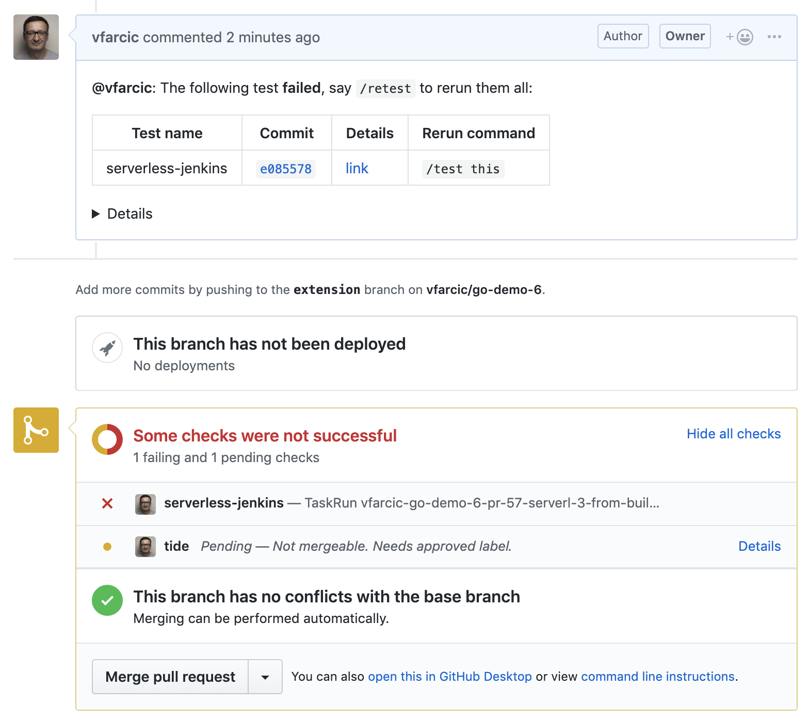

## TODO

- [X] Code
- [ ] Write
- [-] Code review static GKE
- [X] Code review serverless GKE
- [-] Code review static EKS
- [ ] Code review serverless EKS
- [-] Code review static AKS
- [ ] Code review serverless AKS
- [-] Code review existing static cluster
- [ ] Code review existing serverless cluster
- [ ] Text review
- [ ] Gist
- [ ] Review titles
- [ ] Proofread
- [ ] Diagrams
- [ ] Add to slides
- [ ] Publish on TechnologyConversations.com
- [ ] Add to Book.txt
- [ ] Publish on LeanPub.com

# Using The Extension Model in jenkins-x.yaml

NOTE: Serverless only

Copying and pasting coode is one of developer's major sins. One of the first things we learn as developers is that duplicated code is hard to maintain. That's why we are creating libraries. We do not want to repeat ourselves and we even came up with a commonly used acronym DRY (don't repeat yourself). Jenkins users are sinful.

TODO: Repetition results in reinvention of the wheel

When we create pipelines thrugh static Jenkins X, every project gets a Jenkinsfile based on the pipeline residing in the buildpack we choose. If we have ten projects, there will be ten identical copies of the same Jenkinsfile. Over time, we'll modify those Jenkinsfiles and they might not all thee exactly the same. Even in those cases, most of Jenkinsfile contents will remain untouched. It does not matter whether 100% of Jenkinsfile contents is repeated across projects or that percentage drops. There is a high level of repetition.

TODO: Plugins > shared libraries

In the past, we fought repetition through Jenkins shared libraries. Whenever we

TODO: Shared libraries > executables

TODO: Extension model

## Creating A Kubernetes Cluster With Jenkins X

TODO: Rewrite

W> You might be used to the fact that until now we were always using the same Gists to create a cluster or install Jenkins X in an existing one. Those that follow are different.

If you kept the cluster from the previous chapter and it contains serverless Jenkinss X, you can skip this section. Otherwise, we'll need to create a new Jenkins X cluster.

I> All the commands from this chapter are available in the [TODO:](TODO:) Gist.

For your convenience, the Gists that will create a new Jenkins X cluster or install it inside an existing one are as follows.

* Create new serverless **GKE** cluster: [gke-jx-serverless.sh](https://gist.github.com/a04269d359685bbd00a27643b5474ace)
* Create new serverless **EKS** cluster: [eks-jx-serverless.sh](https://gist.github.com/69a4cbc65d8cb122d890add5997c463b)
* Create new serverless **AKS** cluster: [aks-jx-serverless.sh](https://gist.github.com/a7cb7a28b7e84590fbb560b16a0ee98c)
* Use an **existing** serverless cluster: [install-serverless.sh](https://gist.github.com/f592c72486feb0fb1301778de08ba31d)

We will not need the `jx-prow` project we created in the previous chapter. If you are reusing the cluster and Jenkins X installation, you might want to remove it and save a bit of resources.

```bash
GH_USER=[...]

jx delete application \
    $GH_USER/jx-prow \
    --batch-mode
```

W> Please replace `[...]` with your GitHub user before executing the commands that follow.

I> The commands that follow will reset your *go-demo-6* `master` with the contents of the `pr` branch that contains all the changes we did so far. Please execute them only if you are unsure whether you did all the exercises correctly.

```bash
cd go-demo-6

git pull

git checkout versioning

git merge -s ours master --no-edit

git checkout master

git merge versioning

git push

cd ..
```

Now we can explore Jenkins X Pipeline Extension Model.

## Pipeline Extension Model

```bash
cd go-demo-6

git checkout master

rm -f Jenkinsfile

jx import --batch-mode
```

```
WARNING: No username defined for the current Git server!
performing pack detection in folder /Users/vfarcic/code/go-demo-6
--> Draft detected Go (42.156190%)
selected pack: /Users/vfarcic/.jx/draft/packs/github.com/jenkins-x-buildpacks/jenkins-x-kubernetes/packs/go

WARNING: Failed to apply the build pack in /Users/vfarcic/code/go-demo-6 due to mkdir /Users/vfarcic/code/go-demo-6/charts/preview: file exists
replacing placeholders in directory /Users/vfarcic/code/go-demo-6
app name: go-demo-6, git server: github.com, org: vfarcic, Docker registry org: devops24-book
skipping directory "/Users/vfarcic/code/go-demo-6/.git"
skipping ignored file "/Users/vfarcic/code/go-demo-6/charts/go-demo-6/charts/mongodb-5.3.0.tgz"
Creating GitHub webhook for vfarcic/go-demo-6 for url http://hook.cd.104.196.0.121.nip.io/hook

Watch pipeline activity via:    jx get activity -f go-demo-6 -w
Browse the pipeline log via:    jx get build logs vfarcic/go-demo-6/master
Open the Jenkins console via    jx console
You can list the pipelines via: jx get pipelines
When the pipeline is complete:  jx get applications

For more help on available commands see: https://jenkins-x.io/developing/browsing/

Note that your first pipeline may take a few minutes to start while the necessary images get downloaded!
```

```bash
ls -1
```

```
Dockerfile
Makefile
OWNERS
OWNERS_ALIASES
README.md
charts
functional_test.go
go.mod
go.sum
jenkins-x.yml
main.go
main_test.go
production_test.go
skaffold.yaml
vendor
watch.sh
```

```bash
cat jenkins-x.yml
```

```yaml
buildPack: go
```

```bash
open "https://github.com/jenkins-x-buildpacks/jenkins-x-kubernetes"

open "https://github.com/jenkins-x-buildpacks/jenkins-x-kubernetes/tree/master/packs/go"

open "https://github.com/jenkins-x-buildpacks/jenkins-x-kubernetes/blob/master/packs/go/pipeline.yaml"

curl "https://raw.githubusercontent.com/jenkins-x-buildpacks/jenkins-x-kubernetes/master/packs/go/pipeline.yaml"
```

```yaml
extends:
  import: classic
  file: go/pipeline.yaml
pipelines:
  pullRequest:
    build:
      steps:
      - sh: export VERSION=$PREVIEW_VERSION && skaffold build -f skaffold.yaml
        name: container-build
    postBuild:
      steps:
      - sh: jx step post build --image $DOCKER_REGISTRY/$ORG/$APP_NAME:$PREVIEW_VERSION
        name: post-build
    promote:
      steps:
      - dir: /home/jenkins/go/src/REPLACE_ME_GIT_PROVIDER/REPLACE_ME_ORG/REPLACE_ME_APP_NAME/charts/preview
        steps:
        - sh: make preview
          name: make-preview
        - sh: jx preview --app $APP_NAME --dir ../..
          name: jx-preview

  release:
    build:
      steps:
      - sh: export VERSION=`cat VERSION` && skaffold build -f skaffold.yaml
        name: container-build
      - sh: jx step post build --image $DOCKER_REGISTRY/$ORG/$APP_NAME:\$(cat VERSION)
        name: post-build
    promote:
      steps:
      - dir: /home/jenkins/go/src/REPLACE_ME_GIT_PROVIDER/REPLACE_ME_ORG/REPLACE_ME_APP_NAME/charts/REPLACE_ME_APP_NAME
        steps:
        - sh: jx step changelog --version v\$(cat ../../VERSION)
          name: changelog
        - comment: release the helm chart
          name: helm-release
          sh: jx step helm release
        - comment: promote through all 'Auto' promotion Environments
          sh: jx promote -b --all-auto --timeout 1h --version \$(cat ../../VERSION)
          name: jx-promote
```

```bash
curl "https://raw.githubusercontent.com/jenkins-x-buildpacks/jenkins-x-classic/master/packs/go/pipeline.yaml"
```

```yaml
agent:
  label: jenkins-go
  container: go
  dir: /home/jenkins/go/src/REPLACE_ME_GIT_PROVIDER/REPLACE_ME_ORG/REPLACE_ME_APP_NAME
pipelines:
  pullRequest:
    setup:
      steps:
      - groovy: checkout scm
    build:
      steps:
      - sh: make linux
        name: make-linux
  release:
    setup:
      steps:
      - groovy: git 'https://REPLACE_ME_GIT_PROVIDER/REPLACE_ME_ORG/REPLACE_ME_APP_NAME.git'
        when: "prow"
      - groovy: checkout scm
        when: "!prow"
      - sh: git checkout master
        name: git-checkout-master
        comment: ensure we're not on a detached head
        when: "!prow"
      - sh: git config --global credential.helper store
        when: "!prow"
        name: git-config
      - sh: jx step git credentials
        when: "!prow"
        name: git-credentials
    setVersion:
      steps:
      - sh: echo \$(jx-release-version) > VERSION
        name: next-version
        comment: so we can retrieve the version in later steps
      - sh: jx step tag --version \$(cat VERSION)
        name: tag-version
    build:
      steps:
      - sh: make build
        name: make-build
```

```bash
git checkout -b extension

# Increase the number of replicas

cat charts/go-demo-6/values.yaml \
    | sed -e \
    's@replicaCount: 1@replicaCount: 3@g' \
    | tee charts/go-demo-6/values.yaml
```

```yaml
# Default values for Go projects.
# This is a YAML-formatted file.
# Declare variables to be passed into your templates.
replicaCount: 3
image:
  repository: draft
  tag: dev
  pullPolicy: IfNotPresent
service:
  name: go-demo-6
  type: ClusterIP
  externalPort: 80
  internalPort: 8080
  annotations:
    fabric8.io/expose: "true"
    fabric8.io/ingress.annotations: "kubernetes.io/ingress.class: nginx"
resources:
  limits:
    cpu: 100m
    memory: 256Mi
  requests:
    cpu: 80m
    memory: 128Mi
probePath: /demo/hello?health=true
livenessProbe:
  initialDelaySeconds: 60
  periodSeconds: 10
  successThreshold: 1
  timeoutSeconds: 1
readinessProbe:
  periodSeconds: 10
  successThreshold: 1
  timeoutSeconds: 1
terminationGracePeriodSeconds: 10
go-demo-6-db:
  replicaSet:
    enabled: true


  usePassword: false
```

```bash
cat functional_test.go \
    | sed -e \
    's@fmt.Sprintf("http://@fmt.Sprintf("@g' \
    | tee functional_test.go

cat production_test.go \
    | sed -e \
    's@fmt.Sprintf("http://@fmt.Sprintf("@g' \
    | tee production_test.go

jx create step
```

```
? Pick the pipeline kind:  [Use arrows to move, space to select, type to filter]
  release
> pullrequest
  feature

? Pick the lifecycle:   [Use arrows to move, space to select, type to filter]
  setup
  setversion
  prebuild
> build
  postbuild
  promote

? Pick the create mode:   [Use arrows to move, space to select, type to filter]
> pre
  post
  replace

? Command for the new step:  [? for help] make unittest

Updated Jenkins X Pipeline file: jenkins-x.yml
```

```bash
cat jenkins-x.yml
```

```yaml
buildPack: go
pipelineConfig:
  agent: {}
  pipelines:
    pullRequest:
      build:
        preSteps:
        - sh: make unittest
```

```bash
git add .

git commit -m "Trying to extend the pipeline"

git push --set-upstream origin extension

jx create pullrequest \
    --title "Extensions" \
    --body "What I can say?" \
    --batch-mode
```

```
Created PullRequest #56 at https://github.com/vfarcic/go-demo-6/pull/56
```

```bash
PR_ADDR=[...] # e.g., `https://github.com/vfarcic/go-demo-6/pull/56`

BRANCH=[...] # e.g., `PR-56`

jx get build logs \
    --filter go-demo-6 \
    --branch $BRANCH

# error: no Tekton pipelines have been triggered which match the current filter
# If the new build is not available, wait for a few moments and repeat the previous command
```

```
Build logs for vfarcic/go-demo-6/PR-57 #1 serverless-jenkins
getting the log for build vfarcic/go-demo-6/PR-57 #1 serverless-jenkins stage from build pack and container build-step-credential-initializer-9nnfd
{"level":"warn","ts":1556275901.199879,"logger":"fallback-logger","caller":"logging/config.go:65","msg":"Fetch GitHub commit ID from kodata failed: \"ref: refs/heads/backport-container-name-fix\" is not a valid GitHub commit ID"}
{"level":"info","ts":1556275901.2014086,"logger":"fallback-logger","caller":"creds-init/main.go:40","msg":"Credentials initialized."}
getting the log for build vfarcic/go-demo-6/PR-57 #1 serverless-jenkins stage from build pack and container build-step-git-source-vfarcic-go-demo-6-pr-57-serverl-tjnc7
{"level":"warn","ts":1556275901.9147751,"logger":"fallback-logger","caller":"logging/config.go:65","msg":"Fetch GitHub commit ID from kodata failed: \"ref: refs/heads/backport-container-name-fix\" is not a valid GitHub commit ID"}
{"level":"info","ts":1556275902.233642,"logger":"fallback-logger","caller":"git-init/main.go:99","msg":"Successfully cloned \"https://github.com/vfarcic/go-demo-6\" @ \"4b37bbb133a99c47ed9fe7b8a1cdfb567f135263\" in path \"/workspace/source\""}
getting the log for build vfarcic/go-demo-6/PR-57 #1 serverless-jenkins stage from build pack and container build-step-place-tools
getting the log for build vfarcic/go-demo-6/PR-57 #1 serverless-jenkins stage from build pack and container build-step-git-merge
Warning failed to load version: failed to parse version -dev+9e73adc0b: No Major.Minor.Patch elements found
time="2019-04-26T10:51:44Z" level=info msg="got "
Using SHAs from PULL_REFS=master:d91da2334efcbdc4654aa64c5af13a8c04104fd5,57:4b37bbb133a99c47ed9fe7b8a1cdfb567f135263
ran git fetch --unshallow origin 4b37bbb133a99c47ed9fe7b8a1cdfb567f135263: d91da2334efcbdc4654aa64c5af13a8c04104fd5: in 
ran git checkout master in 
ran git reset --hard d91da2334efcbdc4654aa64c5af13a8c04104fd5 in 
ran clean --force -d . in 
ran git merge 4b37bbb133a99c47ed9fe7b8a1cdfb567f135263 in 
getting the log for build vfarcic/go-demo-6/PR-57 #1 serverless-jenkins stage from build pack and container build-step-build-step2
go: finding github.com/stretchr/testify v1.2.2
go: finding github.com/prometheus/client_model v0.0.0-20180712105110-5c3871d89910
go: finding github.com/beorn7/perks v0.0.0-20180321164747-3a771d992973
go: finding github.com/matttproud/golang_protobuf_extensions v1.0.1
go: finding github.com/pmezard/go-difflib v1.0.0
go: finding github.com/prometheus/procfs v0.0.0-20181204211112-1dc9a6cbc91a
go: finding github.com/golang/protobuf v1.2.0
go: finding github.com/davecgh/go-spew v1.1.1
go: finding github.com/stretchr/objx v0.1.1
go: finding gopkg.in/mgo.v2 v2.0.0-20180705113604-9856a29383ce
go: finding github.com/prometheus/client_golang v0.9.2
go: finding github.com/prometheus/common v0.0.0-20181126121408-4724e9255275
go: finding golang.org/x/net v0.0.0-20181201002055-351d144fa1fc
go: finding golang.org/x/sync v0.0.0-20181108010431-42b317875d0f
go: downloading gopkg.in/mgo.v2 v2.0.0-20180705113604-9856a29383ce
go: downloading github.com/prometheus/client_golang v0.9.2
go: extracting github.com/prometheus/client_golang v0.9.2
go: downloading github.com/prometheus/common v0.0.0-20181126121408-4724e9255275
go: downloading github.com/prometheus/procfs v0.0.0-20181204211112-1dc9a6cbc91a
go: downloading github.com/beorn7/perks v0.0.0-20180321164747-3a771d992973
go: downloading github.com/prometheus/client_model v0.0.0-20180712105110-5c3871d89910
go: downloading github.com/golang/protobuf v1.2.0
go: extracting github.com/beorn7/perks v0.0.0-20180321164747-3a771d992973
go: extracting gopkg.in/mgo.v2 v2.0.0-20180705113604-9856a29383ce
go: extracting github.com/prometheus/client_model v0.0.0-20180712105110-5c3871d89910
go: extracting github.com/prometheus/procfs v0.0.0-20181204211112-1dc9a6cbc91a
go: extracting github.com/prometheus/common v0.0.0-20181126121408-4724e9255275
go: downloading github.com/matttproud/golang_protobuf_extensions v1.0.1
go: extracting github.com/matttproud/golang_protobuf_extensions v1.0.1
go: extracting github.com/golang/protobuf v1.2.0
CGO_ENABLED=0 GO15VENDOREXPERIMENT=1 go test --run UnitTest -v
go: downloading github.com/stretchr/testify v1.2.2
go: extracting github.com/stretchr/testify v1.2.2
go: downloading github.com/stretchr/objx v0.1.1
go: downloading github.com/pmezard/go-difflib v1.0.0
go: downloading github.com/davecgh/go-spew v1.1.1
go: extracting github.com/stretchr/objx v0.1.1
go: extracting github.com/davecgh/go-spew v1.1.1
go: extracting github.com/pmezard/go-difflib v1.0.0
=== RUN   TestMainUnitTestSuite
=== RUN   TestMainUnitTestSuite/Test_HelloServer_Waits_WhenDelayIsPresent
=== RUN   TestMainUnitTestSuite/Test_HelloServer_WritesHelloWorld
=== RUN   TestMainUnitTestSuite/Test_HelloServer_WritesNokEventually
=== RUN   TestMainUnitTestSuite/Test_HelloServer_WritesOk
=== RUN   TestMainUnitTestSuite/Test_PersonServer_InvokesUpsertId_WhenPutPerson
=== RUN   TestMainUnitTestSuite/Test_PersonServer_Panics_WhenFindReturnsError
=== RUN   TestMainUnitTestSuite/Test_PersonServer_Panics_WhenUpsertIdReturnsError
=== RUN   TestMainUnitTestSuite/Test_PersonServer_WritesPeople
=== RUN   TestMainUnitTestSuite/Test_RunServer_InvokesListenAndServe
=== RUN   TestMainUnitTestSuite/Test_SetupMetrics_InitializesHistogram
--- PASS: TestMainUnitTestSuite (0.01s)
    --- PASS: TestMainUnitTestSuite/Test_HelloServer_Waits_WhenDelayIsPresent (0.00s)
    --- PASS: TestMainUnitTestSuite/Test_HelloServer_WritesHelloWorld (0.00s)
    --- PASS: TestMainUnitTestSuite/Test_HelloServer_WritesNokEventually (0.00s)
    --- PASS: TestMainUnitTestSuite/Test_HelloServer_WritesOk (0.00s)
    --- PASS: TestMainUnitTestSuite/Test_PersonServer_InvokesUpsertId_WhenPutPerson (0.00s)
    --- PASS: TestMainUnitTestSuite/Test_PersonServer_Panics_WhenFindReturnsError (0.00s)
    --- PASS: TestMainUnitTestSuite/Test_PersonServer_Panics_WhenUpsertIdReturnsError (0.00s)
    --- PASS: TestMainUnitTestSuite/Test_PersonServer_WritesPeople (0.00s)
    --- PASS: TestMainUnitTestSuite/Test_RunServer_InvokesListenAndServe (0.00s)
    --- PASS: TestMainUnitTestSuite/Test_SetupMetrics_InitializesHistogram (0.00s)
PASS
ok      go-demo-6       0.011s
getting the log for build vfarcic/go-demo-6/PR-57 #1 serverless-jenkins stage from build pack and container build-step-build-make-linux
CGO_ENABLED=0 GOOS=linux GOARCH=amd64 GO15VENDOREXPERIMENT=1 go build -ldflags '' -o bin/go-demo-6 main.go
getting the log for build vfarcic/go-demo-6/PR-57 #1 serverless-jenkins stage from build pack and container build-step-build-container-build
INFO[0000] No base image, nothing to extract            
INFO[0000] cmd: EXPOSE                                  
INFO[0000] Adding exposed port: 8080/tcp                
INFO[0000] Using files from context: [/workspace/source/bin] 
INFO[0000] Skipping unpacking as no commands require it. 
INFO[0000] Taking snapshot of full filesystem...        
INFO[0000] EXPOSE 8080                                  
INFO[0000] cmd: EXPOSE                                  
INFO[0000] Adding exposed port: 8080/tcp                
INFO[0000] No files changed in this command, skipping snapshotting. 
INFO[0000] ENTRYPOINT ["/go-demo-6"]                    
INFO[0000] No files changed in this command, skipping snapshotting. 
INFO[0000] Using files from context: [/workspace/source/bin] 
INFO[0000] COPY ./bin/ /                                
INFO[0000] Taking snapshot of files...                  
2019/04/26 10:52:14 pushed blob: sha256:6e1ef53d57eba92cae74327b0cf27fdaf9eb02e1edf06a786c742c23a2ae62b1
2019/04/26 10:52:15 pushed blob: sha256:93e60625c6204ed4cce591e0158de0da5e5d7c16b45ee891d7ea329eed7c60be
2019/04/26 10:52:15 gcr.io/devops24-book/go-demo-6:0.0.0-SNAPSHOT-PR-57-1: digest: sha256:4cbbbbc035303bf89b4c1b78bd1a61045f7c43d0692c8cee1a6790c821010ca3 size: 428
getting the log for build vfarcic/go-demo-6/PR-57 #1 serverless-jenkins stage from build pack and container build-step-postbuild-post-build
no CVE provider running in the current cd namespace so skip adding image to be analysed
getting the log for build vfarcic/go-demo-6/PR-57 #1 serverless-jenkins stage from build pack and container build-step-promote-make-preview
sed -i -e "s/version:.*/version: 0.0.0-SNAPSHOT-PR-57-1/" Chart.yaml
sed -i -e "s/version:.*/version: 0.0.0-SNAPSHOT-PR-57-1/" ../*/Chart.yaml
sed -i -e "s|repository:.*|repository: gcr.io\/vfarcic\/go-demo-6|" values.yaml
sed -i -e "s/tag:.*/tag: 0.0.0-SNAPSHOT-PR-57-1/" values.yaml
echo "  version: 0.0.0-SNAPSHOT-PR-57-1" >> requirements.yaml
jx step helm build
WARNING: No $CHART_REPOSITORY defined so using the default value of: http://jenkins-x-chartmuseum:8080
Adding missing Helm repo: chartmuseum.jenkins-x.io http://chartmuseum.jenkins-x.io
Successfully added Helm repository chartmuseum.jenkins-x.io.
Adding missing Helm repo: jenkins-x-chartmuseum http://jenkins-x-chartmuseum:8080
Successfully added Helm repository jenkins-x-chartmuseum.
getting the log for build vfarcic/go-demo-6/PR-57 #1 serverless-jenkins stage from build pack and container build-step-promote-jx-preview
Creating a preview
WARNING: No author for commit: 4b37bbb133a99c47ed9fe7b8a1cdfb567f135263
Created environment vfarcic-go-demo-6-pr-57
Namespace cd-vfarcic-go-demo-6-pr-57 created 
 
expose:
  Annotations:
    helm.sh/hook: post-install,post-upgrade
    helm.sh/hook-delete-policy: hook-succeeded
  config:
    domain: 34.74.193.252.nip.io
    exposer: Ingress
    http: "true"
preview:
  image:
    repository: gcr.io/devops24-book/go-demo-6
    tag: 0.0.0-SNAPSHOT-PR-57-1
Deleting and cloning the Jenkins X versions repo
Cloning the Jenkins X versions repo https://github.com/jenkins-x/jenkins-x-versions.git with ref refs/heads/master to /builder/home/.jx/jenkins-x-versions
Enumerating objects: 1119, done.
Total 1119 (delta 0), reused 0 (delta 0), pack-reused 1119
WARNING: could not find a stable version from charts of . from /builder/home/.jx/jenkins-x-versions
For background see: https://jenkins-x.io/architecture/version-stream/
Please lock this version down via the command: jx step create version pr -k charts -n .

Applying generated chart . YAML via kubectl in dir: /tmp/helm-template-workdir-901234379/preview/output
role.rbac.authorization.k8s.io/cleanup created
rolebinding.rbac.authorization.k8s.io/cleanup created
serviceaccount/cleanup created
configmap/exposecontroller created
role.rbac.authorization.k8s.io/expose created
rolebinding.rbac.authorization.k8s.io/expose created
serviceaccount/expose created
deployment.extensions/preview-preview created
service/go-demo-6 created
deployment.extensions/preview-preview-db created
service/preview-preview-db created

Applying Helm hook post-upgrade YAML via kubectl in file: /tmp/helm-template-workdir-901234379/preview/helmHooks/preview/charts/expose/templates/job.yaml
job.batch/expose created

Waiting for helm post-upgrade hook Job expose to complete before removing it
Deleting helm hook sources from file: /tmp/helm-template-workdir-901234379/preview/helmHooks/preview/charts/expose/templates/job.yaml
job.batch "expose" deleted
Removing Kubernetes resources from older releases using selector: jenkins.io/chart-release=preview,jenkins.io/version!=0.0.0-SNAPSHOT-PR-57-1 from all pvc configmap release sa role rolebinding secret
Removing Kubernetes resources from older releases using selector: jenkins.io/chart-release=preview,jenkins.io/version!=0.0.0-SNAPSHOT-PR-57-1,jenkins.io/namespace=cd-vfarcic-go-demo-6-pr-57 from clusterrole clusterrolebinding
Updating PipelineActivities vfarcic-go-demo-6-pr-57-1 which has status 
Preview application is now available at: http://go-demo-6.cd-vfarcic-go-demo-6-pr-57.34.74.193.252.nip.io
```

```bash
jx create step \
    --pipeline pullrequest \
    --lifecycle promote \
    --mode post \
    --sh 'ADDRESS=`jx get preview --current 2>&1` make functest'
```

```
Updated Jenkins X Pipeline file: jenkins-x.yml
```

```bash
cat jenkins-x.yml
```

```yaml
buildPack: go
pipelineConfig:
  agent: {}
  pipelines:
    pullRequest:
      build:
        preSteps:
        - sh: make unittest
      promote:
        steps:
        - sh: ADDRESS=`jx get preview --current 2>&1` make functest
```

```bash
git add .

git commit -m "Trying to extend the pipeline"

git push

# Wait for a few moments

jx get build logs \
    --filter go-demo-6 \
    --branch $BRANCH

# If the new build is not available, wait for a few moments and repeat the previous command
```

```
> vfarcic/go-demo-6/PR-57 #2 serverless-jenkins
  vfarcic/go-demo-6/PR-57 #1 serverless-jenkins

Build logs for vfarcic/go-demo-6/PR-57 #2 serverless-jenkins
getting the log for build vfarcic/go-demo-6/PR-57 #2 serverless-jenkins stage from build pack and container build-step-credential-initializer-gfvxh
{"level":"warn","ts":1556276241.170099,"logger":"fallback-logger","caller":"logging/config.go:65","msg":"Fetch GitHub commit ID from kodata failed: \"ref: refs/heads/backport-container-name-fix\" is not a valid GitHub commit ID"}
{"level":"info","ts":1556276241.1706579,"logger":"fallback-logger","caller":"creds-init/main.go:40","msg":"Credentials initialized."}
getting the log for build vfarcic/go-demo-6/PR-57 #2 serverless-jenkins stage from build pack and container build-step-git-source-vfarcic-go-demo-6-pr-57-serverl-tz4lj
{"level":"warn","ts":1556276241.9104946,"logger":"fallback-logger","caller":"logging/config.go:65","msg":"Fetch GitHub commit ID from kodata failed: \"ref: refs/heads/backport-container-name-fix\" is not a valid GitHub commit ID"}
{"level":"info","ts":1556276242.2568915,"logger":"fallback-logger","caller":"git-init/main.go:99","msg":"Successfully cloned \"https://github.com/vfarcic/go-demo-6\" @ \"8c8c3745a76013ee6082d3b6b6054f1c338856ee\" in path \"/workspace/source\""}
getting the log for build vfarcic/go-demo-6/PR-57 #2 serverless-jenkins stage from build pack and container build-step-place-tools
getting the log for build vfarcic/go-demo-6/PR-57 #2 serverless-jenkins stage from build pack and container build-step-git-merge
Warning failed to load version: failed to parse version -dev+9e73adc0b: No Major.Minor.Patch elements found
time="2019-04-26T10:57:24Z" level=info msg="got "
Using SHAs from PULL_REFS=master:d91da2334efcbdc4654aa64c5af13a8c04104fd5,57:8c8c3745a76013ee6082d3b6b6054f1c338856ee
ran git fetch --unshallow origin 8c8c3745a76013ee6082d3b6b6054f1c338856ee: d91da2334efcbdc4654aa64c5af13a8c04104fd5: in 
ran git checkout master in 
ran git reset --hard d91da2334efcbdc4654aa64c5af13a8c04104fd5 in 
ran clean --force -d . in 
ran git merge 8c8c3745a76013ee6082d3b6b6054f1c338856ee in 
getting the log for build vfarcic/go-demo-6/PR-57 #2 serverless-jenkins stage from build pack and container build-step-build-step2
go: finding github.com/prometheus/common v0.0.0-20181126121408-4724e9255275
go: finding github.com/stretchr/testify v1.2.2
go: finding github.com/prometheus/client_model v0.0.0-20180712105110-5c3871d89910
go: finding github.com/prometheus/client_golang v0.9.2
go: finding github.com/davecgh/go-spew v1.1.1
go: finding github.com/golang/protobuf v1.2.0
go: finding github.com/prometheus/procfs v0.0.0-20181204211112-1dc9a6cbc91a
go: finding github.com/beorn7/perks v0.0.0-20180321164747-3a771d992973
go: finding github.com/pmezard/go-difflib v1.0.0
go: finding gopkg.in/mgo.v2 v2.0.0-20180705113604-9856a29383ce
go: finding github.com/stretchr/objx v0.1.1
go: finding github.com/matttproud/golang_protobuf_extensions v1.0.1
go: finding golang.org/x/net v0.0.0-20181201002055-351d144fa1fc
go: finding golang.org/x/sync v0.0.0-20181108010431-42b317875d0f
go: downloading github.com/prometheus/client_golang v0.9.2
go: downloading gopkg.in/mgo.v2 v2.0.0-20180705113604-9856a29383ce
go: extracting github.com/prometheus/client_golang v0.9.2
go: downloading github.com/prometheus/common v0.0.0-20181126121408-4724e9255275
go: downloading github.com/prometheus/procfs v0.0.0-20181204211112-1dc9a6cbc91a
go: downloading github.com/beorn7/perks v0.0.0-20180321164747-3a771d992973
go: downloading github.com/prometheus/client_model v0.0.0-20180712105110-5c3871d89910
go: downloading github.com/golang/protobuf v1.2.0
go: extracting gopkg.in/mgo.v2 v2.0.0-20180705113604-9856a29383ce
go: extracting github.com/beorn7/perks v0.0.0-20180321164747-3a771d992973
go: extracting github.com/prometheus/client_model v0.0.0-20180712105110-5c3871d89910
go: extracting github.com/prometheus/procfs v0.0.0-20181204211112-1dc9a6cbc91a
go: extracting github.com/prometheus/common v0.0.0-20181126121408-4724e9255275
go: downloading github.com/matttproud/golang_protobuf_extensions v1.0.1
go: extracting github.com/matttproud/golang_protobuf_extensions v1.0.1
go: extracting github.com/golang/protobuf v1.2.0
CGO_ENABLED=0 GO15VENDOREXPERIMENT=1 go test --run UnitTest -v
go: downloading github.com/stretchr/testify v1.2.2
go: extracting github.com/stretchr/testify v1.2.2
go: downloading github.com/davecgh/go-spew v1.1.1
go: downloading github.com/pmezard/go-difflib v1.0.0
go: downloading github.com/stretchr/objx v0.1.1
go: extracting github.com/pmezard/go-difflib v1.0.0
go: extracting github.com/davecgh/go-spew v1.1.1
go: extracting github.com/stretchr/objx v0.1.1
=== RUN   TestMainUnitTestSuite
=== RUN   TestMainUnitTestSuite/Test_HelloServer_Waits_WhenDelayIsPresent
=== RUN   TestMainUnitTestSuite/Test_HelloServer_WritesHelloWorld
=== RUN   TestMainUnitTestSuite/Test_HelloServer_WritesNokEventually
=== RUN   TestMainUnitTestSuite/Test_HelloServer_WritesOk
=== RUN   TestMainUnitTestSuite/Test_PersonServer_InvokesUpsertId_WhenPutPerson
=== RUN   TestMainUnitTestSuite/Test_PersonServer_Panics_WhenFindReturnsError
=== RUN   TestMainUnitTestSuite/Test_PersonServer_Panics_WhenUpsertIdReturnsError
=== RUN   TestMainUnitTestSuite/Test_PersonServer_WritesPeople
=== RUN   TestMainUnitTestSuite/Test_RunServer_InvokesListenAndServe
=== RUN   TestMainUnitTestSuite/Test_SetupMetrics_InitializesHistogram
--- PASS: TestMainUnitTestSuite (0.01s)
    --- PASS: TestMainUnitTestSuite/Test_HelloServer_Waits_WhenDelayIsPresent (0.00s)
    --- PASS: TestMainUnitTestSuite/Test_HelloServer_WritesHelloWorld (0.00s)
    --- PASS: TestMainUnitTestSuite/Test_HelloServer_WritesNokEventually (0.00s)
    --- PASS: TestMainUnitTestSuite/Test_HelloServer_WritesOk (0.00s)
    --- PASS: TestMainUnitTestSuite/Test_PersonServer_InvokesUpsertId_WhenPutPerson (0.00s)
    --- PASS: TestMainUnitTestSuite/Test_PersonServer_Panics_WhenFindReturnsError (0.00s)
    --- PASS: TestMainUnitTestSuite/Test_PersonServer_Panics_WhenUpsertIdReturnsError (0.00s)
    --- PASS: TestMainUnitTestSuite/Test_PersonServer_WritesPeople (0.00s)
    --- PASS: TestMainUnitTestSuite/Test_RunServer_InvokesListenAndServe (0.00s)
    --- PASS: TestMainUnitTestSuite/Test_SetupMetrics_InitializesHistogram (0.00s)
PASS
ok      go-demo-6       0.013s
getting the log for build vfarcic/go-demo-6/PR-57 #2 serverless-jenkins stage from build pack and container build-step-build-make-linux
CGO_ENABLED=0 GOOS=linux GOARCH=amd64 GO15VENDOREXPERIMENT=1 go build -ldflags '' -o bin/go-demo-6 main.go
getting the log for build vfarcic/go-demo-6/PR-57 #2 serverless-jenkins stage from build pack and container build-step-build-container-build
INFO[0000] No base image, nothing to extract            
INFO[0000] cmd: EXPOSE                                  
INFO[0000] Adding exposed port: 8080/tcp                
INFO[0000] Using files from context: [/workspace/source/bin] 
INFO[0000] Skipping unpacking as no commands require it. 
INFO[0000] Taking snapshot of full filesystem...        
INFO[0000] EXPOSE 8080                                  
INFO[0000] cmd: EXPOSE                                  
INFO[0000] Adding exposed port: 8080/tcp                
INFO[0000] No files changed in this command, skipping snapshotting. 
INFO[0000] ENTRYPOINT ["/go-demo-6"]                    
INFO[0000] No files changed in this command, skipping snapshotting. 
INFO[0000] Using files from context: [/workspace/source/bin] 
INFO[0000] COPY ./bin/ /                                
INFO[0000] Taking snapshot of files...                  
2019/04/26 10:57:53 pushed blob: sha256:fcfa5df5dce98f0309551ec0f568f50f4bc77424ce070564a4e42dbd6a84c6b7
2019/04/26 10:57:54 pushed blob: sha256:13be0227b143d47408c734e326688fbc38e493b3dbf0eb63cf575c74b9b13301
2019/04/26 10:57:55 gcr.io/devops24-book/go-demo-6:0.0.0-SNAPSHOT-PR-57-2: digest: sha256:6b8cc086ff77a2c6c0de39944f81e4b2c9b71e6004b2de37e22a64c80c4c3f65 size: 428
getting the log for build vfarcic/go-demo-6/PR-57 #2 serverless-jenkins stage from build pack and container build-step-postbuild-post-build
no CVE provider running in the current cd namespace so skip adding image to be analysed
getting the log for build vfarcic/go-demo-6/PR-57 #2 serverless-jenkins stage from build pack and container build-step-promote-make-preview
sed -i -e "s/version:.*/version: 0.0.0-SNAPSHOT-PR-57-2/" Chart.yaml
sed -i -e "s/version:.*/version: 0.0.0-SNAPSHOT-PR-57-2/" ../*/Chart.yaml
sed -i -e "s|repository:.*|repository: gcr.io\/vfarcic\/go-demo-6|" values.yaml
sed -i -e "s/tag:.*/tag: 0.0.0-SNAPSHOT-PR-57-2/" values.yaml
echo "  version: 0.0.0-SNAPSHOT-PR-57-2" >> requirements.yaml
jx step helm build
WARNING: No $CHART_REPOSITORY defined so using the default value of: http://jenkins-x-chartmuseum:8080
Adding missing Helm repo: chartmuseum.jenkins-x.io http://chartmuseum.jenkins-x.io
Successfully added Helm repository chartmuseum.jenkins-x.io.
Adding missing Helm repo: jenkins-x-chartmuseum http://jenkins-x-chartmuseum:8080
Successfully added Helm repository jenkins-x-chartmuseum.
getting the log for build vfarcic/go-demo-6/PR-57 #2 serverless-jenkins stage from build pack and container build-step-promote-jx-preview
Creating a preview
WARNING: No author for commit: 4b37bbb133a99c47ed9fe7b8a1cdfb567f135263
WARNING: No author for commit: 8c8c3745a76013ee6082d3b6b6054f1c338856ee
expose:
  Annotations:
    helm.sh/hook: post-install,post-upgrade
    helm.sh/hook-delete-policy: hook-succeeded
  config:
    domain: 34.74.193.252.nip.io
    exposer: Ingress
    http: "true"
preview:
  image:
    repository: gcr.io/devops24-book/go-demo-6
    tag: 0.0.0-SNAPSHOT-PR-57-2
Deleting and cloning the Jenkins X versions repo
Cloning the Jenkins X versions repo https://github.com/jenkins-x/jenkins-x-versions.git with ref refs/heads/master to /builder/home/.jx/jenkins-x-versions
Enumerating objects: 1119, done.
Total 1119 (delta 0), reused 0 (delta 0), pack-reused 1119
WARNING: could not find a stable version from charts of . from /builder/home/.jx/jenkins-x-versions
For background see: https://jenkins-x.io/architecture/version-stream/
Please lock this version down via the command: jx step create version pr -k charts -n .

Applying generated chart . YAML via kubectl in dir: /tmp/helm-template-workdir-836309270/preview/output
role.rbac.authorization.k8s.io/cleanup configured
rolebinding.rbac.authorization.k8s.io/cleanup configured
serviceaccount/cleanup configured
configmap/exposecontroller configured
role.rbac.authorization.k8s.io/expose configured
rolebinding.rbac.authorization.k8s.io/expose configured
serviceaccount/expose configured
deployment.extensions/preview-preview configured
service/go-demo-6 configured
deployment.extensions/preview-preview-db configured
service/preview-preview-db configured

Applying Helm hook post-upgrade YAML via kubectl in file: /tmp/helm-template-workdir-836309270/preview/helmHooks/preview/charts/expose/templates/job.yaml
job.batch/expose created

Waiting for helm post-upgrade hook Job expose to complete before removing it
Deleting helm hook sources from file: /tmp/helm-template-workdir-836309270/preview/helmHooks/preview/charts/expose/templates/job.yaml
job.batch "expose" deleted
Removing Kubernetes resources from older releases using selector: jenkins.io/chart-release=preview,jenkins.io/version!=0.0.0-SNAPSHOT-PR-57-2 from all pvc configmap release sa role rolebinding secret
Removing Kubernetes resources from older releases using selector: jenkins.io/chart-release=preview,jenkins.io/version!=0.0.0-SNAPSHOT-PR-57-2,jenkins.io/namespace=cd-vfarcic-go-demo-6-pr-57 from clusterrole clusterrolebinding
Updating PipelineActivities vfarcic-go-demo-6-pr-57-2 which has status 
Preview application is now available at: http://go-demo-6.cd-vfarcic-go-demo-6-pr-57.34.74.193.252.nip.io

getting the log for build vfarcic/go-demo-6/PR-57 #2 serverless-jenkins stage from build pack and container build-step-promote-step8
CGO_ENABLED=0 GO15VENDOREXPERIMENT=1 go \
test -test.v --run FunctionalTest \
--cover
=== RUN   TestFunctionalTestSuite
=== RUN   TestFunctionalTestSuite/Test_Hello_ReturnsStatus200
2019/04/26 10:58:31 Sending a request to http://go-demo-6.cd-vfarcic-go-demo-6-pr-57.34.74.193.252.nip.io/demo/hello
=== RUN   TestFunctionalTestSuite/Test_Person_ReturnsStatus200
2019/04/26 10:58:31 Sending a request to http://go-demo-6.cd-vfarcic-go-demo-6-pr-57.34.74.193.252.nip.io/demo/person
--- PASS: TestFunctionalTestSuite (0.26s)
    --- PASS: TestFunctionalTestSuite/Test_Hello_ReturnsStatus200 (0.13s)
    --- PASS: TestFunctionalTestSuite/Test_Person_ReturnsStatus200 (0.13s)
PASS
coverage: 1.4% of statements
ok      go-demo-6       0.271s
```

```bash
jx create step \
    --pipeline pullrequest \
    --lifecycle promote \
    --mode post \
    --sh 'ADDRESS=http://acme.com make functest'

git add .

git commit -m "Trying to extend the pipeline"

git push

jx get build logs \
    --filter go-demo-6 \
    --branch $BRANCH

# If the new build is not available, wait for a few moments and repeat the previous command

# Choose the latest build (e.g., #3)
```

```
? Which build do you want to view the logs of?:  vfarcic/go-demo-6/PR-57 #3 serverless-jenkins
Build logs for vfarcic/go-demo-6/PR-57 #3 serverless-jenkins
getting the log for build vfarcic/go-demo-6/PR-57 #3 serverless-jenkins stage from build pack and container build-step-credential-initializer-q6g9h
{"level":"warn","ts":1556276712.1147194,"logger":"fallback-logger","caller":"logging/config.go:65","msg":"Fetch GitHub commit ID from kodata failed: \"ref: refs/heads/backport-
container-name-fix\" is not a valid GitHub commit ID"}
{"level":"info","ts":1556276712.115202,"logger":"fallback-logger","caller":"creds-init/main.go:40","msg":"Credentials initialized."}
getting the log for build vfarcic/go-demo-6/PR-57 #3 serverless-jenkins stage from build pack and container build-step-git-source-vfarcic-go-demo-6-pr-57-serverl-tdmjk
{"level":"warn","ts":1556276712.84467,"logger":"fallback-logger","caller":"logging/config.go:65","msg":"Fetch GitHub commit ID from kodata failed: \"ref: refs/heads/backport-container-name-fix\" is not a valid GitHub commit ID"}
{"level":"info","ts":1556276713.2234516,"logger":"fallback-logger","caller":"git-init/main.go:99","msg":"Successfully cloned \"https://github.com/vfarcic/go-demo-6\" @ \"e085578b93a64d18be88c9d28d5430b5b8e04845\" in path \"/workspace/source\""}
getting the log for build vfarcic/go-demo-6/PR-57 #3 serverless-jenkins stage from build pack and container build-step-place-tools
getting the log for build vfarcic/go-demo-6/PR-57 #3 serverless-jenkins stage from build pack and container build-step-git-merge
Warning failed to load version: failed to parse version -dev+9e73adc0b: No Major.Minor.Patch elements found
time="2019-04-26T11:05:14Z" level=info msg="got "
Using SHAs from PULL_REFS=master:d91da2334efcbdc4654aa64c5af13a8c04104fd5,57:e085578b93a64d18be88c9d28d5430b5b8e04845
ran git fetch --unshallow origin e085578b93a64d18be88c9d28d5430b5b8e04845: d91da2334efcbdc4654aa64c5af13a8c04104fd5: in 
ran git checkout master in 
ran git reset --hard d91da2334efcbdc4654aa64c5af13a8c04104fd5 in 
ran clean --force -d . in 
ran git merge e085578b93a64d18be88c9d28d5430b5b8e04845 in 
getting the log for build vfarcic/go-demo-6/PR-57 #3 serverless-jenkins stage from build pack and container build-step-build-step2
go: finding github.com/prometheus/client_model v0.0.0-20180712105110-5c3871d89910
go: finding github.com/golang/protobuf v1.2.0
go: finding github.com/matttproud/golang_protobuf_extensions v1.0.1
go: finding github.com/stretchr/testify v1.2.2
go: finding github.com/beorn7/perks v0.0.0-20180321164747-3a771d992973
go: finding github.com/prometheus/client_golang v0.9.2
go: finding github.com/stretchr/objx v0.1.1
go: finding github.com/davecgh/go-spew v1.1.1
go: finding github.com/pmezard/go-difflib v1.0.0
go: finding gopkg.in/mgo.v2 v2.0.0-20180705113604-9856a29383ce
go: finding github.com/prometheus/procfs v0.0.0-20181204211112-1dc9a6cbc91a
go: finding github.com/prometheus/common v0.0.0-20181126121408-4724e9255275
go: finding golang.org/x/net v0.0.0-20181201002055-351d144fa1fc
go: finding golang.org/x/sync v0.0.0-20181108010431-42b317875d0f
go: downloading github.com/prometheus/client_golang v0.9.2
go: downloading gopkg.in/mgo.v2 v2.0.0-20180705113604-9856a29383ce
go: extracting github.com/prometheus/client_golang v0.9.2
go: downloading github.com/prometheus/common v0.0.0-20181126121408-4724e9255275
go: downloading github.com/beorn7/perks v0.0.0-20180321164747-3a771d992973
go: downloading github.com/prometheus/procfs v0.0.0-20181204211112-1dc9a6cbc91a
go: downloading github.com/prometheus/client_model v0.0.0-20180712105110-5c3871d89910
go: downloading github.com/golang/protobuf v1.2.0
go: extracting github.com/beorn7/perks v0.0.0-20180321164747-3a771d992973
go: extracting gopkg.in/mgo.v2 v2.0.0-20180705113604-9856a29383ce
go: extracting github.com/prometheus/client_model v0.0.0-20180712105110-5c3871d89910
go: extracting github.com/prometheus/common v0.0.0-20181126121408-4724e9255275
go: downloading github.com/matttproud/golang_protobuf_extensions v1.0.1
go: extracting github.com/prometheus/procfs v0.0.0-20181204211112-1dc9a6cbc91a
go: extracting github.com/matttproud/golang_protobuf_extensions v1.0.1
go: extracting github.com/golang/protobuf v1.2.0
CGO_ENABLED=0 GO15VENDOREXPERIMENT=1 go test --run UnitTest -v
go: downloading github.com/stretchr/testify v1.2.2
go: extracting github.com/stretchr/testify v1.2.2
go: downloading github.com/davecgh/go-spew v1.1.1
go: downloading github.com/stretchr/objx v0.1.1
go: downloading github.com/pmezard/go-difflib v1.0.0
go: extracting github.com/pmezard/go-difflib v1.0.0
go: extracting github.com/davecgh/go-spew v1.1.1
go: extracting github.com/stretchr/objx v0.1.1
=== RUN   TestMainUnitTestSuite
=== RUN   TestMainUnitTestSuite/Test_HelloServer_Waits_WhenDelayIsPresent
=== RUN   TestMainUnitTestSuite/Test_HelloServer_WritesHelloWorld
=== RUN   TestMainUnitTestSuite/Test_HelloServer_WritesNokEventually
=== RUN   TestMainUnitTestSuite/Test_HelloServer_WritesOk
=== RUN   TestMainUnitTestSuite/Test_PersonServer_InvokesUpsertId_WhenPutPerson
=== RUN   TestMainUnitTestSuite/Test_PersonServer_Panics_WhenFindReturnsError
=== RUN   TestMainUnitTestSuite/Test_PersonServer_Panics_WhenUpsertIdReturnsError
=== RUN   TestMainUnitTestSuite/Test_PersonServer_WritesPeople
=== RUN   TestMainUnitTestSuite/Test_RunServer_InvokesListenAndServe
=== RUN   TestMainUnitTestSuite/Test_SetupMetrics_InitializesHistogram
--- PASS: TestMainUnitTestSuite (0.01s)
    --- PASS: TestMainUnitTestSuite/Test_HelloServer_Waits_WhenDelayIsPresent (0.00s)
    --- PASS: TestMainUnitTestSuite/Test_HelloServer_WritesHelloWorld (0.00s)
    --- PASS: TestMainUnitTestSuite/Test_HelloServer_WritesNokEventually (0.00s)
    --- PASS: TestMainUnitTestSuite/Test_HelloServer_WritesOk (0.00s)
    --- PASS: TestMainUnitTestSuite/Test_PersonServer_InvokesUpsertId_WhenPutPerson (0.00s)
    --- PASS: TestMainUnitTestSuite/Test_PersonServer_Panics_WhenFindReturnsError (0.00s)
    --- PASS: TestMainUnitTestSuite/Test_PersonServer_Panics_WhenUpsertIdReturnsError (0.00s)
    --- PASS: TestMainUnitTestSuite/Test_PersonServer_WritesPeople (0.00s)
    --- PASS: TestMainUnitTestSuite/Test_RunServer_InvokesListenAndServe (0.00s)
    --- PASS: TestMainUnitTestSuite/Test_SetupMetrics_InitializesHistogram (0.00s)
PASS
ok      go-demo-6       0.012s
getting the log for build vfarcic/go-demo-6/PR-57 #3 serverless-jenkins stage from build pack and container build-step-build-make-linux
CGO_ENABLED=0 GOOS=linux GOARCH=amd64 GO15VENDOREXPERIMENT=1 go build -ldflags '' -o bin/go-demo-6 main.go
getting the log for build vfarcic/go-demo-6/PR-57 #3 serverless-jenkins stage from build pack and container build-step-build-container-build
INFO[0000] No base image, nothing to extract            
INFO[0000] cmd: EXPOSE                                  
INFO[0000] Adding exposed port: 8080/tcp                
INFO[0000] Using files from context: [/workspace/source/bin] 
INFO[0000] Skipping unpacking as no commands require it. 
INFO[0000] Taking snapshot of full filesystem...        
INFO[0000] EXPOSE 8080                                  
INFO[0000] cmd: EXPOSE                                  
INFO[0000] Adding exposed port: 8080/tcp                
INFO[0000] No files changed in this command, skipping snapshotting. 
INFO[0000] ENTRYPOINT ["/go-demo-6"]                    
INFO[0000] No files changed in this command, skipping snapshotting. 
INFO[0000] Using files from context: [/workspace/source/bin] 
INFO[0000] COPY ./bin/ /                                
INFO[0000] Taking snapshot of files...                  
2019/04/26 11:05:45 pushed blob: sha256:b8af4d73b4c892e446c73350384f1f7d0609fcb9bd460c77a65fc02bf340d5a2
2019/04/26 11:05:46 pushed blob: sha256:73d0557dfcc8c99665bc89acbd3fc434b4ab5a4c6f4c40c96ce19572766e7aac
2019/04/26 11:05:46 gcr.io/devops24-book/go-demo-6:0.0.0-SNAPSHOT-PR-57-3: digest: sha256:f06bf4e009348c0c264c2d05a53151860f5dd1e5c4bddd0b936664bf782a5117 size: 428
getting the log for build vfarcic/go-demo-6/PR-57 #3 serverless-jenkins stage from build pack and container build-step-postbuild-post-build
no CVE provider running in the current cd namespace so skip adding image to be analysed
getting the log for build vfarcic/go-demo-6/PR-57 #3 serverless-jenkins stage from build pack and container build-step-promote-make-preview
sed -i -e "s/version:.*/version: 0.0.0-SNAPSHOT-PR-57-3/" Chart.yaml
sed -i -e "s/version:.*/version: 0.0.0-SNAPSHOT-PR-57-3/" ../*/Chart.yaml
sed -i -e "s|repository:.*|repository: gcr.io\/vfarcic\/go-demo-6|" values.yaml
sed -i -e "s/tag:.*/tag: 0.0.0-SNAPSHOT-PR-57-3/" values.yaml
echo "  version: 0.0.0-SNAPSHOT-PR-57-3" >> requirements.yaml
jx step helm build
WARNING: No $CHART_REPOSITORY defined so using the default value of: http://jenkins-x-chartmuseum:8080
Adding missing Helm repo: chartmuseum.jenkins-x.io http://chartmuseum.jenkins-x.io
Successfully added Helm repository chartmuseum.jenkins-x.io.
Adding missing Helm repo: jenkins-x-chartmuseum http://jenkins-x-chartmuseum:8080
Successfully added Helm repository jenkins-x-chartmuseum.
getting the log for build vfarcic/go-demo-6/PR-57 #3 serverless-jenkins stage from build pack and container build-step-promote-jx-preview
Creating a preview
WARNING: No author for commit: 4b37bbb133a99c47ed9fe7b8a1cdfb567f135263
WARNING: No author for commit: 8c8c3745a76013ee6082d3b6b6054f1c338856ee
WARNING: No author for commit: e085578b93a64d18be88c9d28d5430b5b8e04845
expose:
  Annotations:
    helm.sh/hook: post-install,post-upgrade
    helm.sh/hook-delete-policy: hook-succeeded
  config:
    domain: 34.74.193.252.nip.io
    exposer: Ingress
    http: "true"
preview:
  image:
    repository: gcr.io/devops24-book/go-demo-6
    tag: 0.0.0-SNAPSHOT-PR-57-3
Deleting and cloning the Jenkins X versions repo
Cloning the Jenkins X versions repo https://github.com/jenkins-x/jenkins-x-versions.git with ref refs/heads/master to /builder/home/.jx/jenkins-x-versions
Enumerating objects: 1119, done.
Total 1119 (delta 0), reused 0 (delta 0), pack-reused 1119
WARNING: could not find a stable version from charts of . from /builder/home/.jx/jenkins-x-versions
For background see: https://jenkins-x.io/architecture/version-stream/
Please lock this version down via the command: jx step create version pr -k charts -n .

Applying generated chart . YAML via kubectl in dir: /tmp/helm-template-workdir-364000905/preview/output
role.rbac.authorization.k8s.io/cleanup configured
rolebinding.rbac.authorization.k8s.io/cleanup configured
serviceaccount/cleanup configured
configmap/exposecontroller configured
role.rbac.authorization.k8s.io/expose configured
rolebinding.rbac.authorization.k8s.io/expose configured
serviceaccount/expose configured
deployment.extensions/preview-preview configured
service/go-demo-6 configured
deployment.extensions/preview-preview-db configured
service/preview-preview-db configured

Applying Helm hook post-upgrade YAML via kubectl in file: /tmp/helm-template-workdir-364000905/preview/helmHooks/preview/charts/expose/templates/job.yaml
job.batch/expose created

Waiting for helm post-upgrade hook Job expose to complete before removing it
Deleting helm hook sources from file: /tmp/helm-template-workdir-364000905/preview/helmHooks/preview/charts/expose/templates/job.yaml
job.batch "expose" deleted
Removing Kubernetes resources from older releases using selector: jenkins.io/chart-release=preview,jenkins.io/version!=0.0.0-SNAPSHOT-PR-57-3 from all pvc configmap release sa role rolebinding secret
Removing Kubernetes resources from older releases using selector: jenkins.io/chart-release=preview,jenkins.io/version!=0.0.0-SNAPSHOT-PR-57-3,jenkins.io/namespace=cd-vfarcic-go-demo-6-pr-57 from clusterrole clusterrolebinding
Updating PipelineActivities vfarcic-go-demo-6-pr-57-3 which has status 
Preview application is now available at: http://go-demo-6.cd-vfarcic-go-demo-6-pr-57.34.74.193.252.nip.io

getting the log for build vfarcic/go-demo-6/PR-57 #3 serverless-jenkins stage from build pack and container build-step-promote-step8
CGO_ENABLED=0 GO15VENDOREXPERIMENT=1 go \
test -test.v --run FunctionalTest \
--cover
=== RUN   TestFunctionalTestSuite
=== RUN   TestFunctionalTestSuite/Test_Hello_ReturnsStatus200
2019/04/26 11:06:20 Sending a request to http://go-demo-6.cd-vfarcic-go-demo-6-pr-57.34.74.193.252.nip.io/demo/hello
=== RUN   TestFunctionalTestSuite/Test_Person_ReturnsStatus200
2019/04/26 11:06:25 Sending a request to http://go-demo-6.cd-vfarcic-go-demo-6-pr-57.34.74.193.252.nip.io/demo/person
--- PASS: TestFunctionalTestSuite (5.04s)
    --- PASS: TestFunctionalTestSuite/Test_Hello_ReturnsStatus200 (5.01s)
    --- PASS: TestFunctionalTestSuite/Test_Person_ReturnsStatus200 (0.03s)
PASS
coverage: 1.4% of statements
ok      go-demo-6       5.051s
WARNING: pod vfarcic-go-demo-6-pr-57-serverl-3-from-build-pack-ttzl7-pod-b6f762 has failed
getting the log for build vfarcic/go-demo-6/PR-57 #3 serverless-jenkins stage from build pack and container build-step-promote-step9
CGO_ENABLED=0 GO15VENDOREXPERIMENT=1 go \
test -test.v --run FunctionalTest \
--cover
=== RUN   TestFunctionalTestSuite
=== RUN   TestFunctionalTestSuite/Test_Hello_ReturnsStatus200
2019/04/26 11:06:28 Sending a request to http://acme.com/demo/hello
=== RUN   TestFunctionalTestSuite/Test_Person_ReturnsStatus200
2019/04/26 11:06:28 Sending a request to http://acme.com/demo/person
--- FAIL: TestFunctionalTestSuite (0.43s)
    --- FAIL: TestFunctionalTestSuite/Test_Hello_ReturnsStatus200 (0.28s)
        functional_test.go:39: 
                Error Trace:    functional_test.go:39
                Error:          Not equal: 
                                expected: 200
                                actual  : 404
                Test:           TestFunctionalTestSuite/Test_Hello_ReturnsStatus200
                Messages:       ADDR: %!(EXTRA string=http://acme.com/demo/hello)
    --- FAIL: TestFunctionalTestSuite/Test_Person_ReturnsStatus200 (0.16s)
        functional_test.go:48: 
                Error Trace:    functional_test.go:48
                Error:          Not equal: 
                                expected: 200
                                actual  : 404
                Test:           TestFunctionalTestSuite/Test_Person_ReturnsStatus200
                Messages:       ADDR: http://acme.com/demo/person
FAIL
coverage: 1.4% of statements
exit status 1
FAIL    go-demo-6       0.437s
make: *** [functest] Error 1
{"component":"entrypoint","error":"wrapped process failed: exit status 2","level":"error","msg":"Error executing test process","time":"2019-04-26T11:06:28Z"}
```

```bash
open "$PR_ADDR"
```



Type the text that follows in the comment field and press the *Comment* button.

```
I suspect that the tests are flaky.

/retest
```

TODO: `/retest` does not work

TODO: Explain the `replace` mode

```bash
cd ..

git clone \
    https://github.com/$GH_USER/environment-tekton-staging.git

cd environment-tekton-staging

cat jenkins-x.yml
```

```yaml
env:
- name: DEPLOY_NAMESPACE
  value: cd-staging
pipelineConfig:
  agent: {}
  env:
  - name: DEPLOY_NAMESPACE
    value: cd-staging
  pipelines: {}
```

```bash
open "https://github.com/jenkins-x-buildpacks/jenkins-x-kubernetes/blob/master/packs/environment/pipeline.yaml"

curl https://raw.githubusercontent.com/jenkins-x-buildpacks/jenkins-x-kubernetes/master/packs/environment/pipeline.yaml
```

```yaml
extends:
  import: classic
  file: pipeline.yaml
agent:
  label: jenkins-go
  container: gcr.io/jenkinsxio/builder-go
pipelines:
  release:
    build:
      steps:
        - dir: env
          steps:
            - sh: jx step helm apply
              name: helm-apply

  pullRequest:
    build:
      steps:
        - dir: env
          steps:
            - sh: jx step helm build
              name: helm-build
```

kubectl -n cd-staging get ing go-demo-6 -o jsonpath="{.spec.rules[0].host}"

```bash
kubectl -n cd-staging get ing go-demo-6 -o jsonpath="{.spec.rules[0].host}"

jx create step \
    --pipeline release \
    --lifecycle postbuild \
    --mode post \
    --sh 'echo "Running integ tests!!!"'
```

```
Updated Jenkins X Pipeline file: jenkins-x.yml
```

```bash
cat jenkins-x.yml
```

```yaml
env:
- name: DEPLOY_NAMESPACE
  value: cd-staging
pipelineConfig:
  agent: {}
  env:
  - name: DEPLOY_NAMESPACE
    value: cd-staging
  pipelines:
    release:
      postBuild:
        steps:
        - sh: echo "Running integ tests!!!"
```

```bash
git add .

git commit -m "Added integ tests"

git push

jx get build logs \
    --filter environment-tekton-staging \
    --branch master

# Might need to repeat the command it the build did not yet start
```

```
Build logs for vfarcic/environment-tekton-staging/master #7 promotion
getting the log for build vfarcic/environment-tekton-staging/master #7 promotion stage from build pack and container build-step-credential-initializer-lk42f
{"level":"warn","ts":1556286447.0025957,"logger":"fallback-logger","caller":"logging/config.go:65","msg":"Fetch GitHub commit ID from kodata failed: \"ref: refs/heads/backport-
container-name-fix\" is not a valid GitHub commit ID"}
{"level":"info","ts":1556286447.0030727,"logger":"fallback-logger","caller":"creds-init/main.go:40","msg":"Credentials initialized."}
getting the log for build vfarcic/environment-tekton-staging/master #7 promotion stage from build pack and container build-step-git-source-vfarcic-environment-tekton-stag-tj2pd
{"level":"warn","ts":1556286447.6203,"logger":"fallback-logger","caller":"logging/config.go:65","msg":"Fetch GitHub commit ID from kodata failed: \"ref: refs/heads/backport-container-name-fix\" is not a valid GitHub commit ID"}
{"level":"info","ts":1556286447.8696747,"logger":"fallback-logger","caller":"git-init/main.go:99","msg":"Successfully cloned \"https://github.com/vfarcic/environment-tekton-staging\" @ \"v0.0.6\" in path \"/workspace/source\""}
getting the log for build vfarcic/environment-tekton-staging/master #7 promotion stage from build pack and container build-step-place-tools
getting the log for build vfarcic/environment-tekton-staging/master #7 promotion stage from build pack and container build-step-git-merge
Warning failed to load version: failed to parse version -dev+9e73adc0b: No Major.Minor.Patch elements found
time="2019-04-26T13:47:29Z" level=info msg="got "
Using SHAs from PULL_REFS=master:cb8ea903e9ed647f482c0c9b05f24a2b0cc279b0
time="2019-04-26T13:47:29Z" level=warning msg="no SHAs to merge, falling back to initial cloned commit"
getting the log for build vfarcic/environment-tekton-staging/master #7 promotion stage from build pack and container build-step-setup-jx-git-credentials
Generated Git credentials file /builder/home/git/credentials
getting the log for build vfarcic/environment-tekton-staging/master #7 promotion stage from build pack and container build-step-build-helm-apply
Modified file /workspace/source/env/Chart.yaml to set the chart to version 7
WARNING: No $CHART_REPOSITORY defined so using the default value of: http://jenkins-x-chartmuseum:8080
Adding missing Helm repo: chartmuseum.jenkins-x.io http://chartmuseum.jenkins-x.io
Successfully added Helm repository chartmuseum.jenkins-x.io.
Adding missing Helm repo: jenkins-x-chartmuseum http://jenkins-x-chartmuseum:8080
Successfully added Helm repository jenkins-x-chartmuseum.
Applying helm chart at . as release name jx to namespace cd-staging
Ignoring templates/.gitignore
Wrote chart values.yaml values.yaml generated from directory tree
generated helm values.yaml

PipelineSecrets: {}
cleanup:
  Annotations:
    helm.sh/hook: pre-delete
    helm.sh/hook-delete-policy: hook-succeeded
  Args:
  - --cleanup
controllerbuild:
  enabled: true
dockerRegistry: gcr.io
expose:
  Annotations:
    helm.sh/hook: post-install,post-upgrade
    helm.sh/hook-delete-policy: hook-succeeded
  Args:
  - --v
  - 4
  config:
    domain: 34.74.193.252.nip.io
    exposer: Ingress
    http: "true"
jenkins:
  Servers:
    Global:
      EnvVars:
        TILLER_NAMESPACE: kube-system
  enabled: false
prow: {}


Using values files: values.yaml
Applying chart overrides
Deleting and cloning the Jenkins X versions repo
Cloning the Jenkins X versions repo https://github.com/jenkins-x/jenkins-x-versions.git with ref refs/heads/master to /builder/home/.jx/jenkins-x-versions
Enumerating objects: 1119, done.
Total 1119 (delta 0), reused 0 (delta 0), pack-reused 1119
WARNING: could not find a stable version from charts of . from /builder/home/.jx/jenkins-x-versions
For background see: https://jenkins-x.io/architecture/version-stream/
Please lock this version down via the command: jx step create version pr -k charts -n .

Applying generated chart . YAML via kubectl in dir: /tmp/helm-template-workdir-167442006/jx/output
role.rbac.authorization.k8s.io/cleanup configured
rolebinding.rbac.authorization.k8s.io/cleanup configured
serviceaccount/cleanup configured
configmap/exposecontroller configured
role.rbac.authorization.k8s.io/expose configured
rolebinding.rbac.authorization.k8s.io/expose configured
serviceaccount/expose configured
service/jx-go-demo-6-db-headless configured
poddisruptionbudget.policy/jx-go-demo-6-db-arbiter configured
poddisruptionbudget.policy/jx-go-demo-6-db-primary configured
poddisruptionbudget.policy/jx-go-demo-6-db-secondary configured
statefulset.apps/jx-go-demo-6-db-arbiter configured
statefulset.apps/jx-go-demo-6-db-primary configured
statefulset.apps/jx-go-demo-6-db-secondary configured
service/jx-go-demo-6-db configured
deployment.extensions/jx-go-demo-6 configured
release.jenkins.io/go-demo-6-1.0.42 configured
service/go-demo-6 configured

Applying Helm hook post-upgrade YAML via kubectl in file: /tmp/helm-template-workdir-167442006/jx/helmHooks/env/charts/expose/templates/job.yaml
job.batch/expose created

Waiting for helm post-upgrade hook Job expose to complete before removing it
Deleting helm hook sources from file: /tmp/helm-template-workdir-167442006/jx/helmHooks/env/charts/expose/templates/job.yaml
job.batch "expose" deleted
Removing Kubernetes resources from older releases using selector: jenkins.io/chart-release=jx,jenkins.io/version!=7 from all pvc configmap release sa role rolebinding secret
Removing Kubernetes resources from older releases using selector: jenkins.io/chart-release=jx,jenkins.io/version!=7,jenkins.io/namespace=cd-staging from clusterrole clusterrolebinding
getting the log for build vfarcic/environment-tekton-staging/master #7 promotion stage from build pack and container build-step-postbuild-step4
Running integ tests!!!
```

```bash
cd ../go-demo-6

open "$PR_ADDR"
```

NOTE: Add a colleague to the `OWNERS` file and the repo collaborators list and let her write `/approve` as the comment. Or, click the *Merge pull request* button followed with *Confirm merge*. Click the *Delete branch* button.

https://jenkins-x.io/architecture/jenkins-x-pipelines/#customising-the-pipelines
https://jenkins-x.io/architecture/build-packs

NOTE: We should probably add changes to *go-demo-6* `jenkins-x.yml` to the buildpack.

## What Now?

TODO: Rewrite

Now you need to decide whether to continue using the cluster or to destroy it. If you choose to destroy it or to uninstall Jenkins X, you'll find the instructions at the bottom of the Gist you chose at the beginning of this chapter.

If you destroyed the cluster or you uninstalled Jenkins X, please remove the repositories and the local files we created. You can use the commands that follow for that.

W> Please replace `[...]` with your GitHub user before executing the commands that follow.

```bash
cd ..

GH_USER=[...]

hub delete -y \
  $GH_USER/environment-tekton-staging

hub delete -y \
  $GH_USER/environment-tekton-production

rm -rf ~/.jx/environments/$GH_USER/environment-tekton-*

rm -rf environment-tekton-staging
```