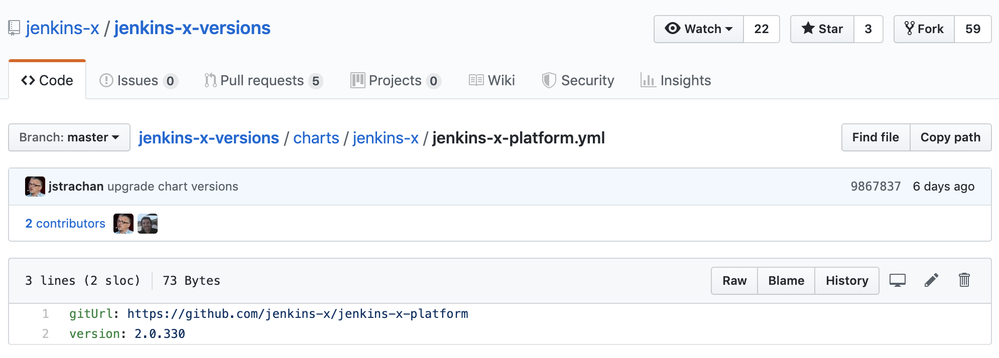
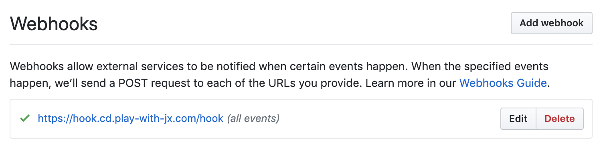

# Upgrading Jenkins X Components

Jenkins X is evolving rapidly. We can see that by checking the releases. There's hardly a day without at least one Jenkins X release. When the community is very bustling, there can be more than ten releases. At the time of this writing (June 2019) we have ~1700 releases created over ~15 months. That's an average of over 110 releases per month, more than 3 releases per day. That's very a high release frequency and for very good reasons.

The community behind the project is proliferating, and that means that the rate of pull requests is increasing as well. It's a simple calculation. More pull requests people make, more releases we get.

There is another important reason for such a high release frequency. Among other things, Jenkins X promotes continuous delivery, and it would be silly if the community behind it would not adhere to the same principles. So, instead of making a new release every quarter or some other less frequent period, Jenkins X creates a release from every approved pull request.

All that does not mean that you should follow the same frequency. I do not believe that you should upgrade your cluster with every new release since that would mean that you would spend much of your time performing upgrades. Still, I do want you to upgrade often. Once a month might be a reasonable frequency. Once a quarter would be acceptable. Less frequently than that would be a terrible idea. The more time passes between upgrades, the more changes will be applied to your cluster. Making significant changes is always more dangerous and harder to deal with than applying smaller changes more frequently.

You might be thinking that performing upgrades every month is insane. "It's too risky. It takes too much time." I beg to differ. Anyone working in our industry for more than ten years experienced what happens when we wait for a long time. It's so hard and painful to upgrade after years of "status quo" that many give up and just keep what they have until it loses support, and then they complain even more. The more we wait, the bigger the chance that something terribly wrong will happen. That's one of the reasons why we release our software much more frequently, and we should apply the same logic to third-party applications as well. Applying smaller changes more frequently gives us more control. It allows us to find issues faster, and it makes it easier to fix them.

But my goal in this chapter is not to convince you that you should be upgrading your third-party software frequently. Instead, I must point out that we haven't upgraded our Jenkins X cluster at all. Or, to be more precise, if you reused the same cluster throughout all the chapters you are running an old version of Jenkins X. Even if you did destroy the cluster at the end of each chapter and created a new one for the next, you will start using Jenkins X outside our exercises and that means that you will have to upgrade it sooner or later. So, the time has come to learn how to do just that.

At this moment you might be thinking that upgrading Jenkins X platform is a single command and that it is silly to dedicate a whole chapter to it. If what's going on in your head is how Jenkins X works, you would be right. But, upgrading the platform inside the cluster is only part of the story. Jenkins X platform is only one of the pieces of the puzzle. The cluster might also contain addons, apps, and extensions. Then there is CLI on our laptop that might need upgrading as well. Finally, we might need to upgrade our Ingress rules as well. If for no other reason, we do need to add TLS certificates. No one should expose their applications over plain HTTP.

As you can see, there's much more to upgrading than what might seem on the first look. But, before we dive into it, it might be beneficial to understand Jenkins X version stream.

## Understanding Jenkins X Version Stream

By now, you should know that Jenkins X packages a lot of useful applications, tools, and wrappers. It has command line packages installed on your laptop, and quite a few applications were deployed in your cluster. Many third-party Helm charts were used during the installation. The `jx` CLI converted them into "pure" Kubernetes YAML files before sending them to Kube API.

Given that new Jenkins X releases are made all the time, things would get messy very quickly if we would be using "latest" releases of all those charts and packages. It should come as no surprise that Jenkins X needs a place to store the information about stable versions of all packages and charts. That place is the [jenkins-x/jenkins-x-versions](https://github.com/jenkins-x/jenkins-x-versions) repository.

I will not waste space by explaining how *jenkins-x-versions* work. If you're curious, please visit the [Version Stream](https://jenkins-x.io/architecture/version-stream/) page.

Let's take a quick look at the [jenkins-x/jenkins-x-versions](https://github.com/jenkins-x/jenkins-x-versions) repository.

```bash
open "https://github.com/jenkins-x/jenkins-x-versions"
```

For now, we are only interested in the current version of the Jenkins X platform. Since it is installed through yet another Helm chart (without tiller), you can probably guess where we could find the version of the latest release.

Please open the *charts/jenkins-x* directory and open the *jenkins-x-platform.yml* file.



The value of the `version` field is significant. It defines a combination of quite a few applications running inside the cluster (e.g., ChartMuseum, Docker Registry, garbage collectors, etc.). So far, you installed only the latest Jenkins X. While using the newest version is not a bad idea, not specifying the version is a bad thing to do. That's not a good idea with any application, so it shouldn't be a good idea with Jenkins X either. The only reason why we always used the latest (without explicit version) so far is to simplify exercises and to avoid making a new release of this book every day. But, when you do start using Jenkins X in production, you should always be specific. Even if you do choose to run the latest version, specify it explicitly through the `--version` argument available both in `jx create cluster` and `jx install` commands. That way, you will be in full control over which platform you're running. Now that you know where to find the information, there is no excuse for being vague.

Today we'll do something different. Since we want to practice all sorts of upgrades, we are going to break our habit of creating a new cluster based on the latest release and intentionally install an older one. That will allow us to experience upgrades instead of trying to imagine how they would look like. That, of course, does not apply to you if you're reusing the same cluster throughout all the chapters since that means that you are certainly running an older version of Jenkins X platform. If that's the case, feel free to jump straight into the [Validating Upgrades And Backing Up The Cluster](#upgrade-backup) section.

Assuming that you still have the *jenkins-x-platform.yml* file open in your browser, please click the *History* button and select one of the older commits. Just make sure that commit is not marked as failed (icon with a red X). Next, scroll to the *jenkins-x-platform.yml* file (unless its the only one in that commit) and copy the `version` value.

We'll store the version in a variable so that we can reference it easier later on.

W> Please replace `[...]` with the version you copied before executing the command that follows.

```bash
PLATFORM_VERSION=[...]
```

Next comes the familiar part where we create a new cluster (unless you are reusing the one from the previous chapter). But, as already mentioned, this time, we will not use the latest platform. We'll add `--version` argument.

W> Make sure that you add `--version $PLATFORM_VERSION` to the arguments when creating the cluster or installing Jenkins X. The gists specified in the next section are the same as before, and you will need to add the `--version` argument to `jx create cluster` or `jx install` commands. Otherwise, you will no be able to see the outcome of upgrading the cluster.

## Creating A Kubernetes Cluster With Jenkins X And Importing The Application

If you kept the cluster from the previous chapter, you can skip this section. Otherwise, we'll need to create a new Jenkins X cluster.

I> All the commands from this chapter are available in the [14-upgrade.sh](https://gist.github.com/00404a74924beadda4143ac26e8fbaa1) Gist.

For your convenience, the Gists from the previous chapter are available below as well.

* Create new static **GKE** cluster: [gke-jx.sh](https://gist.github.com/86e10c8771582c4b6a5249e9c513cd18)
* Create new serverless **GKE** cluster: [gke-jx-serverless.sh](https://gist.github.com/a04269d359685bbd00a27643b5474ace)
* Create new static **EKS** cluster: [eks-jx.sh](https://gist.github.com/dfaf2b91819c0618faf030e6ac536eac)
* Create new serverless **EKS** cluster: [eks-jx-serverless.sh](https://gist.github.com/69a4cbc65d8cb122d890add5997c463b)
* Create new static **AKS** cluster: [aks-jx.sh](https://gist.github.com/6e01717c398a5d034ebe05b195514060)
* Create new serverless **AKS** cluster: [aks-jx-serverless.sh](https://gist.github.com/a7cb7a28b7e84590fbb560b16a0ee98c)
* Use an **existing** static cluster: [install.sh](https://gist.github.com/3dd5592dc5d582ceeb68fb3c1cc59233)
* Use an **existing** serverless cluster: [install-serverless.sh](https://gist.github.com/f592c72486feb0fb1301778de08ba31d)

I> The commands that follow will reset your *go-demo-6* `master` branch with the contents of the branch that contain all the changes we did so far. Please execute them only if you are unsure whether you did all the exercises correctly.

W> Depending on whether you're using static or serverless Jenkins X flavor, we'll need to restore one branch or the other. The commands that follow will restore `extension-model-jx` if you are using static Jenkins X, or `extension-model-cd` if you prefer the serverless flavor. For that to work, you'll need to replace `[...]` with `cd` if you are running serverless Jenkins X, or with `jx` if you are using the static flavor.

```bash
NAMESPACE=[...]

cd go-demo-6

git pull

git checkout extension-model-$NAMESPACE

git merge -s ours master --no-edit

git checkout master

git merge extension-model-$NAMESPACE

git push

cd ..
```

I> If you destroyed the cluster at the end of the previous chapter, you'll need to import the *go-demo-6* application again. Please execute the commands that follow only if you created a new cluster specifically for the exercises from this chapter.

```bash
cd go-demo-6

jx import --pack go --batch-mode

cd ..
```

Now we are ready to talk about validating upgrades and backing up clusters.

## Validating Upgrades And Backing Up The Cluster {#upgrade-backup}

Before we jump into different upgrade options, I must make an important statement. Do not trust anyone or anything blindly. We (the community behind Jenkins X) are doing our best to make it stable and backward compatible. Upgrading **should work**. But that does not mean that it will **always work**. No matter how much attention we put into making the project stable, there is almost an infinite number of combinations, and you should make an extra effort to test upgrades before applying them to production, just as you're hopefully validating your applications.

I> Do NOT trust anyone or anything. Validate upgrades of all applications, no matter whether you wrote them or they come from third-parties.

But, testing your applications and validating system-level third-party applications is not equally easy. You are not in full control of third-party applications, especially when they are not fully open source.

Excluding the option of upgrading Jenkins X blindly, two most commonly used strategies are to run a test instance in parallel with production (e.g., in separate Namespaces) or to have a test cluster. I prefer the latter option when we do have the ability to create and destroy clusters on demand. In such a case, we can create a new cluster, install the same Jenkins X version we're running in production, upgrade it, test it, and, if everything works as expected, upgrade production as well. If we do not have a test cluster, our best bet is to install Jenkins X in different namespaces and follow the same validation process we'd follow if it would be running in the separate cluster. The major problem with using different namespaces is in the probability that a mistake would affect production. It should work well if we're careful and experienced with Kubernetes, but there's no denying that there is a higher chance of messing with production.

No matter whether you test upgrades and, if you do, how well you do it, one thing is sure. You should have a backup of your cluster. If you do, you should be able to manage the worst case scenario. You will be able to restore your cluster to the last known working state.

Given that Kuberentes backups are not directly related to Jenkins X and that there are myriad of options at our disposal, I will not go into the depth of evaluating backup solutions nor will I provide detailed instructions. The only thing I will state is that my favorite tool is [Velero](https://velero.io/). If you do not have periodic and on-demand backups in place, feel free to check it out and decide whether it is an option that fits your use-case.

All in all, I will assume that you are testing upgrades before you apply them to production, that you are backing up your cluster, and that you can restore the last known good version if everything else fails.

We are about to upgrade our Jenkins X cluster, and you've been warned that the commands that follow do not excuse you from testing and backing up.

Off we go...

## Upgrading The Cluster And Local Binaries

We'll have a quick look at the current version before we upgrade our cluster, 

```bash
jx version
```

In my case, the output is as follows.

```
NAME               VERSION
jx                 2.0.151
jenkins x platform 2.0.108
Kubernetes cluster v1.12.7-gke.10
kubectl            v1.14.2
helm client        Client: v2.14.0+g05811b8
git                git version 2.20.1 (Apple Git-117)
Operating System   Mac OS X 10.14.4 build 18E226
```

You might be asked whether you want to upgrade `jx` to the new release. That is a safe operation since it will upgrade only `jx` CLI and leave the apps running in the cluster intact. If you were creating the cluster using the provided Gists, you already upgraded the CLI quite a few times, so that should not be anything new.

It might be worth mentioning that `jx` CLI can also be upgraded through the `jx upgrade cli` command. The end result is the same, except that `jx upgrade cli` does not output all the versions, but directly updates only the CLI.

What matters, for now, is the `jenkins x platform` version from the output. In my case, it is `2.0.108`. If we take a look at the [jenkins-x-platform.yml](https://github.com/jenkins-x/jenkins-x-versions/blob/master/charts/jenkins-x/jenkins-x-platform.yml) file, we can see that quite a few versions of the platform were created in the meantime. At the time of this writing (May 2019), the current version is `2.0.330`. I am 22 versions behind. While that might sound like a lot, it really isn't since Jenkins X has a very high frequency of releases.

So, what is the Jenkins X Platform? It is a bundle of quite a few applications already running in our cluster. If you are running static Jenkins X, Jenkins is one of the components of the platform. ChartMuseum is there, just as Nexus, Monocular, Docker Registry, and quite a few others. At this point, you might think that Jenkins X platform is everything related to Jenkins X, but that would not be true. There are quite a few other applications installed as addons, extensions, apps, CRDs, and so on. We'll go through the process of upgrading them all, but, for now, we'll limit ourselves to the platform.

Let's take a quick look at the help of the `jx upgrade platform` command.

```bash
jx upgrade platform --help
```

The output shows us all the arguments we can set. That one that you should always be using is `-v` or `--version`. Even though most of the time you'll want to upgrade to the latest release, you should still specify the version. That way you can be sure that you'll upgrade production to the same version you'll test before that. Otherwise, Jenkins X community might make a new release of the platform after you created the test environment and before you start the process of upgrading production.

Nevertheless, we will not use the `--version` argument in the exercise that follows because there are likely many new versions since the time of this writing. So, even though we'll skip `--version`, I expect you to use it when applying the exercises from this chapter in the "real" cluster. The same is true for all other `jx upgrade` commands we'll run later. We can say the same for `jx install` and `jx create cluster` commands. Using a specific version gives you control and a better understanding of the problems when things go wrong.

I> Always use the `--version` argument when installing or upgrading Jenkins X components, even if the examples in this book are ignoring it.

Let's see what we'll get when we upgrade the platform.

```bash
jx upgrade platform --batch-mode
```

If you are already running the latest platform, you'll see a message notifying you that the command will skip the upgrade process. Otherwise, you'll see a detailed log with a long list of resources that were updated. It was an uneventful experience, so we can move on and check the versions one more time.

```bash
jx version
```

This time my `jenkins x platform` version is `2.0.330` (yours will be different), thus confirming that the upgrade process was successful.

There's much more to upgrades than keeping the platform up-to-date. We can, for example, upgrade addons. But, before we do that, let's take a look which ones we are currently running in the cluster.

I> We did not yet explore addons. We'll do that in one of the next chapters. For now, please note that they provide, as their name suggests, additional functionalities.

```bash
jx get addons
```

The output will significantly depend on whether you are running static on serverless Jenkins X and whether you installed addons outside those coming through the "standard" installation. I can only assume that you did not install addons on your own given that we did not cover them just yet. If that's the case, you are likely going to see an empty list if you're using static Jenkins X, and a few instances of `jx-prow` and `tekton` if you prefer the serverless flavor.

In the case of serverless Jenkins X, the output, without the repeated addons, is as follows.

```
NAME    CHART            ENABLED STATUS   VERSION
jx-prow jenkins-x/prow           DEPLOYED 0.0.620
...
tekton  jenkins-x/tekton         DEPLOYED 0.0.38
...
```

We can see that I'm running `jx-prow` version `0.0.647` and `tekton` version `0.0.38`. Which versions would we get if we upgrade those addons? We can check that quickly by visiting the [jenkins-x/jenkins-x-versions](https://github.com/jenkins-x/jenkins-x-versions) repository. If you do, open the *charts/jenkins-x* directory and select the file that represents one of the addons you're interested in. For example, opening [prow.yml](https://github.com/jenkins-x/jenkins-x-versions/blob/master/charts/jenkins-x/prow.yml) shows that, at the time of this writing, the current version is `0.0.647`.

Let's upgrade the addons.

I> You might not have any addons installed, or those that you do have might be already at the latest version. If that's the case, feel free to skip the command that follows.

W> **Do not upgrade addons just yet!** There is an open issue that is likely going to delete the `oauth-token` secret and prevent Tekton and probably a few other components from working. Please monitor the [issue 3392](https://github.com/jenkins-x/jx/issues/3392). You should be able to run the command that follows if the problem is resolved and the fix is released. Otherwise, please skip it, or get ready to destroy the cluster and start over, or to figure out how to recreate the secret.

```bash
jx upgrade addons
```

You'll see a long output with the list of things that changed and those that stayed the same.

Let's see what we've got.

```bash
jx get addons
```

You should see the addons running the latest versions.

Please note that we could have upgraded a single addon by adding the name to the command. For example, `jx upgrade addon tekton` would upgrade only Tekton.

The same pattern can be followed with `app`, `crd`, and `extensions` upgrades. We haven't explored them just yet. When we do, you'll already know that they can be upgraded as well. Nevertheless, there should be no need to go through those as well since all you have to do is execute `jx upgrade`.

The last upgradable type of components is `ingress`. But, unlike other `upgrade` types we explored, that one does much more than what you might have guessed.

## Upgrading Ingress Rules And Adding TLS Certificates

All the applications we installed so far are accessible through a plain HTTP protocol. As I'm sure you're aware, that is not acceptable. All public-facing applications should be available through HTTPS only, and that means that we need TLS certificates. We could generate them ourselves for each of the applications, but that would be too much work. Instead, we'll try to figure out how to create and manage the certificates automatically. Fortunately, Jenkins X already solved that and quite a few other Ingress-related challenges. We just need to learn how to tell `jx` what exactly we need.

All the `jx upgrade` commands we explored so far followed the same pattern. They upgrade components to a specific or the latest release. Ingress is the exception. We can use the `jx upgrade ingress` command to change a variety of things. We can change the domain of the cluster or a namespace. We can add TLS certificates to all Ingress endpoints. We can also change the template Jenkins X is using to auto-generate addresses of applications.

Let's start by checking the applications we currently have in our cluster.

```bash
jx get applications
```

The output is as follows.

```
APPLICATION  STAGING PODS URL
jx-go-demo-6 1.0.110 3/3  http://go-demo-6.cd-staging.35.243.230.195.nip.io
```

W> If the output is empty, you were probably reading too fast and the pipeline run initiated when you imported *go-demo-6* did not yet finish and, therefore, the release was not deployed to the staging environment.

You already saw that output quite a few times before. There's nothing special about it, except that *go-demo-6* is accessible through an auto-generated HTTP address. We must change that to HTTPS since no serious applications should be reachable without TLS. But, before we do that, let's confirm that our application can indeed be reached.

W> Make sure to replace `[...]` with the address from the `URL` column from the previous output before executing the commands that follow.

```bash
STAGING_ADDR=[...]

curl "$STAGING_ADDR/demo/hello"
```

The output should show `hello, PR!` so we confirmed that the application is working and that it can be reached through insecure HTTP protocol. Feel free to send a request using `https`, and you'll see that the output will state that there is `SSL certificate problem`.

So far, we used a `nip.io` domain for all our examples. That was useful for the exercises since it saved us from purchasing a "real" domain, from reconfiguring DNS with our domain registrar, and from a long wait until changes are propagated. But I'm sure that you already wondered how to make Jenkins x use a custom domain. When you start using it "for real", you will surely want Jenkins X and your applications to be accessible through your own domain instead of `nip.io`. We'll try to remedy that as well.

So, we have three issues to solve. We should redirect all HTTP requests to HTTPS, we should make sure that SSL/TLS certificates are in place, and we should switch from `nip.io` to any domain we want to use. Furthermore, we should be able to make any of those changes on the level of the whole cluster, a Namespace, or an application. We'll start with cluster-wide changes.

Now you need to choose whether you'd like to use a "real" domain. If you do not have one available, or you do not want to mess with DNS, you can continue using `nip.io` as a simulation of what would happen if we'd change a domain. In either case, we need to find the IP of the cluster first.

```bash
LB_IP=$(kubectl \
    --namespace kube-system \
    get svc jxing-nginx-ingress-controller \
    -o jsonpath="{.status.loadBalancer.ingress[0].ip}")

echo $LB_IP
```

W> Execute the command that follows only if you do NOT have a fully qualified domain. If that's your case, you should know that you will not be able to experience TLS. Later on, when we upgrade Ingress, the addresses **will NOT be changed to HTTPS**, and you will have to "imagine" how it would look like.

```bash
DOMAIN=$LB_IP.nip.io
```

If you do have a domain available, as I hope you do, please change your DNS records in your domain registrar to the IP of the cluster (output of `echo $LB_IP`). It might take an hour or even more until DNS records are propagated so you'll need to wait for a while. This would be an excellent time to have lunch, do some exercise, or see a movie. But, before you go, please execute the command that follows.

W> Execute the command that follows only if you do have a fully qualified domain pointing to your cluster. Make sure to replace `[...]` with the domain (e.g., play-with-jx.com).

```bash
DOMAIN=[...]
```

Now we're ready to upgrade Ingress (remember that you had to wait for DNS to propagate if you're using a custom domain). We'll change the domain across the whole cluster. If you're using nip.io, it'll stay the same, and we'll only simulate the process.

```bash
jx upgrade ingress \
    --cluster true \
    --domain $DOMAIN
```

It'll take a while until the upgrade is finished and we'll have to answer a few questions since, this time, we did not specify `--batch-mode`.

First, we're asked to `confirm to delete all and recreate` Ingress rules. Please stick with the default value not only for this question but for all others. This time, the default value is `Y`.

Next, we are asked whether we want to expose `Ingress` or `Route`. Unless you're using OpenShift, `Ingress` is the correct (and the default) answer.

Next, we are asked to define the domain. Since we already specified it through the `--domain` argument, the default it is already predefined and we can simply press the enter key.

Now comes the critical question if you are using a "real" domain. `Would you like to enable cluster-wide TLS?` Again, the default answer `Y` is correct. Who wouldn't want TLS if it comes at no additional cost? Please note that nip.io users will not be asked that question, nor the next few ones related to certificates.

Jenkins X supports [Let's Encrypt](https://letsencrypt.org/) implemented through [cert-manager](https://github.com/jetstack/cert-manager) out of the box. You can use some other means to provide certificates but, unless you have exceptional requirements, cert-manager is the easiest and probably the most reliable dynamic TLS certification we can use. So, we'll stick with it.

We're asked whether to use `staging` or `production` version of Let's Encrypt. Staging allows more retry attempts, so it is suitable for practice purposes when we iterate over the process frequently. But, in our case, we're likely going to succeed from the first attempt, so we'll go with the default value `production`.

Since Let's Encrypt needs your email address to validate your identity, you'll be asked to provide one.

Next, we can specify `UrlTemplate`. We'll explore it in more detail later. For now, please press the enter key to keep the current value.

Finally, we are asked to confirm that the selected choices are what we really want. Press the enter key to select the default answer `Y`.

Since this is the first time we're using the cert-manager, `jx` will ask us whether we want to install it. Be brave and say yes (press the enter key).

As you can see, we kept all the default options. The main reason we did not run the command in the batch mode was for you to get familiar with the things we can change through `jx upgrade ingress`. For now, we're focusing only on applying a cluster-wide change of the domain and adding TLS certificates to all publicly available applications. We'll explore some of the other possibilities later on.

Now you're in for a wait. It'll take a while until all the changes are propagated throughout the whole cluster and you should be able to follow through logs which resources were created, deleted, or updated.

If you are running static Jenkins X, you might be asked for `Jenkins user name` and GitHub `API Token`. Ignore the instructions for creating the token. Instead, use the one you have from before or go to GitHub and create a new one.

After a while, you will be asked a few more questions like whether you want to `update all existing webhooks` (say that you do) and what your GitHub organization is. Assuming that you did choose to update webhooks, `jx` will go through all your GitHub repositories and update those currently used by Jenkins X. After all, we might have changed the domain, and we have undoubtedly changed the protocol to HTTPS, and those changes need to be applied to GitHub webhooks, or Jenkins X will not receive any new notifications that something changed and, therefore, will not execute new pipeline runs.

That's it. We changed the domain (if you had one), and we switched to HTTPS across the whole cluster (if you're not using *nip.io*). In this context, "whole" means "controlled by Jenkins X". If you had applications deployed through some other means, they would be left intact.

Now that we mentioned applications, let's see what we got after the upgrade.

```bash
jx get applications --env staging
```

The output is as follows.

```
APPLICATION  STAGING PODS URL
jx-go-demo-6 1.0.110 3/3  https://go-demo-6.cd-staging.play-with-jx.com
```

If you changed the domain, you'll notice that the change is reflected in the `URL`. The other important difference is that the protocol is now `https`. Does it work?

W> Make sure to replace `[...]` with the address from the `URL` column from the previous output before executing the commands that follow.

```bash
STAGING_ADDR=[...]

curl "$STAGING_ADDR/demo/hello"
```

If you tried sending a request to HTTPS before, you probably noticed that the response was an error complaining that the certificate is invalid. That is not the case anymore. This time we got the familiar `hello, PR!` output. From now on, all our applications respond to HTTPS with proper certificates. On top of that, all requests sent to HTTP will be redirected to HTTPS.

Now that we saw that Ingress resources associated with our applications were modified correctly, let's see whether our GitHub webhooks were updated as well.

```bash
cd go-demo-6

jx repo --batch-mode
```

Please make sure that you are logged in and open *Settings* followed by *Webhooks*. You'll see that `jx upgrade ingress` modified it to reflect the new domain and that it now uses HTTPS.



The fact that webhooks were modified does not necessarily mean that they work. We can check that out by pushing a change. For brevity, we'll skip creating a pull request and simply make a change to the master branch.

W> If you changed the domain DNS, make sure that considerable time passed so that the update was propagated across the Web. One hour should be enough. Otherwise, GitHub might not yet know that your DNS was updated.

We'll make a silly change to the code and push it to the repository. That will allow us to test whether the updated webhooks work correctly.

```bash
echo "I am too lazy to write a README" \
    | tee README.md

git add .

git commit -m "Checking webhooks"

git push
```

Now, go back to the GitHub webhooks screen and confirm that the newly updated one is still green.

To be on the safe side, we'll take a look at the activities. If a new one was initiated through the last push, we'll know that webhook updates were done correctly.

I> Static Jenkins X periodically pulls Git for changes apart from accepting webhook requests. So, a new pipeline run will execute even if the webhook was not reconfigured correctly.

```bash
jx get activities \
    --filter go-demo-6 \
    --watch
```

The output should display the progress of a new pipeline run thus confirming that webhooks are healthy in case of serverless Jenkins X (the static flavor could accomplish the same by pulling info from GitHub).

Feel free to stop watching the activity progress by pressing *ctrl+c*.

I> We could have saved us from running the `jx upgrade ingress` command to define the "real" domain if we specified `--domain` argument when we executed `jx create cluster` or `jx install` commands. We didn't do that simply because I wanted to show you how `jx upgrade ingress` accomplishes the change of the domain.

## Changing URL Patterns

Jenkins X ability to auto-generate addresses of our applications running in different environments is beneficial. It allows us to stop worrying whether we'll introduce a conflict (the same address in multiple environments) and concentrate on applications themselves. It does that by auto-generating Ingress resources with addresses that follow the pattern which is set to `{{.Service}}.{{.Namespace}}.{{.Domain}}` by default. So, if we have a service called `my-service` deployed to the Namespace `pre-prod` and in a cluster accessible through the domain `acme.com`, the application would be accessible through the auto-generated address `my-service.pre-prod.acme.com`. That is great, but sometimes we might want to change the template, either on the level of the whole cluster or for individual Namespaces. Sometimes we might not even want autogenerated addresses when applications are deployed to specific environments (e.g., production). Fortunately, Jenkins X allows us to control all that, and we're about to explore how to establish that control through a single command.

Let's take a look at the address of our application running in the staging environment.

```bash
jx get applications --env staging
```

The output is as follows.

```
APPLICATION  STAGING PODS URL
jx-go-demo-6 1.0.110 3/3  https://go-demo-6.cd-staging.play-with-jx.com
```

The pattern should be easy to deduce. The address consists of the name of the application (`go-demo-6`), the name of the environment (`cd-staging`), and the domain (in my case, it's `play-with-jx.com`). There is often no need even to retrieve the address of an application if we know the pattern. You can easily guess that if we'd have an application called *my-app* deployed to the namespace *cd-staging*, it would be accessible through *https://my-app.cd-staging.play-with-jx.com*. But what if we do not like the pattern Jenkins X created for us? Can we change it?

Currently, all applications contain `cd-staging` in the address (or `jx-staging` is using the static flavor) and that might not we very intuitive to our users. Wouldn't it be nicer if it is merely `staging` (without *cd-* or *jx-* prefix)? In such a case, our *go-demo-6* application running in staging would be accessible through `https://go-demo-6.staging.play-with-jx.com`.

So, our next mission is to change the URL template that defines how Jenkins X generates addresses of the applications deployed to staging. We'll execute yet another `jx upgrade ingress` command but, this time, we'll limit it to the staging Namespace.

```bash
NAMESPACE=$(kubectl config view \
    --output jsonpath="{..namespace}")

jx upgrade ingress \
    --namespaces $NAMESPACE-staging \
    --urltemplate "{{.Service}}.staging.{{.Domain}}"
```

We initiated the process that will change the URL template. By default, it is set to `{{.Service}}.{{.Namespace}}.{{.Domain}}`. We replaced `{{.Namespace}}` with `staging` hoping that will make it easier for other users to know the address of the applications.

We are presented with the same questions as when we executed `jx upgrade ingress` the first time. Since the necessary changes are already defined in the command arguments, you can select the default answers to all by simply pressing the enter key.

Once the upgrade process is finished, we can confirm that the change was indeed successful.

```bash
jx get applications --env staging
```

The output is as follows.

```
APPLICATION STAGING PODS URL
go-demo-6   1.0.134 3/3  https://go-demo-6.staging.play-with-jx.com
```

We can see from the `URL` column that the now we have `staging` instead of the Namespace.

To be on the safe side, we'll send a request to the application and confirm that it is accessible through the new address.

W> Replace the first occurrence of `[...]` with the release version (we'll need it later) and the second with the `URL`.

```bash
VERSION=[...]

STAGING_ADDR=[...]

curl "$STAGING_ADDR/demo/hello"
```

It should come as no surprise that we got the response (`hello, PR!`). It worked!

Having `staging` in the addresses of the applications deployed to that environment is a good idea because it guarantees that they will be unique and will not clash with the same application running in other environments. However, we might want to simplify it even more for production that is accessible to our end users. But, before we do that, let's first promote the latest release so that we are sure that we have something to work with.

```bash
jx promote go-demo-6 \
    --version $VERSION \
    --env production \
    --batch-mode
```

Let's take a look at the address of our application running in production.

```bash
jx get applications --env production
```

The output is as follows.

```
APPLICATION PRODUCTION PODS URL
go-demo-6   1.0.134         http://go-demo-6.cd-production.40.85.160.33.nip.io
```

The address follows the same pattern `{{.Service}}.{{.Namespace}}.{{.Domain}}`. While we could certainly simplify it by replacing `{{.Namespace}}` with `production`, that might still be too unfriendly to our end users. Wouldn't it be better if we get rid of the namespace altogether?

W> There is a bug (undocumented feature) in `jx upgrade ingress` that causes changes to the domain to apply only to existing applications. If we upgrade them, the new domain is maintained. However, if we install an application for the first time it resets to the "original" domain we specified during Jenkins X installation. That's what happened when we promoted *go-demo-6*. It's a new install, and the "original" domain was used. I opened [issue 4114](https://github.com/jenkins-x/jx/issues/4114) that you can track to see whether the problem is resolved. While it is not convenient to work through this bug, it is still not a critical one since we do not install new applications to new environments that frequently. Most of the time, we upgrade those that are already running. The workaround is to re-run the `jx upgrade ingress` command (just as we're about to anyway) with the `--domain` argument.

W> If you do see the new domain, the previous warning must sound like the talk of a madman. That means that the issue is either resolved or that you reused the cluster from the earlier chapters and you already have an older release of the application running in production, so it wasn't a new install but an upgrade.

Let's get back to the task at hand. We'll change the URL pattern used in the production environment so that applications are accessible through their (service) name as a subdomain (without anything in between). The command is as follows.

```bash
jx upgrade ingress \
    --domain $DOMAIN \
    --namespaces $NAMESPACE-production \
    --urltemplate "{{.Service}}.{{.Domain}}"
```

Keep pressing the enter key to answer all the questions.

Let's see the address of the production deployment of *go-demo-6*.

```bash
jx get applications --env production
```

The output is as follows.

```
APPLICATION PRODUCTION PODS URL
go-demo-6   1.0.134    3/3  https://go-demo-6.play-with-jx.com
```

As you can see, the address is now using the new template consisting of the application (service) name and the domain. The namespace we had in between is gone and we can safely say that this is much more user-friendly than before.

We could have changed the template to `{{.Service}}.com`. That would assume that the name of the service of an application is the same as the domain we own. Unless you do own *go-demo-6.com*, we'll skip changing the temple to `{{.Service}}.com` and you'll need to trust me that it would work as long as you do own that domain.

Ultimately, we might choose not to let Jenkins X generate addresses dynamically. While I cannot imagine a reason why we would do that in staging, previews, and other non-production environments, that might be en excellent strategy for production. That would allow us to control the address of each application. It would introduce a slight overhead since we'd need to set it up ourselves, but it might be worth it for production. How would we do that?

If you take a closer look at the files in the [charts/go-demo-6/templates](https://github.com/vfarcic/go-demo-6/tree/master/charts/go-demo-6/templates) directory, you'll notice that there is no Ingress. The assumption is that Jenkins X will create it for us using the URL template we've been modifying. But, if we do want to have application-level control over addresses we might need to add Ingress. Given that we cannot have the same addresses in different environments (e.g., staging, production), that Ingress needs to be created only under certain conditions.

If we'd set the goal to redefine the address of *go-demo-6* only when it's running in production, we could create *charts/go-demo-6/templates/ing.yaml* that would have the following content.

```yaml
# If could be `jx-production` if you're using static JX.
{{- if eq .Release.Namespace "cd-production" }}
apiVersion: extensions/v1beta1
kind: Ingress
metadata:
  name: go-demo-6-prod
  annotations:
    kubernetes.io/ingress.class: nginx
spec:
  rules:
  - host: go-demo-6.com
    http:
      paths:
      - backend:
          serviceName: go-demo-6
          servicePort: 80
{{- end }}
```

The key is in the first and the last line that envelops the whole YAML inside a conditional statement. Ingress will be created if the `Namespace` is `cd-production` (or `jx-production`, or whatever is the condition).

If we would push that YAML to the repository and deploy a new release to production, we would end up with two addresses through which the application could be accessed. One would be the same dynamically created URL, and the other would be the Ingress we just defined. If we'd like to remove the former, we'd need to get rid of `service.annotations` defined in [charts/go-demo-6/values.yaml](https://github.com/vfarcic/go-demo-6/blob/master/charts/go-demo-6/values.yaml). The `fabric8.io/expose` tells Jenkins X that it should dynamically expose our application. But we cannot simply remove it from the application chart since that would affect deployments to all the environments, not only production. Instead, we should go to the production environment repository and add values that would overwrite those annotations. That way, dynamic exposing would work anywhere but in production.

## What Now?

Now you need to decide whether to continue using the cluster or to destroy it. If you choose to destroy it or to uninstall Jenkins X, you'll find the instructions at the bottom of the Gist you chose at the beginning of this chapter.

If you destroyed the cluster or you uninstalled Jenkins X, please remove the repositories and the local files we created. You can use the commands that follow for that.

W> Please replace the first `[...]` with your GitHub  user and the second `[...]` with the name of your environment (`jx-rocks` if static, `tekton` if serverless) before executing the commands that follow.

```bash
cd ..

GH_USER=[...]

ENVIRONMENT=[...]

hub delete -y \
  $GH_USER/environment-$ENVIRONMENT-staging

hub delete -y \
  $GH_USER/environment-$ENVIRONMENT-production

rm -rf environment-$ENVIRONMENT-production

rm -rf ~/.jx/environments/$GH_USER/environment-$ENVIRONMENT-*
```