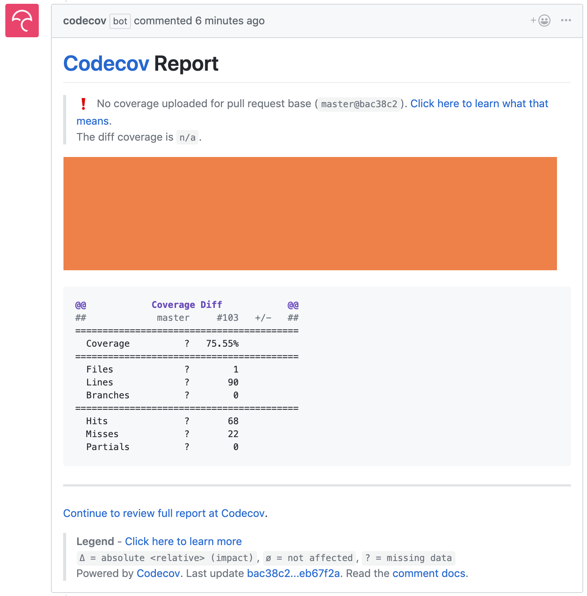

# Extending Jenkins X Pipelines

W> The examples in this chapter work only with serverless Jenkins X. Nevertheless, pipelines defined in build packs use (almost) the same format as those used by serverless Jenkins X. When we create a new quickstart project or import an existing one into static Jenkins X, build pack pipelines are converted into Jenkinsfile. Therefore, even if you are not using serverless Jenkins X, advanced knowledge of writing YAML-based pipelines will help you when you choose to modify build pack pipelines.

So far, we relied mostly on pipelines created for us through build packs. No matter how much effort the community puts into creating build packs, it is almost sure that they will not fulfill all our needs. Every organization has something "special" and that inevitably leads to discrepancies between generic and tailor-made pipelines. So far, we extended our pipelines without knowing much about the syntax. We did not yet explore the benefits additional instructions might provide.

You can think of the subject of this chapter as advanced pipelines, but that would be an overstatement. No matter whether you're using static of serverless pipelines, they are always simple. Or, to be more precise, they should be simple since their goal is not to define complex logic but rather to orchestrate automation defined somewhere else (e.g., scripts). That does not mean that there are no complex pipelines, but rather that those cases often reflect misunderstanding and the desire to solve problems in wrong places.

I> Pipelines are orchestrators of automation and should not contain complex logic.

Now, let's define some objectives.

## What Are We Trying To Do?

It would be silly to explore Jenkins X pipeline syntax in more depth using random and irrelevant examples. Instead, we'll define some real and tangible goals. It does not matter whether they fit your specific needs since the objective is for them to guide us in our effort to learn by producing concrete outcomes.

Our next mission is to add code coverage reports, to ensure that functional tests are executed only after a release rolls out and that we build a version of our application binary for each of the popular operating systems (e.g., Windows, macOS, and Linux). Now, you might think that those goals are useful, or you might feel that they are a waste of time given your context. But, our real objective is not to accomplish those goals. Instead, we are using them as an excuse to learn some additional constructs that might come in handy. They will force us to learn a few new things.

* We'll add names to pipeline steps
* We'll learn how to define multi-line commands
* We'll start using additional environment variables
* We'll define custom agents
* We'll learn how to override pipelines, stages, and steps defined in build packs
* We'll learn how to implement loops

Those are only a fraction of what we could use. But, we need to start somewhere, and we have a set of improvements to our application that we'll be able to implement using the aforementioned concepts. Later on, it'll be up to you to expand your knowledge of pipeline constructs by exploring the other definitions we can use.

You might find those improvements useful as they are, or you might think of them as things you do not need. Both options are OK since the goal is not to show you how to add specific steps like code coverage, but rather to showcase some of the pipeline constructs that we might use in the context of our projects. All in all, focus on the value brought by additional pipeline instructions and not on examples I'll use to demonstrate how those constructs work.

As always, we need a cluster with Jenkins X so that we can experiment with some new concepts and hopefully improve our Jenkins X knowledge.

## Creating A Kubernetes Cluster With Jenkins X And Importing The Application

You can skip this section if you kept the cluster from the previous chapter and it contains **serverless Jenkins X**. Otherwise, we'll need to create a new Jenkins X cluster.

I> All the commands from this chapter are available in the [15-advanced-pipelines.sh](https://gist.github.com/db86e33ed393edc595176787712bcd92) Gist.

For your convenience, the Gists that will create a new Jenkins X cluster or install it inside an existing one are as follows.

* Create a new **GKE** cluster: [gke-jx-serverless.sh](https://gist.github.com/fe18870a015f4acc34d91c106d0d43c8)
* Create a new **EKS** cluster: [eks-jx-serverless.sh](https://gist.github.com/f4a1df244d1852ee250e751c7191f5bd)
* Create a new **AKS** cluster: [aks-jx-serverless.sh](https://gist.github.com/b07f45f6907c2a1c71f45dbe0df8d410)
* Use an **existing** cluster: [install-serverless.sh](https://gist.github.com/7b3b3d90ecd7f343effe4fff5241d037)

I> The commands that follow will reset your *go-demo-6* `master` with the contents of the `extension-model-cd` branch that contains all the changes we did so far. Please execute them only if you are unsure whether you did all the exercises correctly.

```bash
cd go-demo-6

git pull

git checkout extension-tekton

git merge -s ours master --no-edit

git checkout master

git merge extension-tekton

git push

cd ..
```

If you ever restored a branch at the beginning of a chapter, the chances are that there is a reference to my user (`vfarcic`). We'll change that to Google project since that's what Knative will expect to be the location of the container images.

W> Please execute the commands that follow only if you restored a branch at the beginning of a chapter (like in the snippet above). Please note the comments within the snipper that follows.

```bash
cd go-demo-6

# If GKE
export REGISTRY_OWNER=$PROJECT

# If EKS or AKS
# Replace `[...]` with your GitHub user
export REGISTRY_OWNER=[...]

cat charts/go-demo-6/Makefile \
    | sed -e \
    "s@vfarcic@$REGISTRY_OWNER@g" \
    | sed -e \
    "s@devops-26@$REGISTRY_OWNER@g" \
    | tee charts/go-demo-6/Makefile

cat charts/preview/Makefile \
    | sed -e \
    "s@vfarcic@$REGISTRY_OWNER@g" \
    | sed -e \
    "s@devops-26@$REGISTRY_OWNER@g" \
    | tee charts/preview/Makefile

cat skaffold.yaml \
    | sed -e \
    "s@vfarcic@$REGISTRY_OWNER@g" \
    | sed -e \
    "s@devops-26@$REGISTRY_OWNER@g" \
    | tee skaffold.yaml

cd ..
```

I> If you destroyed the cluster at the end of the previous chapter, you'll need to import the *go-demo-6* application again. Please execute the commands that follow only if you created a new cluster specifically for the exercises from this chapter.

```bash
cd go-demo-6

jx import --pack go --batch-mode

cd ..
```

## Naming Steps And Using Multi-Line Commands

Let's take a quick look at the pipeline we have so far.

```bash
cd go-demo-6

cat jenkins-x.yml
```

```yaml
buildPack: go
pipelineConfig:
  pipelines:
    pullRequest:
      build:
        preSteps:
        - command: make unittest
      promote:
        steps:
        - command: ADDRESS=`jx get preview --current 2>&1` make functest
```

We're extending the `go` pipeline defined as a build pack by adding two steps. We're executing unit tests (`make unittest`) before the build steps, and we added functional tests as a step after those pre-defined for the `promote` lifecycle. Both of those steps have issues we might want to fix.

So far, I tried my best to hide a big problem with the execution of functional tests in our pipelines. They are executed after promotion, but there is no guarantee that our application is fully operational before we run the tests. If you create a pull request right now, without modifying the pipeline, you are likely going to experience failure. A pipeline run triggered by the creation of a pull request will fail because the functional tests are executed not when the application in a preview environment is fully up-and-running but after the "deploy" instruction is sent to Kubernetes. As you probably already know, when we execute `kubectl apply`, Kube API responds with the acknowledgment that it received the instruction, not with the confirmation that the actual state converged to the desired one.

There are quite a few ways to ensure that an application is rolled out before we run tests against it. We're using Helm so you might be thinking that `--wait` should be enough. Usually, that would be the correct assumption if we use tiller (Helm server) in the cluster. But, Jenkins X does not use tiller due to security and quite a few other issues. To be more precise, it does not use tiller by default. You'll need to specify `--no-tiller false` argument when installing Jenkins X. If you followed the instructions (Gists) as they are, your cluster does not have it, and Jenkins X uses Helm only to convert charts (templates) into "standard" Kubernetes YAML files. In that case, the simplified version of the deployment process consists of executing `helm template` command followed with `kubectl apply`.

All in all, we do not have tiller (Helm server) unless you customized the installation so we cannot use `--wait` to tell the deployment (promotion) process to exit only after the application rolls out. Instead, we'll go back to basics and inject a step that will execute `kubectl rollout status`. It will serve two purposes. First, it will make the pipeline wait until the application rolls out so that we can run functional tests without the fear that it will fail if the app is not yet fully up-and-running. The second benefit is that the command will fail if rollout times out. If a command fails, pipeline fails as well so we'll receive a notification that the new release could not roll out.

However, the problem is that we cannot merely execute `kubectl rollout status`. We need to know the namespace where our application is deployed, and each preview is deployed in a separate and unique one. Fortunately, namespaces are created using a known pattern, so we will not have a problem figuring it out. And now we're getting to a real issue. We need to execute three commands, the first to figure out the namespace of a preview environment, the second to wait for a few seconds to ensure that the deployment was indeed created by the promotion process, and the third with `kubectl rollout status`. We cannot put them into separate commands because each is a different session in a separate container. If we store the namespace in an environment variable in one step (`command`), that variable would not be available in the next. We could solve that by converting those three commands into one, but that would result in a very long single line instruction that would be very hard to read. We want readable code, don't we?

All that brings us to a new thing we'll learn about pipelines. We'll try to specify a multi-line command.

Before we move on an implement what we just discussed, there is one more problem we'll try to solve. The few custom steps we added to the pipeline consisted only of `command` instructions. They are nameless. If you paid closer attention, you probably noticed that Jenkins X auto-generated meaningless names for the steps we added. It does not have a "crystal ball" to figure out how we'd like to call the step with the `make unittest` command. So, our second improvement will be to add names to our custom steps. Those coming from buildpacks are already named, so we need to worry only for those we add directly to our pipelines.

All in all, we'll add a step with a multi-line command that will make the pipeline wait until the application rolls out, and we'll make sure that all our steps have a name.

Here we go.

We'll create a new branch and replace the content of `jenkins-x.yml` with the command that follows.

I> You'll see `# This is new` and `# This was modified` comments so that it's easier to figure out which parts of the pipeline are new or modified, and which are left unchanged.

W> Some of the lines might be too big, and the process of converting the manuscript into book formats might break them into multiple lines. Please use the Gists listed at the beginning of the chapter as a way to avoid potential problems.

```bash
git checkout -b better-pipeline

echo "buildPack: go
pipelineConfig:
  pipelines:
    pullRequest:
      build:
        preSteps:
        # This was modified
        - name: unit-tests
          command: make unittest
      promote:
        steps:
        # This is new
        - name: rollout
          command: |
            NS=\`echo jx-\$REPO_OWNER-go-demo-6-\$BRANCH_NAME | tr '[:upper:]' '[:lower:]'\`
            sleep 15
            kubectl -n \$NS rollout status deployment preview-preview --timeout 3m
        # This was modified
        - name: functional-tests
          command: ADDRESS=\`jx get preview --current 2>&1\` make functest
" | tee jenkins-x.yml
```

What did we change? We added the `rollout` step that contains a multi-line `command` that defines the namespace where the preview is deployed, sleeps for a while, and waits until the `deployment` is rolled out. All we had to do is specify pipe (`|`) and indent all the lines with the commands.

Since the branch is part of the namespace and it is in upper case (e.g., `PR-27`), the namespace is converted to lower case letters to comply with the standard. The second line of the `rollout` command sleeps for fifteen seconds. The reason for that wait is to ensure that the promotion build initiated by changing the repositories associated with automatic promotion to environments has started. Finally, the third line executes `kubectl rollout status`, thus forcing the pipeline to wait until the app is fully up and running before executing functional tests. Additionally, if the rollout fails, the pipeline will fail as well.

In addition to the new step, we also added a `name` to all the steps we created so far. Now we have `unit-tests`, `rollout`, and `functional-tests`. Please note that you should not use space and "special" characters in names. Even though it is not a requirement, we prefer to have the names using lower case letters and words separated with dashes (`-`). We'll see, later on, what Jenkins X does with those names.

Before we proceed and push the updates to the new branch, we should validate whether our changes to the pipeline comply with the schema.

```bash
jx step syntax validate pipeline
```

Assuming that you did not make a typo, the output should claim that the format of the pipeline was `successfully validated`.

Now we can push the changes to GitHub.

```bash
git add .

git commit -m "rollout status"

git push --set-upstream origin \
    better-pipeline
```

Since all the changes we did so far were related to the `pullRequest` pipeline, so we need to create a PR if we're going to test that everything works as expected.

```bash
jx create pullrequest \
    --title "Better pipeline" \
    --body "What I can say?" \
    --batch-mode
```

Next, we'll explore the activities related to this pull request. We'll do that by limiting the activities for the branch that corresponds with the PR.

W> Please replace `[...]` with `PR-[PR_ID]` (e.g., PR-72). You can extract the ID from the last segment of the pull request address.

```bash
BRANCH=[...] # e.g., PR-72
```

Now we can, finally, take a look at the activities produced with the newly created pull request.

```bash
jx get activities \
    --filter go-demo-6/$BRANCH \
    --watch
```

The output is as follows.

```
...
vfarcic/go-demo-6/PR-103 #1        1m36s 1m28s Succeeded
  from build pack                  1m36s 1m28s Succeeded
    Credential Initializer Qtb2s   1m36s    0s Succeeded
    Working Dir Initializer Tchx7  1m35s    0s Succeeded
    Place Tools                    1m34s    0s Succeeded
    Git Source Vfarcic Go Demo ... 1m33s    1s Succeeded https://github.com/vfarcic/go-demo-6
    Git Merge                      1m32s    2s Succeeded
    Build Unit Tests               1m32s   25s Succeeded
    Build Make Linux               1m32s   27s Succeeded
    Build Container Build          1m31s   30s Succeeded
    Postbuild Post Build           1m31s   31s Succeeded
    Promote Make Preview           1m31s   51s Succeeded
    Promote Jx Preview             1m30s 1m17s Succeeded
    Promote Rollout                1m30s 1m18s Succeeded
    Promote Functional Tests       1m30s 1m22s Succeeded
  Preview                            18s        https://github.com/vfarcic/go-demo-6/pull/103
    Preview Application              18s        http://go-demo-6.jx-vfarcic-go-demo-6-pr-103.35.196.24.179.nip.io
```

You'll notice that now we have a new step `Promote Rollout`. It is a combination of the name of the stage (`promote`) and the `name` of the step we defined earlier. Similarly, you'll notice that our unit and functional tests are now adequately named as well.

Feel free to stop watching the activities by pressing *ctrl+c*.

To be on the safe side, we'll take a quick look at the logs to confirm that the `rollout status` command is indeed executed.

```bash
jx get build logs --current
```

Even though we retrieved `build logs` quite a few times before, this time we used a new argument `--current`. With it, we do not need to specify the repository. Instead, `jx` assumed that the current folder is the repository name.

The output, limited to the relevant section, is as follows.

```
...
Showing logs for build vfarcic-go-demo-6-pr-159-server-1 stage from-build-pack and container step-promote-rollout
deployment "preview-preview" successfully rolled out
...
```

We can see that the pipeline was `Waiting for deployment "preview-preview" rollout to finish` and that the pipeline continued executing only after all three replicas of the application were rolled out. We can also see that the functional tests were executed only after the rollout, thus removing potential failure that could be caused by running tests before the application is fully up-and-running or, even worse, running them against the older release if the new one is still not rolled out.

Now that we saw how to define multi-line commands as well as how to name our steps, we'll explore how to work with environment variables and agents.

## Working With Environment Variables And Agents

Let's say that we want to add code coverage to our pipeline. We could do that through a myriad of tools. However, since the goal is not to teach you how to set up code coverage and how to explore which tool is better, we'll skip the selection process and use [Codecov](https://codecov.io) service. Just keep in mind that I'm not saying that it is better than the others nor that you must use a service for that, but rather that I needed an example to demonstrate a few new pipeline instructions. Codecov seems like the right candidate.

What do we need to do to integrate our pipeline with the Codecov service? If we check their instruction for Go applications, we'll see that we should output code coverage to a text file. Since I'm trying to make the examples as agnostic to programming languages as possible, we'll skip changing Makefile that contains testing targets assuming that you'll read the Codecov instructions later on if you choose to use it. So, instead of telling you to apply specific changes to Makefile, we'll download a Gist I prepared.

```bash
curl -o Makefile \
    https://gist.githubusercontent.com/vfarcic/313bedd36e863249cb01af1f459139c7/raw
```

Now that we put Go internals out of the way, there are a few other things we need to do. We need to run [a script](https://codecov.io/bash) provided by Codecov. That script expects a token that will authenticate us. So, we need three things. We need a container image with the script, an environment variable with the token, and a pipeline step that will execute the script that will send the code coverage results to Codecov.

Let's start by retrieving a Codecov token for our *go-demo-6* repository.

```bash
open "https://codecov.io/"
```

I will skip giving you instructions on how to add your *go-demo-6* fork into Codecov. I'm sure that you will be able to sign up and follow the instructions provided on the site. Optionally, you can install their GitHub App (the message will appear at the top). What matter the most is the token you'll receive once you add the fork of the *go-demo-6* repository to Codecov.

W> Please replace `[...]` with the Codecov token for the *go-demo-6* repository.

```bash
CODECOV_TOKEN=[...]
```

There are a few ways we can provide the info Codecov needs to calculate code coverage. We'll use a Shell script they provide. To make things simple, I already created a container image that contains the script. It is a straightforward one, and you can explore Dockerfile used to create the image from the [vfarcic/codecov](https://github.com/vfarcic/codecov) repository.

```bash
open "https://github.com/vfarcic/codecov"
```

Open Dockerfile, and you'll see that the definition is as follows.

```
FROM alpine:3.9

RUN apk update && apk add bash curl git
RUN curl -o /usr/local/bin/codecov.sh https://codecov.io/bash
RUN chmod +x /usr/local/bin/codecov.sh
```

I already created a public image `vfarcic/codecov` based on that definition, so there is no action on your part. We can start using it right away.

So, what do we need to integrate Codecov with our pipeline? We need to define the environment variable `CODECOV_TOKEN` required by the `codecov.sh` script. We'll also need to add a new step that will execute that script. We already know how to add steps, but this time there is a twist. We need to make sure that the new step is executed inside a container created from `vfarcic/codecov` image converted into a pipeline agent.

All in all, we need to figure out how to define environment variables as well as to define an agent based on a custom container image.

Please execute the command that follows to create the full pipeline that contains the necessary changes.

```bash
echo "buildPack: go
pipelineConfig:
  # This is new
  env:
  - name: CODECOV_TOKEN
    value: \"$CODECOV_TOKEN\"
  pipelines:
    pullRequest:
      build:
        preSteps:
        - name: unit-tests
          command: make unittest
        # This is new
        - name: code-coverage
          command: codecov.sh
          agent:
            image: vfarcic/codecov
      promote:
        steps:
        - name: rollout
          command: |
            NS=\`echo jx-\$REPO_OWNER-go-demo-6-\$BRANCH_NAME | tr '[:upper:]' '[:lower:]'\`
            sleep 15
            kubectl -n \$NS rollout status deployment preview-preview --timeout 3m
        - name: functional-tests
          command: ADDRESS=\`jx get preview --current 2>&1\` make functest
" | tee jenkins-x.yml
```

Near the top of the pipeline is the `env` section that, in this case, defines a single variable `CODECOV_TOKEN`. We could have moved the `env` definition inside a pipeline, stage, or a step to limit its scope. As it is now, it will be available in all the steps of the pipeline.

We added a new step `code-coverage` inside the `pullRequest` pipeline. What makes it "special" is the `agent` section with the `image` set to `vfarcic/codecov`. As a result, that step will be executed inside a container based on that image. Just as with `env`, we could have defined `agent` in `pipelineConfig`, and then all the steps in all the pipelines would run in containers based on that image. Or we could have defined it on the level of a single pipeline or a stage.

All in all, for the sake of diversity, we defined an environment variable available in all the steps, and an agent that will be used in a single step.

Before we proceed, we'll check whether the syntax of the updated pipeline is correct.

```bash
jx step syntax validate pipeline
```

Next, we'll push the changes to GitHub and watch the activity that will be initiated by it.

```bash
git add .

git commit -m "Code coverage"

git push

jx get activities \
    --filter go-demo-6/$BRANCH \
    --watch
```

After the unit tests are executed, we should see the `Code Coverage` step of the `build` stage/lifecycle change the status to `succeeded`.

Feel free to cancel the watcher by pressing *ctrl+c*.

To be on the safe side, we'll take a quick look at the logs and confirm that Codecov script was indeed executed correctly.

```bash
jx get build logs --current
```

The output, limited to the relevant parts, is as follows (you might need to scroll through your output to find it).

```
...

  _____          _
 / ____|        | |
| |     ___   __| | ___  ___ _____   __
| |    / _ \ / _` |/ _ \/ __/ _ \ \ / /
| |___| (_) | (_| |  __/ (_| (_) \ V /
 \_____\___/ \__,_|\___|\___\___/ \_/
                              Bash-8a28df4
...
==> Python coveragepy not found
==> Searching for coverage reports in:
    + .
    -> Found 1 reports
==> Detecting git/mercurial file structure
==> Reading reports
    + ./coverage.txt bytes=1289
==> Appending adjustments
    http://docs.codecov.io/docs/fixing-reports
    + Found adjustments
==> Gzipping contents
==> Uploading reports
    url: https://codecov.io
    query: branch=master&commit=eb67f2a869f16ce1a02d4903f6eec0af124300dc&build=&build_url=&name=&tag=&slug=vfarcic%2Fgo-demo-6&service=&flags=&pr=&job=
    -> Pinging Codecov
https://codecov.io/upload/v4?package=bash-8a28df4&token=4384f439-9da1-4be3-af60-ee80aed67bc8&branch=master&commit=eb67f2a869f16ce1a02d4903f6eec0af124300dc&build=&build_url=&name=&tag=&slug=vfarcic%2Fgo-demo-6&service=&flags=&pr=&job=
    -> Uploading
    -> View reports at https://codecov.io/github/vfarcic/go-demo-6/commit/eb67f2a869f16ce1a02d4903f6eec0af124300dc
...
```

As you can see, the coverage report was uploaded to Codecov for evaluation, and we got a link where we can see the result. Feel free to visit it. We won't be using it in the exercises since there is a better way to see the results. I'll explain it soon. For now, there is an important issue we need to fix.

We added the Codecov token directly to the pipeline. As you can imagine, that is very insecure. There must be a way to provide the token without storing it in Git. Fortunately, Jenkins X pipelines have a solution. We can define an environment variable that will get the value from a Kubernetes secret. So, our next step is to create the secret.

```bash
kubectl create secret \
    generic codecov \
    --from-literal=token=$CODECOV_TOKEN
```

Now we can update the pipeline. Please execute the command that follows.

```bash
echo "buildPack: go
pipelineConfig:
  env:
  # This was modified
  - name: CODECOV_TOKEN
    valueFrom:
      secretKeyRef:
        key: token
        name: codecov
  pipelines:
    pullRequest:
      build:
        preSteps:
        - name: unit-tests
          command: make unittest
        - name: code-coverage
          command: codecov.sh
          agent:
            image: vfarcic/codecov
      promote:
        steps:
        - name: rollout
          command: |
            NS=\`echo jx-\$REPO_OWNER-go-demo-6-\$BRANCH_NAME | tr '[:upper:]' '[:lower:]'\`
            sleep 15
            kubectl -n \$NS rollout status deployment preview-preview --timeout 3m
        - name: functional-tests
          command: ADDRESS=\`jx get preview --current 2>&1\` make functest
" | tee jenkins-x.yml
```

This time, instead of creating an `env` with a `value`, we used `valuefrom` with reference to the Kubernetes secret `codecov` and the key `token`.

Let's see whether our updated pipeline works correctly.

```bash
jx step syntax validate pipeline

git add .

git commit -m "Code coverage secret"

git push

jx get activities \
    --filter go-demo-6/$BRANCH \
    --watch
```

We validated the pipeline syntax, pushed the change to GitHub, and started watching the activities related to the pull request. The output should be the same as before since we did not change any of the steps. What matters is that all the steps of the newly executed activity should be successful.

Please stop watching the activity by pressing *ctrl+c*.

Now that we are securely calculating code coverage, we can take a look at the pull request. If the integration was successful, we should see Codecov entries.

Please click on the `Preview` link from the last activity to open the pull request in your favorite browser.

You should see a comment in the pull request similar to the screenshot that follows.



Don't be alarmed by the warning (if you see it). Codecov could not compare pull request coverage with the one from the master branch because we did not yet marge anything to master since we started using Codecov. That'll be fixed by itself when we merge with PR.

Additionally, you should see Codecov activity in the "checks" section of the pull request.

Since delaying is not a good practice, let's merge the pull request right away. That way we'll give Codecov something to compare future pull request coverage. The next challenge will require that we work with the master branch anyway.

Please click *Merge pull request* followed by the *Confirm merge* button. Click the *Delete branch* button.

All that's left, before we move on, is to check out the master branch locally, to pull the latest version of the code from GitHub, and to delete the local copy of the `better-pipeline` branch.

```bash
git checkout master

git pull

git branch -d better-pipeline
```

Off we go to the next challenge.

## Overriding Pipelines, Stages, And Steps And Implementing Loops

Our pipeline is currently building a Linux binary of our application before adding it to a container image. But what if we'd like to distribute the application also as executables for different operating systems? We could provide that same binary, but that would work only for Linux users since that is the architecture it is currently built for. We might want to extend the reach to Windows and macOS users as well, and that would mean that we'd need to build two additional binaries. How could we do that?

Since our pipeline is already building a Linux executable through a step inherited from the build pack, we can add two additional steps that would build for the other two operating systems. But that approach would result in *go-demo-6* binary for Linux, and our new steps would, let's say, build *go-demo-6_Windows* and *go-demo-6_darwin*. That, however, would result in "strange" naming. In that context, it would make much more sense to have *go-demo-6_linux* instead of *go-demo-6*. We could add yet another step that would rename it, but then we'd be adding unnecessary complexity to the pipeline that would make those reading it wonder what we're doing. We could build the Linux executable again, but that would result in duplication of the steps.

What might be a better solution is to remove the build step inherited from the build pack and add those that build the three binaries in its place. That would be a more optimum solution. One step removed, and three steps added. But those steps would be almost the same. The only difference would be an argument that defines each OS. We can do better than repeating almost the same step. Instead of having three steps, one for building a binary for each operating system, we'll create a loop that will iterate through values that represent operating systems and execute a step that builds the correct binary.

All that might be too much to swallow at once, so we'll break it into two tasks. First, we'll try to figure out how to remove a step from the inherited build pack pipeline. If we're successful, we'll put the loop of steps in its place.

Let's get going.

We can use the `overrides` instruction to remove or replace any inherited element. We'll start with the simplest version of the instruction and improve it over time.

Please execute the command that follows to create a new version of `jenkins-x.yml`.

```bash
echo "buildPack: go
pipelineConfig:
  env:
  - name: CODECOV_TOKEN
    valueFrom:
      secretKeyRef:
        key: token
        name: codecov
  pipelines:
    pullRequest:
      build:
        preSteps:
        - name: unit-tests
          command: make unittest
        - name: code-coverage
          command: codecov.sh
          agent:
            image: vfarcic/codecov
      promote:
        steps:
        - name: rollout
          command: |
            NS=\`echo jx-\$REPO_OWNER-go-demo-6-\$BRANCH_NAME | tr '[:upper:]' '[:lower:]'\`
            sleep 15
            kubectl -n \$NS rollout status deployment preview-preview --timeout 3m
        - name: functional-tests
          command: ADDRESS=\`jx get preview --current 2>&1\` make functest
    # This is new
    overrides:
    - pipeline: release
" | tee jenkins-x.yml
```

All we did was to add two lines at the end of the pipeline. We specified that we want to override the `release` pipeline.

Just as with the previous examples, we'll validate the syntax, push the changes to GitHub, and observe the result by watching the activities.

```bash
jx step syntax validate pipeline

git add .

git commit -m "Multi-architecture"

git push

jx get activities \
    --filter go-demo-6/master \
    --watch
```

The output of the last command, limited to the relevant parts, is as follows.

```
...
vfarcic/go-demo-6/master #3                        36s 30s Succeeded 
  meta pipeline                                    36s 20s Succeeded 
    Credential Initializer Bsggw                   36s  0s Succeeded 
    Working Dir Initializer 5n6mx                  36s  1s Succeeded 
    Place Tools                                    35s  1s Succeeded 
    Git Source Meta Vfarcic Go Demo 6 Master R ... 34s  5s Succeeded https://github.com/vfarcic/go-demo-6.git
    Git Merge                                      29s  1s Succeeded 
    Merge Pull Refs                                28s  1s Succeeded 
    Create Effective Pipeline                      27s  3s Succeeded 
    Create Tekton Crds                             24s  8s Succeeded 
  from build pack                                  14s  8s Succeeded 
    Credential Initializer Fw774                   14s  0s Succeeded 
    Working Dir Initializer S7292                  14s  1s Succeeded 
    Place Tools                                    13s  1s Succeeded 
    Git Source Vfarcic Go Demo 6 Master Releas ... 12s  5s Succeeded https://github.com/vfarcic/go-demo-6.git
    Git Merge                                       7s  1s Succeeded 
    Setup Jx Git Credentials                        6s  0s Succeeded 
```

Judging from the output of the latest activity, the number of steps dropped drastically. That's the expected behavior since we told Jenkins X to override the release pipeline with "nothing". We did not specify replacement steps that should be executed instead of those inherited from the build pack. So, the only steps executed are those related to Git since they are universal and not tied to any specific pipeline.

Please press *ctrl+c* to stop watching the activities.

In our case, overriding the whole `release` pipeline might be too much. We do not have a problem with all of the inherited steps, but only with the `build` stage inside the `release` pipeline. So, we'll override only that one.

Since we are about to modify the pipeline yet again, we might want to add the `rollout` command to the `release` pipeline as well. It'll notify us if a release cannot be rolled out.

Off we go.

```bash
echo "buildPack: go
pipelineConfig:
  env:
  - name: CODECOV_TOKEN
    valueFrom:
      secretKeyRef:
        key: token
        name: codecov
  pipelines:
    pullRequest:
      build:
        preSteps:
        - name: unit-tests
          command: make unittest
        - name: code-coverage
          command: codecov.sh
          agent:
            image: vfarcic/codecov
      promote:
        steps:
        - name: rollout
          command: |
            NS=\`echo jx-\$REPO_OWNER-go-demo-6-\$BRANCH_NAME | tr '[:upper:]' '[:lower:]'\`
            sleep 15
            kubectl -n \$NS rollout status deployment preview-preview --timeout 3m
        - name: functional-tests
          command: ADDRESS=\`jx get preview --current 2>&1\` make functest
    overrides:
    - pipeline: release
      # This is new
      stage: build
    # This is new
    release:
      promote:
        steps:
        - name: rollout
          command: |
            sleep 30
            kubectl -n jx-staging rollout status deployment jx-go-demo-6 --timeout 3m
" | tee jenkins-x.yml
```

We added the `stage: build` instruction to the existing override of the `release` pipeline. We also added the `rollout` command as yet another step in the `promote` stage of the `release` pipeline.

You probably know what comes next. We'll validate the pipeline syntax, push the changes to GitHub, and observe the activities hoping that they will tell us whether the change was successful or not.

```bash
jx step syntax validate pipeline

git add .

git commit -m "Multi-architecture"

git push

jx get activities \
    --filter go-demo-6/master \
    --watch
```

The output, limited to the latest build, is as follows.

```
...
vfarcic/go-demo-6/master #5                        3m46s 2m45s Succeeded Version: 1.0.446
  meta pipeline                                    3m46s   21s Succeeded 
    Credential Initializer L6kh9                   3m46s    0s Succeeded 
    Working Dir Initializer Khkf6                  3m46s    0s Succeeded 
    Place Tools                                    3m46s    1s Succeeded 
    Git Source Meta Vfarcic Go Demo 6 Master R ... 3m45s    5s Succeeded https://github.com/vfarcic/go-demo-6.git
    Git Merge                                      3m40s    1s Succeeded 
    Merge Pull Refs                                3m39s    0s Succeeded 
    Create Effective Pipeline                      3m39s    4s Succeeded 
    Create Tekton Crds                             3m35s   10s Succeeded 
  from build pack                                  3m23s 2m22s Succeeded 
    Credential Initializer 5cw8t                   3m23s    0s Succeeded 
    Working Dir Initializer D99p2                  3m23s    1s Succeeded 
    Place Tools                                    3m22s    1s Succeeded 
    Git Source Vfarcic Go Demo 6 Master Releas ... 3m21s    6s Succeeded https://github.com/vfarcic/go-demo-6.git
    Git Merge                                      3m15s    0s Succeeded 
    Setup Jx Git Credentials                       3m15s    0s Succeeded 
    Promote Changelog                              3m15s    8s Succeeded 
    Promote Helm Release                            3m7s   18s Succeeded 
    Promote Jx Promote                             2m49s 1m32s Succeeded 
    Promote Rollout                                1m17s   16s Succeeded 
  Promote: staging                                 2m43s 1m26s Succeeded 
    PullRequest                                    2m43s 1m26s Succeeded  PullRequest: ...
    Update                                         1m17s    0s Succeeded 
    Promoted                                       1m17s    0s Succeeded  Application ...
```

The first thing we can note is that the number of steps in the activity is closer to what we're used to. Now that we are not overriding the whole pipeline but only the `build` stage, almost all the steps inherited from the build pack are there. Only those related to the `build` stage are gone, simply because we limited the scope of the `overrides` instruction.

Another notable difference is that the `Promote Rollout` step took too long to execute until it eventually `failed`. That's also to be expected. We removed all the steps from the `build` stage, so our binary was not created, and the container image was not built. Jenkins X did execute `promote` steps that are deploying the new release, but Kubernetes is bound to fail to pull the new image.

That demonstrated the importance of executing `rollout`, no matter whether we run tests afterward. Without it, the pipeline would finish successfully since we are not running tests against the staging environment. Before we added the `rollout` step, the promotion was the last action executed as part of the pipeline.

Please stop watching the activities by pressing *ctrl+c*.

We are getting closer to our goal. We just need to figure out how to override a specific step with the new one that will build binaries for all operating systems. But, how are we going to override a particular step if we do not know which one it is? We could find all the steps of the pipeline by visiting the repositories that host build packs. But that would be tedious. We'd need to go to a few repositories, check the source code of the related pipelines, and combine the result with the one we're rewriting right now. There must be a better way to get an insight into the pipeline related to *go-demo-6*.

Before we move on and try to figure out how to retrieve the full definition of the pipeline, we'll revert the current version to the state before we started "playing" with `overrides`. You'll see the reason for such a revert soon.

```bash
echo "buildPack: go
pipelineConfig:
  env:
  - name: CODECOV_TOKEN
    valueFrom:
      secretKeyRef:
        key: token
        name: codecov
  pipelines:
    pullRequest:
      build:
        preSteps:
        - name: unit-tests
          command: make unittest
        - name: code-coverage
          command: codecov.sh
          agent:
            image: vfarcic/codecov
      promote:
        steps:
        - name: rollout
          command: |
            NS=\`echo jx-\$REPO_OWNER-go-demo-6-\$BRANCH_NAME | tr '[:upper:]' '[:lower:]'\`
            sleep 15
            kubectl -n \$NS rollout status deployment preview-preview --timeout 3m
        - name: functional-tests
          command: ADDRESS=\`jx get preview --current 2>&1\` make functest
    # Removed overrides
    release:
      promote:
        steps:
        - name: rollout
          command: |
            sleep 30
            kubectl -n jx-staging rollout status deployment jx-go-demo-6 --timeout 3m
" | tee jenkins-x.yml
```

Now that we are back to where we were before we discovered `overrides`, we can learn about yet another command.

```bash
jx step syntax effective
```

The output is the "effective" version of our pipeline. You can think of it as a merge of our pipeline combined with those it extends (e.g., from build packs). It is the same final version of the YAML pipeline Jenkins X would use as a blueprint for creating Tekton resources.

The reason we're outputting the effective pipeline lies in our need to find the name of the step currently used to build the Linux binary of the application. If we find its name, we will be able to override it.

The output, limited to the relevant parts, is as follows.

```yaml
buildPack: go
pipelineConfig:
  ...
  pipelines:
    ...
    release:
      pipeline:
        ...
        stages:
        - agent:
            image: go
          name: from-build-pack
          steps:
          ...
          - command: make build
            dir: /workspace/source
            image: go
            name: build-make-build
          ...
```

We know that the step we're looking for is somewhere inside the `release` pipeline, so that should limit the scope. If we take a look at the steps inside, we can see that one of them executes the command `make build`. That's the one we should remove or, to be more precise, override.

You'll notice that the names of the steps are different in the effective version of the pipeline. For example, the `rollout` step we created earlier is now called `promote-rollout`. In the effective version of the pipelines, the step names are always prefixed with the stage. As a result, when we see the activities retrieved from Tekton pipeline runs, we see the two (stage and step) combined.

There's one more explanation I promised to deliver. Why did we revert the pipeline to the version before we added overrides? If we didn't, we would not find the step we were looking for. The whole `build` stage from the `release` pipeline would be gone since we had it overridden to nothing.

Now, let's get back to our mission. We know that the step we want to override in the effective version of the pipeline is named `build-make-build`. Since we know that the names are prefixed with the stage, we can deduce that the stage is `build` and the name of the step is `make-build`.

Now that it's clear what to override, let's talk about loops.

We can tell Jenkins X to loop between values and execute a step or a set of steps in each iteration. An example syntax could be as follows.

```yaml
- loop:
    variable: COLOR
    values:
    - yellow
    - red
    - blue
    - purple
    - green
    steps:
    - command: echo "The color is $COLOR"
```

If we'd have that loop inside our pipeline, it would execute a single step five time, once for each of the `values` of the `loop`. What we put inside the `steps` section is up to us, and the only important thing to note is that `steps` in the `loop` use the same syntax as the `steps` anywhere else (e.g., in one of the stages).

Now, let's see whether we can combine `overrides` with `loop` to accomplish our goal of building a binary for each of the "big" three operating systems.

Please execute the command that follows to update `jenkins-x.yml` with the new version of the pipeline.

```bash
echo "buildPack: go
pipelineConfig:
  env:
  - name: CODECOV_TOKEN
    valueFrom:
      secretKeyRef:
        key: token
        name: codecov
  pipelines:
    pullRequest:
      build:
        preSteps:
        - name: unit-tests
          command: make unittest
        - name: code-coverage
          command: codecov.sh
          agent:
            image: vfarcic/codecov
      promote:
        steps:
        - name: rollout
          command: |
            NS=\`echo jx-\$REPO_OWNER-go-demo-6-\$BRANCH_NAME | tr '[:upper:]' '[:lower:]'\`
            sleep 30
            kubectl -n \$NS rollout status deployment preview-preview --timeout 3m
        - name: functional-tests
          command: ADDRESS=\`jx get preview --current 2>&1\` make functest
    overrides:
    - pipeline: release
      # This is new
      stage: build
      name: make-build
      steps:
      - loop:
          variable: GOOS
          values:
          - darwin
          - linux
          - windows
          steps:
          - name: build
            command: CGO_ENABLED=0 GOOS=\${GOOS} GOARCH=amd64 go build -o bin/go-demo-6_\${GOOS} main.go
    release:
      promote:
        steps:
        - name: rollout
          command: |
            sleep 15
            kubectl -n jx-staging rollout status deployment jx-go-demo-6 --timeout 3m
" | tee jenkins-x.yml
```

This time we are overriding the step `make-build` in the `build` stage of the `release` pipeline. The "old" step will be replaced with a `loop` that iterates over the values that represent operating systems. Each iteration of the loop contains the `GOOS` variable with a different value and executes the `command` that uses it to customize how we build the binary. The end result should be *go-demo-6_* executable with the unique suffix that tells us where it is meant to be used (e.g., `linux`, `darwin`, or `windows`)s.

I> If you're new to Go, the compiler uses environment variable `GOOS` to determine the target operating system for a build.

Next, we'll validate the pipeline and confirm that we did not introduce a typo incompatible with the supported syntax.

```bash
jx step syntax validate pipeline
```

There's one more thing we should fix. In the past, our pipeline was building the *go-demo-6* binary, and now we changed that to *go-demo-6_linux*, *go-demo-6_darwin*, and *go-demo-6_windows*. Intuition would tell us that we might need to change the reference to the new binary in Dockerfile, so let's take a quick look at it.

```bash
cat Dockerfile
```

The output is as follows.

```
FROM scratch
EXPOSE 8080
ENTRYPOINT ["/go-demo-6"]
COPY ./bin/ /
```

The last line will copy all the files from the `bin/` directory. That would introduce at least two problems. First of all, there is no need to have all three binaries inside container images we're building. That would make them bigger for no good reason. The second issue with the way binaries are copied is the `ENTRYPOINT`. It expects `/go-demo-6`, instead of `go-demo-6_linux` that we are building now. Fortunately, the fix to both of the issues is straightforward. We can change the Dockerfile `COPY` instruction so that only `go-demo-6_linux` is copied and that it is renamed to `go-demo-6` during the process. That will help us avoid copying unnecessary files and will still fulfill the `ENTRYPOINT` requirement.

```bash
cat Dockerfile \
    | sed -e \
    's@/bin/ /@/bin/go-demo-6_linux /go-demo-6@g' \
    | tee Dockerfile
```

Now we're ready to push the change to GitHub and observe the new activity that will be triggered by that action.

```bash
git add .

git commit -m "Multi-architecture"

git push

jx get activities \
    --filter go-demo-6/master \
    --watch
```

The output, limited to the latest build, is as follows.

```
...
vfarcic/go-demo-6/master #6                        5m32s 5m18s Succeeded Version: 1.0.447
  meta pipeline                                    5m32s   24s Succeeded 
    Credential Initializer Pg5cf                   5m32s    0s Succeeded 
    Working Dir Initializer Lzpdb                  5m32s    2s Succeeded 
    Place Tools                                    5m30s    1s Succeeded 
    Git Source Meta Vfarcic Go Demo 6 Master R ... 5m29s    4s Succeeded https://github.com/vfarcic/go-demo-6.git
    Git Merge                                      5m25s    1s Succeeded 
    Merge Pull Refs                                5m24s    0s Succeeded 
    Create Effective Pipeline                      5m24s    4s Succeeded 
    Create Tekton Crds                             5m20s   12s Succeeded 
  from build pack                                   5m6s 4m52s Succeeded 
    Credential Initializer P5wrz                    5m6s    0s Succeeded 
    Working Dir Initializer Frrq2                   5m6s    0s Succeeded 
    Place Tools                                     5m6s    1s Succeeded 
    Git Source Vfarcic Go Demo 6 Master Releas ...  5m5s    9s Succeeded https://github.com/vfarcic/go-demo-6.git
    Git Merge                                      4m56s    1s Succeeded 
    Setup Jx Git Credentials                       4m55s    0s Succeeded 
    Build1                                         4m55s   42s Succeeded 
    Build2                                         4m13s   16s Succeeded 
    Build3                                         3m57s   33s Succeeded 
    Build Container Build                          3m24s    5s Succeeded 
    Build Post Build                               3m19s    0s Succeeded 
    Promote Changelog                              3m19s    7s Succeeded 
    Promote Helm Release                           3m12s   16s Succeeded 
    Promote Jx Promote                             2m56s 1m31s Succeeded 
    Promote Rollout                                1m25s 1m11s Succeeded 
  Promote: staging                                 2m50s 1m25s Succeeded 
    PullRequest                                    2m50s 1m24s Succeeded  PullRequest: ...f157af83f254d90df5e9b0c4bb8ddb81e1016871
    Update                                         1m25s    0s Succeeded 
    Promoted                                       1m25s    0s Succeeded  Application is at: ...
```

We can make a few observations. The `Build Make Build` step is now gone, so the override worked correctly. We have `Build1`, `Build2`, and `Build3` in its place. Those are the three steps created as a result of having the loop with three iterations. Those are the steps that are building `windows`, `linux`, and `darwin` binaries. Finally, we can observe that the `Promote Rollout` step is now shown as `succeeded`, thus providing a clear indication that the new building process (steps) worked correctly. Otherwise, the new release could not roll out, and that step would fail.

Please stop watching the activities by pressing *ctrl+c*.

Before we move on, I must confess that I would not make the same implementation as the one we just explored. I'd rather change the `build` target in Makefile. That way, there would be no need for any change to the pipeline. The build pack step would continue building by executing that Makefile target so there would be no need to override anything, and there would certainly be no need for a loop. Now, before you start throwing stones at me, I must also state that `overrides` and `loop` can come in handy in some other scenarios. I had to come up with an example that would introduce you to `overrides` and `loop`, and that ended up being the need to cross-compile binaries, even if it could be accomplished in an easier and a better way. Remember, the "real" goal was to learn those constructs, and not how to cross-compile with Go.

## Pipelines Without Buildpacks

While the idea behind build packs is to cover a wide range of use cases, we might easily be in a situation when what we want to accomplish is fundamentally different from any of the build packs. In such cases, it probably does not make sense to have a pipeline based on a build pack. Instead, we can tell Jenkins X that our pipeline is not based on any build pack.

Please execute the command that follows to create a pipeline without a build pack.

```bash
echo "buildPack: none
pipelineConfig:
  pipelines:
    release:
      pipeline:
        agent:
          image: go
        stages:
        - name: nothing
          steps:
          - name: silly
            command: echo \"This is a silly pipeline\"" \
    | tee jenkins-x.yml
```

In this context, the only line that matters is the first one that instructs Jenkins X not to use any `buildPack` by setting the value to `none`. The rest of the pipeline contains a silly example with constructs that we already explored.

Now, let's push the change and confirm that none of the build packs is used by observing the activities.

```bash
git add .

git commit -m "Without buildpack"

git push

jx get activities \
    --filter go-demo-6/master \
    --watch
```

The output of the last command, limited to the newest activity, is as follows.

```
...
vfarcic/go-demo-6/master #7                        34s 28s Succeeded 
  meta pipeline                                    34s 20s Succeeded 
    Credential Initializer Jnghb                   34s  0s Succeeded 
    Working Dir Initializer H4bg2                  34s  1s Succeeded 
    Place Tools                                    33s  1s Succeeded 
    Git Source Meta Vfarcic Go Demo 6 Master R ... 32s  5s Succeeded https://github.com/vfarcic/go-demo-6.git
    Git Merge                                      27s  1s Succeeded 
    Merge Pull Refs                                26s  1s Succeeded 
    Create Effective Pipeline                      25s  3s Succeeded 
    Create Tekton Crds                             22s  8s Succeeded 
  nothing                                          13s  7s Succeeded 
    Credential Initializer 26fg8                   13s  0s Succeeded 
    Working Dir Initializer Fz7zz                  13s  1s Succeeded 
    Place Tools                                    12s  1s Succeeded 
    Git Source Vfarcic Go Demo 6 Master Releas ... 11s  4s Succeeded https://github.com/vfarcic/go-demo-6.git
    Git Merge                                       7s  1s Succeeded 
    Silly                                           6s  0s Succeeded 
```

We can see that all the steps we normally get from a build pack are gone. We are left only with the generic Git-related steps and the `silly` one we defined in our pipeline.

Please stop watching the activities by pressing *ctrl+c*.

## Exploring The Syntax Schema

I bet that you wondered how I knew that there are instructions like `overrides` and `loop`? I could have consulted the documentation in [jenkins-x.io](http://jenkins-x.io), but it is not always up-to-date. I could have consulted the code. As a matter of fact, most of what I know about pipelines comes from reviewing the code of the project. I did that not only because I like reading code, but also because that was the only reliable way to find out all the instructions we can specify. Fortunately, things got a bit simpler since then, and the community added the means to consult the full syntax schema with a single command.

```bash
jx step syntax schema
```

The output is too long to be presented in a book, so I'll choose a single construct (`loop`) and show only the output related to it.

```json
{
  "$schema": "http://json-schema.org/draft-04/schema#",
  "$ref": "#/definitions/ProjectConfig",
  "definitions": {
    ...
    "Loop": {
      "properties": {
        "steps": {
          "items": {
            "$ref": "#/definitions/Step"
          },
          "type": "array"
        },
        "values": {
          "items": {
            "type": "string"
          },
          "type": "array"
        },
        "variable": {
          "type": "string"
        }
      },
      "additionalProperties": false,
      "type": "object"
    },
    ...
    "Step": {
      "properties": {
        ...
        "loop": {
          "$schema": "http://json-schema.org/draft-04/schema#",
          "$ref": "#/definitions/Loop"
        },
        ...
```

We can see that `Loop` is one of the definitions and that it can contain `steps`, `values`, and `variables`. The array of steps includes a reference to the `Step` definition. If we scroll down to that definition, we can see that, among others, it can have a loop inside. All in all, a step can contain a loop, and a loop can include steps inside it.

We won't go into all the definitions we can use inside pipelines. That would be too much and could easily fill an entire book alone. We will probably explore a couple of other schema definitions, and it's up to you to go through those we'll skip. For now, I'll use this opportunity to introduce you to a few other potentially useful commands.

We can add `--buildpack` argument if we want to find out the schema that is used with build pack pipelines.

```bash
jx step syntax schema --buildpack
```

Application pipeline and build pack schemas are very similar, but there are still a few differences. Use one schema or the other depending on whether you're planning to modify pipeline of your application or of a build pack.

Since we are talking about build packs, it's worth noting that we can validate those already used by our cluster with the command that follows.

```bash
jx step syntax validate buildpacks
```

If all the build packs are valid, we'll see the `SUCCESS` status in the output of each.

## What Now?

If you are using static Jenkins X, you should consider relying on build packs as much as possible. Serverless Jenkins X is the future, and most of the effort (new features, bug fixes, etc.) will be focused around it. On the other hand, static Jenkins X is in "maintenance mode". That does not mean that you should use it. There are quite a few reasons why static Jenkins X might be a better option for you. We won't go into those reasons now. I am mentioning all this because you will move to serverless Jenkins X at some point and you do not want to spend your precious time rewriting your Jenkinsfiles into the jenkins-x.yml format. If most of your pipelines is in build packs, you can easily switch from static to serverless Jenkins X. All you'd have to do is re-import your project and let Jenkins X convert the pipeline into the correct format.

I> We explored only a fraction of the Jenkins X pipeline syntax. Please consult [Jenkins X Pipeline Syntax Reference](https://jenkins-x.io/architecture/pipeline-syntax-reference/) for more info.

Before we leave, we'll restore the master to the `extension-model-cd`. Our jenkins-x.yml became too big for future examples so we'll go back to the much simpler one we had at the beginning of this chapter. I will assume that you understood the constructs we used and that you will extend that knowledge by exploring the pipeline schema. If we'd keep adding everything we learn to our *go-demo-6* pipeline, we'd soon need multiple pages only to list jenkins-x.yml content.

```bash
git checkout extension-tekton

git merge -s ours master --no-edit

git checkout master

git merge extension-tekton

git push
```

Now you need to decide whether to continue using the cluster or to destroy it. If you choose to destroy it or to uninstall Jenkins X, you'll find the instructions at the bottom of the Gist you chose at the beginning of this chapter.

If you destroyed the cluster or you uninstalled Jenkins X, please remove the repositories and the local files we created. You can use the commands that follow for that.

W> Please replace `[...]` with your GitHub user before executing the commands that follow.

```bash
cd ..

GH_USER=[...]

hub delete -y \
  $GH_USER/environment-jx-rocks-staging

hub delete -y \
  $GH_USER/environment-jx-rocks-production

rm -rf ~/.jx/environments/$GH_USER/environment-jx-rocks-*
```
