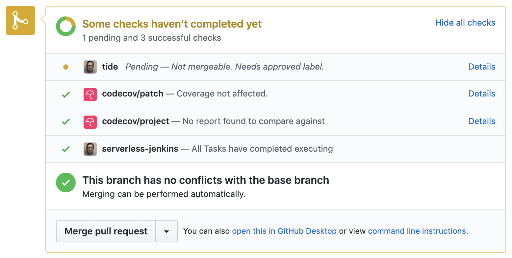

## TODO

- [X] Code
- [ ] Write
- [-] Code review static GKE
- [X] Code review serverless GKE
- [-] Code review static EKS
- [ ] Code review serverless EKS
- [-] Code review static AKS
- [ ] Code review serverless AKS
- [-] Code review existing static cluster
- [ ] Code review existing serverless cluster
- [ ] Text review
- [ ] Gist
- [ ] Review titles
- [ ] Proofread
- [ ] Diagrams
- [ ] Add to slides
- [ ] Publish on TechnologyConversations.com
- [ ] Add to Book.txt
- [ ] Publish on LeanPub.com

# Extending Jenkins X Pipelines

W> The examples in this chapter work only with serverless Jenkins X. Nevertheless, pipelines defined in buildpacks use (almost) the same format as those used by serverless Jenkins X. When we create a new quickstart project or import an existing one into static Jenkins X, buildpack pipelines are converted into Jenkinsfile. Therefore, even if you are not using serveless Jenkins X, advanced knowledge of writing YAML-based pipelines will help you when you choose to modify buildpack pipelines.

So far we relied mostly on pipelines created for us through build packs. No matter how much effort the community puts into creating build packs, it is almost certain that they will not fulfil all our needs. Every organization has something "special" and that inevitably leads to discrepancies between generic and tailor-made pipelines. So far, we did extend our pipelines but we did not yet explore the benefits additional instructions might provide. The time has come to extend them beyond out-of-the-box steps.

You can think of the subject of this chapter as advanced pipelines, but that would be an overstatement. No matter whether you're using static of serverless pipelines, they are always simple. Or, to be more precise, they should be simple since their goal is not to define complex logic but rather to orchestrate automation defined somewhere else (e.g., scripts). That does not mean that there are no complex pipelines, but rather that those cases often reflect missunderstanding and the desire to solve problems in wrong places.

I> Pipelines are orchestrators of automation and should not contain complex logic.

As always, we need a cluster with Jenkins X so that we can experiment with some new concepts and hopefuly improve our Jenkins X knowledge.

## Creating A Kubernetes Cluster With Jenkins X

TODO: Rewrite

You can skip this section if you kept the cluster from the previous chapter and it contains serverless Jenkins X. Otherwise, we'll need to create a new Jenkins X cluster.

I> All the commands from this chapter are available in the [13-pipeline-extension-model.sh](https://gist.github.com/60556b4844afb120581f7dfeb9280bda) Gist.

For your convenience, the Gists that will create a new serverless Jenkins X cluster or install it inside an existing one are as follows.

* Create new serverless **GKE** cluster: [gke-jx-serverless.sh](https://gist.github.com/a04269d359685bbd00a27643b5474ace)
* Create new serverless **EKS** cluster: [eks-jx-serverless.sh](https://gist.github.com/69a4cbc65d8cb122d890add5997c463b)
* Create new serverless **AKS** cluster: [aks-jx-serverless.sh](https://gist.github.com/a7cb7a28b7e84590fbb560b16a0ee98c)
* Use an **existing** serverless cluster: [install-serverless.sh](https://gist.github.com/f592c72486feb0fb1301778de08ba31d)

I> The commands that follow will reset your *go-demo-6* `master` with the contents of the `extension-model-cd` branch that contains all the changes we did so far. Please execute them only if you are unsure whether you did all the exercises correctly.

```bash
cd go-demo-6

git pull

git checkout extension-model-cd

git merge -s ours master --no-edit

git checkout master

git merge extension-model-cd

git push

cd ..
```

I> If you destroyed the cluster at the end of the previous chapter, you'll need to import the *go-demo-6* application again. Please execute the commands that follow only if you created a new cluster specifically for the exercises from this chapter.

```bash
cd go-demo-6

jx import --pack go --batch-mode

cd ..
```

## What Are We Trying To Do?

It would be silly to explore in more depth Jenkins X pipeline syntax using random and irrelevant examples. Instead, we'll define some real and tangible goals. No matterr whether they fit your specific needs, having improvements objectives should guide us in our effort to learn by producing tangible outcomes.

What is our go-demo-6 pipeline missing? The answer can be a huge list that usually depends on your needs and processes. Nevertheless, they are a few important improvement we are likely going to agree on.

We are not waiting until deployment of our releases rolls out. As a result, functional tests are likely going to fail or execute against the old release. We can avoid that easily by executing `kubectl rollout status` before running funcional and other types of tests that require a live application. That is definitely a better solution than executing (only) `sleep` that is likely going to run longer than needed or be too short and end up with the same result as if we do not run it at all.

The steps we added so far (at least when using serverless Jenkins) were not named. As a result, it is sometimes hard to follow progress through `jx get activities` as well as to deduce which part of logs belongs too which step.

All in all, the improvements we'll try to add to our pipelines are as follows.

* We'll add names to pipeline steps
* We'll learn how to define multi-line commands
* We'll start using additional environment variables
* We'll define custom agents
* We'll learn how to override pipelines, stages, and steps defined in build packs
* We'll learn how to implement loops

Do not think that those things are all you can do with serverless Jenkins X pipelines. That's only a fraction of what we can do. But, we need to start somewhere, and I have a set of improvements to our application that we'll be able to implement using the beforementined concepts. It's up to you to expand your knowledge of pipeline constructs by exploring the other definitions you can use.

You might find those improvements useful as they are, or you might think of them as things you do not need. Both options are OK since the goal is not to show you how to add specific steps like code coverage, but rather to showcase some of the pipeline constructs that you might use in the context of your projets. All in all, focus on value brought by additional pipeline instruction, and not on examples I'll use to demonstrate how those constructs work.

## Naming Steps And Using Multi-Line Commands

Let's take a quick look at the pipeline we have so far.

```bash
cd go-demo-6

cat jenkins-x.yml
```

```yaml
buildPack: go
pipelineConfig:
  pipelines:
    pullRequest:
      build:
        preSteps:
        - command: make unittest
      promote:
        steps:
        - command: ADDRESS=`jx get preview --current 2>&1` make functest
```

We're extending the `go` pipeline defined as a buildpack by adding two steps. We're executing unit tests (`make unittest`) before the build steps, and we added funcinal tests as a step after those pre-defined for the `promote` lifecycle. Both of those steps have issues we might want to fix.

So far I tried my best to hide a big problem with execution of functional tests in our pipelines. They are executed after promotion, but there is no guarantee that our application is fully operational before we run the tests. If you create a pull request right now, without modifying the pipeline, you are likey going too experience a failure. A pipeline run triggered by creation of a pull request will fail because the functional tests are executed not when the application in a preview environoment is fully up-and-running but after the "deploy" instruction is sent to Kubernetes. As you probably already know, when we execute `kubectl apply`, Kube API responds with the acknowledgement that it received the instruction, not with the confirmation that the actual state converged to the desired one.

There are quite a few ways to ensure that an application is rolled out before we run tests against it. We're using Helm so you might be thinking that `--wait` should be enough. Normally, that would be the correct assumption if we use tiller (Helm server) in the cluster. But, Jenkins X does not use tiller due to security and quite a few other issues. To be more precise, it does not use tiller by default. You're need to specify `--no-tiller false` argument when installing Jenkins X. If you followed the instructions (Gists) as they are, your cluster does not have it and Jenkins X uses Helm only to convert charts (templates) into the "standard" Kubernetes YAML file. The simplified deployment process in that case consists of executing `helm template` command followed with `kubectl apply`.

All in all, we do not have tiller (Helm server) unless you customized the installation so we cannnot use `--wait` to tell the deployment (promotion) process to exist only after the application rolls out. Instead, we'll go back to basics and inject a step that will execute `kubectl rollout status`. It will serve two purposes. First, it will make the pipeline wait until the application rolls out so that we can execute functional tests without the fear that it will fail because the application is not yet running. The second benefit is that the command will fail if rollout times out. If a command fails, pipeline fails as well so we'll receive a notification that the new release could not roll out.

However, the problem is that we cannot simply execute `kubectl rollout status`. We need to know the namespace where oour application is deployed, and each preview is deployed in a separate and unique one. Fortunatelly, namespaces are created using a known pattern, so we will not have a problem figuring it out. And now we're getting to a real issue. We need to execute two commands, one to figure out the namespace of a preview environment, and the other with `kubectl rollout status`. We cannot put them into separate commands because each is a separate session in a separate container. If we store the namespace in an environment variable in one step (`command`), that variable would not be available in the next. We could solve that by running both commands as one, but that would result in a very long single line instruction that would be very hard to read. We want readable code, don't we?

All that brings us to a new thing we'll learn about pipelines. We'll try to specify a multi-line command.

Before we move on an implement what we just discussed, there is one more problem we'll try to solve. The few custom steps we added to the pipeline consisted only of `command` instructions. They are nameless. If you paid closer attention you probably noticed that Jenkins X auto-generated meaningless names for the steps we added. It does not have a crystall ball to figure out how we'd like to call the step with the `make unittest` command. So, our second improment will be to add names to our custom steps. Those comming from buildpacks are already named, so we need to woorry only for those we add as buildpack extensions.

All in all, we'll add a step with a multi-line command that will make the pipeline wait until the application rolls out, and we'll make sure that all our steps have a name. Here we go.

We'll create a new branch and replace the content of `jenkins-x.yml` with the command that follows.

I> You'll see `# This is new` and `# This was modified` comments so that it's easier to figure out which parts of the pipeline are new, and which are left unchanged.

```bash
git checkout -b better-pipeline

echo "buildPack: go
pipelineConfig:
  pipelines:
    pullRequest:
      build:
        preSteps:
        # This was modified
        - name: unit-tests
          command: make unittest
      promote:
        steps:
        # This is new
        - name: rollout
          command: |
            NS=\`echo cd-\$REPO_OWNER-go-demo-6-\$BRANCH_NAME | tr '[:upper:]' '[:lower:]'\`
            sleep 15
            kubectl -n \$NS rollout status deployment preview-preview --timeout 3m
        # This was modified
        - name: functional-tests
          command: ADDRESS=\`jx get preview --current 2>&1\` make functest
" | tee jenkins-x.yml
```

What did we change? We added the `rollout` step that contains a multi-line `command` that defines the namespace where the preview is deployed. All we had to do is specify pipe (`|`) and indent all the lines of the command.

Since the branch is part of the namespace and it is in upper case (e.g., `PR-27`), the namespace is converted to lower case letters to comply with the standard. The second line of the `rollout` command sleeps for fifteen seconds. The reason for that wait is to ensure that the promotion build initiated by changing the repositories associated with automatic promotion to environments has started. Finally, the third line executes `kubectl rollout status` thus forcing the pipeline to wait until the app is fully up and running before executing functional tests. Additional, if the rollout will fail, the pipeline would fail as well.

In addition to the new step, we also added `name` to all the steps we created in previous chapters. Now we have `unit-tests` as well as `functional-tests`. Please note that you should not use space and "special" characters in names. Even though it is not a requirement, we prefer to have the names all in lower case and words separated with dashes (`-`). We'll see, later on, what Jenkins X does with those names.

Before we proceed and push the updates to the new branch, we should validate whether our changes to the pipeline are valid.

```bash
jx step syntax validate pipeline
```

Assuming that you did not make a typo, the output should claim that the format of the pipeline was `successfully validated`. Now we can push the changes to GitHub.

```bash
git add .

git commit -m "rollout status"

git push --set-upstream origin \
    better-pipeline
```

Since all the changes we did so far related to the `pullRequest` pipeline, we need to create one if we're going to test that everything works as expected.

```bash
jx create pullrequest \
    --title "Better pipeline" \
    --body "What I can say?" \
    --batch-mode
```

Next, we'll explore the activities related to this pull request. We'll do that by limiting the activities for the branch that corresponds with the PR.

W> Please replace `[...]` with `PR-[PR_ID]` (e.g., PR-72). You can extract the ID from the last segment of the pull request address.

```bash
BRANCH=[...] # e.g., PR-72
```

Now we can, finally, take a look at the activities produced with the newly created pull request.

```bash
jx get activities \
    --filter go-demo-6/$BRANCH \
    --watch
```

The output is as follows.

```
...
vfarcic/go-demo-6/PR-103 #1        1m36s 1m28s Succeeded
  from build pack                  1m36s 1m28s Succeeded
    Credential Initializer Qtb2s   1m36s    0s Succeeded
    Working Dir Initializer Tchx7  1m35s    0s Succeeded
    Place Tools                    1m34s    0s Succeeded
    Git Source Vfarcic Go Demo ... 1m33s    1s Succeeded https://github.com/vfarcic/go-demo-6
    Git Merge                      1m32s    2s Succeeded
    Build Unit Tests               1m32s   25s Succeeded
    Build Make Linux               1m32s   27s Succeeded
    Build Container Build          1m31s   30s Succeeded
    Postbuild Post Build           1m31s   31s Succeeded
    Promote Make Preview           1m31s   51s Succeeded
    Promote Jx Preview             1m30s 1m17s Succeeded
    Promote Rollout                1m30s 1m18s Succeeded
    Promote Functional Tests       1m30s 1m22s Succeeded
  Preview                            18s        https://github.com/vfarcic/go-demo-6/pull/103
    Preview Application              18s        http://go-demo-6.cd-vfarcic-go-demo-6-pr-103.35.196.24.179.nip.io
```

You'll notice that now we have a new step `Promote Rollout`. It is a combination of the name of the stage (`promote`) and the `name` of the step we defined earlier. Similarly, you'll notice that our unit and functional tests are now properly named as well.

Feel free to stop watching the activities by pressing *ctrl+c*.

To be on the safe side, we'll take a quick look at the logs to confirm that the `rollout status` command is indeed executed.

```bash
jx get build logs --current
```

Even though we retrieved `build logs` quite a few times before, this time we used a new argument `--current`. With it we do not need to specify the repository. Instead, `jx` assumed that the current folder is the repository name.

The output, limited to the relevant section, is as follows.

```
...
getting the log for build vfarcic/go-demo-6/PR-101 #1 serverless-jenkins stage from build pack and container build-step-promote-rollout
Waiting for deployment "preview-preview" rollout to finish: 0 of 3 updated replicas are available...
Waiting for deployment "preview-preview" rollout to finish: 1 of 3 updated replicas are available...
Waiting for deployment "preview-preview" rollout to finish: 2 of 3 updated replicas are available...
deployment "preview-preview" successfully rolled out
getting the log for build vfarcic/go-demo-6/PR-101 #1 serverless-jenkins stage from build pack and container build-step-promote-functional-tests
CGO_ENABLED=0 GO15VENDOREXPERIMENT=1 go \
test -test.v --run FunctionalTest \
--cover
=== RUN   TestFunctionalTestSuite
=== RUN   TestFunctionalTestSuite/Test_Hello_ReturnsStatus200
2019/06/07 18:39:38 Sending a request to http://go-demo-6.cd-vfarcic-go-demo-6-pr-101.34.74.132.38.nip.io/demo/hello
=== RUN   TestFunctionalTestSuite/Test_Person_ReturnsStatus200
2019/06/07 18:39:38 Sending a request to http://go-demo-6.cd-vfarcic-go-demo-6-pr-101.34.74.132.38.nip.io/demo/person
--- PASS: TestFunctionalTestSuite (0.14s)
    --- PASS: TestFunctionalTestSuite/Test_Hello_ReturnsStatus200 (0.01s)
    --- PASS: TestFunctionalTestSuite/Test_Person_ReturnsStatus200 (0.13s)
PASS
coverage: 1.4% of statements
ok      go-demo-6       0.142s
```

We can see that the pipeline was `Waiting for deployment "preview-preview" rollout to finish` and that the pipeline continued executing only after all three replicas of the application were rolled out. We can also see that the functional tests were executed only after the rollout, thus removing potential failure cause by running tests before the application is fully up-and-running or, even worse, running them against the older release if the new one is still not rolled out.

Now that we saw how to define multi-line commands as well as how to name our steps. Next, we'll explore how to work with environment variables and agents.

## Working With Environment Variables And Agents

Let's say that we want to add code coverage to our pipeline. We could do that through a myriad of tools. However, since the goal is not to teach you how to setup code coverage and to explore which tool is better, we'll skip the selection process and use [Codecov](https://codecov.io) service. Just keep in mind that I'm not saying that it is better than the others nor that you must use a service for that, but rather that I needed an example to demonstrate a few new pipeline instrutions, and Codecov seemed like a good candidate.

What do we need to do to integrate our pipeline with the Codecov service? If we check their instruction for Go applications we'll see that we should output code coverage to a text file. Since I'm trying to make the examples as agnostic to programming languages as possible, we'll skip changing Makefile that contains testing targets assuming that you'll read the Codecov instructions later on when if you choose to use it. So, instead of telling you to apply cceertain changes to Makefile, we'll download a Gist I prepared.

```bash
curl -o Makefile \
    https://gist.githubusercontent.com/vfarcic/313bedd36e863249cb01af1f459139c7/raw
```

Now that we put Go internals out of the way, there are a few other things we need to do. We need to run [a script](https://codecov.io/bash) provided by Codecov. That script expects a token that will outhenticate us. So, we need three things. We need a container image with the script, an environment variable with the token, and a pipeline step that will execute the script that will send the code coverage results to Codecov.

Let's start by retrieving a Codecov token for our *go-demo-6* repository.

```bash
open "https://codecov.io/"
```

I will skip giving you instructions how to add your *go-demo-6* fork into Codecov. I'm sure that you will be able to sign up and follow the instructins provided on the site.

TODO: Continue text

NOTE: Optionally, install Codecov's GitHub App (the message will appear at the top)

```bash
CODECOV_TOKEN=[...]
```

```bash
open "https://github.com/vfarcic/codecov"
```

NOTE: Open *Dockerfile*

```
FROM alpine:3.9

RUN apk update && apk add bash curl git
RUN curl -o /usr/local/bin/codecov.sh https://codecov.io/bash
RUN chmod +x /usr/local/bin/codecov.sh
```

```bash
echo "buildPack: go
pipelineConfig:
  # This is new
  env:
  - name: CODECOV_TOKEN
    value: \"$CODECOV_TOKEN\"
  pipelines:
    pullRequest:
      build:
        preSteps:
        - name: unit-tests
          command: make unittest
        # This is new
        - name: code-coverage
          command: codecov.sh
          agent:
            image: vfarcic/codecov
      promote:
        steps:
        - name: rollout
          command: |
            NS=\`echo cd-\$REPO_OWNER-go-demo-6-\$BRANCH_NAME | tr '[:upper:]' '[:lower:]'\`
            sleep 15
            kubectl -n \$NS rollout status deployment preview-preview --timeout 3m
        - name: functional-tests
          command: ADDRESS=\`jx get preview --current 2>&1\` make functest
" | tee jenkins-x.yml
```

```bash
jx step syntax validate pipeline

git add .

git commit -m "Code coverage"

git push

jx get activities \
    --filter go-demo-6/$BRANCH \
    --watch
```

```
...
    Build Code Coverage  35s  27s  Succeeded
...
```

```bash
# Cancel with *ctrl+c*

jx get build logs --current

# Select the latest build of the PR
```

```
...

  _____          _
 / ____|        | |
| |     ___   __| | ___  ___ _____   __
| |    / _ \ / _` |/ _ \/ __/ _ \ \ / /
| |___| (_) | (_| |  __/ (_| (_) \ V /
 \_____\___/ \__,_|\___|\___\___/ \_/
                              Bash-8a28df4


x> No CI provider detected.
    Testing inside Docker? http://docs.codecov.io/docs/testing-with-docker
    Testing with Tox? https://docs.codecov.io/docs/python#section-testing-with-tox
    project root: .
--> token set from env
    Yaml not found, that's ok! Learn more at http://docs.codecov.io/docs/codecov-yaml
==> Running gcov in . (disable via -X gcov)
find: unrecognized: -execdir
BusyBox v1.29.3 (2019-01-24 07:45:07 UTC) multi-call binary.

Usage: find [-HL] [PATH]... [OPTIONS] [ACTIONS]

Search for files and perform actions on them.
First failed action stops processing of current file.
Defaults: PATH is current directory, action is '-print'

        -L,-follow      Follow symlinks
        -H              ...on command line only
        -xdev           Don't descend directories on other filesystems
        -maxdepth N     Descend at most N levels. -maxdepth 0 applies
                        actions to command line arguments only
        -mindepth N     Don't act on first N levels
        -depth          Act on directory *after* traversing it

Actions:
        ( ACTIONS )     Group actions for -o / -a
        ! ACT           Invert ACT's success/failure
        ACT1 [-a] ACT2  If ACT1 fails, stop, else do ACT2
        ACT1 -o ACT2    If ACT1 succeeds, stop, else do ACT2
                        Note: -a has higher priority than -o
        -name PATTERN   Match file name (w/o directory name) to PATTERN
        -iname PATTERN  Case insensitive -name
        -path PATTERN   Match path to PATTERN
        -ipath PATTERN  Case insensitive -path
        -regex PATTERN  Match path to regex PATTERN
        -type X         File type is X (one of: f,d,l,b,c,s,p)
        -perm MASK      At least one mask bit (+MASK), all bits (-MASK),
                        or exactly MASK bits are set in file's mode
        -mtime DAYS     mtime is greater than (+N), less than (-N),
                        or exactly N days in the past
        -mmin MINS      mtime is greater than (+N), less than (-N),
                        or exactly N minutes in the past
        -newer FILE     mtime is more recent than FILE's
        -inum N         File has inode number N
        -user NAME/ID   File is owned by given user
        -group NAME/ID  File is owned by given group
        -size N[bck]    File size is N (c:bytes,k:kbytes,b:512 bytes(def.))
                        +/-N: file size is bigger/smaller than N
        -links N        Number of links is greater than (+N), less than (-N),
                        or exactly N
        -prune          If current file is directory, don't descend into it
If none of the following actions is specified, -print is assumed
        -print          Print file name
        -print0         Print file name, NUL terminated
        -exec CMD ARG ; Run CMD with all instances of {} replaced by
                        file name. Fails if CMD exits with nonzero
        -exec CMD ARG + Run CMD with {} replaced by list of file names
        -delete         Delete current file/directory. Turns on -depth option
==> Python coveragepy not found
==> Searching for coverage reports in:
    + .
    -> Found 1 reports
==> Detecting git/mercurial file structure
==> Reading reports
    + ./coverage.txt bytes=1289
==> Appending adjustments
    http://docs.codecov.io/docs/fixing-reports
    + Found adjustments
==> Gzipping contents
==> Uploading reports
    url: https://codecov.io
    query: branch=master&commit=eb67f2a869f16ce1a02d4903f6eec0af124300dc&build=&build_url=&name=&tag=&slug=vfarcic%2Fgo-demo-6&service=&flags=&pr=&job=
    -> Pinging Codecov
https://codecov.io/upload/v4?package=bash-8a28df4&token=4384f439-9da1-4be3-af60-ee80aed67bc8&branch=master&commit=eb67f2a869f16ce1a02d4903f6eec0af124300dc&build=&build_url=&name=&tag=&slug=vfarcic%2Fgo-demo-6&service=&flags=&pr=&job=
    -> Uploading
    -> View reports at https://codecov.io/github/vfarcic/go-demo-6/commit/eb67f2a869f16ce1a02d4903f6eec0af124300dc
...
```

```bash
kubectl create secret \
    generic codecov \
    --from-literal=token=$CODECOV_TOKEN
```

```
secret/codecov created
```

```bash
echo "buildPack: go
pipelineConfig:
  env:
  # This was modified
  - name: CODECOV_TOKEN
    valueFrom:
      secretKeyRef:
        key: token
        name: codecov
  pipelines:
    pullRequest:
      build:
        preSteps:
        - name: unit-tests
          command: make unittest
        - name: code-coverage
          command: codecov.sh
          agent:
            image: vfarcic/codecov
      promote:
        steps:
        - name: rollout
          command: |
            NS=\`echo cd-\$REPO_OWNER-go-demo-6-\$BRANCH_NAME | tr '[:upper:]' '[:lower:]'\`
            sleep 15
            kubectl -n \$NS rollout status deployment preview-preview --timeout 3m
        - name: functional-tests
          command: ADDRESS=\`jx get preview --current 2>&1\` make functest
" | tee jenkins-x.yml

jx step syntax validate pipeline

git add .

git commit -m "Code coverage secret"

git push

jx get activities \
    --filter go-demo-6/$BRANCH \
    --watch

# Cancel with *ctrl+c*
```

```
...
  Preview               21s https://github.com/vfarcic/go-demo-6/pull/104
    Preview Application 21s http://go-demo-6.cd-vfarcic-go-demo-6-pr-104.34.214.94.88.nip.io
```

```bash
# Open the `Preview` link to see the PR
```




NOTE: Click the *Merge pull request* followed by the *Confirm merge* button. Click the *Delete branch* button.

```bash
git checkout master

git branch -d better-pipeline
```

## Overriding Pipelines, Stages And Steps And Implementing Loops

```bash
git pull

echo "buildPack: go
pipelineConfig:
  env:
  - name: CODECOV_TOKEN
    valueFrom:
      secretKeyRef:
        key: token
        name: codecov
  pipelines:
    pullRequest:
      build:
        preSteps:
        - name: unit-tests
          command: make unittest
        - name: code-coverage
          command: codecov.sh
          agent:
            image: vfarcic/codecov
      promote:
        steps:
        - name: rollout
          command: |
            NS=\`echo cd-\$REPO_OWNER-go-demo-6-\$BRANCH_NAME | tr '[:upper:]' '[:lower:]'\`
            sleep 15
            kubectl -n \$NS rollout status deployment preview-preview --timeout 3m
        - name: functional-tests
          command: ADDRESS=\`jx get preview --current 2>&1\` make functest
    # This is new
    overrides:
    - pipeline: release
" | tee jenkins-x.yml

jx step syntax validate pipeline

git add .

git commit -m "Multi-architecture"

git push

jx get activities \
    --filter go-demo-6/master \
    --watch

# Stop with *ctrl+c*
```

```
...
vfarcic/go-demo-6/master #3        9s 4s Succeeded
  from build pack                  9s 4s Succeeded
    Credential Initializer Ch2fc   9s 0s Succeeded
    Working Dir Initializer 4gsbn  8s 0s Succeeded
    Place Tools                    7s 0s Succeeded
    Git Source Vfarcic Go Demo ... 6s 0s Succeeded https://github.com/vfarcic/go-demo-6
    Git Merge                      6s 1s Succeeded
    Setup Jx Git Credentials       6s 1s Succeeded
```

```bash
echo "buildPack: go
pipelineConfig:
  env:
  - name: CODECOV_TOKEN
    valueFrom:
      secretKeyRef:
        key: token
        name: codecov
  pipelines:
    pullRequest:
      build:
        preSteps:
        - name: unit-tests
          command: make unittest
        - name: code-coverage
          command: codecov.sh
          agent:
            image: vfarcic/codecov
      promote:
        steps:
        - name: rollout
          command: |
            NS=\`echo cd-\$REPO_OWNER-go-demo-6-\$BRANCH_NAME | tr '[:upper:]' '[:lower:]'\`
            sleep 15
            kubectl -n \$NS rollout status deployment preview-preview --timeout 3m
        - name: functional-tests
          command: ADDRESS=\`jx get preview --current 2>&1\` make functest
    overrides:
    - pipeline: release
      # This is new
      stage: build
    # This is new
    release:
      promote:
        steps:
        - name: rollout
          command: |
            sleep 15
            kubectl -n cd-staging rollout status deployment jx-go-demo-6 --timeout 3m
" | tee jenkins-x.yml

jx step syntax validate pipeline

git add .

git commit -m "Multi-architecture"

git push

jx get activities \
    --filter go-demo-6/master \
    --watch

# NOTE: It'll take a while for rollout to time out.

# Stop with *ctrl+c*
```

```
...
vfarcic/go-demo-6/master #5       4m59s 4m49s Failed Version: 1.0.193
  from build pack                 4m59s 4m49s Failed
    Credential Initializer G72ls  4m59s    0s Succeeded
    Working Dir Initializer Z7ns2 4m58s    0s Succeeded
    Place Tools                   4m57s    0s Succeeded
    Git Source Vfarcic Go Demo... 4m56s    0s Succeeded https://github.com/vfarcic/go-demo-6
    Git Merge                     4m56s    1s Succeeded
    Setup Jx Git Credentials      4m56s    2s Succeeded
    Promote Changelog             4m56s    8s Succeeded
    Promote Helm Release          4m55s   16s Succeeded
    Promote Jx Promote            4m55s 1m29s Succeeded
    Promote Rollout               4m55s 4m45s Failed
  Promote: staging                4m32s  1m6s Succeeded
    PullRequest                   4m32s  1m6s Succeeded  PullRequest: https://github.com/vfarcic/environment-tekton-staging/pull/4 Merge SHA: e943036bad3ecddce8769c64e5eaa39875d76611
    Update                        3m26s    0s Succeeded
    Promoted                      3m26s    0s Succeeded  Application is at: http://go-demo-6.cd-staging.34.214.94.88.nip.io
```

```bash
echo "buildPack: go
pipelineConfig:
  env:
  - name: CODECOV_TOKEN
    valueFrom:
      secretKeyRef:
        key: token
        name: codecov
  pipelines:
    pullRequest:
      build:
        preSteps:
        - name: unit-tests
          command: make unittest
        - name: code-coverage
          command: codecov.sh
          agent:
            image: vfarcic/codecov
      promote:
        steps:
        - name: rollout
          command: |
            NS=\`echo cd-\$REPO_OWNER-go-demo-6-\$BRANCH_NAME | tr '[:upper:]' '[:lower:]'\`
            sleep 15
            kubectl -n \$NS rollout status deployment preview-preview --timeout 3m
        - name: functional-tests
          command: ADDRESS=\`jx get preview --current 2>&1\` make functest
    # Removed overrides
    release:
      promote:
        steps:
        - name: rollout
          command: |
            sleep 15
            kubectl -n cd-staging rollout status deployment jx-go-demo-6 --timeout 3m
" | tee jenkins-x.yml

jx step syntax effective
```

```yaml
buildPack: go
pipelineConfig:
  agent:
    dir: /home/jenkins/go/src/REPLACE_ME_GIT_PROVIDER/REPLACE_ME_ORG/REPLACE_ME_APP_NAME
    image: go
    label: jenkins-go
  env:
  - name: CODECOV_TOKEN
    valueFrom:
      secretKeyRef:
        key: token
        name: codecov
  pipelines:
    pullRequest:
      pipeline:
        options:
          containerOptions:
            env:
            - name: DOCKER_REGISTRY
              valueFrom:
                configMapKeyRef:
                  key: docker.registry
                  name: jenkins-x-docker-registry
            - name: TILLER_NAMESPACE
              value: kube-system
            - name: DOCKER_CONFIG
              value: /home/jenkins/.docker/
            - name: GIT_AUTHOR_EMAIL
              value: jenkins-x@googlegroups.com
            - name: GIT_AUTHOR_NAME
              value: jenkins-x-bot
            - name: GIT_COMMITTER_EMAIL
              value: jenkins-x@googlegroups.com
            - name: GIT_COMMITTER_NAME
              value: jenkins-x-bot
            - name: JENKINS_URL
              value: http://jenkins:8080
            - name: XDG_CONFIG_HOME
              value: /home/jenkins
            name: ""
            resources:
              requests:
                cpu: 400m
                memory: 600Mi
            securityContext:
              privileged: true
            volumeMounts:
            - mountPath: /home/jenkins
              name: workspace-volume
            - mountPath: /var/run/docker.sock
              name: docker-daemon
            - mountPath: /home/jenkins/.docker
              name: volume-0
        stages:
        - agent:
            image: go
          name: from-build-pack
          steps:
          - command: make unittest
            dir: /workspace/source
            image: go
            name: build-unit-tests
          - command: codecov.sh
            dir: /workspace/source
            image: vfarcic/codecov
            name: build-code-coverage
          - command: make linux
            dir: /workspace/source
            image: go
            name: build-make-linux
          - args:
            - --cache=true
            - --cache-dir=/workspace
            - --context=/workspace/source
            - --dockerfile=/workspace/source/Dockerfile
            - --destination=036548781187.dkr.ecr.us-west-2.amazonaws.com/vfarcic/go-demo-6:${inputs.params.version}
            - --cache-repo=036548781187.dkr.ecr.us-west-2.amazonaws.com/todo/cache
            - --skip-tls-verify-registry=036548781187.dkr.ecr.us-west-2.amazonaws.com
            command: /kaniko/executor
            dir: /workspace/source
            image: gcr.io/kaniko-project/executor:9912ccbf8d22bbafbf971124600fbb0b13b9cbd6
            name: build-container-build
          - command: jx step post build --image $DOCKER_REGISTRY/$ORG/$APP_NAME:$PREVIEW_VERSION
            dir: /workspace/source
            image: go
            name: postbuild-post-build
          - command: make preview
            dir: /workspace/source/charts/preview
            image: go
            name: promote-make-preview
          - command: jx preview --app $APP_NAME --dir ../..
            dir: /workspace/source/charts/preview
            image: go
            name: promote-jx-preview
          - command: |
              NS=`echo cd-$REPO_OWNER-go-demo-6-$BRANCH_NAME | tr '[:upper:]' '[:lower:]'`
              sleep 15
              kubectl -n $NS rollout status deployment preview-preview --timeout 3m
            dir: /workspace/source
            image: go
            name: promote-rollout
          - command: ADDRESS=`jx get preview --current 2>&1` make functest
            dir: /workspace/source
            image: go
            name: promote-functional-tests
    release:
      pipeline:
        options:
          containerOptions:
            env:
            - name: DOCKER_REGISTRY
              valueFrom:
                configMapKeyRef:
                  key: docker.registry
                  name: jenkins-x-docker-registry
            - name: TILLER_NAMESPACE
              value: kube-system
            - name: DOCKER_CONFIG
              value: /home/jenkins/.docker/
            - name: GIT_AUTHOR_EMAIL
              value: jenkins-x@googlegroups.com
            - name: GIT_AUTHOR_NAME
              value: jenkins-x-bot
            - name: GIT_COMMITTER_EMAIL
              value: jenkins-x@googlegroups.com
            - name: GIT_COMMITTER_NAME
              value: jenkins-x-bot
            - name: JENKINS_URL
              value: http://jenkins:8080
            - name: XDG_CONFIG_HOME
              value: /home/jenkins
            name: ""
            resources:
              requests:
                cpu: 400m
                memory: 600Mi
            securityContext:
              privileged: true
            volumeMounts:
            - mountPath: /home/jenkins
              name: workspace-volume
            - mountPath: /var/run/docker.sock
              name: docker-daemon
            - mountPath: /home/jenkins/.docker
              name: volume-0
        stages:
        - agent:
            image: go
          name: from-build-pack
          steps:
          - command: jx step git credentials
            dir: /workspace/source
            image: go
            name: setup-jx-git-credentials
          - command: make build
            dir: /workspace/source
            image: go
            name: build-make-build
          - args:
            - --cache=true
            - --cache-dir=/workspace
            - --context=/workspace/source
            - --dockerfile=/workspace/source/Dockerfile
            - --destination=036548781187.dkr.ecr.us-west-2.amazonaws.com/vfarcic/go-demo-6:${inputs.params.version}
            - --cache-repo=036548781187.dkr.ecr.us-west-2.amazonaws.com/todo/cache
            - --skip-tls-verify-registry=036548781187.dkr.ecr.us-west-2.amazonaws.com
            command: /kaniko/executor
            dir: /workspace/source
            image: gcr.io/kaniko-project/executor:9912ccbf8d22bbafbf971124600fbb0b13b9cbd6
            name: build-container-build
          - command: jx step post build --image $DOCKER_REGISTRY/$ORG/$APP_NAME:${VERSION}
            dir: /workspace/source
            image: go
            name: build-post-build
          - command: jx step changelog --version v${VERSION}
            dir: /workspace/source/charts/go-demo-6
            image: go
            name: promote-changelog
          - command: jx step helm release
            dir: /workspace/source/charts/go-demo-6
            image: go
            name: promote-helm-release
          - command: jx promote -b --all-auto --timeout 1h --version ${VERSION}
            dir: /workspace/source/charts/go-demo-6
            image: go
            name: promote-jx-promote
          - command: |
              sleep 15
              kubectl -n cd-staging rollout status deployment jx-go-demo-6 --timeout 3m
            dir: /workspace/source
            image: go
            name: promote-rollout
```

```bash
echo "buildPack: go
pipelineConfig:
  env:
  - name: CODECOV_TOKEN
    valueFrom:
      secretKeyRef:
        key: token
        name: codecov
  pipelines:
    pullRequest:
      build:
        preSteps:
        - name: unit-tests
          command: make unittest
        - name: code-coverage
          command: codecov.sh
          agent:
            image: vfarcic/codecov
      promote:
        steps:
        - name: rollout
          command: |
            NS=\`echo cd-\$REPO_OWNER-go-demo-6-\$BRANCH_NAME | tr '[:upper:]' '[:lower:]'\`
            sleep 15
            kubectl -n \$NS rollout status deployment preview-preview --timeout 3m
        - name: functional-tests
          command: ADDRESS=\`jx get preview --current 2>&1\` make functest
    overrides:
    - pipeline: release
      # This is new
      stage: build
      name: make-build
      steps:
      - loop:
          variable: GOOS
          values:
          - darwin
          - linux
          - windows
          steps:
          - name: build
            command: CGO_ENABLED=0 GOOS=\${GOOS} GOARCH=amd64 go build -o bin/go-demo-6_\${GOOS} main.go
    release:
      promote:
        steps:
        - name: rollout
          command: |
            sleep 15
            kubectl -n cd-staging rollout status deployment jx-go-demo-6 --timeout 3m
" | tee jenkins-x.yml

jx step syntax validate pipeline

cat Dockerfile
```

```
FROM scratch
EXPOSE 8080
ENTRYPOINT ["/go-demo-6"]
COPY ./bin/ /
```

```bash
cat Dockerfile \
    | sed -e \
    's@/bin/ /@/bin/go-demo-6_linux /go-demo-6@g' \
    | tee Dockerfile

git add .

git commit -m "Multi-architecture"

git push

jx get activities \
    --filter go-demo-6/master \
    --watch

# Cancel with *ctrl+c*
```

```
...
vfarcic/go-demo-6/master #6        3m4s 2m55s Succeeded Version: 1.0.194
  from build pack                  3m4s 2m55s Succeeded
    Credential Initializer Xb9cv   3m4s    0s Succeeded
    Working Dir Initializer Qknjp  3m3s    0s Succeeded
    Place Tools                    3m2s    0s Succeeded
    Git Source Vfarcic Go Demo...  3m0s    0s Succeeded https://github.com/vfarcic/go-demo-6
    Git Merge                      3m0s    1s Succeeded
    Setup Jx Git Credentials       3m0s    1s Succeeded
    Build1                         3m0s   22s Succeeded
    Build2                         3m0s   30s Succeeded
    Build3                         3m0s   46s Succeeded
    Build Container Build         2m59s   48s Succeeded
    Build Post Build              2m59s   49s Succeeded
    Promote Changelog             2m58s   53s Succeeded
    Promote Helm Release          2m58s  1m2s Succeeded
    Promote Jx Promote            2m57s 2m16s Succeeded
    Promote Rollout               2m56s 2m47s Succeeded
  Promote: staging                1m48s  1m7s Succeeded
    PullRequest                   1m48s  1m7s Succeeded  PullRequest: ...
    Update                          41s    0s Succeeded
    Promoted                        41s    0s Succeeded  Application is at: ...
```

## Pipelines Without Buildpacks

```bash
echo "buildPack: none
pipelineConfig:
  pipelines:
    release:
      pipeline:
        agent:
          image: go
        stages:
        - name: nothing
          steps:
          - name: silly
            command: echo \"This is a silly pipeline\"" \
    | tee jenkins-x.yml

git add .

git commit -m "Without buildpack"

git push

jx get activities \
    --filter go-demo-6/master \
    --watch

# Cancel with *ctrl+c*
```

```
vfarcic/go-demo-6/master #7       14s 6s Succeeded
  nothing                         14s 6s Succeeded
    Credential Initializer Hwqm2  14s 0s Succeeded
    Working Dir Initializer Lqnvn 13s 0s Succeeded
    Place Tools                   12s 0s Succeeded
    Git Source Vfarcic Go Demo... 11s 1s Succeeded https://github.com/vfarcic/go-demo-6
    Git Merge                     11s 2s Succeeded
    Silly                         10s 2s Succeeded
```

## The Schema

```bash
jx step syntax schema
```

```json
JSON schema for jenkins-x.yml:
{
  "$schema": "http://json-schema.org/draft-04/schema#",
  "$ref": "#/definitions/ProjectConfig",
  "definitions": {
    "AddonConfig": {
      "properties": {
        "name": {
          "type": "string"
        },
        "version": {
          "type": "string"
        }
      },
      "additionalProperties": false,
      "type": "object"
    },
    "Agent": {
      "properties": {
        "container": {
          "type": "string"
        },
        "dir": {
          "type": "string"
        },
        "image": {
          "type": "string"
        },
        "label": {
          "type": "string"
        }
      },
      "additionalProperties": false,
      "type": "object"
    },
    "ChatConfig": {
      "properties": {
        "developerChannel": {
          "type": "string"
        },
        "kind": {
          "type": "string"
        },
        "url": {
          "type": "string"
        },
        "userChannel": {
          "type": "string"
        }
      },
      "additionalProperties": false,
      "type": "object"
    },
    "ConfigMapKeySelector": {
      "properties": {
        "key": {
          "type": "string"
        },
        "name": {
          "type": "string"
        },
        "optional": {
          "type": "boolean"
        }
      },
      "additionalProperties": false,
      "type": "object"
    },
    "Container": {
      "additionalProperties": true,
      "type": "object"
    },
    "EnvVar": {
      "properties": {
        "name": {
          "type": "string"
        },
        "value": {
          "type": "string"
        },
        "valueFrom": {
          "$schema": "http://json-schema.org/draft-04/schema#",
          "$ref": "#/definitions/EnvVarSource"
        }
      },
      "additionalProperties": false,
      "type": "object"
    },
    "EnvVarSource": {
      "properties": {
        "configMapKeyRef": {
          "$schema": "http://json-schema.org/draft-04/schema#",
          "$ref": "#/definitions/ConfigMapKeySelector"
        },
        "fieldRef": {
          "$schema": "http://json-schema.org/draft-04/schema#",
          "$ref": "#/definitions/ObjectFieldSelector"
        },
        "resourceFieldRef": {
          "$schema": "http://json-schema.org/draft-04/schema#",
          "$ref": "#/definitions/ResourceFieldSelector"
        },
        "secretKeyRef": {
          "$schema": "http://json-schema.org/draft-04/schema#",
          "$ref": "#/definitions/SecretKeySelector"
        }
      },
      "additionalProperties": false,
      "type": "object"
    },
    "IssueTrackerConfig": {
      "properties": {
        "kind": {
          "type": "string"
        },
        "project": {
          "type": "string"
        },
        "url": {
          "type": "string"
        }
      },
      "additionalProperties": false,
      "type": "object"
    },
    "Loop": {
      "properties": {
        "steps": {
          "items": {
            "$ref": "#/definitions/Step"
          },
          "type": "array"
        },
        "values": {
          "items": {
            "type": "string"
          },
          "type": "array"
        },
        "variable": {
          "type": "string"
        }
      },
      "additionalProperties": false,
      "type": "object"
    },
    "ObjectFieldSelector": {
      "properties": {
        "apiVersion": {
          "type": "string"
        },
        "fieldPath": {
          "type": "string"
        }
      },
      "additionalProperties": false,
      "type": "object"
    },
    "ParsedPipeline": {
      "properties": {
        "agent": {
          "$ref": "#/definitions/Agent"
        },
        "dir": {
          "type": "string"
        },
        "env": {
          "items": {
            "$ref": "#/definitions/EnvVar"
          },
          "type": "array"
        },
        "environment": {
          "items": {
            "$ref": "#/definitions/EnvVar"
          },
          "type": "array"
        },
        "options": {
          "$schema": "http://json-schema.org/draft-04/schema#",
          "$ref": "#/definitions/RootOptions"
        },
        "post": {
          "items": {
            "$ref": "#/definitions/Post"
          },
          "type": "array"
        },
        "stages": {
          "items": {
            "$schema": "http://json-schema.org/draft-04/schema#",
            "$ref": "#/definitions/Stage"
          },
          "type": "array"
        }
      },
      "additionalProperties": false,
      "type": "object"
    },
    "PipelineConfig": {
      "properties": {
        "agent": {
          "$schema": "http://json-schema.org/draft-04/schema#",
          "$ref": "#/definitions/Agent"
        },
        "containerOptions": {
          "$ref": "#/definitions/Container"
        },
        "env": {
          "items": {
            "$ref": "#/definitions/EnvVar"
          },
          "type": "array"
        },
        "environment": {
          "type": "string"
        },
        "extends": {
          "$schema": "http://json-schema.org/draft-04/schema#",
          "$ref": "#/definitions/PipelineExtends"
        },
        "pipelines": {
          "$schema": "http://json-schema.org/draft-04/schema#",
          "$ref": "#/definitions/Pipelines"
        }
      },
      "additionalProperties": false,
      "type": "object"
    },
    "PipelineExtends": {
      "properties": {
        "file": {
          "type": "string"
        },
        "import": {
          "type": "string"
        }
      },
      "additionalProperties": false,
      "type": "object"
    },
    "PipelineLifecycle": {
      "properties": {
        "preSteps": {
          "items": {
            "$ref": "#/definitions/Step"
          },
          "type": "array"
        },
        "replace": {
          "type": "boolean"
        },
        "steps": {
          "items": {
            "$schema": "http://json-schema.org/draft-04/schema#",
            "$ref": "#/definitions/Step"
          },
          "type": "array"
        }
      },
      "additionalProperties": false,
      "type": "object"
    },
    "PipelineLifecycles": {
      "properties": {
        "build": {
          "$ref": "#/definitions/PipelineLifecycle"
        },
        "pipeline": {
          "$schema": "http://json-schema.org/draft-04/schema#",
          "$ref": "#/definitions/ParsedPipeline"
        },
        "postBuild": {
          "$ref": "#/definitions/PipelineLifecycle"
        },
        "preBuild": {
          "$ref": "#/definitions/PipelineLifecycle"
        },
        "promote": {
          "$ref": "#/definitions/PipelineLifecycle"
        },
        "setVersion": {
          "$ref": "#/definitions/PipelineLifecycle"
        },
        "setup": {
          "$schema": "http://json-schema.org/draft-04/schema#",
          "$ref": "#/definitions/PipelineLifecycle"
        }
      },
      "additionalProperties": false,
      "type": "object"
    },
    "PipelineOverride": {
      "properties": {
        "agent": {
          "$ref": "#/definitions/Agent"
        },
        "name": {
          "type": "string"
        },
        "pipeline": {
          "type": "string"
        },
        "stage": {
          "type": "string"
        },
        "step": {
          "$ref": "#/definitions/Step"
        },
        "steps": {
          "items": {
            "$ref": "#/definitions/Step"
          },
          "type": "array"
        },
        "type": {
          "type": "string"
        }
      },
      "additionalProperties": false,
      "type": "object"
    },
    "Pipelines": {
      "properties": {
        "default": {
          "$ref": "#/definitions/ParsedPipeline"
        },
        "feature": {
          "$ref": "#/definitions/PipelineLifecycles"
        },
        "overrides": {
          "items": {
            "$schema": "http://json-schema.org/draft-04/schema#",
            "$ref": "#/definitions/PipelineOverride"
          },
          "type": "array"
        },
        "post": {
          "$ref": "#/definitions/PipelineLifecycle"
        },
        "pullRequest": {
          "$schema": "http://json-schema.org/draft-04/schema#",
          "$ref": "#/definitions/PipelineLifecycles"
        },
        "release": {
          "$ref": "#/definitions/PipelineLifecycles"
        }
      },
      "additionalProperties": false,
      "type": "object"
    },
    "Post": {
      "properties": {
        "actions": {
          "items": {
            "$schema": "http://json-schema.org/draft-04/schema#",
            "$ref": "#/definitions/PostAction"
          },
          "type": "array"
        },
        "condition": {
          "type": "string"
        }
      },
      "additionalProperties": false,
      "type": "object"
    },
    "PostAction": {
      "properties": {
        "name": {
          "type": "string"
        },
        "options": {
          "patternProperties": {
            ".*": {
              "type": "string"
            }
          },
          "type": "object"
        }
      },
      "additionalProperties": false,
      "type": "object"
    },
    "PreviewEnvironmentConfig": {
      "properties": {
        "disabled": {
          "type": "boolean"
        },
        "maximumInstances": {
          "type": "integer"
        }
      },
      "additionalProperties": false,
      "type": "object"
    },
    "ProjectConfig": {
      "properties": {
        "addons": {
          "items": {
            "$schema": "http://json-schema.org/draft-04/schema#",
            "$ref": "#/definitions/AddonConfig"
          },
          "type": "array"
        },
        "buildPack": {
          "type": "string"
        },
        "buildPackGitRef": {
          "type": "string"
        },
        "buildPackGitURL": {
          "type": "string"
        },
        "chat": {
          "$schema": "http://json-schema.org/draft-04/schema#",
          "$ref": "#/definitions/ChatConfig"
        },
        "dockerRegistryHost": {
          "type": "string"
        },
        "dockerRegistryOwner": {
          "type": "string"
        },
        "env": {
          "items": {
            "$schema": "http://json-schema.org/draft-04/schema#",
            "$ref": "#/definitions/EnvVar"
          },
          "type": "array"
        },
        "issueTracker": {
          "$schema": "http://json-schema.org/draft-04/schema#",
          "$ref": "#/definitions/IssueTrackerConfig"
        },
        "noReleasePrepare": {
          "type": "boolean"
        },
        "pipelineConfig": {
          "$schema": "http://json-schema.org/draft-04/schema#",
          "$ref": "#/definitions/PipelineConfig"
        },
        "previewEnvironments": {
          "$schema": "http://json-schema.org/draft-04/schema#",
          "$ref": "#/definitions/PreviewEnvironmentConfig"
        },
        "wiki": {
          "$schema": "http://json-schema.org/draft-04/schema#",
          "$ref": "#/definitions/WikiConfig"
        },
        "workflow": {
          "type": "string"
        }
      },
      "additionalProperties": false,
      "type": "object"
    },
    "Quantity": {
      "additionalProperties": false,
      "type": "object"
    },
    "ResourceFieldSelector": {
      "properties": {
        "containerName": {
          "type": "string"
        },
        "divisor": {
          "$schema": "http://json-schema.org/draft-04/schema#",
          "$ref": "#/definitions/Quantity"
        },
        "resource": {
          "type": "string"
        }
      },
      "additionalProperties": false,
      "type": "object"
    },
    "RootOptions": {
      "properties": {
        "containerOptions": {
          "$schema": "http://json-schema.org/draft-04/schema#",
          "$ref": "#/definitions/Container"
        },
        "retry": {
          "type": "integer"
        },
        "timeout": {
          "$schema": "http://json-schema.org/draft-04/schema#",
          "$ref": "#/definitions/Timeout"
        }
      },
      "additionalProperties": false,
      "type": "object"
    },
    "SecretKeySelector": {
      "properties": {
        "key": {
          "type": "string"
        },
        "name": {
          "type": "string"
        },
        "optional": {
          "type": "boolean"
        }
      },
      "additionalProperties": false,
      "type": "object"
    },
    "Stage": {
      "properties": {
        "agent": {
          "$ref": "#/definitions/Agent"
        },
        "dir": {
          "type": "string"
        },
        "env": {
          "items": {
            "$ref": "#/definitions/EnvVar"
          },
          "type": "array"
        },
        "environment": {
          "items": {
            "$ref": "#/definitions/EnvVar"
          },
          "type": "array"
        },
        "name": {
          "type": "string"
        },
        "options": {
          "$schema": "http://json-schema.org/draft-04/schema#",
          "$ref": "#/definitions/StageOptions"
        },
        "parallel": {
          "items": {
            "$ref": "#/definitions/Stage"
          },
          "type": "array"
        },
        "post": {
          "items": {
            "$schema": "http://json-schema.org/draft-04/schema#",
            "$ref": "#/definitions/Post"
          },
          "type": "array"
        },
        "stages": {
          "items": {
            "$ref": "#/definitions/Stage"
          },
          "type": "array"
        },
        "steps": {
          "items": {
            "$ref": "#/definitions/Step"
          },
          "type": "array"
        }
      },
      "additionalProperties": false,
      "type": "object"
    },
    "StageOptions": {
      "properties": {
        "containerOptions": {
          "$ref": "#/definitions/Container"
        },
        "retry": {
          "type": "integer"
        },
        "stash": {
          "$schema": "http://json-schema.org/draft-04/schema#",
          "$ref": "#/definitions/Stash"
        },
        "timeout": {
          "$ref": "#/definitions/Timeout"
        },
        "unstash": {
          "$schema": "http://json-schema.org/draft-04/schema#",
          "$ref": "#/definitions/Unstash"
        },
        "workspace": {
          "type": "string"
        }
      },
      "additionalProperties": false,
      "type": "object"
    },
    "Stash": {
      "properties": {
        "files": {
          "type": "string"
        },
        "name": {
          "type": "string"
        }
      },
      "additionalProperties": false,
      "type": "object"
    },
    "Step": {
      "properties": {
        "agent": {
          "$ref": "#/definitions/Agent"
        },
        "args": {
          "items": {
            "type": "string"
          },
          "type": "array"
        },
        "command": {
          "type": "string"
        },
        "comment": {
          "type": "string"
        },
        "container": {
          "type": "string"
        },
        "dir": {
          "type": "string"
        },
        "env": {
          "items": {
            "$ref": "#/definitions/EnvVar"
          },
          "type": "array"
        },
        "groovy": {
          "type": "string"
        },
        "image": {
          "type": "string"
        },
        "loop": {
          "$schema": "http://json-schema.org/draft-04/schema#",
          "$ref": "#/definitions/Loop"
        },
        "name": {
          "type": "string"
        },
        "options": {
          "patternProperties": {
            ".*": {
              "type": "string"
            }
          },
          "type": "object"
        },
        "sh": {
          "type": "string"
        },
        "step": {
          "type": "string"
        },
        "steps": {
          "items": {
            "$ref": "#/definitions/Step"
          },
          "type": "array"
        },
        "when": {
          "type": "string"
        }
      },
      "additionalProperties": false,
      "type": "object"
    },
    "Timeout": {
      "properties": {
        "time": {
          "type": "integer"
        },
        "unit": {
          "type": "string"
        }
      },
      "additionalProperties": false,
      "type": "object"
    },
    "Unstash": {
      "properties": {
        "dir": {
          "type": "string"
        },
        "name": {
          "type": "string"
        }
      },
      "additionalProperties": false,
      "type": "object"
    },
    "WikiConfig": {
      "properties": {
        "kind": {
          "type": "string"
        },
        "space": {
          "type": "string"
        },
        "url": {
          "type": "string"
        }
      },
      "additionalProperties": false,
      "type": "object"
    }
  }
}
```

```bash
jx step syntax schema --buildpack

jx step syntax validate buildpacks
```

```
SUCCESS: classic: C++
SUCCESS: classic: D
SUCCESS: classic: appserver
SUCCESS: classic: custom-jenkins
SUCCESS: classic: dropwizard
SUCCESS: classic: go
SUCCESS: classic: gradle
SUCCESS: classic: javascript
SUCCESS: classic: liberty
SUCCESS: classic: maven
SUCCESS: classic: maven-java11
SUCCESS: classic: python
SUCCESS: classic: rust
SUCCESS: classic: scala
SUCCESS: classic: typescript
SUCCESS: kubernetes: C++
SUCCESS: kubernetes: D
SUCCESS: kubernetes: apps
SUCCESS: kubernetes: appserver
SUCCESS: kubernetes: charts
SUCCESS: kubernetes: csharp
SUCCESS: kubernetes: custom-jenkins
SUCCESS: kubernetes: cwp
SUCCESS: kubernetes: docker
SUCCESS: kubernetes: docker-helm
SUCCESS: kubernetes: dropwizard
SUCCESS: kubernetes: environment
SUCCESS: kubernetes: go
SUCCESS: kubernetes: go-mongodb
SUCCESS: kubernetes: gradle
SUCCESS: kubernetes: helm
SUCCESS: kubernetes: javascript
SUCCESS: kubernetes: jenkins
SUCCESS: kubernetes: liberty
SUCCESS: kubernetes: maven
SUCCESS: kubernetes: maven-java11
SUCCESS: kubernetes: ml-python-service
SUCCESS: kubernetes: ml-python-training
SUCCESS: kubernetes: nop
SUCCESS: kubernetes: php
SUCCESS: kubernetes: python
SUCCESS: kubernetes: ruby
SUCCESS: kubernetes: rust
SUCCESS: kubernetes: scala
SUCCESS: kubernetes: typescript
```

TODO: If static, use build pack pipelines as much as possible

## Going Back To Where We Started

```bash
git checkout extension-model-cd

git merge -s ours master --no-edit

git checkout master

git merge extension-model-cd

git push
```

## What Now?

TODO: Rewrite

Now you need to decide whether to continue using the cluster or to destroy it. If you choose to destroy it or to uninstall Jenkins X, you'll find the instructions at the bottom of the Gist you chose at the beginning of this chapter.

If you destroyed the cluster or you uninstalled Jenkins X, please remove the repositories and the local files we created. You can use the commands that follow for that.

W> Please replace `[...]` with your GitHub user before executing the commands that follow.

```bash
cd ..

GH_USER=[...]

hub delete -y \
  $GH_USER/environment-tekton-staging

hub delete -y \
  $GH_USER/environment-tekton-production

rm -rf ~/.jx/environments/$GH_USER/environment-tekton-*
```
