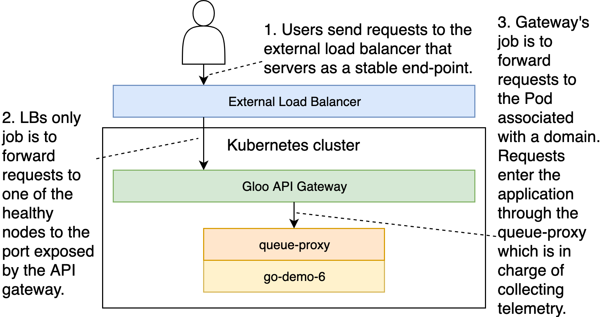
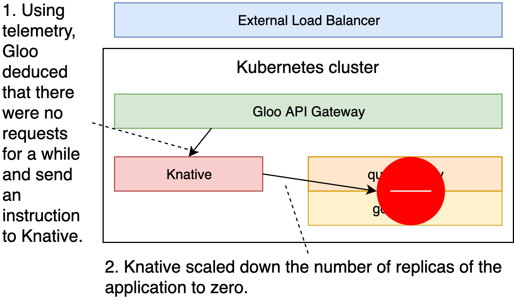
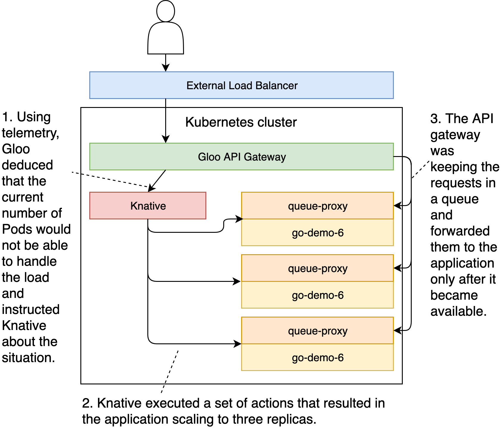
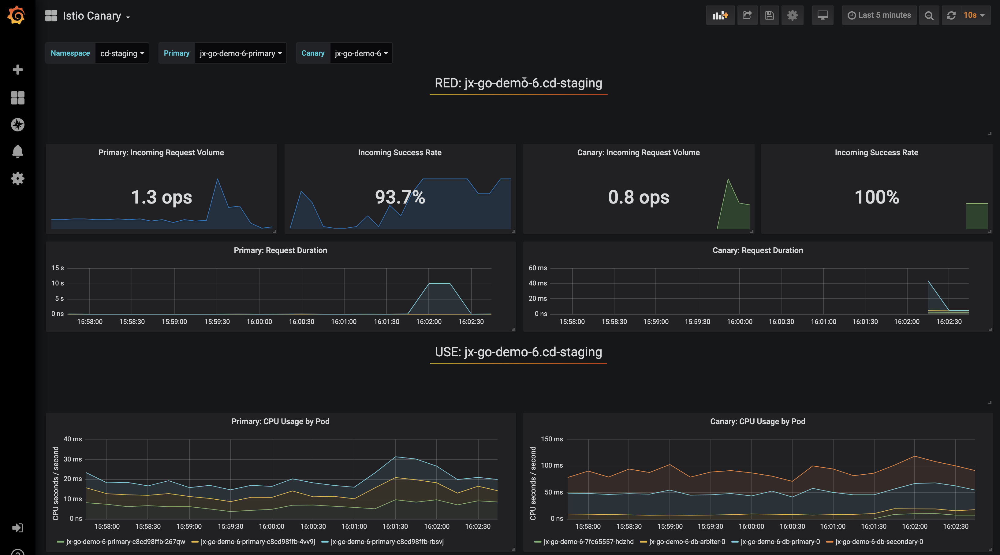

## TODO

- [X] Code
- [X] Write
- [X] Code review static GKE
- [X] Code review serverless GKE
- [ ] Code review static EKS
- [X] Code review serverless EKS
- [X] Code review static AKS
- [X] Code review serverless AKS
- [-] Code review existing static cluster
- [-] Code review existing serverless cluster
- [ ] Text review
- [ ] Gist
- [ ] Review titles
- [ ] Proofread
- [ ] Diagrams
- [ ] Add to slides
- [ ] Publish on TechnologyConversations.com
- [ ] Add to Book.txt
- [ ] Publish on LeanPub.com

# Choosing The Right Deployment Strategy

I> This chapter is co-authored by **Carlos Sanchez**.

W> The examples in this chapter should work with any Jenkins X flavor (static or serverless) and with any hosting vendor (e.g., AWS, AKS, GKE, on-prem, etc.).

So far, we performed many deployments of our releases. All those created from master branches were deployed to the staging environment and a few reached production through manual promotions. Nevertheless, with exception of serverless deployments with Knative, we did not have a say in how an application is deployed. We just assumed that the default method employed by Jenkins X is the correct one. As it happens, the default deployment process used by Jenkins X happens to be the default or, to be more precise, the most commonly used deployment process in Kubernetes. However, that does not necessarily mean that the default deployment is the right one for all our applications.

For many people, deploying applications is transparent or even irrelevant. If you are a developer, you might be focused on writing code and allowing magic to happen. By magic, I mean letting other people and departments figuring out how to deploy your code. Similarly, you might be oblivious to deployments if you are a tester or you have some other role not directly related to system administration, operations, or infrastructure. Now, I doubt that you are one of the oblivious. The chances are that you would not be even reading this if that's the case. If, against all chances, you do belong to the deployment-is-not-my-thing group, the only thing I can say is that you are terribly wrong.

Generally speaking, there are two types of teams. Wast majority is still working in teams based on types of tasks and parts of application lifecycles. If you're wondering whether that's the type of the team you work in, ask youself whether you are in a development, testing, operations, or some other department focused on a fraction of a lifecycle of an application. Are you handing your work to someone else? When you finish writing code, do you give it to the testing department to validate it? When you need to test a live application, are you giving it to operations to deploy it to an environment? Or, to formulate the question on a higher level, are you (your team) in charge only of a part of the lifecycle of your application? If the answer to any of those question is "yes", you are NOT working in a self-sufficient team. Now, I'm not going to tell you why that is wrong nor I'm here to judge you. Instead, I'm only going to state that there is a high probability that you do not know in detail how your application is deployed. As a result, you don't know how to architecture it properly, you don't know how to test it well, and so on and so forth. That, ofcourse, is not true if you are dedicated only on operations. But, in that case, you might not be aware of the architecture of the application. You might know how the application is deployed but you might not know whether that is the optimum way to go.

On the other hand, you might be indeed working in a self-sufficient team that is fully responsible for each aspect of application's lifecycle, from requirements all the way until it is running in production. If that's the case, your definition of done is likely defined as "it's running in production and nothing exploded." Being in a self-sufficient team has a distinct advantage of everyone being aware of every aspect of application's lifecycle. You know the architecture, you know the code, you understand the tests, and you are aware how it is deployed. That is not to say that you are an expert in all those and other areas. No one can know everything in depth, you everyone can have enough high-level knowledge of everything, while being specialized in something.

Why am I rumbling about team organizations? The answer is simple. Deployment strategies affect everyone, no matter whether we are focused only on a single aspect of application's lifecycle or we are in full control. The way we deploy affects the architecture, testing, monitoring, and many other aspects. And not only that, but we can say that architecture, testing, and monitoring affect the way we deploy. All those things are closely related and affect each others in way that might not be obvious on the first look.

We already learned many of the things Jenkins X does out-of-the-box and quite a few others that could be useful to customize it to behave as we want. But, so far, we mostly ignored deployment strategies. If we exclude our brief exploration of serverless deployments with Knative, we always assumed that the application will be deployed using whichever strategy was defined in a build pack. Not only that, but we did not even question whether the type of the resource defined in our Helm charts are the right ones. We'll fill that hole next.

The time has come to discuss different deployment strategies and answer a couple of questions. Is your application stateful or stateless? Does its architecture permit scaling? How do your roll back? How do you scale up and down? Do you need our application to run constantly? Should you use Kubernetes Deployments instead of, let's say, StatefulSets? Those are only a few of the questions you need to answer in order to choose the right deployment mechanism. But, answers to those questions will not serve much purpose unless we are familiar with some of the most commonly used deployment strategies. Not only that knowledge will help us choose which one to pick, but they might even influence the architecture of our applications.

## What Do We Expect From Deployments?

Before we dive into some of the deployment strategies, we might want to set some expectations that will guide us through our choices. But, before we do that, let's try to define what a deployment is.

Traditionally, a deployment is a process through which we would install new applications into our servers or update those that are already running with new releases. That was, more or less, what we were doing from the begining of the history of our industry, and that is in its essence what we're doing today. But, as we evolved our requirements were evolving as well. Today, say that all we expect is for our releases to run is an understatement. Today we want so much more and we have technology that can help us fulfil those desired. So, what does "much more" mean today?

Depending on who you speak with, you will get a different list of "desires", so mine might not be all encompasing and include every single thing than anyone might need. What follows is what I believe is important and what I observed that the companies I worked typically put emphasis. Without further ado, the requirements, excluding the obvious that applications should be running inside the cluster, are as follows.

Applications should be fault tolerant. If an instance of the application dies, it should be brought back up. If a node where an application is running dies, the application should be moved to a healthy node. Even if a whole datacenter goes down, the system should be able to move the applications that were running there into a healthy one. An alternative would be to recreate the failed nodes or even whole datacenters with exactly the same applications that were running there before the outage. However, that is too slow and, frankly speaking, we moved away from that concept the moment we adopted schedulers. That does not mean that failed nodes and failed datacenters should not recuperate, but rather that we should not wait for everything to get back to normal. Instead, we should run failed applications (no matter the cause) on healthy nodes as long as there is enough available capacity.

Fault tolerance might be the most important requirement of all. If our application is not running, our users cannot use it, and that results in dissatisfaction, loss of profit, churn, and quite a few other negative outcomes. Still, we will not use fault tolerance as a criteria because everything we do is now in Kuberentes which makes (almost) everything fault tolerant. As long as it has enough available capacity, our applications will run. So, even that is an important requirement, it is off the table because we are fulfiling it no matter the deployment strategy we choose. That is not to say that there is no change for an application not to recuperate from a failure but rather that Kubernetes provides a reasonable guarantee of fault tolerance. If things do go terribly wrong we are likely going to have to do some manual actions no matter which deployment strategy we choose.

The next in line is high availability, and that a trickier one.

Being fault tolerant means that the system will recuperate from a failure, not that there will be no downtime. If our application goes down, a few moments later it will be up-and-running again. Still, those few moments can result in downtime. Depending on many factors, "few moments" can be translated to miliseconds, seconds, minutes, hours, or even days. While it is certainly not the same whether our application is unavailable during miliseconds as apposed to hours, for the sake of brevity, we'll assume that any downtime is bad and look at things as black and white. Either there is or there isn't downtime. Or, to be more precise, either there is a considerable downtime or there isn't. What changed is what "considerable" means. In the past, having 99% availability was a worthy goal for many. Today, that figure is unaceptable. Today we are taking about how many nines there are after the decimal. For some, 99.99% uptime is aceptable. For others, that could be 99.99999%.

Now, you might say "my business is important, therefore I want 100% uptime." If anyone says that to you, feel free to respond with "you have no idea what you're talking about". A hundred percent uptime is impossible, assuming that by that we mean "real" uptime, and not "my application runs all the time".

Making sure that our application is always running is not that hard. Making sure that not a single request is ever lost or, in other words, our users perceive our application as being always available, is impossible. By the nature of HTTP, some requests will fail. Even if that never happens (as it will), network might go down, storage might fail, or some other thing might happen that will produce at least one request without response.

All in all, high-availability means that our applications are responsive to our users most of the time, and by most we mean at least 99.99%. Even that is a very pesimistic number that would result in 1 failure for ten thousand successes.

What are common causes of unavailability? We already discussed those that tend to be the first associations (hardware and softwar failures). However, those are often not the primary causes of unavaibility. You might have missed something in your tests and that might cause a failure. More often than not, those are not failures caused by "obvious" bugs but rather those that manifest itself a while after a new release is deployed. I will not tell you that you should make sure that there are no bugs (that's impossible), but rather focus on detecting those that sneak into production and how to minimize their affect to as few users as possible. So, our next requirement will be that our deployments should reduce the number of users affected by bugs. We'll call it progressive rollout. Don't worry if you never heard that term. We'll explain it in more depth later.

Progressive rollout, as you'll see later, does allow us to abort upgrades or, to be more precise, not to proceed with them, if something goes wrong. But that might not be enough. We might need not only to abort deployment of a new release, but also to roll back what the one we had before. So, we'll add rollback as yet another requirement.

We'll probably find more requirements directly or indirectly related to high-available or, to inverse it, to unavailability. For now, we'll leave those aside, and move to yet another important aspect. We should strive to make our applications responsive. Now, there are many ways to accomplish that. We can design our applications in a certain way, we can avoid congestions and memory leaks, and we can do many other things. However, right now that's not the focus. We're interested in things that are directly or indirectly related to deployments. With such a limited scope, scalability is the key to responsiveness. If we need more replicas of our application, it should scale up. Similarly, if we do not need as many, it should scale down and free the resources for some other processes if cost savings are not a good enough reason.

Finally, we'll add one more requirement. It would be nice if our applications do not use more resources than it is necessary. We can say that scalability provides that (it can scale up and down) but we might want to take it a step further and say that our applications should not use (almost) any resources when they are not in use. We'll call that "nothing when idle" or, to use a more commonly used term, serverless. I'll use this as yet another opportunity to express my discust with that term given that it implies that there are no servers involved. But, since it is a commonly used one, we'll stick with it. After all, it's still better than call it function-as-a-service since that is just as missleading as serverless, and it occupies more characters (it is a longer word). However, serverless is not the real goal. What really matters is that our solution is cost effective, so that will be our last requirement.

Are those all the requirements we care about. They certainly aren't. Yet, this text cannot contain infinite number of words and we need to focus on something. Those, in my experience, are the most important ones, so we'll stick with them, at least for now.

Another thing we might need to note is that those requirements or, to be more precise, features are all interconnected. More often than note, one cannot be accomplished without the other or, in some other cases, one facilitates the other and makes it easier to accomplish.

Another thing worth noting is that we'll focus only on automation. For example, I know perfectly well that anything can be rolled back through a human intervention. As a matter of fact, anything can be done with enough time and man power. But that's not what matters in this discussion. We'll ignore humans and focus only on the things that can be automated. I don't want you to scale your applications. I want the system to do it for you. I don't want you to roll back in case of a failure, I want the system to do that for you. I don't want you to waste your brain capacity on such trivial tasks. I want to you spend your time on things that matter and leave the rest to machines.

After all that, we can summarize our requirements or features by saying that we'd like deployments to result in applications that are running and are:

* fault tolerant
* highly available
* responsive
* rolling out progressivelly
* rolling back in case of a failure
* cost effective

We'll remove *fault tolerance* from the future discussions since Kubernetes providees that out-of-the-box. It's yet to be seen whether we'll accomplish the rest and, if we do, how we'll do that.

Given that there is a strong chance that there is no solution that will provide all those features. Even if we do find such a solution, the chances are that it might not be appropriate for your applications and their architecture. Instead, we'll explore some of the commonly used deployment strategies and see which of those requirements they fullfil.

Just as in any other chapter, we'll explore the subject in more depth through practical examples. For that, we need a working Jenkins X cluster as well as the *go-demo-6* application since we'll use it to demonstrate different deployment strategies.

## Creating A Kubernetes Cluster With Jenkins X And Importing The Application

If you kept the cluster from the previous chapter, you can skip this section only if you were doubting my choice of VM sizes and make the nodes bigger than what I suggested. Otherwise, we'll need to create a new Jenkins X cluster.

I> All the commands from this chapter are available in the [TODO: Viktor](TODO: Viktor) Gist.

We've been using the same cluster specifications for a while now. No matter the hosting vendor you choose in the past, if you created the cluster using my instructions if is based on nodes with only 2 available CPUs or even smaller. We'll need more. Even if your cluster is set to autoscale, increasing the number of nodes will not help since one of the Istio components we'll use requires at least 2 CPU available. Remember, even if you do have nodes with 2 CPUs, some computing power is reserved for system-level processes or Kubernetes daemons. So, we'll need to create a cluster with bigger nodes. The gists listed below will do just that. Those related to AKS, EKS, and GKE are now having nodes with 4 CPUs. If you are using your own cluster hosted somewhere else, the Gists are the same and I will assume that the nodes have at least 2 CPUs available.

On top of all that, if you are using GKE, the gists now contain the command that installs **Gloo** which we explored in the previous chapter.

The new Gists, excluding those installing Jenkins X in an existing cluster, are as follows.

* Create a new static **GKE** cluster: [gke-jx-gloo.sh](TODO:)
* Create a new serverless **GKE** cluster: [gke-jx-serverless-gloo.sh](TODO:)
* Create a new static **EKS** cluster: [eks-jx-gloo.sh](TODO:)
* Create a new serverless **EKS** cluster: [eks-jx-serverless-gloo.sh](TODO:)
* Create a new static **AKS** cluster: [aks-jx-gloo.sh](TODO:)
* Create a new serverless **AKS** cluster: [aks-jx-serverless-gloo.sh](TODO:)
* Use an **existing** static cluster: [install.sh](TODO:)
* Use an **existing** serverless cluster: [install-serverless.sh](TODO:)

I> The commands that follow will reset your *go-demo-6* `master` branch with the contents of the branch that contain all the changes we did so far. Please execute them only if you are unsure whether you did all the exercises correctly.

W> Depending on whether you're using static or serverless Jenkins X flavor, we'll need to restore one branch or the other. To make things more complicated, those of you running GKE will have to use the branch based on the previous chapter while others are still stuck with those from before. The commands that follow will restore `knative-cd` if you are using GKE and serverless Jenkins X and `knative-jx` if you're in GKE but with static Jenkins X. For everyone else, `extension-model-jx` is the branch if you are using static Jenkins X and `extension-model-cd` if you prefer the serverless flavor. In the commands listed below you will see `# If GKE` and `# If NOT GKE`. Execute only one command or the other depending on whether you use GKE or something else.

```bash
NAMESPACE=$(kubectl config view \
    --minify \
    --output jsonpath="{..namespace}")

cd go-demo-6

git pull

# If GKE
BRANCH=knative-$NAMESPACE

# If NOT GKE
BRANCH=extension-model-$NAMESPACE

git checkout $BRANCH

git merge -s ours master --no-edit

git checkout master

git merge $BRANCH

git push

cd ..
```

Now the branch with the last known good state is restored (if you choose to do that). What comes next should be executed only by GKE users.

W> Please execute the commands that follow only if you are using **GKE** and if you restored the branch using the commands above. Those commands will replace `vfarcic` with the GCP project you used to created the GKE Jenkins X cluster.

```bash
cd go-demo-6

cat charts/go-demo-6/Makefile \
    | sed -e \
    "s@vfarcic@$PROJECT@g" \
    | tee charts/go-demo-6/Makefile

cat charts/preview/Makefile \
    | sed -e \
    "s@vfarcic@$PROJECT@g" \
    | tee charts/preview/Makefile

cat skaffold.yaml \
    | sed -e \
    "s@vfarcic@$PROJECT@g" \
    | tee skaffold.yaml

git add .

git commit -m "Fixed the project"

git push

cd ..
```

There isn't much mystery in the commands we executed. They replaced `vfarcic` with the name of your Google project in two Makefile files and in `skaffold.yaml`.

I> If you destroyed the cluster at the end of the previous chapter, you'll need to import the *go-demo-6* application again. Please execute the commands that follow only if you created a new cluster specifically for the exercises from this chapter.

```bash
cd go-demo-6

jx import --pack go --batch-mode

cd ..
```

Now we can start exploring deployment strategies, with serverless being the first in line.

## Using Serverless Deployments As The Preferable Deployment Strategy (GKE only)

Judging by the name of this section, you might be wondering why do we start with serverless deployments. The honest answer is that I did not try to put the deployment strategies in any order. We're starting with serverless simply because that is the one we used in the previous chapter. So, we'll start with what we have right now, at least for those who are running Jenkins X in GKE.

Another question you might be asking is why do we cover serverless with Knative in here given that we already discussed it in the previous chapter. The answer to that question lies in completeness. Serverless deployments are one of the important options we have when choosing the strategy and this chapter could not be complete without it. If you did go through the previous chapter, consider this one a refresher with a potential to find out something new. If nothing else, you'll might get a better understanding of the flow of events with Knative as well as to see a few diagrams. In any case, the rest of the strategies will build on top of this one. Or you might be impatient and bored with repetion. If that's the case, feel free to skip this section all together.

W> At the time of this writing (August 2019), serverless deployments with Knative work out-of-the-box only in GKE. That does not mean that Knative does not work in other Kubernetes flavors, but rather that Jenkins X installation of Knative works only in GKE. I encourage you to set it up and enable yourself to follow along in your Kubernetes flavor. Or you can skip this section if you're using a different vendor. Still, I suggest to stick around even if you cannot run the examples. I'll do my best to be brief and only provide an overview and pros and cons.

Instead of discussing pros and cons first, we'll start each strategy with an example, observe the results, and, based on that, comment their advantages and dissadvantages as well as the scenarios when they might be a good fit. In that spirit, let's create a serverless deployment first and see what we got.

W> At the time of this writing (August 2019), the examples in this section work only in a **GKE** cluster. Feel free to monitor [the issue 4668](https://github.com/jenkins-x/jx/issues/4668) for more info.

When we imported *go-demo-6* it was already running in Knative mode, so there is nothing for us to do to enable it. Thanks to what we did in the previous chapter, *go-demo-6* is already running as serverless or, to be more precise, a part of it is.

Let's go into the project directory and take a quick look at the definition that makes the application serverless.

```bash
cd go-demo-6

cat charts/go-demo-6/templates/ksvc.yaml
```

We won't go into details of Knative specification. It was briefly explained in the [Using Jenkins X To Define And Run Serverless Deployments](#knative) chapter and details can be found in the [official docs](https://knative.dev). What matters in the context of the current discussion is that the YAML you see in front of you defined a serverless deployment using Knative.

By now, if you created a new cluster the application we imported should be up-and-running. But, to be on the safe side, we'll confirm that by taking a quick look at the *go-demo-6* activities.

W> There's no need to inspect the activities to confirm whether the build is finished if you are reusing the cluster from the previous chapter. The application we deployed previously should still be running.

```bash
jx get activities \
    --filter go-demo-6 \
    --watch
```

Once you confirm that the build is finished press *ctrl+c* to stop watching the activities.

If you are using **serverless Jenkins X**, as you probably already know, the activity of an application does not wait until the release is promoted to the staging environment. So, we'll confirm that the build initiated by changes to the *environment-tekton-staging* repository is finished as well.

W> Please execute the command that follows only if you are using **serverless Jenkins X**.

```bash
jx get activities \
    --filter environment-tekton-staging/master \
    --watch
```

Just as before, feel free to press *ctrl+c* once you confirm that the build was finished.

Finally, the last verification we'll do is to confirm that the Pods are running.

```bash
kubectl \
    --namespace $NAMESPACE-staging \
    get pods
```

The output is as follows.

```
NAME                           READY STATUS  RESTARTS AGE
go-demo-6-lbxwr-deployment-... 2/2   Running 0        26s
jx-go-demo-6-db-arbiter-0      1/1   Running 0        27s
jx-go-demo-6-db-primary-0      1/1   Running 0        27s
jx-go-demo-6-db-secondary-0    1/1   Running 0        27s
```

In your case, `go-demo-6` deployment might not be there. If that's the case, it's been a while since you used the application and Knative made the decision to scale it to zero replicas. We'll go through scaling-to-zero example later. For now, imagine that you do have that Pod running.

On the first look, everything looks "normal", as if the application is deployed as any other. The only "strange" thing we can observe by looking at the Pods is the name of the one created through the *go-demo-6* Deployment and that it contains two containers instead of one. We'll ignore the "naming strangeness" and focus on the latter observation.

Knative injected a container into our Pod. It contains `queue-proxy` that, as the name suggests, serves as a proxy responsible for request queue parameters. It also reports metrics to the Autoscaler through which it might to scale up or down depending on the number of different parameters. Request are reaching our application through this container.

Besides the Pod controlled by Knative, we can also observe that the MongoDB is there as well. It is not serverless but running in the same way it was running throughout the rest of the book. While we could make it serverless as well, MongoDB is probably not a good candidate for that and even if it would be, I wanted to demonstrate that different types of deployments can coexist happily.

Now, let's confirm that the application is indeed accessible just as if we did not make it serverless.

```bash
STAGING_ADDR=$(kubectl \
    --namespace $NAMESPACE-staging \
    get ksvc go-demo-6 \
    --output jsonpath="{.status.domain}")

curl "http://$STAGING_ADDR/demo/hello"
```

We retrieved the address through which we can reach the application running in the staging environment and we used `curl` to send a request. The output should be `hello, PR!` which is the message we defined in one of the previous chapters. 

So far, the major difference when compared with "normal" Kubernetes deployments is that the access to the application is not controlled through Ingress any more but through a new resource type abbreviated as `ksvc` (short for Knative Service). Apart from that, everything else seems to be the same, except if you left the application unused for a while. In such a case, you still got the same output, but there was a slight delay between sending the request and receiving the response. The reason for such a delay lies in Knative's scaling capabilities. It saw that the application is not used and scaled it to zero replicas. But, the moment we sent a request, it noticed that zero replicas is not the desired state and scaled it back to one replica. So, in such a case, the request entered into a gateway (in our case served by Gloo Envoy) and waited there until a new replica was created and initialized. After that, it forwarded the request to it, and the rest is the "standard" process of our application responding and that response being forwarded to us (back to `curl`).



So far, from the process perspective, there is no significant difference when compared with "normal" Kubernetes deployments, except for the `queue-proxy`. If that's everything Knative does, we could just as well replace the gateway with nginx or any other Ingress. But there's more.

Given that I couldn't be sure whether your serverless deployment indeed scaled to zero or it didn't, we'll use a bit of patience to validate that it does indeed scale to nothing after a bit of inactivity. All we have to do is wait for five to ten minutes. Go get a coffee or some snack.

```bash
kubectl \
    --namespace $NAMESPACE-staging \
    get pods
```

Assuming that sufficient time passed, the output should be as follows.

```
NAME                        READY STATUS  RESTARTS AGE
jx-go-demo-6-db-arbiter-0   1/1   Running 0        6m21s
jx-go-demo-6-db-primary-0   1/1   Running 0        6m21s
jx-go-demo-6-db-secondary-0 1/1   Running 0        6m21s
```

The database is there but the application is now gone. If we ignore other resources and focus only on Pods, it seems like the application is wiped out completely. That is true in terms that nothing application-specific is running. All that's left are a few Knative definitions and the common resources used for all applications (not specific to ours).

I> If you still see that application, all I can say is that you are impatient and you did not wait long enough. If that's what happened, wait for a while longer and repeat the `get pods` command.

Using telemetry collected from all the Pods deployed as Knative applications, Gloo detected that no requests were sent to *go-demo-6* for a while and decided that the time has come to scale it down. It sent a notification to Knative that executed a series of actions which resulted in our application being scaled to zero replicas.



Bear in mind that the actual procees is more complicated than that and that there are quite a few other components involved. Nevertheless, for the sake of brevity, the simplistic view we presented should suffice. I'll leave it up to you to go deeper into Gloo and Knative or accept it as magic. In either case, our application was successfully scaled to zero (removed) thus saving resources that could be better used by other applications and save us some costs in the process.

If you never used serverless deployments and specifically never worked with Knative, you might think that your users would not be able to access it any more since the application is not running. Or you might think that it will be scaled up once requests start coming in but you might be scared that you'll loose those sent before the new replica start running. Or you might have read the previous chapter and know that those fears are unfounded. In any case, we'll put that to the test by sending three hundred concurrent requests during twenty seconds.

```bash
kubectl run siege \
    --image yokogawa/siege \
    --generator "run-pod/v1" \
     -it --rm \
     -- --concurrent 300 --time 20S \
     "http://$STAGING_ADDR/demo/hello" \
     && kubectl \
     --namespace $NAMESPACE-staging \
    get pods
```

We won't go into details about Siege. Read the previous chapter if you want to know more. What matters is that we finished sending a lot of requests and that the previous command output the Pods in the staging namespace. That output is as follows.

```
NAME                           READY STATUS  RESTARTS AGE
go-demo-6-lbxwr-deployment-... 2/2   Running 0        20s
go-demo-6-lbxwr-deployment-... 2/2   Running 0        14s
go-demo-6-lbxwr-deployment-... 2/2   Running 0        14s
jx-go-demo-6-db-arbiter-0      1/1   Running 0        6m59s
jx-go-demo-6-db-primary-0      1/1   Running 0        6m59s
jx-go-demo-6-db-secondary-0    1/1   Running 0        6m59s
```

Our application is up-and-running again. Few moments the application was not running and now it is. Not only that but it was scaled to three replicas to accomodate the elevated number of concurrent requests.



What did we learn from serverless deployments in the context of our quest to find one that fits our needs the best?

Highly availability is easy in Kuberentes, as long as our applications are designed with that in mind. What that means is that our applications should be scalable and should not contain state. If they cannot be scaled, they cannot be highly available. When a replica fails (not that I did not say if but when), no matter how fast Kubernetes is to reschedule it somewhere else, there will be downtime, unless other replicas take over its load. If there are no other replicas, we are bound to have downtime both due to failures but also whenever we deploy a new release. So, scalability (running more than one replica) is the prerequisite for high availability. At least, that's what logic might make us think.

In case of serverless deployments with Knative, not having replicas that can respond to user requests is not an issue, at least not from high availability point of view. While in a "normal" situation the requests would fail to receive a response, in our case they were queued in the gateway and forwarded only after the application is up-and-running. So, even if the application is scaled to zero replicas (nothing is running), we are still highly available. The major downside are potential delays between receiving the first requests and until the first replica of the application is responsive.

The problem with might have with serverless deployments, at least when used in Kubernetes, is responsiveness. If we keep the default settings, our application will scale to zero if there are no incoming requests. As a result, when someone does send a request to our application it might take longer until the response is received. That could be a couple of milliseconds, a few seconds, or much longer. It all depends on the size of container image, whether it is already cached on the node where the Pod is scheduled, the amount of time the application needs to initialize, and quite a few other criteria. If we do things right, that delay can be short. Still, a delay reduces the responsivenes of our application. What we need to do compare pros and cons where results will differ from one application to another.

Let's take the static Jenkins as an example. In many organizations, it is under heavy usage throughout working hours, and with low or no usage at nights. We can say that half of the day it is not used. What that really means is that we are paying double to our hosting vendor. We could have shut it down over night. Even if the price is not an issue, surely those resources used by inactive Jenkins could be better used by some other processes. Shutting down the application would be an improvement but it would also produce potentially very negative effects. What if someone is working over night and pushes a change to Git. A webhook would fire trying to notify Jenkins that it should run a build. But, such webhook would fail since there would be no Jenkins to handle the request. A build would never be executed. Unless we set up a policy that says "you are never allowed to work after 6pm, even if the whole system crashed", having a non-responsive system is unacceptable.

Another issue would be to figure out when is our system not in use. If we continue using the "traditional" Jenkins as an example, we could say that it should shut-down at 9pm. If our official working hours end at 6pm, that would provide three hours margin for those who do stay in the office longer. That would still be an suboptimal solution. During much of those three hours Jenkins would not be used and it would continue wasting resources. On the other hand, there is still no guarantee that no one will ever push a change after 9pm.

Knative solves those and quite a few other problems. Instead of shutting down our applications at predefined hours and hope that no one is using them while they are unavailable, we can let Knative (together with Gloo or Istio) monitor requests. It would scale down if certain period of inactivity passed. On the other hand, it would scale back up if a request is sent to it. Such requests would not be lost but queued until the application becomes available again.

All in all, I cannot say that Knative might result in non-responsiveness but that it might produce slower responses in some cases (between having none and more replicas). Such periodical slower responsiveness might produce less negative effect than the good it brings. Is it really such a bad thing if static Jenkins takes aditional 15 seconds to start building something after a whole night of inactivity? In that particular case, the upside outweight the downsides. Still, there are even better examples of the advantages of serverless deployments than Jenkins.

Preview environments might be the best example of wasted resources. Every time we create a pull request, a release is deployed in a temporary environment. That, by itself, is not a waste since the benefits of being able to test and review an application before merging it to master outweight the fact that most of the time we are not using those applications. Nevertheless, we can do better. Just as we explained in the previous chapter, we can use Knative to deploy to preview environments, no matter whether we use it for permanent environments like staging and production. After all, preview environments are not meant to provide a place to test something before promoting it to production (staging does that), but rather to have relative certainty that what we'll merge to the master branch is likely code that works well.

If the response delay caused by scaling up from zero replicas is unacceptable in certain situations, we can still configure Knative to have one or replicas as a minimum. In such a case, we'd still benefit from Knative capabilities. For example, the metrics it uses to decide when to scale might be easier or better than those provided by HorizontalPodAutoscaler (HPA). Nevertheless, the result of having Knative deployment with a minimum number of replicas above zero is similar to the one we'd have with using HPA so we'll ignore such situations since our applications would not be serverless. That is not to say that Knative is not useful if it doesn't scale to zero, but rather that we'll treat those situations separately and stick to serverless features in this section.

What's next in our list of deployment requirements?

Even though we did not demonstrate it through examples, serverless deployments with Knative do not produce downtime when deploying new releases. All new requests will be handled by a new release, while the old one will be available to process all those that were initiated before the new deployment started rolling out. Similarly, if we have health checks, it will stop the rollout if the fail and never succeed. In that aspect, we can say that rollout is progressive. On the other hand, it is not true progressive rollout but similar to those we get with rolling updates. Knative, by itself, cannot choose whether to continue progressing based on arbitrary metrics. Similarly, it cannot roll back automatically if pre-defined criteria is met. Similarly like rolling updates, it will stop the rollout if health checks fail. If those health checks fail with the first replica, even though there is no rollback, all the requests will continue being served with the old release. Still, there are too many ifs in those statements. We can only say that serverless deployments with Knative (without additional tooling) partially fullfill progressive rollout and are incapable of automated rollbacks.

Finally, the last requirement is that our deployment strategy should be cost effective. Serverless deployments, at least those implemented with Knative, are probably the most cost effective deployments we can have. Unlike vendor-specific serverless implementations like AWS Lambda, Azure Functions, and Google Cloud's serverless platform, we are in (almost) full control. We can define how many requests are served by a single replica. We control the size of our applications given that anything that can run in a container can be serverless (but is not necesarrily a good candidate). We control which metrics are used to make decisions and what are the thresholds. That might be more complicated than using vendor-specific serverless implementations and its up to us to decide whether additional complications with Knative outweight the benefits it brings. I'll leave such a decision in your hands.

So, what did we conclude? Do serverless deployments with Knative fullfull all our requirements? The answer to that question is a resounding "no". No deployment is perfect. Serverless deployments provide **huge benefits** with **high-availability* and *cost-effectiveness**. They are **relatively responsive and provide certain level of progressive rollouts**. The major drawback is the **lack automated rollaback**.

|Requirement        |Fullfilled|
|-------------------|----------|
|High-availability  |Fully     |
|Responsiveness     |Partly    |
|Progressive rollout|Partly    |
|Rollback           |Not       |
|Cost effectiveness |Fully     |

Please note that we used Gloo in conjunction with Knative to perform serverless deployments. We could have used Istio instead of Gloo. Similarly, we could have used OpenFaaS instead of Knative. Or we could have opted for something completely different. There are many different solutions we could assemble with the goal of making our applications serverless. Still, the goal was not to compare them all and choose the best one, but rather to explore serverless deployments as one possible strategy we could employ. I do believe that Knative is the most promising one, but we are still in early stages with those concepts and it would be impossible to be certain what will prevail. Similarly, for many Istio would be the service mesh of choice due to it's high popularity. Yet, I choose Gloo mostly because of its simplicity and its small footprint. For those of you who prefer Istio, all I can say is that we will use it for different purposes later on in this chapter.

Finally, I made a decision to present only one serverless implementation mostly because it would take much more than a single chapter to compare all those that are popular. The same can be said for service mesh (Gloo). Both are very interesting subject that I might explore in the next book. But, at this moment I cannot make that promise because I honestly do not know plan a new book before the one I'm writing (this one) is finished.

What matters is that we're finished with a very high-level exploration of pros and cons of using serverless deployments and now we can move onto the next one. But, before we do that, we'll revert our chart to the good old Kubernetes Deployment.

```bash
jx edit deploy \
    --kind default \
    --batch-mode

cat charts/go-demo-6/values.yaml \
    | grep knative
```

We edited the deployment strategy by setting it to `default` (it was `knative` so far) and we output the `knative` variable to confirm that it is now set to `false`.

The last thing we'll do is go out of the local copy of the *go-demo-6* directory so that we are in the same place as those who could not follow the exaples because their cluster cannot yet run Knative or those who were too lazy to set it up.

```bash
cd ..
```

## Going Old-School With the Recreate Deployment Strategy

*A long time ago in a galaxy far, far away...* most of the applications were deployed with what today we call the *recreate* strategy. We'll discuss it shortly. For now, we'll focus on implementing it and observing the outcome.

By default, Kubernetes Deployments use the RollingUpdate strategy. If we do not specify any, that's the one that is implied. We'll get to that one later. For now, what we need to do is ad the `strategy` into the `deployment.yaml` file that defines the Deployment.

```bash
cd go-demo-6

cat charts/go-demo-6/templates/deployment.yaml \
    | sed -e \
    's@  replicas:@  strategy:\
    type: Recreate\
  replicas:@g' \
    | tee charts/go-demo-6/templates/deployment.yaml
```

We entered the local copy of the *go-demo-6* repository and used a bit of `sed` magic to add the `strategy` entry just above `replicas`. If you are not a `sed` ninja, that command might have been confusing, so let's output the file and see what we got.

```bash
cat charts/go-demo-6/templates/deployment.yaml
```

The output, limited to the relevant section, is a follows.

```yaml
...
spec:
  strategy:
    type: Recreate
...
```

Now that we changed our deployment strategy to `recreate`, all that's left is to push it to GitHub, wait until it is deployed, and observe the outcome. Right?

```bash
git add .

git commit -m "Recreate strategy"

git push

jx get activities \
    --filter go-demo-6/master \
    --watch
```

We pushed the changes and started watching the activities. Please press *ctrl+c* to cancel the watcher once you confirm that the newly started build is finished.

If you're using serverless Jenkins X, the build of an application does not wait for the activity associated with automatic promotion to finish so we'll confirm whether that is done as well.

W> Please execute the command that follows only if you are using **serverless Jenkins X**.

```bash
jx get activities \
    --filter environment-tekton-staging/master \
    --watch
```

You know what needs to be done. Press *ctrl+c* when the build is finished.

Let's take a look at the Pods we got.

```bash
kubectl \
    --namespace $NAMESPACE-staging \
    get pods
```

The output is as follows

```
NAME                        READY STATUS  RESTARTS AGE
jx-go-demo-6-94b4bb9b6-...  1/1   Running 0        36s
jx-go-demo-6-94b4bb9b6-...  1/1   Running 0        36s
jx-go-demo-6-94b4bb9b6-...  1/1   Running 0        36s
jx-go-demo-6-db-arbiter-0   1/1   Running 0        15m
jx-go-demo-6-db-primary-0   1/1   Running 0        15m
jx-go-demo-6-db-secondary-0 1/1   Running 0        15m
```

There's nothing new here. Judging by the look of the Pods, if you did not change the strategy to `recreate` you would probably think that it is still the default `RollingUpdate`.

The only difference we could notice is in the description of the Deployment, so let's output it.

```bash
kubectl \
    --namespace $NAMESPACE-staging \
    describe deployment jx-go-demo-6
```

The output, limited to the relevant part, is as follows.

```yaml
...
StrategyType:       Recreate
...
Events:
  Type   Reason            Age  From                  Message
  ----   ------            ---- ----                  -------
...
  Normal ScalingReplicaSet 20s  deployment-controller Scaled up replica set jx-go-demo-6-589c47878f to 3
```

So, we confirmed that the `StrategyType` is now `Recreate`. That's not a surprise. What is more interesting is the last entry in the `Events` section. It scaled replicas of the new release to three. Why is that a surprise? Isn't that the logical action when deploying the first release with the new strategy? Well... It is indeed logical for the first release so we'll have to make another release and deploy it to see what's really going on.

If you had Knative deployment running before, there is a small nuasance we need to fix. Ingress is missing and I can prove that.

```bash
kubectl \
    --namespace $NAMESPACE-staging \
    get ing
```

The output claims that `no resources` were `found`.

W> Non-Knative users will have Ingress running and will not have to execute the workaround we are about to do. Feel free to skip the few commands that follow. Alternatively, you can run them as well. No harm will be done. Just remember that their purpose is to create Ingress that is already running and there will be no visible effect.

What happened? Why isn't there Ingress when we saw it countless times before in previous execises?

Jenkins X creates Ingress resources automatically unless we tell it otherwise. You know that already. What you might not know is that there is a bug (undocummented feature) because of which Ingress is not created the first time we change the deployment type from Knative to plain-old Kubernetes Deployments. Given that that happens only when we switch and not in consecutive deployments of new releases, all we have to do is deploy a new release and the second time Jenkins X will pick it up correctly and create missing Ingress resource. Without it we won't be able to access the application from outside the cluster. So, all we have to do is make a trivial change and push it to GitHub. That will trigger yet another pipeline activity that will result in creation of a new release and its deployment to the staging environment.

```bash
echo "something" | tee README.md

git add .

git commit -m "Recreate strategy"

git push
```

We made a silly change, we pushed it to GitHub, and that triggered yet a new build. All we have to do is wait or, even better, watch the activities of *go-demo-6* and the staging environment pipelines to confirm that everything was executed correctly. I'll skip showing you the `jx get activities` commands given that I'm sure you already know them by heart.

Assuming that you were patient enough and waited until the new release is deployed, now we can confirm that the Ingress was indeed created.

```bash
kubectl \
    --namespace $NAMESPACE-staging \
    get ing
```

The output is as follows.

```
NAME      HOSTS                                      ADDRESS        PORTS AGE
go-demo-6 go-demo-6.cd-staging.35.237.194.237.nip.io 35.237.194.237 80    61s
```

That's the same output that those that did not run Knative before saw after the first release.

All in all, the application is now running in staging, and it was deployed using the `recreate` strategy.

Next, we'll make yet another simple change to the code. This time, we'll change the output message of the application. That will allow us to easily see how it before and after the new release is deployed.

```bash
cat main.go | sed -e \
    "s@hello, PR@hello, recreate@g" \
    | tee main.go

cat main_test.go | sed -e \
    "s@hello, PR@hello, recreate@g" \
    | tee main_test.go

git add .

git commit -m "Recreate strategy"

git push
```

We changed the message. As a result, our current release is outputting `hello, PR` while the new release, once its deployed, will return `hello, recreate`.

Now we need to be **very fast** and start sending requests to our application before the new release is rolled out. If you're unsude why we need to do that, it will become evident in a few moments.

Please open a **second terminal** window.

Given that **EKS** requires access key ID and secret access key as authentication, we'll need to declare a few environment variables in the new terminal session. Those are the same ones we used to create the cluster, so you should not have any trouble recreating them.

W> Please execute the commands that follow **only** if your cluster is running in **EKS**. You'll have to replace the first `[...]` with your access key ID, and the second with the secret access key.

```bash
export AWS_ACCESS_KEY_ID=[...]

export AWS_SECRET_ACCESS_KEY=[...]

export AWS_DEFAULT_REGION=us-west-2
```

Let's find out the address of our application running in staging.

```bash
jx get applications --env staging
```

The output should be similar to the one that follows.

```
APPLICATION STAGING PODS URL
go-demo-6   9.0.30  3/3  http://go-demo-6.cd-staging.35.237.194.237.nip.io
```

Copy the `go-demo-6` URL and paste it instead of `[...]` in the command that follows.

```bash
STAGING_ADDR=[...]
```

That's it. Now we can start bombing our application with requests.

```bash
while true
do
    curl "$STAGING_ADDR/demo/hello"
    sleep 0.2
done
```

We created an infinite loop inside which we're sending requests to the application running in staging. To avoid burning your laptop, we also added a short delay of `0.2` seconds.

If you were fast enough, the output should consist of an endless list of `hello, PR!`. If that's what you're getting, it means that the deployment of the new release did not yet start. If that's what you're seeing, all we have to do is wait.

At one moment, `hello, PR!` messages will turn into `502` or `503` responses. Our application is down. If this would be a "real world" situation, our users would experience outage. Some of them might even be so dissapointed that they will choose not to stick around to see whether we'll recuperate and instead switch to a competing product. I know that I, at least, have a very short tollerance threshold. If something does not work and I do not have a strong dependency on it, I move somewhere else almost instantly. If I'm commited to a service or an application, my tollerance might be a bit more forgiving but it is not indefinite. I might forgive you one outage, maybe even two, but the third time I cannot consume something I will start considering an anlternative. Than again, that's only me and your users might be more forgiving. Still, even if you do have loyal customers, downtime is not a good thing and we should avoid it.

While you were reading the previous paragraph, the message probably changed again. Now it should be end endless loop of `hello, recreate!`. Our application recuperated and is now operational again. It's even showing us the results of the new release. If we could erase from our memory the `502` and `503` messages, that would be awesome.

All in all, the output, limited to the relevant parts, should be as follows.

```
...
hello, PR!
hello, PR!
...
<html>
<head><title>502 Bad Gateway</title></head>
<body>
<center><h1>502 Bad Gateway</h1></center>
<hr><center>openresty/1.15.8.1</center>
</body>
</html>
<html>
<head><title>503 Service Temporarily Unavailable</title></head>
<body>
<center><h1>503 Service Temporarily Unavailable</h1></center>
<hr><center>openresty/1.15.8.1</center>
</body>
</html>
...
hello, recreate!
hello, recreate!
...
```

If all you ever saw was only the loop of `hello, recreate!`, all I can say is that you were too slow and you'll have to trust me that there were some nesty messages in between the old and the new release.

That was enough looping for now. Please press *ctrl+c* to stop it and give your laptop a rest. Leave the second terminal open and **back to the first one**. We'll need both later on.

What happened was not pretty nor desirable. Even if you are not familiar with the `RollingUpdate` strategy (the default one for Kubernetes Deployments), you already experienced it countless times before. You probably did not see those 5xx message in the previous exercises and that might make you wonder why did we switch to `Recreate`. Would anyone want that? Now, the answer to that question is that no one desires such outcomes, but many are having them anyway. I'll explain soon why we want to use the `Recreate` strategy even though it produces outage. To answer why would anyone want something like that, we'll first explore why was the outage produced in the first place.

When we deployed the second release using the `Recreate` strategy, Kubernetes first shut down all the instances of the old release and only when they all ceased to work, it deployed the new release in its place. The downtime we experienced existed between the time the old release was shut down and the time the new one became fully operational. The downtime lasted for only a couple of seconds, but that's because our application (*go-demo-6*) boots up very fast. Some other applications might be much slower and the downtime would be much longer. It's not uncommon for the downtime in such cases to take minutes and sometimes even hours.

Alternativelly, you might not have seen a single 5XX error. If that's the case, you were very lucky because that means that the old release was shut down and the new was up-and-running within 200 milliseconds. If that's what happened to you, reast assured that it is highly unlikely it'll happen again. You just experienced a once in a lifetime event. As you can probably guess, we cannot rely on users being that lucky.

We can think of the `Recreate` strategy as "Big Bang". There is no transition period, there are no rolling updates, nor there is any other of the "modern" deployment practices. The old release is shut down and the new one is put in its place. It's simple and straightforward, but it results in inevitable downtime.


Still, the initial question stands. Who would ever want to use the `Recreate` strategy? The answer is not that much who wants it, but rather who must use it.

Let's take another look at static Jenkins. It is a stateful application that cannot scale. So, replacing one replica at a time as a way to avoid downtime is out of question. When applications cannot scale, there is no way we could ever accomplish deployments without downtime. Two replicas are a minimum. Otherwise, if only one replica is allowed to run at any given moment, we have to shut it down to make room for the other replica (the one from the new release). So, when there is no scaling, there is no high availability. Downtime, at least related to new releases, is unavoidable.

Why static Jenkins cannot scale? There can be many answers to that question, but the main culprit is its state. It is a stateful application unable to share that state across multiple instances. Even if you deploy multiple Jenkins instances, they would operate independenly from each other. Each would have a different state and manage different pipelines. That, dear reader, is not scaling. Having multiple independent instances of an application is not replication. For an application to be scalable, each replica needs to work together with others and share the load. As a rule of thumb, for an application to be scalable it needs to be stateless (e.g., *go-demo-6*) or to be able to replicate state across all replicas (e.g,. MongoDB). Jenkins does not fullfil either of the two criteria and, therefore, it cannot scale. Each instance has its own file storage where it keeps the state unique to that instance. The best we can do with static Jenkins is to give an instance to each team. That solves quite a few Jenkins-specific problems, but it does not make it scalable. As a result, it is impossible to upgrade Jenkins without downtime.

Upgrades are not the only source of downtime with unscalable applications. If we have only one replica, when it fails Kubernetes will recreate it. But that will also result in downtime. As a matter of fact, failure and upgrades of single-replica applicaions are more or less the same. In both cases the only replica is shut down and the new one is put in its place. Between the two there is downtime.


All that might leads you to conclude that only single-replica applications should use the `Recreate` strategy. That's not true. There are many other reasons while "big bang" deployment strategy should be used. We won't have time to discuss all the reasons so I'll mention only one more.

The only way to avoid downtime when upgrading applications is to run multiple replicas and start replacing them one by one or in batches. It does not matter much how many replicas we shut down and replace with those with the new release, just as long as long as there is at least one replica of the application running. What that means is that we are likely going to run the new release in parallel with the old for a while. We'll go through that scenario soon. For now, trust me when I say that running multiple releases of an application in parallel is unavoidable if we are to perform deployments without downtime. That means that our releases must be backwards compatible, that our applications need to version APIs, and that clients need to take that versioning into account when working with our applications. That backwards compatibility is usually the main stumbling block that prevents teams to apply zero-downtime deployments. It extends everywhere. Database schemas, APIs, clients, and many other components need to be backwards compatible.

All in all, lack of backwards compatibility and quite a few other things might prevent us from running two releases in parallel and without that, we are forced to use the `Recreate` strategy or something similar.

So, the real question is not whether anyone wants to use the `Recreate` strategy, but rether who is forced to apply it due to the problems usually related to architecture of an application. If you are having a stateful application, the chances are the you have to use that strategy. Similarly, if your application cannot scale, you are probably forced to use it.

Given that deployment with the `Recreate` strategy inevitably produce downtime, most teams tend to have less frequent releases. The impact of, lets say, one minute of downtime is not that big if we produce it only a couple of times a year. But, if we would increase the release frequency, that negative impact would increase as well. Having downtime a couple of times a year is much better than once a month. High velocity iterations are out of question. We couldn't deploy a release once a week, once a day, or even multiple times a day if we'll experience downtime each time we do that. In other words, zero-downtime deployments are a prerequisite for high-frequency releases to production. Given that the `Recreate` strategy does produce downtime, it stands to reason that it fosters less frequent releases to production as a way to reduce the impact.

Before we proceed, it might be important to note that there was no particular reason to use the `Recreate` deployment strategy. The application is scalable and it is designed to be backwards compatible. Any other strategy would be better suited given that downtime produced by deployments is probably the most important requirement we can have. We used it only to demonstrate how that deployment type works and to be consistent with other examples in this chapter.

Now that we saw how the `Recreate` strategy works, let's see which requirement did it fullfil, and which it failed to address. As you can probably guess, what follows is not going to be a pretty picture.

When there is downtime, there is no high-availability. One excludes the other, so we failed with that one.

Is our application responsive? If we used an application more appropriate for that type of deployment, we would probably discover that it would not be responsive or that it would be very expensive, if not both. If we go back to static Jenkins as a good example for the `Recreate` deployment strategy, we would quickly discover that it is expensive to have it. Now, I do not mean expensive in terms of licencing costs but rather in resource usage. We'd need to set it up to you memory and CPU required for its peak load. We'd probably take a look at metrics and try to figure out how much memory and CPU it uses when the most concurrent builds are running, increase those values just to be on the safe side, and set them as requested resources. What that would mean is that we'd use CPU and memory required for the peak load, even if most of the time we need much less. In some other cases, we'd let it scale up and down and, in that way, balance the load while using only the resources it needs. But, if that would be possible, we would not use the `Recreate` strategy. Instead, we'd waste resources just to be on the safe side knowing that it can handle any load. That's costly. The alternative would be to be cheaper and give it less resources than the peak load. However, in that case it would not be responsive given that the builds at the peak load would need to be queue. Or, even worse, it would just bleed out and fail under a lot of pressure. In any case, a typical application used with the `Recreate` deployment strategy is either not responsive or it is expensive or both.

The only thing left is to see whether that deployment type allows progressive rollout and rollbacks. In both cases, the answer is a resounding no. Given that most of the times there only one replica is allowed to run, progressive rollout is impossible. On the other hand, there is no mechanism to roll back in case of a failure. That is not to say that it is not possible to do that, but rather that it is not incorporated into the deployment process itself. We'd need to modify our pipelines to accomplish that. Given that we're focused only on deployment strategy, rollbacks are not available.

The summary of the fullfillement of our requirements for the `Recreate` deployment strategy is as follows.

|Requirement        |Fullfilled|
|-------------------|----------|
|High-availability  |Not       |
|Responsiveness     |Not       |
|Progressive rollout|Not       |
|Rollback           |Not       |
|Cost effectiveness |Not       |

As you can see, that was a very depressing outcome. Yet, architecture of our applications often forces us to apply it and we need to learn to live with it, at least until the day we are allowed to redesign those applications or throw them to thrash and start over.

I hope that you never worked with such applications. If you didn't, you are either very young, or you always worked in awesome companies. I, for example, spent most of my cerreer with applications that had to be put down for hours every time we deploy a new release. I had to come to the office for weekends because that's then the least number of users were using our applications and spend hours or even days doing deployments. I spent too many nights sleeping in the office over weekends. Luckily, that was years ago and we had only a few releases a year. Those days now feel like nightmare that I never want to experience again. That might be the reason why I got interested in automation and architecture. I wanted to make sure that I replace myself with scripts.

So far, we saw two deployment strategies. We probably started with the inverted order, at least from the historical perspective. We can say that serverless deployments are one of the most advanced and modern strategies, while `Recreate` or, to use a better name, "big bang" deployments are the gosts of the past that are still haunting us. It's no wonder that Kubernetes does not use it as a default deployment type.

From here on, the situation can be only more positive. Brace yourself for an increased level of happiness.

## Using Rolling Updates Deployment Strategy

We explored one of the only two strategies we can use with Kubernetes Deployment resource. As we saw, the non-default `Recreate` is meant to serve legacy applications that are typically stateful and often do not scale. Next, we'll see what Kubernetes community thinks should be the default way we should deploy our software.

I> Please bear in mind that both in the previous and in this section we are focused on what Kubernetes Deployment offers. We could have just as well used StatefulSet for stateful applications or DeamonSet for those that should be running in each node of the cluster. However, even though those behave differently, they are still based on similar principles. Given that I do not want to convert this chapter into a neverending flow of rambling, we'll ignore those and focus only on Kubernetes Deployment resource before we go yet again outside of what Kubernetes offers out-of-the-box.

Now, let's get back to to the topic.

To make our Deployment use the `RollingUpdate` strategy, we can either remove the whole `strategy` entry given that is the default, or we can change the type. We'll go with the latter since the command to accomplish that is easier.

```bash
cat charts/go-demo-6/templates/deployment.yaml \
    | sed -e \
    's@type: Recreate@type: RollingUpdate@g' \
    | tee charts/go-demo-6/templates/deployment.yaml
```

All we did was to change the `strategy` `type` to `RollingUpdate`. You should see the full definition of the Deployment on the screen.

Next, we'll change the application return message so that we can track easily the change from one release to the other.

```bash
cat main.go | sed -e \
    "s@hello, recreate@hello, rolling update@g" \
    | tee main.go

cat main_test.go | sed -e \
    "s@hello, recreate@hello, rolling update@g" \
    | tee main_test.go

git add .

git commit -m "Recreate strategy"

git push
```

We made the changes and pushed them to the GitHub repository. Now, all that's left is to execute another loop that will keep sending requests to the application and display the output.

W> Please go to the **second terminal** before executing the command that follows.

```bash
while true
do
    curl "$STAGING_ADDR/demo/hello"
    sleep 0.2
done
```

The output should be a long list of `hello, recreate!` outputs. After a while, when the new release is deployed, it will suddenly switch to `hello, rolling update!`. The relevant part of the output should be as follows.

```
...
hello, recreate!
hello, recreate!
hello, rolling update!
hello, rolling update!
...
```

As you can see, this time there was no downtime. The application switched from one release to another, or so it seems. But, if that's what happened, we would have seen some downtime, unless that switch happened exactly in those 0.2 seconds between the two requests. To see better what happened, we'll describe the deployment and explore its events.

W> Please stop the loop with *ctrl+c* and return to the **first terminal**.

```bash
kubectl \
    --namespace $NAMESPACE-staging \
    describe deployment jx-go-demo-6
```

The output, limited to the events section, is as follows.

```
...
Events:
  Type    Reason             Age   From                  Message
  ----    ------             ----  ----                  -------
...
  Normal  ScalingReplicaSet  6m24s deployment-controller Scaled down replica set jx-go-demo-6-8b5698864 to 0
  Normal  ScalingReplicaSet  6m17s deployment-controller Scaled up replica set jx-go-demo-6-77b6455c87 to 3
  Normal  ScalingReplicaSet  80s   deployment-controller Scaled up replica set jx-go-demo-6-658f88478b to 1
  Normal  ScalingReplicaSet  80s   deployment-controller Scaled down replica set jx-go-demo-6-77b6455c87 to 2
  Normal  ScalingReplicaSet  80s   deployment-controller Scaled up replica set jx-go-demo-6-658f88478b to 2
  Normal  ScalingReplicaSet  72s   deployment-controller Scaled down replica set jx-go-demo-6-77b6455c87 to 1
  Normal  ScalingReplicaSet  70s   deployment-controller Scaled up replica set jx-go-demo-6-658f88478b to 3
  Normal  ScalingReplicaSet  69s   deployment-controller Scaled down replica set jx-go-demo-6-77b6455c87 to 0
```

From those events we can see what happened to the Deployment so far. The first entry in my output (the one that happened over 6 minutes ago) we can see that it scaled one replica set to `0` and the other to `3`. That was the rollout of the new release we created when we used the `Recreate` strategy. Everything was shut down before the new release was put in its place. That was the cause of downtime.

Now, with the `RollingUpdate` strategy, we can see that the system was gradually increasing replicas of one ReplicaSet (`jx-go-demo-6-658f88478b`) and decreasing the other (`jx-go-demo-6-77b6455c87`). As a result, instead of having a "big bang" deployment, the system was gradually replacing the old release with the new one, one replica at the time. That means that there was not a single moment without one or the other release running and, during brief period, both were running in parallel.


You saw from the output of the loop that the output switched from the old to the new release. In "real world" scenarios, you are likely going to have mixed outputs from both releases. For that reason, it is paramount that releases are backwards compatible.

Let's take a database as an example. If we updated schema, we can assume that for some time both releases will use the new schema. If the change is not backwards compatible, we can end up in a situation where some requests fail because the old release running in parallel with the new is incapable to operate with the new schema. If that was to happen, the result would be similar as if we used the `Recreate` strategy. Some requests would fail. Or, even worse, evverything might seem to be working correctly from the end-user point of view, but we would end up with inconsistent data. That could be even worse than downtime.

There are quite a few other things that could go wrong with `RollingUpdates`, but most of those boil down to two important questions we need to ask pourselves. Is our application scalable and are our releases backwards compatible. Without scaling (multiple replicas), `RollingUpdate` is impossible and without backwards compatibility we can expect errors caused by serving requests through multiple versions of our software.

So, what did we learn so far? Which requirements did we fullfil with the `RollingUpdate` strategy?

Our application was highly available at all times. By running multiple replicas we are safe from downtime that could be caused by one or more replicas failing. Similarly, by gradually rolling out new releases we are avoiding downtime that we experienced with the `Recreate` strategy.

Even though we did not use HorizontalPodAutoscaler (HPA) in our example, we should add it our solution. With it, we can make our application scale up and down to meet the changes in traffic. The effect would be the same as if we'd use serverless deployments (e.g., with Knative). Still, since HPA does not scale to zero replicas, it would be even more responsive given that there would be no response delay while the system is going from nothing to something (from zero replicas to whatever is needed). On the other hand, this approach comes at a greater cost. We'd have to run at least one replica even if our application is receiving no traffic. Also, some might argue that setting up HPA might be more complex given that Knative comes with some sensible scaling defaults. That might or might not be an issue, depending on the knowledge one has with deployments and Kubernetes in general. While with Knative HPA and quite a few other resources are implied, with Deployments and the `RollingUpdate` strategy we do need to define HPA ourselves. We can say that Knative is more developer-friendly given its simpler syntax and less need to change the defaults.

The only two requirements left to explore are progressive rollout and rollback.

Just as with serverless deployments, `RollingUpdate` kind of works. As you already saw, it does roll out replicas of the new release progressivelly, one or more at the time. However, the best we can do is make it stop the progress based on health checks with are very limiting. We can do much better on this front and later we'll see how.

Rollback feature does not exist with the `RollingUpdate` strategy. It's true that it can stop rolling forward and that, in some cases, we might end up with only one non-funcional replica of the new release. From user's perspective, that might seem like only the old release is running. But there is no guarantee for such behavior given that in many occassions a problem might be detected only after the second, third, or some other replica is rolled out. Automated rollbacks are the only requirement that wasn't fullfilled by any of the deployment strategies we employed. Bear in mind that, just as before, by automated rollback I'm referring to what deployments offer us, and exclude situations in which you would do them inside your deployment pipelines, simply because in such a way anything can be rolled back with a few tests and scripts executed if they fail.

The summary of the fullfillement of our requirements for the `RollingUpdate` deployment strategy is as follows.

|Requirement        |Fullfilled|
|-------------------|----------|
|High-availability  |Fully     |
|Responsiveness     |Fully     |
|Progressive rollout|Partly    |
|Rollback           |Not       |
|Cost effectiveness |Partly    |

The next in line is blue-green deployment.

## Evaluating Whether Blue-Green Deployments Are Useful

Blue-green deployment is probably the most commonly mentioned "modern" deployment strategies. It was made popular by Martin Fowler, even though he is probably not the person who invented the term.

The idea behind blue-green deployments is to run two production releases in parallel. If, for example, the current release is called "blue", the new one would be called "green", and vice versa. Assuming that the load balancer (LB) is currently pointing to the blue release, all we'd need to do to start redirecting users to the new one would be to change the LB to point to green.

Blue-green deployments made a lot of sense before. If each of the replicas of our application would be running in a separate VM, rolling updates would be much harder to accomplish. On top of that, rolling back (manual or automated) is indeed relatively easy if both releases are running in parallel. All we'd have to do is to reconfigure the LB to point to the old release.


However, we do not live in the past. We are not deploying to VMs but as containers through Kuberentes. Running any release is easy and fast. Rolling back containers is as easy as reconfiguring the LB.

When compared to the serverless deployments and the `RollingUpdate` strategy, blue-green do not bring anything new to the table. In all the cases, multiple replicas are running in parallel, even though that might not be that obvious with blue-green deployments.

People tend to think that switching from blue to green deployment is instant, but that is far from truth. The moment we change the load balancer to point to the new release, both are running in parallel. The requests initiated before the switch will continue being processed by the old release, and the new ones will be handled by the new. In that aspect, blue-green deployments are no different from the `RollingUpdate` strategy. The major difference is in the cost.

Let's imagine that we have five replicas of our application. If we're using rolling updates, during the deployment process we will have six, unless we configure it differently. A replica of the new release is created so we have six replicas. After that, a replica of the old release is destroyed, so we're back to five. And so on and so forth, the process keeps alternating between five and six replicas, until the whole new release is rolled out and the old one is destroyed. With blue-green deployments, the number of replicas is duplicated. If we keep with five replicas as the example, during the deployment process we'd have ten (five of the old and five of the new). As you can imagine, increase in resource consumption is much lower if we increase the number of replicas by one than if we double them. Now, you can say that increase is not that big given that it lasts only for the duration of the deployment process, but that would not necessarily be true.

One of the ccornerstones of blue-green strategy is the ability of rolling back by reconfiguring the load balancer to point to the old release. For that, we need the old release to be always up-and-running, and thus have the whole infrastructure requirements doubled permanently. Now, I do not believe that's a reason good enough today since replacing a container based on one image with a container based on another is almost instant. Instead of running two releases in parallel, we can just as easily and repidly roll forward to the old release. Today, running two releases in parallel forever and ever is just a waste of resources for no good reason.

Such waste of resources (for no good reason) is even more evident if we're dealing with large scale. Imagine that your application requires hundreds of CPU and hundreds of gigabytes of memory. Do you really want to double that knowing that rolling updates give you all the same benefits without such a high cost associated with it?

Frankly, I think that blue-green was a short blink in the history of deployments and that rolling updates are a much better implementation of the same objectives. Nevertheless, blue-green is so popular that there is a high chance that you will not listen to me and that you want it anyways. I will not show you how to do "strict" blue-green deployments. Instead, I will argue that you were already doing the variation of it through quite a few chapters. I will assume that you want to deploy to production what you already tested so no new builds should be involved. I will also assume that you do understand that there is no need to keep the old release running only so that you can roll back to it. Finally, I will assume that you do not want to have any downtime during the deployment process. With all that in mind, let's do a variation of blue-green deployments without actually employing any new strategy or using any additional tools.

Right now, we might or might not run a release in production. It all depends on whether your reused the cluster from the previous chapter. If you spin up a new cluster, your production environment is empty. If that's the case, please imagine that's not true and that *go-demo-6* is indeed running in production. That will save us some time.

Now, let's take a look at what's running in the staging environment.

```bash
jx get applications --env staging
```

The output is as follows.

```
APPLICATION STAGING PODS URL
go-demo-6   1.0.339 3/3  http://go-demo-6.jx-staging...
```

For now, we'll assume that whatever is running in production is our blue release and that staging is green. Now, you can say that both releases should be running in production to qualify for blue-green deployments. If that's what's going through your brain, remember that "staging" is just the name. It is running in the same cluster as production unless you choose to run Jenkins X environments in different clusters. The only thing that makes the release in staging different from production (apart from different Namespaces) is that itt might not be using the production database or to be connected with other applications in production, but their equivalents in staging. Even that would be an exageration since you are (and should be) running in staging the same setup as production the only difference being that one has production candidates while the other is the "real" production. If that bothers you, you can easily change the configuration so that an application in staging is using the database in production, be connected with other applications in production, and whatever else you have there.

With the differences between production and staging out of the way, we can say that the application running in staging is the candidate to be deployed in production and we can just as easily call one blue (production) and the other one green (staging).

Now, what comes next will be a slight deviation behind the idea of blue-green deployments. Instead of changing the load balancer (in our case Ingress) to point to the staging release (green), we'll just promote it to production.

I> Please replace `[...]` with the version from the previous output.

```bash
VERSION=[...]

jx promote go-demo-6 \
    --version $VERSION \
    --env production \
    --batch-mode
```

After a while, the promotion will end and the new (green) release will be running in production. All that's left, if you're running serverless Jenkins X, is to confirm that by watching the activities associated with the production repository.

W> Please execute the command that follows only if you are using **serverless Jenkins X**.

```bash
jx get activities \
    --filter environment-tekton-production/master \
    --watch
```

Please press *ctrl+c* to stop watching the activity once you confirm that the build initiated by the previous command's push of the changes to the master branch.

Now we can take a look at the applications running in production.

```bash
jx get applications --env production
```

The output should not be a surprise since you already saw the promotion process quite a few times before. It shows that the release version we has in staging is now running in producction, but accessible through a different address.

Finally, we'll confirm that the release is indeed running correctly by sending a request.

I> Please replace `[...]` with the address of the release in production. You can get it from the output of the previous command.

```bash
PRODUCTION_ADDR=[...]

curl "$PRODUCTION_ADDR/demo/hello"
```

Surprise, surprise... The output is `hello, rolling update!`. If you got `503 Service Temporarily Unavailable`, the application is not yet full operational. If that's the case, please wait for a few moments and re-run the `curl` command.

Was that blue-green deployment? If was, of sorts. We had a release (in staging) running in exactly the same way it'll be seen by users. We has the oportunity to test it. We switched our production load from the old to the new release without downtime. The major difference is that we used `RollingUpdate` for that, but that's not a bad thing. Quite the contrary.

What we did had many of the characteristics of blue-green deployments. On the other hand, we did not strictly follow the blue-green deployment processs, mostly because I believe that it is silly to do so having in mind that Kubernetes opened quite a few new posibilities that make blue-green deployments obsolete, ineficient, and wasteful.

Did that make you mad? Are you dissapointed that I bashed blue-green deployments? Did you hope to see examples of "real" blue-green process? If that's what's going through your mind, the only thing I can say is to stick with me for a while longer. We're about to explore progressive delivery and the tools we'll use can just as well be used to perform blue-green deployments. By the end of this chapter, all you'll have to do is read a bit of documentation and change a few things in a YAML file and you'll have "real" blue-green deployment. However, by the time you finish reading this chapter, especially what's coming next, the chances are that you will discard blue-green as well. 

Given that we did not execute "strict" blue-green proccess and that what we used is `RollingUpdate` combined with promotion from one environment to another, we will not disucss the pros and cons nor we'll have the table that evalutes which requirements we fullfilled. Instead, we'll jump into progressive delivery as a way to try to address progressive rollout and automated rollbacks, the only two requirements we did not yet obtain fully.

## Exploring Progressive Delivery

The necessity to test new releases before deploying them to production is as old as our industry. Over time, we developed elaborate processes aimed at ensuring that our software is ready for production. We test it locally and deploy it to a testing environment and we test some more. When we're comfortable with the quality we'd deploy it to the integration or pre-production environment for the final round of validations. You probably see the pattern. The closer we get to releasing something to production, the more our environments would be similar to production. That was a lengthy process that would last for months, sometimes even years.

Why are we moving our releases through different environments (e.g., servers or clusters)? The answer lies in the difficulties in maintaining production-like environments. In the past, it took a lot of effort to manage environments and the more they looked like production, the more work they required. Later on we adopted configuration management tools like CFEngine, Chef, Puppet, Ansible, and quite a few others. They simplified management of our environments, but we kept the practice of moving our software from one to another as if it was an abandoned child moving from one foster family to another. The main reason why configuration management tools did not solve much lies in misunderstanding the root-cause of the problem. What made management of environments difficult is not that we had many of them, nor that production-like clusters are complicated. Rather, the issue was in mutability. No matter how much effort we put in maintaining the state of our clusters, differences would pile up over time and we could not say that one environment is truly the same as the other. Without that guarantee, we could not claim that what was tested in one environment would work in another. The risk of experiencing failure after deploying to production was still too high.

Over time, we adopted immutability. We learned that things shouldn't be modified at runtime, but rather created anew whenever we need to update something. We started creating VM images that contained new releases and applying rolling updates that would gradually replace the old. But that was slow. It takes time to create a new VM image, and it takes time to instantiate them. There were many other problems with them, but this is neither time nor place to explore them all. What matters is that immutability applied to the VM level brought quite a few improvements. Our environments became stable and it was easy to have as many production-like environments as we needed, even though that approach revealed quite a few other issues.

Then came containers that took immutability to the next level. They allowed us the ability to say that something running in a laptop is the same as something running in a test environment that happens to behave in the same way as in production. Simply put, creating a container based on an image produces the same result no matter where it runs. To be honest, that's not 100% true, but when compared to what we had in the past, containers bring us as close to repeatability as we can get today.

So, if containers provide a reasonable guarantee that a release will behave the same no matter the environment it runs in, we can safely say that if it works in staging, it should work in production. That is especially true if both environments are in the same cluster. In such a case, hardware, networking, storage, and other infrastructure components are the same and the only difference is the Kubernetes Namespace something runs in. That should provide a reasonable guarantee that a release tested in staging should work correctly when promoted to production. Don't you agree?

Actually, even if environments are just different Namespaces in the same cluster and our releases are immutable container images, there is still a reasonable chance that we will detect issues only after we promote releases to production. No matter how well our performance tests are, production load cannot be reliably replicated. No matter how good we became writing functional tests, real users are unpredictable and that cannot be reflected in test automation. Tests look for errors we already know about, and we can't test what we don't know. I can go on and on about the differences between production and non-production environments, but it all boils down to one having real users, and the other running simulations of what we think "real" people would do.

Considering that production with real users and non-production with I-hope-this-is-what-real-people-do type of simulations are not the same, we can only conclude that the only final and definitive confirmation that a release is successful can come from observing how well received it is by "real" users while running in production. That leads us to the fact that we need to monitor our production systems and observe user behavior, error rates, response times, and a lot of other metrics. Based on that data we can conclude whether a new release is truly successful or not. We keep it if it is. If it isn't, we might need to roll back or, even better, roll forward with improvements and bug fixes. That's where Progressive Delivery kicks in.

Progressive Delivery is a term that includes deployment strategies that try to avoid the pitfalls of all-or-nothing deployment strategies. New versions being deployed do not replace existing versions but run in parallel for an amount of time receiving live production traffic. They are evaluated in terms of correctness and performance before the rollout is considered successful.

Progressive Delivery encompasses methodologies such as rolling updates, blue-green or canary deployments. As a matter of fact, we already used rolling updates for most of our deployments so you should be familiar with at least one flavor of progressive delivery. What is common to all of them is that monitoring and metrics are used to evaluate whether a new version is "safe" or needs to be rolled back. That's the part that our deployments were missing so far. Even though we did add tests that run during and after deployments to staging and production environments, they were not communicating findings to the deployment process. We did manage to have a system that can decide whether the deployment was successful or not, but we need more. We need a system that will run validations during the deployment process and let it decide whether to proceed, or to roll back. We should be able to roll out a release to a fraction of users, evaluate whether it works well and whether the users are finding it useful. If everything goes well, we should be able to ccontinue extending the percentage of users affected by the new release. All in all, we should be able to roll out gradually, lets say ten percent at a time, run some tests and evaludate results, and, depending on the outcome, choose whether to proceed or roll back.

To make progressive delivery easier to grasp, we should probably go through the high-level process followed for the three most commonly used falvors.

Using rolling updates not all the instances of our application are updated at the same time, but they are rolled out incrementally. If you have several instances (containers, virtual machines, etc.) of your application you would update one at a time and check the metrics of that one before updating the next and so on. In case of issues you would remove them from the pool and increase the number of instances running the previous version.

Blue-green deployments temporarily create a parallel duplicate set of your application with both the old and new version running at the same time, and reconfigure a load balancer or a DNS to start routing all traffic to the new release. Both versions coexist until the new version is validated in production. If there are problems with the new version, the load balancer or DNS is just pointed back to the previous version.

With Canary deployments new versions are deployed and a subset of users are directed to it using traffic rules in a load balancer or more advanced solutions like service mesh. Users of the new version can be chosen randomly as a percentage of the total users or using other criteria such as geographic location, headers, employees instead of general users, etc. The new version is evaluated in terms of correctness and performance and, if successful, more users are gradually directed to the new version. If there are issues with the new version or if it doesn't match the expected metrics the traffic rules are updated to send all traffic back to the previous version.

Canary releases are very similar to rolling updates. In both cases, the new release is gradually rolled out to users. The major difference is that canary deployments allow us more control over the process. It allows us to decide who sees the new release and who is using the old. It allows us to gradually extend the reach based on the outcome of validations and on evaluating metrics. The are quite a few other differences we'll explore in more detail later through practical examples. For now, what matters is that canary releases bring additional levers to continuous delivery.

**Progressive delivery makes it easier to adopt continuous delivery**. It reduces risks of new deployments limiting the blast radius of any possible issues, known or unknown, and providing automated ways to rollback to an existing working version. No matter how much we test a release before deploying it to production, we can never be sure that it will actually work. Our tests could never fully simulate "real" users behavior. So, it being 100% certain that a release is valid and will be well received by our users is impossible, the best we can do it to provide a safety net in terms of gradual rollout to production that depend on results of tests, evaluation of metrics, and observation how users receive the new release.

There are quite a few ways we can implement canary deployments, ranging from custom scripts to using ready-to-go tools that can facilitate the process. Given that we do not have time or space to evaluate all the tools we could use, we'll have to pick a combination.

We will explore how Jenkins X integrates with Flagger, Istio, and Prometheus which, when combined, can be used to faccilitate canary deployments. Each will start by getting a small percentage of the traffic and analyzing metrics such as response errors and duration. If these metrics fit a predefined requirement the deployment process will continue getting more and more traffic until all of it goes through the new releease. If these metrics are not successful for any reason our deployment is rolled back and is marked as failure. To do all that, we'll start with a very quick overview of those tools. Just remember that what you'll read next is a high-level overview, not an in-depth description. A whole book can be written on Istio alone, and this chapter quite big.

## A Quick Introduction To Istio, Prometheus, Flagger, And Grafana

[Istio](https://istio.io) is a service mesh that can run on top of Kubernetes. Quickly after the project was created, it became oone of the most commoonly used in Kubernetes. It allows traffic management, for example sending a percentage of the traffic to a different application or a release and other advanced networking such as point to point security, policy enforcement, automated tracing, monitoring, and logging.

We could write a full book about Istio, so we will focus on the traffic shifting and metric gathering capabilities of Istio and how we use those to enable Canary deployments.

We can configure Istio to expose metrics that can be pulled by specialized tools. Given that [Prometheus](https://prometheus.io) is the most commonly used application for pulling, storing, and querying metrics and that its format for defining them can be considered a de-facto standard in Kubernetes, it is an easy choice. It stores time series data that can be queried using PromQL, its query language. We just need to make sure that Istio and Prometheus are integrated.

Finally, [Flagger](https://github.com/stefanprodan/flagger) is a project sponsored by WeaveWorks. It can use service mesh solutions like Istio, Linkerd, Gloo (which we used with Knative), and quite a few others. Together with a service mesh we can use Flagger to automate deployments and rollbacsk using a few different strategies. We're interested in canary deployment and you should be able to adapt the examples that follow to other strategies later on. To make things easier, Flagger even offers a Grafana dashboard to monitor the deployment progress.

[Grafana](https://grafana.com) provides an UI that allows us to visualize metrics through dashboards. Just like the other tools we chose, it is probably the most commonly used among the solutions we can run inside our Kubernetes clusters.

Please note that we could have used Gloo instead of Istio, just as we did in the [Using Jenkins X To Define And Run Serverless Deployments](#knative) chapter. But, I though that this would be a good oportunity to introduce you to Istio. Also, you should be aware that none of the tools are the focus of the book and that the main goal is to show you one possible implementation of canary deployments. Once you understand the loogic behind it, you should be able to switch to whichever toolset you prefer.

I> This book is dedicated to continuous delivery with Jenkins X and all the other tools we use are chosen mostly to demonstrate integrations with Jenkins X. We are not providing an in-depth analysis of those tools beyond their usefulness to continuous delivery.

## Installing Istio, Prometheus, And Flagger

We'll install all the tools we need as Jenkins X addons. They are a good way to install and integrate the tools, but might not provide you with all the options you can use to tweak those tools to your specific needs. For now, we'll use addons. Later on, once you adopt Jenkins X in production, you should evaluate whether you want to continue using the addons or you prefer to set up those tools in some other way which might give you more freedom.

Let's start with Istio.

```bash
jx create addon istio \
    --version 1.1.7
```

W> In some cases, the command may fail due to the order Helm applies CRD resources. If that happens,  re-running the command again should fix the issue.

I> Istio is resource heavy. It is the reason why we increased the size of the VMs that compose our cluster.

When installing Istio a new ingress gateway service is created. It is used for sending all the incoming traffic to services based on Istio rules or `VirtualServices`. This achieves a similar functionality as the one provided by Ingress. However, while Ingress is simple it is also very limited in its capabilities. Istio, on the other hand, allows us to create more advanced rules for incoming traffic.

For now, we need to find the external IP address of the Istio Ingress gateway service. We'll need both to configure canary deployments as well as to be able to access the application from outside the cluster. We can get the address from the the output of the `jx create addon istio` command. But, given that I don't like copying and pasting outputs, we'll use the commands that follow to retrieve the address and store it in environment variable `ISTIO_IP`.

Just as with Ingress, the way to retrieve the IP will different depending on whether you're using EKS or some other Kubernetes flavor.

W> Please run the command that follows only if you are **NOT** using **EKS** (e.g., **GKE**, **AKS**, etc.).

```bash
ISTIO_IP=$(kubectl \
    --namespace istio-system \
    get service istio-ingressgateway \
    --output jsonpath='{.status.loadBalancer.ingress[0].ip}')
```

W> Please run the commands that follow only if you are using **EKS**.

```bash
ISTIO_HOST=$(kubectl \
    --namespace istio-system \
    get service istio-ingressgateway \
    --output jsonpath='{.status.loadBalancer.ingress[0].hostname}')

export ISTIO_IP="$(dig +short $ISTIO_HOST \
    | tail -n 1)"
```

To be on the safe side, we'll output the environment variable to confirm that the IP does indeed look correct.

```bash
echo $ISTIO_IP
```

When we created the `istio` addon, Prometheus was installed alongside it, so the only one left for us to add is Flagger.

```bash
jx create addon flagger
```

You will see from the output that Istio was enabled in the production namespace (`cd-production`, `jx-rocks-production`, or whichever Namespace you're using). As a result, traffic metrics generated by the resources in that Namespace will be pulled by Prometheus. As you will see soon, metrics are the cornerstone of canary deployments. We can also see that it created an `Istio gateway` called `jx-gateway`. It will accept incomming external traffic and we are yet to create Istio `VirtualServices` with the rules where to forward those requests.Flagger will do that for us later on.

Now, let's take a quick look at the Pods that were created through those two addons.

```bash
kubectl --namespace istio-system \
    get pods
```

The output is as follows.

```
NAME                       READY STATUS    RESTARTS AGE
flagger-5bdbccc7f4-...     1/1   Running   0        110s
flagger-grafana-...        1/1   Running   0        78s
istio-citadel-...          1/1   Running   0        3m22s
istio-galley-...           1/1   Running   0        4m46s
istio-ingressgateway-...   1/1   Running   0        4m40s
istio-init-crd-10-...      0/1   Completed 0        5m8s
istio-init-crd-11-...      0/1   Completed 0        5m7s
istio-pilot-...            2/2   Running   0        3m35s
istio-policy-...           2/2   Running   6        4m38s
istio-sidecar-injector-... 1/1   Running   0        3m14s
istio-telemetry-...        2/2   Running   6        4m38s
prometheus-...             1/1   Running   0        3m28s
```

We won't go into details of what each of those Pods do. I expect you to consult the documentation if you are curious. For now, we'll just note that there are Flagger, Istio, and Prometheus running in the `istio-system` Namespace and that, by the look of it, they are all running. If any of those are in the pending state, you either need to increase the number of nodes of your cluster or none of the nodes is big enough to meet the requested resources. The former case should be solved with the Cluster Autoscaler if you have it running in your Kubernetes flavor while the later probably means that you did not follow the instructions to create a cluster with bigger VMs. In any case, the next step would be to describe the pending Pod, see the root cause of the issue, and act accordingly.

As we saw from the output of the `jx create addon flagger` command, the Namespace that holds our production releases is enabled to use Istio. Let's see how that enablement works.

```bash
kubectl describe namespace \
    $NAMESPACE-production
```

The output, limited to the relevant parts, is as follows.

```yaml
Name:         cd-production
Labels:       env=production
              istio-injection=enabled
              team=cd
...
```

We can see that we got a new label `istio-injection=enabled`. That one tells Istio to inject the sidecar containers into our Pods. Without it, we'd need to perform additional manual steps, and you already know that's not something I like doing.

Whichever deployment strategy we use, it should be the same in all the permanent environments. Otherwise, we do not have parity between applications running in production and those running in environments meant to be used for testing before we release something to production (e.g., staging). The more similar, if not the same, those environments are, the more confident we are to promote something to production. Otherwise, we can end up in a situation where someone could rightfully say that what was tested (e.g., staging) is not the same as what is being deployed to production.

So, let's take a look at the labels in the staging environment.

```bash
kubectl describe namespace \
    $NAMESPACE-staging
```

The output, limited to the relevant parts, is as follows.

```yaml
Name:         cd-staging
Labels:       env=staging
              team=cd
...
```

As we can see, staging environment does not have the `istio-injection=enabled` label so Istio will not inject sidecars and, as a result, it will not work there. Given that we already elaborated that staging and production should be as similar as possible, if not the same, we'll add the missing label so that Istio works in both.

```bash
kubectl label namespace \
    $NAMESPACE-staging \
    istio-injection=enabled \
    --overwrite
```

Let's have another look at the staging environment to confirm that the label was indeed added correctly.

```bash
kubectl describe namespace \
    $NAMESPACE-staging
```

The output, limited to the relevant parts, is as follows.

```yaml
Name:         cd-staging
Labels:       env=staging
              istio-injection=enabled
              team=cd
...
```

The `istio-injection=enabled` is there and we can continue knowing that whatever Istio will do in the staging environment will be the same as in production.

## Creating Canary Resources With Flagger

Let's say we want to deploy our new release only to 20% of the users and that during 30 seconds we will monitor metrics. Specifically, during that period we'll be validating whether the error rate is within a predefined threshold and whether the time it takes to proccess requests is within some limits. If everything seems right, we'll increase the percentage of users who can use our new release for another 20%, and continue monitoring metrics to decide whether to proceed. The process should repeat until the new release is rolled out to everyone, twenty percent at a time every thirty seconds.

Now that everything is set up, all that's missing is to create Flagger `Canary` definition. We'll create a new file `canary.yaml` in the `charts/go-demo-6/templates` directory.

I> There might already be a canary in the buildpacks if I (or someone else) made a pull request to add canary capabilities out-of-the-box. If that's the case, ignore it bacause I'll provide explanation for the one we are about to create from scratch. Later on, if canaries are indeed available in build packs, you should be able to use the knowledge from creating canary deployment from scratch to fine tune those available in build packs.

Please execute the command that follows to create a new `Canary` resource.

```bash
echo "{{- if .Values.canary.enable }}
apiVersion: flagger.app/v1alpha2
kind: Canary
metadata:
  name: {{ template \"fullname\" . }}
spec:
  provider: {{.Values.canary.provider}}
  targetRef:
    apiVersion: apps/v1
    kind: Deployment
    name: {{ template \"fullname\" . }}
  progressDeadlineSeconds: 60
  service:
    port: {{.Values.service.internalPort}}
{{- if .Values.canary.service.gateways }}
    gateways:
{{ toYaml .Values.canary.service.gateways | indent 4 }}
{{- end }}
{{- if .Values.canary.service.hosts }}
    hosts:
{{ toYaml .Values.canary.service.hosts | indent 4 }}
{{- end }}
  canaryAnalysis:
    interval: {{ .Values.canary.canaryAnalysis.interval }}
    threshold: {{ .Values.canary.canaryAnalysis.threshold }}
    maxWeight: {{ .Values.canary.canaryAnalysis.maxWeight }}
    stepWeight: {{ .Values.canary.canaryAnalysis.stepWeight }}
{{- if .Values.canary.canaryAnalysis.metrics }}
    metrics:
{{ toYaml .Values.canary.canaryAnalysis.metrics | indent 4 }}
{{- end }}
{{- end }}
" | tee charts/go-demo-6/templates/canary.yaml
```

To begin with, we enveloped the whole definition inside an `if` statement so that the definition is applied only if the value `canary.enable` is set to `true`. That way, by default, we will not use canary deployments at all. Instead, we'll have to specify when and under which circumstances they will be used. That might bef the question why do we go into trouble of making sure that canary deployments are enabled only in certain cases. Why not use them always?

By their nature, it takes much more time to execute a canary deployment than most of strategies since it rolls out progressivelly and it pauses periodically allowing us to validate the result on a subset of users. That increased duration can be anything from seconds to hours or even days or weeks. In some cases we might have an important release that we want to test with our users over a whole week. While such prolonged periods might be well worth the wait in production and staging which should use the same processes, waiting more than necessary to deploy a release in a preview environment is a waste. Those environments are not supposed to provide the "final stamp" before promoting to production, but rather to flash out most of the errors. After all, not using canaries in preview environments might not be the only difference. As we saw in the previous chapter, we might choose to make them serverless without while keeping permanent environments using different deployment strategies. Long story short, the `if` statement allows us to choose when we'll employ canary deployments.

The `apiVersion`, `kind`, and `metadata` should be self-explanatory if you have a minimal experience with Kubernetes and Helm templating.

The interesting entry is `spec.provider`. It allows us to specify which provider we'll use. In our case it'll be Istio but I wanted to make sure that you can easily switch to something else like, for example, Gloo. If you are using GKE, you already have Gloo running. While exploring different solutions is welcome while learning, later on you should probably use one or the other, not necessarily both.

The `spec.targetRef` tells `Canary` which Kuberentes object it should manipulate. Unlike serverless Deployments with Knative which replaced Deployments, `Canary` runs on top of whichever Kubernetes resource we'd use to run our software. For *go-demo-6* that's `Deployment`, but it could just as well be a `StatefulSet` or something else.

The next in line is `spec.progressDeadlineSeconds`. Think of it as a safety net. If the system cannot progress with the deployment for the specified time (expessed in in seconds it will initiate rollback to the previous release.

The `spec.service` entry provide the information how to access the application, both internally (`port`) and externally (`gateways`) as well as the `hosts` through which the end users can communicate with the application.

The `spec.canaryAnalysis` entries are probably the most interesting ones. They define the analysis that should be done to decide whether to progress with the deployment or to roll back. In the interoduction I mentioned that the interval between progress iterations is thirty seconds. That's specified in the `interval` entry. The `threshold` defined how many failed metric checks are allowed before rolling back. The `maxWeight` sets the percentage of requests routed to the canary deployment before it gets converted to the primary. After that percentage is reached, all users will see the new release. More often than not, we do not need to wait until the process reaches 100% through smaller increments. We can say that, for example, when 60% of users are using the new release, there is no need to proceed with validations of the metrics and the system can move forward and make the new release available to everynoe right away. The `stepWeight` entry defines how big roll out increments should be (e.g., 20% at a time). Finally, `metrics` can host an array of entries, one for each metric and threshold that should be constantly evaluated during the process.

As you noticed, many of the values are not hard-coded into the `Canary` definition, but instead defined as Helm values. That way, we can change all those that should be tweaked from `charts/go-demo-6/values.yaml`. So, let's create that file with some sample values.

```bash
echo "
canary:
  enable: false
  provider: istio
  service:
    hosts:
    - go-demo-6.$ISTIO_IP.nip.io
    gateways:
    - jx-gateway.istio-system.svc.cluster.local
  canaryAnalysis:
    interval: 30s
    threshold: 5
    maxWeight: 70
    stepWeight: 20
    metrics:
    - name: request-success-rate
      threshold: 99
      interval: 120s
    - name: request-duration
      threshold: 500
      interval: 120s
" | tee -a charts/go-demo-6/values.yaml
```

We set the provider to `istio` since that is our service mesh technology of choice in this section.

Through the `service` entry, we set the external facing `hosts` to a single address (`go-demo-6.$ISTIO_IP.nip.io`). For what we're about to do, we cannot rely on Jenkins X's ability to auto-generate addresses so they need to be explicit. We'll keep that address as production meaning that we'll have to set the one for staging separately later on. The `gateway` is set to `jx-gateway.istio-system.svc.cluster.local` with represents the `jx-gateway` created by Flagger.

The `canaryAnalysis` sets the interval to `30s`. So, it will progress with the rollout every half a minute. Similarly, it will roll back it encounters failures (e.g., reaches metrics thresholds) `5` times. It will finish rollout when it reaches `70` percent of users (`maxWeight`) and it will increment the number of requests forwarded to the new release with increments of `20` percent (`stepWeight`).

Finally, it will use two metrics to validate rollouts and decide whether to proceed or to roll back. The first metric is `request-success-rate` calculated over the interval of `120s`. If less than `99` percent of requests are successfull (are not 5xx responses), it will be considered an error. Remember that does not necessarily mean that it will rollback since the `threshold` is set to `5`. There must be five failures for the rollback to initiate. The second metric is `request-duration`. It is also measured over the interval of `120s` with the threshold of half a second (`500` milliseconds). It does not take into account every request but rather 99th percecntile.

MongoDB will not work by default with Istio because it runs under a non root `securityContext`. Given that Istio is not the main subject here but rather a helper to explore canary deployments, we will not fix that issue but ratherr disable Istio for the DB. We'll do that mostly to simplify the setup and that is by no means a recommendation to do in the "real world" scenario.

We added the `istio-injection=enabled` label to the staging and the production environment. As a result, everything running in those Namespaces will automatically use Istio for networking. Now we need to disable it only for MongoDB used by *go-demo-6*. We can do that by adding a label to the Pods and, luckily for us, the [MongoDB chart](https://github.com/helm/charts/tree/master/stable/mongodb) already allows that through values. All we have to do is to set the annotation `sidecar.istio.io/inject` to false.


```bash
cat charts/go-demo-6/values.yaml \
    | sed -e \
    's@go-demo-6-db:@go-demo-6-db:\
  podAnnotations:\
    sidecar.istio.io/inject: "false"@g' \
    | tee charts/go-demo-6/values.yaml
```

We used `sed` "magic" to add the `podAnnotations.sidecar.istio.io/inject` value just below `go-demo-6-db`.

There's only one more change missing before we can try `Canary` deployments in action. Do you remember that we set the `hosts` to `go-demo-6.$ISTIO_IP.nip.io`. Assuming that's the address through which our application will be exposed when running in production, we need to define a different address for staging. Otherwise, the releases running in both environments would be accessible through the same address, and that's almost certainly not something we want to do.

The best place to add staging-specific values is the staging repository. We'll have to clone it, so let's get out of the local copy of the *go-demo-6* repo.

```bash
cd ..
```

Depending on whether you are using static or serverless Jenkins X, the name of the staging repository is `environment-jx-rocks-staging` or `environment-tekton-staging`. To avoid confusion and allow you to run the same commands no matter the name of the repository, we'll store the part of the name that matters into an environment variable.

W> Please execute the command that follows only if you are using **static** Jenkins X.

```bash
ENVIRONMENT=jx-rocks
```

W> Please execute the command that follows only if you are using **serverless** Jenkins X.

```bash
ENVIRONMENT=tekton
```

Now we can clone the staging repository.

W> Please replace `[...]` with your GitHub user before executing the commands that follow.

```bash
rm -rf environment-$ENVIRONMENT-staging

GH_USER=[...]

git clone \
    https://github.com/$GH_USER/environment-$ENVIRONMENT-staging.git

cd environment-$ENVIRONMENT-staging
```

We removed the local copy of the environment repo just in case it was left over from the exercises in the previous chapters. After that, we cloned the repository and entered inside the local copy.

Next, we need to enable `Canary` deployments for the staging environment and to define the address through which *go-demo-6* be accessible.

```bash
STAGING_ADDR=staging.go-demo-6.$ISTIO_IP.nip.io

echo "go-demo-6:
  canary:
    enable: true
    service:
      hosts:
      - $STAGING_ADDR" \
    | tee -a env/values.yaml
```

All we did was to add a few variables associated with `go-demo-6`.

Now we can push the changes to the staging repository.

```bash
git add .

git commit \
    -m "Added progressive deployment"

git push
```

With the staging-specific values defined, we can go back to the *go-demo-6* repository and push the changes we previously did over there.

```bash
cd ../go-demo-6

git add .

git commit \
    -m "Added progressive deployment"

git push
```

We should not see a tangible change to the deployment process with the first release, so all there is to do, for now, is to confirm that the activities initiated by pushing changes to the repository were executed successfully.

```bash
jx get activities \
    --filter go-demo-6/master \
    --watch
```

Press *ctrl+c* to cancel the watcher once you confirm that the newly started build is finished.

W> Please execute the command that follows only if yu are using **serverless** Jenkins X

```bash
jx get activities \
    --filter environment-tekton-staging/master \
    --watch
```

Press *ctrl+c* to cancel the watcher once you confirm that the newly started build is finished.

Now we're ready with the preparations for `Canary` deployments and we can finally take a closer look at the process itself as well as the benefits it brings.

## Exploring Canary Deployments Through A Happy Path

Before we start exploring `Canary` deployments, lets take a quick look to cconfirm that the first release using the new definition worked. Is our application accessible through the Istio gateway?

```bash
curl $STAGING_ADDR/demo/hello
```

The output should say `hello, rolling update!`. If, on the other hand, you received `no healthy upstream`, the database is not yet up and running so wait a few moments and re-run the `curl` command.

Now that we confirmed that the application released with the new defition is accessible through the Istio gateway, we can take a quick look at the Pods running in the staging Namespace.

```bash
kubectl \
    --namespace $NAMESPACE-staging \
    get pods
```

The output is as follows.

```
NAME                        READY STATUS  RESTARTS AGE
jx-go-demo-6-db-arbiter-0   1/1   Running 0        69s
jx-go-demo-6-db-primary-0   1/1   Running 0        65s
jx-go-demo-6-db-secondary-0 1/1   Running 0        65s
jx-go-demo-6-primary-...    2/2   Running 0        65s
jx-go-demo-6-primary-...    2/2   Running 1        65s
jx-go-demo-6-primary-...    2/2   Running 1        65s
```

While the database Pods are the same as they always were, there is a change at least in the naming of those belonging to *go-demo-6*. The word `primary` is injected. Given that we deployed only one release using `Canary`, those Pods represent the primary or the main release accessible to all the users. As you can imagine, those Pods were created by the corresponding `jx-go-demo-6-primary` ReplicaSet which, in turn, was created by the `jx-go-demo-6-primary` Deployment. As you can probably guess, there is also the `jx-go-demo-6-primary` Service that allows communication to those Pods, even though that is further complicated by sidecar containers injected by Istio. Later on, we'll see why all those are important.

What might matter more is the `canary` resource, so let's take a look at it as well.

```bash
kubectl \
    --namespace $NAMESPACE-staging \
    get canary
```

The output is as follows.

```
NAME         STATUS      WEIGHT LASTTRANSITIONTIME
jx-go-demo-6 Initialized 0      2019-08-16T23:17:03Z
```

Just as with Pods, there's not much going on since we have only the first `Canary` release running. For now, just note that `canary` can give us additional insight into the process.

Finally, if you paid attention, you saw that we set the `Canary` gateway that to `jx-gateway.istio-system.svc.cluster.local`. As a result, when we deployed the first `Canary` release, it created the gateway for us. We can see it by retrieving `virtualservice.networking.istio.io` resources.

```bash
kubectl \
    --namespace $NAMESPACE-staging \
    get virtualservice.networking.istio.io
```

The output is as follows.

```
NAME         GATEWAYS                                    HOSTS                                                 AGE
jx-go-demo-6 [jx-gateway.istio-system.svc.cluster.local] [staging.go-demo-6.34.73.8.113.nip.io jx-go-demo-6]   1m
```

We can see from the output that the gateway `jx-gateway.istio-system.svc.cluster.local` is handling external requests coming from `staging.go-demo-6.34.73.8.113.nip.io` as well as `jx-go-demo-6`. We'll focus on the former host and ignore the latter.

Finally, we can output Flagger logs if we want to see more details about the deployment process.

```bash
kubectl \
    --namespace istio-system logs \
    --selector app.kubernetes.io/name=flagger
```

I'll leave it to you to interpret those logs, just don't get stressed if you don't understand what each event means. We'll explore what's going on in the background as soon as we deploy a new release.

To see `Canary` deployments in action, we'll create a trivial change in the demo application byreplacing `hello, rolling update!` in `main.go` to `hello, progressive!`. Then we will commit and merge it to master to get a new version in the staging environment.

```bash
cat main.go | sed -e \
    "s@hello, rolling update@hello, progressive@g" \
    | tee main.go

cat main_test.go | sed -e \
    "s@hello, rolling update@hello, progressive@g" \
    | tee main_test.go

git add .

git commit \
    -m "Added progressive deployment"

git push
```

Those were such trivial and commonly used commands that there is no need explaining them.

Just as with previous deployment strategies, now we need to be fast.

```bash
echo $STAGING_ADDR
```

Please copy the output and go to the **second terminal**.

I> Replace `[...]` in the command that follows with the copied address of *go-demo-6* in staging environment.

```bash
STAGING_ADDR=[...]

while true
do
    curl "$STAGING_ADDR/demo/hello"
    sleep 0.2
done
```

As with other deployment types, we initiated a loop that continuously sends requests to the application. That will allow us to see whether there is deployment-caused downtime but also the first insight into how canary deployments work.

Until the pipeline starts the deployment, all we're seeing is the `hello, rolling update!` message coming from the previous release. Once the first iteration of the rollout is finished, we should see both `hello, rolling update!` and `hello, progressive!` messages alternating. Since we specified that `stepWeight` is `20`, approximatelly twenty percent of the requests should go the new release while the rest will continue receiving the requests from the old. Thirty seconds later (the `interval` value), the balance should change because we should have reached the second iteration, with forty percent of requests cmoing from the new release and the rest from the old.

From what we can deduce so far, `Canary` deployments are behaving in a very similar way as `RollingUpdate`. The major difference is that our rolling update examples did not specify any delay. If they did, and if we had five replicas, the output would be almost the same.

As you might have guessed, we would not go into trouble of setting up `Canary` deployments if their behavior is the same as with the `RollingUpdate` strategy. There's much more going on and to better see the other effects, we'll have to go back to the first terminal.

Leave the loop running and go back to the **first terminal** 

Let's see which Pods do we have in the staging Namespace.

```bash
kubectl \
    --namespace $NAMESPACE-staging \
    get pods
```

The output is as follows.

```
NAME                        READY STATUS  RESTARTS AGE
jx-go-demo-6-...            2/2   Running 0        116s
jx-go-demo-6-db-arbiter-0   1/1   Running 0        6m58s
jx-go-demo-6-db-primary-0   1/1   Running 0        6m54s
jx-go-demo-6-db-secondary-0 1/1   Running 0        6m54s
jx-go-demo-6-primary-...    2/2   Running 0        6m54s
jx-go-demo-6-primary-...    2/2   Running 1        6m54s
jx-go-demo-6-primary-...    2/2   Running 1        6m54s
```

Assuming that the process did not yet finish, excluding `jx-go-demo-6-db` Pods, we should see that besides the `jx-go-demo-6-primary` we also got `jx-go-demo-6` (without `-primary`). If you take a closer loop at the `AGE` you should notice that all the Pods were created a while ago except `jx-go-demo-6`. That's the new release and we'll call it "canary Pod". Flagger has both running during the deployment process. Initially, all traffic was being sent to the `primary` Pods. But, when the deployment process was initiated, `VirtualService` started sending traffic to one or another, depending on the iteration and the `stepWeight`. To be more precise, the percentage of requests being sent to the new release is equivalent to the iteration multiplied with `stepWeight`. Behind the scenes, Flagger is updating Istio `VirtualService` with the percentage of requests that should be sent to one group of Pods or another. To be more accurate, it is updating `VirtualService` telling it how many requests should go to the Service associated with primary and how many should go to the one associated with "canary" Pods.

Let's take a closer look at the `VirtualService`.

I> Your outputs will probably differ from mine depending on the deployment iteration (stage) you're in right now. Follow my explanations of the output even if they are not the same as what you'll see on the screen.

```bash
kubectl \
    --namespace $NAMESPACE-staging \
    get virtualservice.networking.istio.io \
    jx-go-demo-6 \
    --output yaml
```

The output, limited to the relevant parts, is as follows.

```yaml
...
spec:
  gateways:
  - jx-gateway.istio-system.svc.cluster.local
  hosts:
  - staging.go-demo-6.34.73.8.113.nip.io
  - jx-go-demo-6
  http:
  - route:
    - destination:
        host: jx-go-demo-6-primary
      weight: 40
    - destination:
        host: jx-go-demo-6-canary
      weight: 60
```

The interesting part is the `spec`. In it, besides, the `gateways` and the `hosts` is `http` with two `routes`. The first one points to `jx-go-demo-6-primary` which is the old release. Currently, at least in my case, it has the `weight` of `40`. That means that the `primary` (the old) release is currently receiving forty percent of requests. On the other hand, the rest of sixty percent is going to the `jx-go-demo-6-canary` (the new) release. Gradially, Flagger was increasing the `weight` of `canary` and decreasing the `primary` thus gradually shifting more and more requests from the old to the new release. Still, so far all that looks just a "fancy" way to accomplish what rolling updates are already doing. If that's the thought that's passing through your head, soon you'll see that there's so much more.

An easier and more concise way to see the progress is to retrieve the `canary` resource.

```bash
kubectl -n $NAMESPACE-staging \
    get canary
```

The output is as follows.

```
NAME         STATUS      WEIGHT LASTTRANSITIONTIME
jx-go-demo-6 Progressing 60     2019-08-16T23:24:03Z
```

In my case, the process was still `progressing` and, so far, it reached `60` percent. In your case, the `weight` is likely different or the `status` might be `succeeded`. In the latter case, the process is finished successfully and all the requests are now going to the new release. The deployment rolled out fully.

If we describe that `canary` resource, we can get more insight into the process by observing the events.

```bash
kubectl \
    --namespace $NAMESPACE-staging \
    describe canary jx-go-demo-6
```

The output, limited to the `events` initited by the latest deployment, is as follows.

```
...
Events:
  Type    Reason Age   From    Message
  ----    ------ ----  ----    -------
...
  Normal  Synced 3m32s flagger New revision detected! Scaling up jx-go-demo-6.cd-staging
  Normal  Synced 3m2s  flagger Starting canary analysis for jx-go-demo-6.cd-staging
  Normal  Synced 3m2s  flagger Advance jx-go-demo-6.cd-staging canary weight 20
  Normal  Synced 2m32s flagger Advance jx-go-demo-6.cd-staging canary weight 40
  Normal  Synced 2m2s  flagger Advance jx-go-demo-6.cd-staging canary weight 60
  Normal  Synced 92s   flagger Advance jx-go-demo-6.cd-staging canary weight 80
  Normal  Synced 92s   flagger Copying jx-go-demo-6.cd-staging template spec to jx-go-demo-6-primary.cd-staging
  Normal  Synced 62s   flagger Routing all traffic to primary
  Normal  Synced 32s   flagger Promotion completed! Scaling down jx-go-demo-6.cd-staging
```

If the last event is not `Promotion completed`, please wait for a while longer for the process too finish and re-run the `kubectl describe` command.

We can see the it started by Flagger detecting that there is a new `revision` (a new release) and that it started scaling the application. A while later, it started the analysis that coonsists in evaluations of the metrics (`request-success-rate` and `request-duration`) and the thresholds we defined earlier. Further on, we can see that it was increasing the weight every thirty seconds, until it reached `80` percent. That number is important given that it is the first iteration with the `weight` equal to or above the `maxWeight` weight which we set to `70` perccent. After that it did not wait for another thirty seconds. Instead, it replaced the definition of the `primary` template to the one used for `canary`. From that moment on, the `primary` was updated to the new release and all the traffic is being routed to it. Finally, the last event was the message that the `promotion` was `completed` and that the `canary` (`jx-go-demo-6.cd-staging`) was scaled down to zero replicas.

We finally found a big different between `Canary` and `RollingUpdate` deployments. That difference was in evaluation of the metrics as a way too decide whether to proceed or not with the rollout. Given that everything worked correctly. We are yet to see what would happen if one of metrics reached a threshold.

We're finished exploring the happy path and we can just as well stop the loop. There's no need, for now, to continue sending requests. But, before we do that, I should explain that there was a  reason for the loop besides the obvious need to see the progress.

If we were not sending requests to the application, there would be no metrics to collect. In such a case, Flagger would think that there's something fishy with the new release. Maybe it was soo bad that no one could send a request to our application. Or maybe there was some other reason. In any case, lack of metrics used to validate the release is considered a problem. Given that, for now, we wanted to see the happy path with the new release fully rolled out, the stream of requests was there to ensure that there are sufficient metrics for Flagger to say "everything's fine, let's move on."

With that out of the way, please go back to the **second terminal**, stop the loop by pressing *ctrl+c*, and go back again to the **first terminal**.

Next, we'll see how does "unhappy" path look like.

## Automated Rollbacks With Canary Deployments

Here's the good news. Flagger will automatically roll back if any of the metrics we set fails the number of times set as the `threshold` configuration option. Similarly, it will roll back if there are no metrics.

In our case, there are at least three ways we can run an example that would result in a roll back. We could start sending requests that would generate errors until we reach the `threshold` of the `request-success-rate` metric. Or we can create some slow requests so that `request-duration` is messed up (above `500` milliseconds). Finally, we could not send any request and force Flagger to interprete lack of metrics as an issue. There's probably no point in running exercises that would demonstrate all three cases, so we'll pick one. We'll send requests that will produce HTTP errors.

The *go-demo-6* app already has the end-point `/demo/random-error` that will generate errors randomly, one for every ten requests on average. Just as with the happy path, we'll change the message so that we can see easily which release is running.

```bash
cat main.go | sed -e \
    "s@Everything is still OK@Everything is still OK with progressive delivery@g" \
    | tee main.go

cat main_test.go | sed -e \
    "s@Everything is still OK@Everything is still OK with progressive delivery@g" \
    | tee main_test.go
```

Now we can push the change so that it is picked by Jenkins X and deployed to staging.

```bash
git add .

git commit \
    -m "Added progressive deployment"

git push
```

Go to the **second terminal** and execute the command that follows.

```bash
while true
do
    curl "$STAGING_ADDR/demo/random-error"
    sleep 0.2
done
```

Just as before, we created a never-ending loop that sends requests to the application. The only difference is that now we're targeting the `/demo/random-error` endpoint which, as we already explained, generates on average one faulty response for every ten requests.

At the beginning, before the deployment of the new release starts, most of the messages will be `Everything is still OK` with occasional `ERROR: Something, somewhere, went wrong!` When the first iteration of canary kicks in, `Everything is still OK` will start alternating with `Everything is still OK with progressive delivery`. There's nothing new there. The system, so far, behaves in the same way as it did before by increasing the reach of the new release by twenty percent every thirty seconds.

We are not sending the requests as a way to see how it rolls out. We already know that. The real reason for the current loop of requests is to see what happens when one of the metrics thresholds is reached. We'll leave the loop running and producing some errored responses.

Please switch back to the **first terminal**.

I'll skip showing you the Istio `VirtualService` and we'll jump straight into the events of the `canary` resource.

```bash
kubectl \
    --namespace $NAMESPACE-staging \
    describe canary jx-go-demo-6
```

The output, limited to the relevant parts, is as follows.

```
Events:
  Type    Reason Age   From    Message
  ----    ------ ----  ----    -------
...
  Warning Synced 3m17s flagger Halt jx-go-demo-6.jx-staging advancement success rate 90.09% < 99%
  Warning Synced 2m47s flagger Halt jx-go-demo-6.jx-staging advancement success rate 88.57% < 99%
  Warning Synced 2m17s flagger Halt jx-go-demo-6.jx-staging advancement success rate 91.49% < 99%
  Warning Synced 107s  flagger Halt jx-go-demo-6.jx-staging advancement success rate 96.00% < 99%
  Warning Synced 77s   flagger Halt jx-go-demo-6.jx-staging advancement success rate 87.72% < 99%
  Warning Synced 47s   flagger Canary failed! Scaling down jx-go-demo-6.jx-staging
  Warning Synced 47s   flagger Rolling back jx-go-demo-6.jx-staging failed checks threshold reached 5
```

I> If the last event in your output does not state that it is `rolling back`, please give it a bit more time. Wait for a few moments and release the `kubectl describe` command.

We can see that, at some point, we got a message stating that it halted the `advancement` of `jx-go-demo-6.jx-staging` because the `success rate` is below the predefined threshold of `99%`. Now, you'll notice that the first failure only halted the advancement, nothing else. It took four more such events, separated by the `30s` interval until the `canary` deployment was declared as `failed`. The reason for a total of five halts lies in the `threshold` we set to `5`. If we'd fail on the first sign of trouble, there would be a high chance that we aborted the rollout due to a temporary issue or a glitch. As it is now, the same metric needs to continue being outside the threshold for over two and a half minutes (`5` x `30s`) for the system to consider it a total failure.

The second to last event shows us that it scaled down `jx-go-demo-6.jx-staging` so only the `primary` Pods are left alive. Those are the Pods of the old release.

Finally, the last message tells us that it started `rolling back` because of the `failed checks threshold` that `reached 5`. What that really means is that it reconfigured Istio `VirtualService` to forward all the requests to the `primary` release. In other words, it reverted the `VirtualService` to what we had before the deployment start. As a matter a fact, every time a `Canary` deployment is finished, the `VirtualService` is configured to send all the requests to `primary` Pods. The major difference between a successfull and a failed (rolled back) deployment is whether the primary Pods were changed to use the new release or not. The real magic is in the process happening during the deployment, not afterwards.

Please go back to the **second terminal**.

You'll see that all the messages are now `Everything is still OK` or `ERROR`. There is no trace of `Everything is still OK with progressive delivery`. The application was indeed rolled back to the previous release.

Please stop the loop by pressing *ctrl+c* and go back to the **first terminal**.

Istio can do sooooooo much more than what you just saw. Canary deployments alone can be tweaked to infinity to provide just the process you need. For example, you could send requests only to users in certain region. Or you could use many other options to specify who will see your new release before the others. Similarly, we could use many other metrics and the only "real" limitation is that, at least in our setup, it must exist in Prometheus. If infinite combinations we could employ with canary deployments are not enough, we could just as well tell Flagger that we want it to use the blue-green strategy instead.

The real question is whether you should use Istio service mesh or one of the alternatives like Gloo or Linkerd or something completely different. You're the only one who can answer that question and, for that, you'll need to explore those tools in more depth somewhere else since they are not the focus of this book. All I can do is provide a few quick notes.

Istio is a monster, and that can be both a good and a bad thing. It provides a vast amount of features, but it is also heavy, relatively slow, and it can be complicated to use. On the other hand, today (August 2019) it is the most widely adopted solution and that's a big bonus given that means that it is preinstalled on many Kubernetes distributions and that it has a huge number of contributors. What you should do is evaluate at least the three solutions I already mentioned (Istio, Gloo, and Linkerd) and familiarize with service meshes. Remember, what you just saw is only a fraction of what Istio or other service mesh technologies provide.

Before we move on, there are a few more things worth mentioning.

When Flagger rolls back a deployment, `jx get applications` will still show the latest release, not the one the system rolled back to.

Finally, I will not show you how to implement canary deployments in production given that it follows the same logic as staging. All you'd really need to do is to set the `go-demo-6.canary.enable` variable to `true` inside the `values.yaml` file in the production environment repository.

## To Canary Or Not To Canary?

We saw one possible implementation of canary deployments with Flagger, Istio, and Prometheus. As we discussed, we could have used other tools and we could have as well created more complex formulas used to decide whether to proceed or roll back a release. Now the time has come to evaluate canary deployments and see how they fit the requirements we defined initially.

Canary deployments are, in a way, an extension of rolling updates. As such, some of the requirements fullfilled by one are fullfilled by the other.

The deployments we did using canary strategy were highly available. The process itself could be qualified as rolling updates on steroids. New releases are initially being rolled out to a fraction of users and, over time, we were increasing the reach of the new release until all requests were going there. From that perspective, there was no substantial difference between rolling updates and canary releases. However, the process behind the scenes was different.

While rolling updates are increasing the number of Pods of the new release and decreasing those from the old, canaries are leaving the old release untouched. Instead, a new Pod (or a set of Pods) is spin up and service mesh (e.g., Istio) is making sure to redirect some requests to the new and others to the old release. While rolling updates are becoming available to users by changing how many Pods of the new release are available, canaries are accomplishing the same result through networking. As such, canaries allow us to have much greater control over the process.

Given that with canary deployments we are in control over who sees what, we can fine tune it to meet our precise needs. We are less relying on chance and more on instructions we're giving to Flagger. That allows us to create more complicated calculations like, for example, allow only people from one country to see the new release, check their reactions, and decide whether to proceed with the rollout or not.

All in all, with canary deployments, we have as much high-availability as with rolling updates. Given that our applications are running in multiple replicas and that we can just as easily use HorizontalPodAutoscaler or any other Kubernetes resource type, canary deployments make our applications as responsive as rolling updates.

Where canary deployments truly shine and make a huge difference is in progressive rollout. While, as we already mentioned, rolling updates give us that feature as well, the additional control the process makes canary deployments true progressive rollout.

On top of all that, canary deployments were the only ones that had a built-in mechanism to roll back. While we could extend our pipelines to run tests during and after the deployment and roll back if they fail, the synergy provided by canary deployments is truly stunning. The process itself decides whether to roll forward, to temporarily halt the process, or to roll back. Such tight integration provides benefits which would require considerable effort to implement with the other deployment strategies. I cannot say that only canary deployments allow us to roll back automatically, but that it is the only deployment strategy that we explored that has rollbacks integrated into the process. And that should come as no surprise. Given that canary deployments rely on using a defined set of rules to decide when to progress with rollouts, it would be strange if the oposite is not true. If a machnine can decide when to move forward, it can just as well decide when to move back.

Judging by our requirements, the only area where the `Canary` deployment strategy is not as good or better than any other is cost efectiveness. If we want to save on resources, serverless deployments are in most cases the best option. Not only that serverless but also rolling updates are cheaper than canaries. With rolling updates, we replace one Pod at the time (unless we specify differently). However, with `Canary` deployments we keep running the full old release throughout the whole process, and add the new one in parallel. In that aspect, canaries are similar to blue-green deployments, except that we do not need to duplicate everything. Running a fraction (e.g., one) of the Pods with the new release should be enough.

All in all, canaries are expensive or, at least, more expensive than other strategies, excluding blue-green that we already discarded.

The summary of the fullfillement of our requirements for the `Recreate` deployment strategy is as follows.

|Requirement        |Fullfilled|
|-------------------|----------|
|High-availability  |Fully     |
|Responsiveness     |Fully     |
|Progressive rollout|Fully     |
|Rollback           |Fully     |
|Cost effectiveness |Not       |

The last piece of the canary puzzle is to figure out how to visualize canary deployments.

## Visualizing Rollouts Of Canary Deployments

Jenkins X Flagger addon includes a Grafana dashboard that we can use to see metrics related to canary deployments visually. However, there is a tiny problem. Grafana Ingress was not created so, for now, its UI is not accessible. We'll fix that easily by creating an Ingress pointing to the Grafana service. For that, first we need to find out the IP of the Ingress controller.

Please note that the commands that follow will differ depending on whether you are using EKS or some other Kubernetes provider.

W> Please run the command that follows only if you are **NOT** using **EKS** (e.g., **GKE**, **AKS**, etc.).

```bash
LB_IP=$(kubectl \
    --namespace kube-system \
    get svc jxing-nginx-ingress-controller \
    -o jsonpath="{.status.loadBalancer.ingress[0].ip}")
```

W> Please run the commands that follow only if you are using **EKS**.

```bash
LB_HOST=$(kubectl \
    --namespace kube-system \
    get svc jxing-nginx-ingress-controller \
    --output jsonpath='{.status.loadBalancer.ingress[0].hostname}')

export LB_IP="$(dig +short $LB_HOST \
    | tail -n 1)"
```

Finally, you might not be using Ingress controlled installed by Jenkins X. For example, you might be using the "official" nginx Ingress (the one from Jenkins X is a variation of it). If that's the case, you'll have to modify the command(s) to fit your situation.

Now matter how we retrieved the IP of the external load balancer, we'll output it as a way to have a visual confirmation that it looks OK.

```bash
echo $LB_IP
```

Now that we have the IP, we can create the missing Ingress.

```bash
echo "apiVersion: extensions/v1beta1
kind: Ingress
metadata:
  annotations:
    kubernetes.io/ingress.class: nginx
  name: flagger-grafana
  namespace: istio-system
spec:
  rules:
  - host: flagger-grafana.$LB_IP.nip.io
    http:
      paths:
      - backend:
          serviceName: flagger-grafana
          servicePort: 80
" | kubectl create -f -
```

With Ingress defined, we can, finally, open Grafana UI.

```bash
open "http://flagger-grafana.$LB_IP.nip.io"
```

Just as Istio is not the main subject of this book, neither is Grafana. So, we won't go into details. I expect you to figure them out yourself. Instead, we'll just take a quick look at the predefined Flagger dashboard.

Please select *Dashboards* from the left-hand menu, click the *Manage* button, and select *Istio Canary*,

Lo and behold, the dashboard is in front of us and I'll leave you to explore it. But, before I go, please note that in order to visualize the process, you should make yet another change to the source code, push it to GitHub, and wait until the pipeline-initiated canary deployment start. From there on, please select `cd-staging` or `jx-staging` as the *namespace*, choose `jx-go-demo-6-primary` as *primary* and `jx-go-demo-6` as *canary*. Now you should be able to visualize the process.



## Which Deployment Strategy Should We Choose?

We saw some of the deployment strategies. There are others and this chapter does not exclude you from exploring them. Please do that. Still, until you figure out all the other strategies and variations you can do, we accumulated enough material to talk about.

So, can we conclude that canary deployments are the best and that everyone should use them for all the applications? Certainly not. To begin with, if an application is not eligible for rolling updates (e.g., single replica app), it is almost certainly not eligible for canary deployments. If we think of canaries as extensions of rolling updates, whomever does not fit the latter will also not fit the former. In other words, there is a good use case for using the `Recreate` strategy in some cases.

So, if both `Canary` and `Recreate` strategies have their use cases, can we discard rolling updates and serverless?

Rolling updates should, in most cases, we replaced with canary deployments. The applications eligible for one deployment strategy are eligible for the other, and canaries provide so much more. If nothing else, they give us a bigger safety net. The exceptions would be very small clusters serving very small teams. In those cases, the resource overhead added by a service mesh (e.g., Istio) and metrics collector and database (e.g., Prometheus) might be too much. Another advantage of rolling updates is simplicity. There are no additional components to install and manage, and there are no additional YAML files. Long story short, canary deployments could easily replace all your rolling updates as long as the cost (on resources and operations) is not too high.

That leaves us with serverless (e.g., Knative). It would be hard for me to find a situation in which there is no use for serverless deployments. It has a fantastic scaling capabilities on its own that can be combined with HorizontalPodAutoscaler. It saves us money by shutting (almost) everything down when our applications are not in use. Knative ticks all the boxes and the only downside is the deployment process itself which is more elaborated with canaries. The only downside is that scaling from nothing to something can introduce a delay from user's perspective. Nevertheless, that is rarely a problem. If an application is unused for a long period, users rarely complain when they need to wait for an additional second or two to wake it up.

So, we are in a situation where one solution (`Canary`) provides better capabilities for the deployment process itself, while the other (serverless) might be a better choice as a model for running applications. Ultimatelly, you'll need to make a choice. What matters more? Operational cost (use serverless) or deployment safety net (use canary).

What is important though, is that it is not winner-takes-all type of decision. We can use `Recreate` with some applications, `RollingUpdate` with others, and so on. But it goes beyond choosing a single deployment strategy for a single application. Deployment types can differ from one environment to the other. Canaries, for example, are not a good choice for preview environments. All we'd get is increased time required to terminate the deployment process and potential failures due to the lack of metrics.

Let's make a quick set of rules when to use one deployment strategy over the other. Bear in mind that what follows is not a comprehensive list but rather elevator pitch for each deployment type.

Use the **recreate** strategy when working with legacy applications that often do not scale, that are stateful without replication, and are lacking other feautures that make them not cloud-native.

Use the **rolling update** strategy with cloud-native applications which, for one reason or another, cannot use canary deployments.

Use the **canary** strategy instead of **rolling update**, especially when you need the additional control when to roll forward and when to roll back.

Use the **serverless** strategy in permanent environments when you need great scaling capabilities or when an application is not in constant use.

Finally, use **serverless** strategy for all the deployments to preview environments, no matter which strategy you're using in staging and production.

## What Now?

This was a long chapter and you deserve a break.

If you created a cluster only for the purpose of the exercises we executed, please destroy it. We'll start the next, and each other chapter from scratch as a way to save you from running your cluster longer than necessary and pay more than needed to your hosting vendor. If you created the cluster or installed Jenkins X using one of the Gists from the beginning of this chapter, you'll find the instructions on how to destroy the cluster or uninstall everything at the bottom.

If you did choose to destroy the cluster or to uninstall Jenkins X, please remove the repositories we created as well as the local files. You can use the commands that follow for that. Just remember to replace `[...]` with your GitHub user.

```bash
cd ..

GH_USER=[...]

# If serverless
ENVIRONMENT=tekton

# If static
ENVIRONMENT=jx-rocks

hub delete -y \
    $GH_USER/environment-$ENVIRONMENT-staging

hub delete -y \
    $GH_USER/environment-$ENVIRONMENT-production

rm -rf ~/.jx/environments/$GH_USER/environment-$ENVIRONMENT-*

rm -rf environment-$ENVIRONMENT-staging
```

Finally, you might be planning to move into the next chapter right away. If that's the case, there are no cleanup actions to do. Just keep reading.
