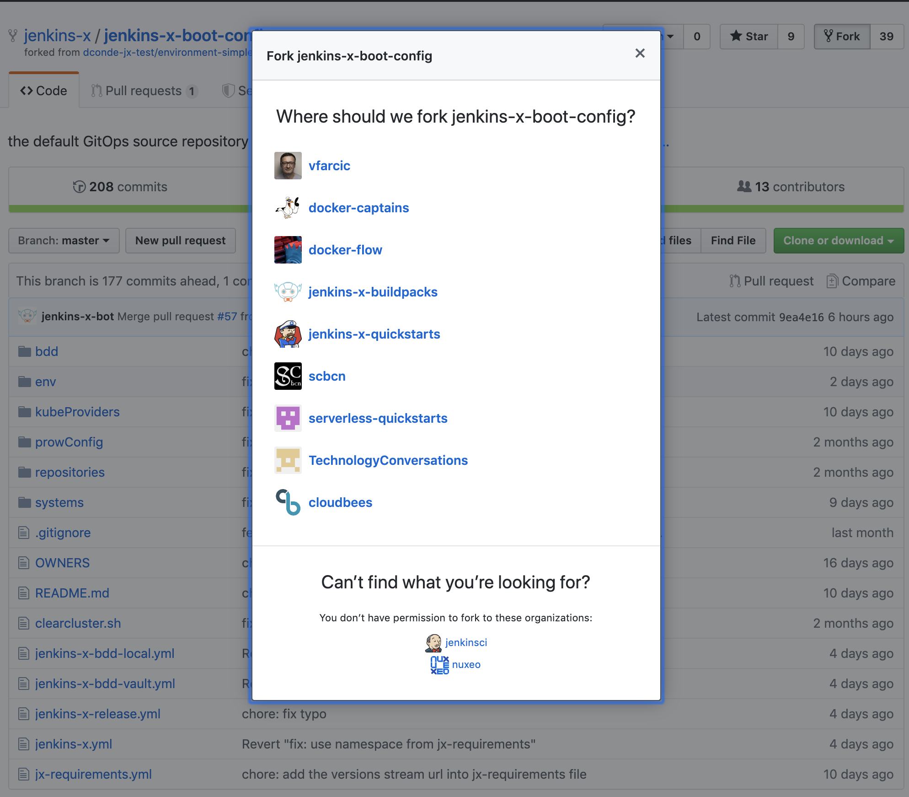

# Applying GitOps Principles To Jenkins X

W> At the time of this writing (October 2019), the examples in this chapter are validated only with **serverless Jenkins X** in **GKE**. Jenkins X Boot is currently verified by the community to work only there, even though it likely works in EKS, AKS, and other Kubernetes flavors. Over time, the community will be adding support for all Kubernetes distributions, and, with a slight delay, I will be updating this chapter to reflect that. Still, there will be an inevitable delay between the progress of that support and me incorporating it into this book, so I strongly advise you to check the official documentation to see whether your Kubernetes flavor is added.

If there is a common theme in Jenkins X, that is GitOps. The platform was designed and built around the idea that everything is defined as code, that everything is stored in Git, and that every change to the system is initiated by a Git webhook. It's a great concept, and we should ask ourselves whether we were applying it in all our examples. What do you think?

Using a single `jx create cluster` command to create a whole cluster and install all the tools that comprise Jenkins X is excellent. Isn't it?

The community behind Jenkins X thought that providing a single command that will create a cluster and install Jenkins X is a great idea. But we were wrong. What we did not envision initially was that there is an almost infinite number of permutations we might need. There are too many different hosting providers, too many different Kubernetes flavors, and too many components we might want to have inside our clusters. As a result, the number of arguments in `jx create cluster` and `jx install` commands was growing continuously. What started as a simple yet handy feature ended up as a big mess. Some were confused with too many arguments, while others thought that too many are missing. In my opinion, Jenkins X, in this specific context, tried to solve problems that were already addressed by other tools. We should not use Jenkins X to create a cluster. Instead, we should use the tool specialized for that. My favorite is Terraform, but almost any other (e.g., CloudFormation, Ansible, Puppet, Chef, etc.) would do a better job. What that means is that Jenkins X should assume that we already have a fully operational Kubernetes cluster. We should have an equivalent of the `jx install` command, while `jx create cluster` should serve particular use-cases, mostly related to demos and playgrounds, not a real production setting.

Now, you might just as well say, "if I'm not going to use `jx create cluster`, why should we use configuration management tools like Terraform? Isn't it easier to simply run `gcloud`, `eksctl`, or `az` CLI?" It is indeed tempting to come up with a single one-off command to do things. But, that leads us to the same pitfalls as when using UIs. We could just as easily replace the command with a button. But that results in a non-reproducible, non-documented, and not omnipotent way of doing things. Instead, we want to modify some (preferably declarative) files, push them to Git, and let that initiate the process that will converge the actual with the desired state. Or, it can be vice versa as well. We could run a process based on some files and push them later. As long as a Git repository always contains the desired state, and the system's actual state matches those desires, we have a reproducible, documented, and (mostly) automated way to do things. Now, that does not mean that commands and buttons are always a bad thing. Running a command or pressing a button in a UI works well only when that results in changes of the definition of the desired state being pushed to a Git repository so that we can keep track of changes. Otherwise, we're just performing arbitrary actions that are not documented and not reproducible. What matters is that Git should always contain the current state of our system. How we get to store definitions in Git is of lesser importance.

I'm rambling how bad it is to run arbitrary commands and pushing buttons because that's what we were doing so far. To be fair, we did follow GitOps principles most of the time, but one crucial part of our system kept being created somehow arbitrarily. So far, we were creating a Kubernetes cluster and installing Jenkins X with a single `jx create cluster` command, unless you are running it in an existing cluster. Even if that's the case, I taught you to use the `jx install` command. No matter which of the two commands you used, the fact is that we do not have a place that defines all the components that constitute our Jenkins X setup. That's bad, and it breaks the GitOps principle that states that everything is defined as code and stored in a Git repository, and that Git is the only one that initiates actions aimed at converging the actual into the desired state. We'll change that next by adding the last piece of the puzzle that prevented us from having the full system created by following the GitOps principles.

We'll learn how *Jenkins X Boot* works but, before we do that, we'll take a quick look at a cardinal sin we were committing over and over again.

## Discussing The Cardinal Sin

Our applications and their direct third-party dependencies are managed by Jenkins X pipelines. A process is initiated with a push to a Git repository, thus adhering to GitOps principles. If our applications have direct third-party dependencies, we'll specify them in `requirements.yaml`. We've been doing that for a while, and there is probably no need to revisit the process that works well.

If we move higher into system-level third-party applications, we had mixed results so far. We could specify them as dependencies in environment repositories. If, for example, we need Prometheus in production, all we have to do is define it as yet another entry in `requirements.yaml` in the repository associated with it. Similarly, if we'd like to deploy it to the staging environment for testing, we could specify it in the repository related to staging. So far, so good. We were following GitOps principles. But, there was one crucial application in this group that we chose to deploy ignoring all the best practices we established so far. The one that eluded us is Jenkins X itself.

I was very vocal that we should enforce GitOps principles as much as we can. I insisted that everything should be defined as code, that everything should be stored in Git, and that only Git can initiate actions that will change the state of the cluster. Yet, I failed to apply that same logic to the creation of a cluster and installation of Jenkins X. Running commands like `jx create cluster` and `jx install` goes against everything I preached (at least in this book). Those commands were not stored in Git, and they are not idempotent. Other people working with us would not be able to reproduce our actions. They might not even know what was done and when.

So, why did I tell you to do things that go against my own beliefs?

Running `jx create cluster` command was the easiest way to get you up to speed with Jenkins X quickly. It is the fastest way to create a cluster and install Jenkins X. At the same time, it does not need much of an explanation. *Run a command, wait for a few minutes, and start exploring the examples that explain how Jenkins X works.* For demos, for workshops, and for examples in a book, `jx create cluster` is probably the best way to get up-and-running fast. But, the time has come to say that such an approach is not good enough for any serious usage of Jenkins X. We explored most of the essential features Jenkins X offers, and I feel that you are ready to start using it in "real world". For that to happen, we need to be able to set up Jenkins X using the same principles we applied to other use-cases. We should store its definition in Git, and we should allow webhooks to notify the system if any aspect of Jenkins X should change. We should have a pipeline that drives Jenkins X through different stages so that we can validate that it works correctly. In other words, Jenkins X should be treated the same way as other applications. Or, to be more precise, maybe not in exactly the same way but, at least, with a process based on the same principles. We'll accomplish that with `jx boot`. But, before we explore it, there is one more level we should discuss.

We used `jx create cluster` both to create a cluster and to install Jenkins X. The latter part will, from now on, be done differently using `jx boot`. We still need to figure out how to create a cluster using code stored in Git. But, for better or worse, I won't teach you that part. That's outside the scope of this book. The only thing I will say is that you should define your whole infrastructure as code using one of the tools designed for that. My personal preference is [Terraform by HashiCorp](https://www.terraform.io/). However, since infrastructure-as-code is not the subject, I won't argue why I prefer Terraform over other tools. You can use anything you like; CloudFormation, Ansible, Puppet, Chef, SaltStack, etc.

All in all, we'll continue deploying our application and associated third-party services as well as system-level third-party apps using Jenkins X pipelines. We'll explore `jx boot` as a much better way to install and manage Jenkins X. As for infrastructure, it'll be up to you to choose what you prefer. From now on, I will provide commands to create a Kubernetes cluster. Do NOT take those commands as a recommendation. They are only the representation of my unwillingness to dive into the subject of "infrastructure as code" in this book. So, from now on, whenever you see `gcloud`, `eksctl`, or `az` commands, remember that is not what you should do with the production system.

Now that we got that out of the way, let's create a Kubernetes cluster and start "playing" with `jx boot`.

## Creating A Kubernetes Cluster (Without Jenkins X)

W> As mentioned at the beginning of this chapter, the examples are verified only in GKE, given that's the only currently (October 2019) supported platform for `jx boot`. Double-check the documentation to see whether that changed or be brave and try it out yourself with other Kubernetes flavors.

From now on, we will not use `jx create cluster` to create a Kubernetes cluster and install Jenkins X. Instead, I will assume that you will create a cluster any way you like (e.g., Terraform, `gcloud`, etc.) and we'll focus only on how to set up Jenkins X. If you're lazy and do not yet want to figure out the best way to create a cluster, the Gists that follow can get you up-to-speed fast. Just remember that the commands in them are not the recommended way to create a cluster, but rather the easiest and fastest method I could come up with.

I opted for commands instead of, let's say, Terraform for two reasons. First of all, I'm trying to keep this neutral as a way to avoid influencing you about the tool you should use for managing infrastructure. Now, I'm aware that I already stated a couple of times that I prefer Terraform, so I cannot say that I am neutral (I'm not), so that argument is not really valid, so let's jump to the second one. The more important reason for not using any tool for creating and setting up a cluster lies in the decision not to spend time explaining such a tool. This is neither time nor place to enter into configuration management discussion. 

Finally, please note that, just as before, the Gists contain instructions not only to create but also to destroy the cluster. For now, focus on creating it and postpone your destructive tendencies for the end.

I> All the commands from this chapter are available in the [18-boot.sh](https://gist.github.com/8af2cdfe9ffad2beac9c1e89cf863a46) Gist.

The Gists are as follows.

* Create new **GKE** cluster: [gke.sh](https://gist.github.com/1b7a1c833bae1d5da02f4fd7b3cd3c17)

Now that we have a Kubernetes cluster, we can turn our attention to Jenkins X Boot.

## What Is Jenkins X Boot?

What's wrong with `jx create cluster` and `jx install` commands? Why do we need a different way to install, manage, and upgrade Jenkins X? Those are ad-hoc commands that do not follow GitOpts principles. They are not idempotent (you cannot run them multiple times and expect the same result). They are not stored in Git, at least not in a form that the system can interpret and consume in an attempt to converge the desired into the actual state. They are not declarative.

We know all those reasons. They are the same issues we're trying to get rid of with other applications by implementing pipelines and declarative configurations and storing everything in Git. But, there is one more reason that we did not discuss yet.

The `jx` CLI contains a lot of custom-made code written specifically for Jenkins X. Part of it, however, consists of wrappers. The `jx create pullrequest` command is a wrapper around `hub`. Similarly, `jx create cluster` is a wrapper around `az` (AKS), `eksctl` (EKS), `gcloud` (GKE), and a few others. That's all great because `jx` allows us to have a single user-facing CLI that enables us to do (almost) everything we need, at least with the tasks related to the application lifecycle. But, in my opinion, Jenkins X tried to do more than it should. Its scope went overboard by attempting to enter into the configuration management sphere and trying to provide ways to create Kubernetes clusters. Truth be told, that was done mostly so that project contributors could spin up clusters easily.

Nevertheless, the feature became popular, and many started using it. That begs the question. If many are adopting something, isn't that a sign that it is useful?

Over time, the number of requests to add additional features (arguments) to `jx create cluster` kept increasing. People were missing things that are already available in the arguments of the commands it was wrapping, so the community kept adding them. At one point, the command became too confusing with too many arguments, and it went far beyond the initial idea to quickly span up a cluster, mostly for demo purposes.

Jenkins X boot is a result of two primary needs; to create infrastructure and to install and maintain Jenkins X and other system-level components. It, in a way, puts the creation of the cluster back to the commands like  `gcloud`, `az`, and `eksctl` (to name a few). At the same time, it urges people not to use them and to opt for tools like Terraform to create a Kubernetes cluster. On the other hand, it transforms the `jx install` process from being a command into a GitOps-based process. As you will see soon, `jx boot` entirely depends on a set of declarative files residing in a Git repository. It embraces GitOps principles, as it should have been done from the start.

So, given that having a declarative GitOps-based process is better than one-shot commands, you might be asking, "why did it take the community so long to create it?" Jenkins X Boot was released sometime around August 2019, over a year and a half after Jenkins X project started. What took us so long?

Jenkins X Boot had the "chicken and egg" type of a problem. Jenkins X assumes that everything is a pipeline triggered by a Git webhook. We make a change to Git, Git triggers a webhook, and that webhook notifies the cluster that there is a change that should trigger a pipeline that will ultimately converge the actual into the desired state. The process that performs that convergence is executed by Jenkins X running in that cluster. Now, if we say that the installation of Jenkins X should follow the same process, who will run those steps? How can we make Jenkins X install itself? If it doesn't exist, it cannot run the process that will install it. When there is nothing in a cluster, nothing cannot create something. That would be magic.

The solution to the problem was to allow `jx` CLI to run a pipeline as well. After all, until we install Jenkins X inside a Kubernetes cluster, the only thing we have is the CLI. So, the community made that happen. It created the necessary changes in the CLI that allows it to run pipelines locally. After that, all that was needed was to create a pipeline definition that we can use together with a bunch of configuration files that define all aspects of Jenkins X installation.

As a result, now we can use Jenkins X Boot to run the first build of a pipeline specifically defined for installation and upgrades of Jenkins X and all its dependencies. To make things even more interesting, the same pipeline can (and should) be executed by Jenkins X inside a Kubernetes cluster. Finally, we can have the whole platform defined in a Git repository, let a pipeline run the first time locally and install Jenkins X, as well as configure webhooks in that repo so that each consecutive change to it triggers new builds that will change the actual state of the platform into the desired one. There is no need to run the pipeline locally ever again after the initial run. From there on, it'll be handled by Jenkins X inside a Kubernetes cluster just like any other pipeline. Finally, we can treat Jenkins X just like any other application (platform) controlled by pipelines and defined as declarative files.

We could summarize all that by saying that ad-hoc commands are bad, that GitOps principles backed by declarative files are good, and that Jenkins X can be installed and managed by pipelines, no matter whether they are run by a local CLI or through Jenkins X running inside a Kubernetes cluster. Running a pipeline from a local CLI allows us to install Jenkins X for the first time (when it's still not running inside the cluster). Once it's installed, we can let Jenkins X maintain itself by changing the content of the associated repository. As an added bonus, given that a pipeline can run both locally and inside a cluster, if there's something wrong with Jenkins X in Kubernetes, we can always repair it locally by re-running the pipeline. Neat, isn't it?

Still confused? Let's we'll see it in practice soon and clarify the doubts. But, for now, there is one more subject we should discuss.

## Using Stable Releases Of Jenkins X

Jenkins X is a fast-paced project. The community is making multiple releases a day. It is not uncommon to have ten or even more releases within 24 hours. That is great because it fosters innovation. With such a speed, the community can experiment, get feedback, and adapt fast. However, that also comes at a cost. You cannot be sure that the latest release is stable. So, we decided to create *CloudBees Jenkins X Distribution*.

The major difference between open source Jenkins X and CloudBees Jenkins X Distribution is stability. Instead of making multiple releases a day, the distribution is released once a month. It does not have all the features that Jenkins X has. Instead, the Distribution contains only a subset of those that are validated. For production usage, the Distribution is, without a doubt, a much better option than open-source Jenkins X.

Now, at this point, you are probably thinking that CloudBees Jenkins X Distribution costs money, but that's not the case. It is free, just as the open-source version is free. The only question is whether the reduced number of features fit your use case. If they do, using the Distribution is a no-brainer.

Since the list of what Distribution supports is changing all the time, I will not list them here but, instead, redirect you to the [What is CloudBees Jenkins X Distribution?](https://docs.cloudbees.com/docs/cloudbees-jenkins-x-distribution/latest/install-guide/#_what_is_cloudbees_jenkins_x_distribution) section of the documentation. Please note that the list does not mean that you cannot use the other features, but rather that only those have been validated.

From now on, I will be using the Distribution for all the examples running in Jenkins X installed using Jenkins X Boot. However, you do not need to do the same. You can just as well use the open-source version if, for one reason or another, it fits better your situation. There will be some features that are available only in the Distribution, and I'll do my best to say in advance what those features are.

If you do choose to use the Distribution, and I strongly suggest that you do, you'll need to replace your current `jx` binary with the latest release of the Distribution. Apart from having a different binary, all the commands will be the same between open-source and the Distribution.

You can find the instruction for installing the `jx` release of the Distribution in the [CloudBees Jenkins X Distribution installation guide](https://docs.cloudbees.com/docs/cloudbees-jenkins-x-distribution/latest/install-guide/) page. Please go there and follow the instructions to replace your current `jx` binary.

W> At the time of this writing (November 2019), there is no Windows version of the binary. If you do prefer Windows, you have two options. You can create a Linux-based VM and use it to run the commands, or you might choose to fall back to the open-source version of Jenkins X.

Now that we clarified the differences between the open-source version and the Distribution, and I hopefully convinced you to use the latter, we can proceed and install Jenkins X in a very different way than what we're used to.

## Installing Jenkins X Using GitOps Principles

How can we install Jenkins X in a better way than what we're used to? Jenkins X configuration should be defined as code and reside in a Git repository, and that's what the community created for us. It maintains a GitHub repository that contains the structure of the definition of the Jenkins X platform, together with a pipeline that will install it, as well as a requirements file that we can use to tweak it to our specific needs.

Let's take a look at the repository.

```bash
open "https://github.com/cloudbees/cloudbees-jenkins-x-boot-config"
```

I> If you chose to use the open-source version (not the Distribution), the repository is [jenkins-x/jenkins-x-boot-config](https://github.com/jenkins-x/jenkins-x-boot-config).

We'll explore the files in it a bit later. Or, to be more precise, we'll explore those that you are supposed to customize. For now, what matters is that you should fork the repository since we'll make some modifications and use it as yet another environment repo firing webhooks to Jenkins X.



Now that you forked the repository, we'll define a variable `CLUSTER_NAME` that will, as you can guess, hold the name of the cluster we created a short while ago.

W> In the commands that follow, please replace the first occurrence of `[...]` with the name of the cluster and the second with your GitHub user.

```bash
CLUSTER_NAME=[...]

GH_USER=[...]
```

Now that we forked the Boot repo and we know how our cluster is called, we can clone the repository with a proper name that will reflect the naming scheme of our soon-to-be-installed Jenkins X.

W> If you are NOT using the Distribution (if you're using the open-source version), the name of the repository is `jenkins-x-boot-config`, NOT `cloudbees-jenkins-x-boot-config`. Please adapt the command that follows to reflect that.

```bash
git clone \
    https://github.com/$GH_USER/cloudbees-jenkins-x-boot-config.git \
    environment-$CLUSTER_NAME-dev
```

The key file that contains (almost) all the parameters that can be used to customize the setup is `jx-requirements.yml`. Let's take a look at it.

```bash
cd environment-$CLUSTER_NAME-dev

cat jx-requirements.yml
```

The output is as follows.

```yaml
autoUpdate:
  enabled: false
  schedule: ""
cluster:
  clusterName: ""
  environmentGitOwner: ""
  environmentGitPublic: true
  project: ""
  azure: {}
  provider: gke
  zone: ""
gitops: true
environments:
- key: dev
- key: staging
- key: production
ingress:
  domain: ""
  externalDNS: false
  tls:
    email: ""
    enabled: false
    production: false
kaniko: true
secretStorage: vault
storage:
  logs:
    enabled: true
    url: ""
  reports:
    enabled: true
    url: ""
  repository:
    enabled: true
    url: ""
versionStream:
  ref: b335faf15fddb5863a7b5360b03f48b72fe69340 
  url: https://github.com/cloudbees/cloudbees-jenkins-x-versions.git
webhook: prow
```

As you can see, that file contains values in a format that resembles `requirements.yaml` file used with Helm charts. It is split into a few sections.

I> The format of the `jx-requirements.yml` file might have changed since I wrote this section, so your output might be different. Nevertheless, what I'm describing should give you a good enough grip over the values you can tweak, and you should be able to extend that knowledge to those not represented here.

First, there is a group of values that define our `cluster`. You should be able to figure out what it represents by looking at the variables inside it. It probably won't take you more than a few moments to see that we have to change at least some of those values, so that's what we'll do next.

Please open `jx-requirements.yml` in your favorite editor and change the following values.

* Set `cluster.clusterName` to the name of your cluster. It should be the same as the name of the environment variable `CLUSTER_NAME`. If you already forgot it, execute `echo $CLUSTER_NAME`.
* Set `cluster.environmentGitOwner` to your GitHub user. It should be the same as the one we previously declared as the environment variable `$GH_USER`.
* Set `cluster.project` to the name of your GKE project, only if that's where your Kubernetes cluster is running. Otherwise, leave that value intact (empty). If you used one my Gist to create a GKE cluster, the name of the project should be in the environment variable `PROJECT`, so feel free to output it with `echo $PROJECT` if you are forgetful.
* Set `cluster.provider` to `gke` or to `eks` or to any other provider if you decided that you are brave and want to try currently unsupported platforms. Or, the things might have changed since I wrote this chapter, and your provider is indeed supported now.
* Set `cluster.zone` to whichever zone your cluster is running in. If you're running a regional cluster (as you should) than the value should be the region, not the zone. If, for example, you used my Gist to create a GKE cluster, the value should be `us-east1`.

We're finished with the `cluster` section, and the next in line is the `gitops` value. It instructs the system how to treat the Boot process. I don't believe it makes sense to change it to `false`, so we'll leave it as-is (`true`).

The next section contains the list of the `environments` that we're already familiar with. The keys are the suffixes, and the final names will be a combination of `environment-` with the name of the cluster followed by the `key`. We'll leave them intact.

The `ingress` section defines the parameters related to external access to the cluster (`domain`, TLS, etc.). We won't dive into it just yet. That will be left for later (probably the next chapter).

The `kaniko` value should be self-explanatory. When set to `true`, the system will build container images using Kaniko instead of, let's say, Docker. That is a much better choice since Docker cannot run in a container and, as such, poses a significant security risk (mounted sockets are evil), and it messes with Kubernetes scheduler given that it bypasses its API. In any case, Kaniko is the only supported way to build container images when using Tekton, so we'll leave it as-is (`true`).

Next, we have `secretStorage` currently set to `vault`. The whole platform will be defined in this repository, except for secrets (e.g., passwords). Pushing them to Git would be childish, so Jenkins X can store the secrets in different locations. If we'd change it to `local`, that location is your laptop. While that is better than a Git repository, you can probably imagine why that is not the right solution. Keeping them locally complicates cooperation (they exist only on your laptop), is volatile, and is only slightly more secure than Git. A much better place for secrets is [HashiCorp Vault](https://www.vaultproject.io). It is the most commonly used solution for secrets management in Kubernetes (and beyond), and Jenkins X supports it out of the box.

All in all, secrets storage is an easy choice, and we'll keep it to its default value `vault`.

Below the `secretStorage` value is the whole section that defines `storage` for `logs`, `reports`, and `repository`. If enabled, those artifacts will be stored on a network drive. As you already know, containers and nodes are short-lived, and if we want to preserve any of those, we need to store them elsewhere. That does not necessarily mean that network drives are the best place, but rather that's what comes out of the box. Later on, you might choose to change that and, let's say, ship logs to a central database like ElasticSearch, PaperTrail, CloudWatch, StackDriver, etc.

For now, we'll keep it simple and keep the default values (`true`) that enable network storage for all three types of artifacts.

The `versionsStream` section defines the repository that contains versions of all the packages (charts) used by Jenkins X. You might choose to fork that repository and control versions yourself. Before you jump into doing just that, please note that Jenkins X versioning is quite complex, given that many packages are involved. Leave it be unless you have a very good reason to take over the control, and that you're ready to maintain it.

Finally, at the time of this writing (October 2019), `webhook` is set to `prow`. It defines the end-point that receives webhooks and forwards them to the rest of the system, or back to Git.

As you already know, Prow supports only GitHub. If that's not your Git provider, Prow is a no-go. As an alternative, we could set it to `jenkins`, but that's not the right solution either. Jenkins (without X) is not going to be supported for long, given that the future is in Tekton. It was used in the first generation of Jenkins X only because it was a good starting point and because it supports almost anything we can imagine. But, the community embraced Tekton as the only pipeline engine, and that means that static Jenkins X is fading away and that it is used mostly as a transition solution for those accustomed to the "traditional" Jenkins.

So, what can we do if `prow` is not a choice if you do not use GitHub, and `jenkins` days are numbered? To make things more complicated, even Prow will be deprecated sometime in the future (or past depending when you read this). It will be replaced with *Lighthouse*, which, at least at the beginning, will provide similar functionality as Prow. Its primary advantage when compared with Prow is that Lighthouse will (or already does) support all major Git providers (e.g., GitHub, GitHub Enterprise, Bitbucket Server, Bitbucket Cloud, GitLab, etc.). At some moment, the default value of `webhook` will be `lighthouse`. But, at the time of this writing (October 2019), that's not the case since `Lighthouse` is not yet stable and production-ready. It will be soon. Or, maybe it already is, and I did not yet rewrite this chapter to reflect that.

In any case, we'll keep `prow` as our `webhook` (for now).

Let's take a peek at how `jx-requirements.yml` looks like now.

```bash
cat jx-requirements.yml
```

In my case, the output is as follows (yours is likely going to be different).

```yaml
autoUpdate:
  enabled: false
  schedule: ""
cluster:
  clusterName: "jx-boot"
  environmentGitOwner: "vfarcic"
  environmentGitPublic: true
  project: "devops-26"
  azure: {}
  provider: gke
  zone: "us-east1"
gitops: true
environments:
- key: dev
- key: staging
- key: production
ingress:
  domain: ""
  externalDNS: false
  tls:
    email: ""
    enabled: false
    production: false
kaniko: true
secretStorage: vault
storage:
  logs:
    enabled: true
    url: ""
  reports:
    enabled: true
    url: ""
  repository:
    enabled: true
    url: ""
versionStream:
  ref: b335faf15fddb5863a7b5360b03f48b72fe69340 
  url: https://github.com/cloudbees/cloudbees-jenkins-x-versions.git
webhook: prow
```

I> Feel free to modify some values further or to add those that we skipped. If you used my Gist to create a cluster, the current setup will work. On the other hand, if you created a cluster on your own, you will likely need to change some values.

Now, you might be worried that we missed some of the values. For example, we did not specify a domain. Does that mean that our cluster will not be accessible from outside? We also did not specify `url` for storage. Will Jenkins X ignore it in that case?

The truth is that we specified only the things we know. For example, if you created a cluster using my Gist, there is no Ingress, so there is no external load balancer that it was supposed to create. As a result, we do not yet know the IP through which we can access the cluster, and we cannot generate a `.nip.io` domain. Similarly, we did not create storage. If we did, we could have entered addresses into `url` fields.

Those are only a few examples of the unknowns. We specified what we know, and we'll let Jenkins X Boot figure out the unknowns. Or, to be more precise, we'll let the Boot create the resources that are missing and thus convert the unknowns into knowns.

W> In some cases, Jenkins X Boot might get confused with the cache from the previous Jenkins X installations. To be on the safe side, delete the `.jx` directory by executing `rm -rf ~/.jx`.

Off we go. Let's install Jenkins X.

```bash
jx boot
```

Now we need to answer quite a few questions. In the past, we tried to avoid answering questions by specifying all answers as arguments to commands we were executing. That way, we had a documented method for doing things that do not end up in a Git repository. Someone else could reproduce what we did by running the same commands. This time, however, there is no need to avoid questions since everything we'll do will be stored in a Git repository. Later on, we'll see where exactly will Jenkins X Boot store the answers. For now, we'll do our best to provide the information is needs.

I> The Boot process might change by the time you read this. If that happens, do your best to answer by yourself the additional questions that are not covered here.

We can see that, after a while, we were presented with two warnings stating that TLS is not enabled for `Vault` and `webhooks`. If we specified a "real" domain, Boot would install Let's Encrypt and generate certificates. But, since I couldn't be sure that you have a domain at hand, we did not specify it, and, as a result, we will not get certificates. While that would be unacceptable in production, it is quite OK as an exercise.

As a result of those warnings, the Boot is asking us whether we `wish to continue`. Type `y` and press the enter key to continue.

Given that Jenkins X creates multiple releases a day, the chances are that you do not have the latest version of `jx`. If that's the case, the Boot will ask, `would you like to upgrade to the jx version?`. Press the enter key to use the default answer `Y`. As a result, the Boot will upgrade the CLI, but that will abort the pipeline. That's OK. No harm's done. All we have to do is repeat the process but, this time, with the latest version of `jx`.

```bash
jx boot
```

The process started again. We'll skip commenting on the first few questions to `jx boot the cluster` and to `continue` without TLS. Answers are the same as before (`y` in both cases).

The next set of questions is related to `long term storage` for logs, reports, and repository. Press the enter key to all three questions, and the Boot will create buckets with auto-generated unique names.

From now on, the process will create the secrets and install CRDs (Custom Resource Definitions) that provide custom resources specific to Jenkins X. Then, it'll install nginx Ingress (unless your cluster already has one) and set the domain to `.nip.io` since we did not specify one. Further on, it will install CertManager, which will provide Let's Encrypt certificates. Or, to be more precise, it would provide the certificates if we specified a domain. Nevertheless, it's installed just in case we change our minds and choose to update the platform by changing the domain and enabling TLS later on.

The next in line is Vault. The Boot will install it and attempt to populate it with the secrets. But, since it does not know them just yet, the process will ask us another round of questions. The first one in this group is the `Admin Username`. Feel free to press the enter key to accept the default value `admin`. After that comes `Admin Password`. Type whatever you'd like to use (we won't need it today).

The process will need to know how to access our GitHub repositories, so it asks us for the Git `username`, `email address`, and `token`. I'm sure that you know the answers to the first two questions. As for the token, if you did not save the one we created before, you'll need to create a new one. Do that, if you must, and feed it to the Boot. Finally, the last question related to secrets is `HMAC token`. Feel free to press the enter key, and the process will create it for you.

Finally comes the last question. `Do you want to configure an external Docker Registry?` Press the enter key to use the default answer (`N`) and the Boot will create it inside the cluster or, as in case of most cloud providers, use the registry provided as a service. In case of GKE, that would be GCR, for EKS that's ECR, and if you're using AKS, that would be ACR. In any case, by not configuring an external Docker Registry, the Boot will use whatever makes the most sense for a given provider.

The rest of the process will install and configure all the components of the platform. We won't go into all of them since they are the same as those we used before. What matters is that the system will be fully operational a while later.

The last step will verify the installation. You might see a few warnings during this last step of the process. Don't be alarmed. The Boot is most likely impatient. Over time, you'll see the number of `running` Pods increasing and those that are `pending` decreasing, until all the Pods are `running`.

That's it. Jenkins X is now up-and-running. On the surface, the end result is the same as if we used the `jx install` command but, this time, we have the whole definition of the platform with complete configuration (except for secrets) stored in a Git repository. That's a massive improvement by itself. Later on, we'll see additional benefits like upgrades performed by changing any of the configuration files and pushing those changes to the repository. But, for now, what matters is that Jenkins X is up-and-running. Or, at least, that's what we're hoping for.

## Exploring The Changes Done By The Boot

Now, let's take a look at the changes Jenkins X Boot did to the local copy of the repository.

```bash
git --no-pager diff origin/master..HEAD
```

That's a long output, isn't it? Jenkins X Boot changed a few files. Some of those changes are based on our answers, while others are specific to the Kubernetes cluster and the vendor we're using.

We won't comment on all the changes that were done, but rather on the important ones, especially those that we might choose to modify in the future.

If you take a closer look at the output, you'll see that it created the `env/parameters.yaml` file. Let's take a closer look at it.

```bash
cat env/parameters.yaml
```

The output is as follows.

```yaml
adminUser:
  password: vault:jx-boot/adminUser:password
  username: admin
enableDocker: false
pipelineUser:
  email: viktor@farcic.com
  token: vault:jx-boot/pipelineUser:token
  username: vfarcic
prow:
  hmacToken: vault:jx-boot/prow:hmacToken
```

The `parameters.yaml` file contains the data required for Jenkins X to operate correctly. There are the administrative `username` and `username` and the information that Docker is not enabled (`enableDocker`). The latter is not really Docker but rather that the system is not using an internal Docker Registry but rather an external service. Further on, we can see the `email`, the `token`, and the `username` pipeline needs for accessing our GitHub account. Finally, we can see the `hmacToken` required for the handshake between GitHub webhooks and `prow`.

As you can see, the confidential information is not available in the plan-text format. Since we are using Vault to store secrets, some values are references to the Vault storage. That way, it is safe for us to keep that file in a Git repository without fear that sensitive information will be revealed to prying eyes.

We can also see from the `git diff` output that the `parameters.yaml` did not exist before. Unlike `requirements.yml` that existed from the start (and we modified it), that one was created by `jx boot`.

Which other file did the Boot process create or modify?

We can see that it made some modifications to the `jenkins-x.yml` file. We did not explore it just yet, so let's take a look at what we have right now.

```bash
cat jenkins-x.yml
```

The output is too long to be presented in a book, and you can see it on your screen anyway.

That is a `jenkins-x.yml` file like any other Jenkins X pipeline. The format is the same, but the content is tailor-made for the Boot process. It contains everything it needs to install or, later on, upgrade the platform.

What makes this pipeline unique, when compared with those we explored earlier, is that the `buildPack` is set to `none`. Instead of relying on a buildpack, the whole pipeline is defined in that `jenkins-x.yml` file. Whether that's a good thing or bad depends on the context. On the one hand, we will not benefit from future changes the community might make to the Boot process. On the other hand, those changes are likely going to require quite a few other supporting files. So, the community decided not to use the buildpack. Instead, if you'd like to update the Boot process, you'll have to merge the repository you forked with the upstream.

Now, let's get to business and take a closer look at what's inside `jenkins-x.yml`.

We can see that it is split into two pipelines; `pullRequest` and  `release`.

The `pullRequest` is simple, and it consists of a single `stage` with only one `step`. It executes `make build`. If you take a look at `env/Makefile` you'll see that it builds the charts in the `kubeProviders` directory, and afterward, it lints it. The real purpose of the `pullRequest` pipeline is only to validate that the formatting of the charts involved in the Boot process is correct. It is very similar to what's being done with pull requests to the repositories associated with permanent environments like staging and production.

The "real" action is happening in the `release` pipeline, which, as you already know, is triggered when we make changes to the master branch.

The `release` pipeline contains a single stage with the same name. What makes it special is that there are quite a few steps inside it, and we might already be familiar with them from the output of the `jx boot` command.

We'll go through the steps very briefly. All but one of those are based on `jx` commands, which you can explore in more depth on your own.

The list of the steps, sorted by order of execution, is as follows.

|Step                       |Command                         |Description|
|---------------------------|--------------------------------|-----------|
|`validate-git`             |`jx step git validate`          |Makes sure that the `.gitconfig` file is configured correctly so that Jenkins X can interact with our repositories|
|`verify-preinstall`        |`jx step verify preinstall`     |Validates that our infrastructure is set up correctly before the process installs or upgrades Jenkins X|
|`install-jx-crds`          |`jx upgrade crd`                |Installs or upgrades Custom Resource Definitions required by Jenkins X|
|`install-velero`           |`jx step helm apply`            |Installs or upgrades [Velero](https://velero.io) used for creating backups of the system|
|`install-velero-backups`   |`jx step helm apply`            |Installs or upgrades Jenkins X nginx Ingress implementation|
|`install-nginx-controller` |`jx step helm apply`            |Installs nginx Ingress|
|`create-install-values`    |`jx step create install values` |Adds missing values (if there are any) to the `cluster/values.yaml` file used to install cluster-specific charts|
|`install-external-dns`     |`jx step helm apply`            |Installs or upgrades the support for external DNSes|
|`install-cert-manager-crds`|`kubectl apply`                 |Installs or upgrades CertManager CRDs|
|`install-cert-manager`     |`jx step helm apply`            |Installs or upgrades CertManager in charge of creating Let's Encrypt certificates|
|`install-acme-issuer...`   |`jx step helm apply`            |Installs or upgrades CertManager issuer|
|`install-vault`            |`jx step boot vault`            |Installs or upgrades HashiCorp Vault|
|`create-helm-values`       |`jx step create values`         |Creates or updates the `values.yaml` file used by Charts specific to the selected Kubernetes provider|
|`install-jenkins-x`        |`jx step helm apply`            |Installs Jenkins X|
|`verify-jenkins-x-env...`  |`jx step verify`                |Verifies the Jenkins X environment|
|`install-repositories`     |`jx step helm apply`            |Makes changes to the repositories associated with environments (e.g., webhooks)|
|`install-pipelines`        |`jx update webhooks`            |Updates webhooks for all repositories associated with applications managed by Jenkins X|
|`verify-installation`      |`jx step verify install`        |Validates Jenkins X setup|

Please note that some of the components (e.g., Vault) are installed, upgraded, or deleted depending on whether they are enabled or disabled in `jx-requirements.yml`.

As you can see, the process consists of the following major groups of steps.

* Validate requirements
* Define values used to apply Helm charts
* Apply Helm charts
* Validate the setup

The Helm charts used to set up the system are stored in `systems` and `env` directories. They do not contain templates, but rather only `values.yaml` and `requirements.yaml` files. If you open any of those, you'll see that the `requirements.yaml` file is referencing one or more Charts stored in remote Helm registries.

That's all we should know about the `jenkins-x.yml` file, at least for now. The only thing left to say is that you might choose to extend it by adding steps specific to your setup, or you might even choose to add those unrelated with Jenkins X. For now, I will caution against such actions. If you do decide to modify the pipeline, you might have a hard time merging it with upstream. That, by itself, shouldn't be a big deal, but there is a more important reason to exercise caution. I did not yet explain everything there is to know about Jenkins X Boot. Specifically, we are yet to explore Jenkins X Apps (not to be confused with Applications). They allow us to add additional capabilities (components, applications) to our cluster and manage them through Jenkins X Boot. We'll get there in due time. For now, we'll move to yet another file that was modified by the process.

Another file that changed is `jx-requirements.yml`. Part of the changes are those we entered, like `clusterName`, `environmentGitOwner`, and quite a few others. But, some of the moodifications were done by `jx boot` as well. Let's take a closer look at what we got.

```bash
cat jx-requirements.yml
```

The output is as follows.

```yaml
autoUpdate:
  enabled: false
  schedule: ""
bootConfigURL: https://github.com/cloudbees/cloudbees-jenkins-x-boot-config.git
cluster:
  azure: {}
  clusterName: jx-boot
  environmentGitOwner: vfarcic
  environmentGitPublic: true
  gitKind: github
  gitName: github
  gitServer: https://github.com
  namespace: jx
  project: devops-26
  provider: gke
  registry: gcr.io
  zone: us-east1
environments:
- ingress:
    domain: 35.185.53.115.nip.io
    externalDNS: false
    namespaceSubDomain: -jx.
    tls:
      email: ""
      enabled: false
      production: false
  key: dev
- ingress:
    domain: ""
    externalDNS: false
    namespaceSubDomain: ""
    tls:
      email: ""
      enabled: false
      production: false
  key: staging
- ingress:
    domain: ""
    externalDNS: false
    namespaceSubDomain: ""
    tls:
      email: ""
      enabled: false
      production: false
  key: production
gitops: true
ingress:
  domain: 35.185.53.115.nip.io
  externalDNS: false
  namespaceSubDomain: -jx.
  tls:
    email: ""
    enabled: false
    production: false
kaniko: true
secretStorage: vault
storage:
  backup:
    enabled: false
    url: ""
  logs:
    enabled: true
    url: gs://jx-boot-logs-...
  reports:
    enabled: true
    url: gs://jx-boot-reports-...
  repository:
    enabled: true
    url: gs://jx-boot-repository-...
vault: {}
velero: {}
versionStream:
  ref: b335faf15fddb5863a7b5360b03f48b72fe69340
  url: https://github.com/cloudbees/cloudbees-jenkins-x-versions.git
webhook: prow
```

As you can see both from `git diff` and directly from `jx-requirements.yml`, the file does not contain only the changes we made initially. The `jx boot` command modified it as well by adding some additional information. I'll assume that you do remember which changes you made, so we'll comment only on those done by Jenkins X Boot.

I> My output might not be the same as the one you're seeing on the screen. Jenkins X Boot might have features that did not exist at the time I wrote this chapter (October 2019). If you notice changes that I am not commenting on, you'll have to consult the documentation to get more information.

At the very top, we can see that `jx boot` added the `autoUpdate` section, which did not even exist in the repository we forked. That's normal since that repo does not necessarily contain all the entries of the currently available Boot schema. So, some might be added even if they are empty.

We won't go into `autoUpdate` just yet. For now, we're interested only in installation. Updates and upgrades are coming later.

Inside the `cluster` section, we can see that it set `gitKind` and `gitName` to `github` and `gitServer` to `https://github.com`. Jenkins X's default assumption is that you're using GitHub. If that's not the case, you can change it to some other Git provider. As I already mentioned, we'll explore that together with Lighthouse later. It also set the `namespace` to `jx`, which, if you remember, is the default Namespace for Jenkins X.

The `environments` section is new, as well. We can use one of its sub-entries to change Ingress used for a specific environment (e.g., `production`). Otherwise, the `ingress` entries (at the root) are applied to the whole cluster (to all the environments).

Speaking of `ingress`, you'll notice that the `domain` entry inside it was auto-generated. Since we did not specify a domain ourselves, it used `.nip.io` in the same way we were using it so far. Ingress, both on the cluster and on the environment level, is a separate topic that we'll explore later.

Finally, we can see that it added values to `url` entries in `storage`. We could have created storage and set those values ourselves. But we didn't. We let Jenkins X Boot create it for us and update those entries with the URLs. We'll explore in more detail what we can do (if anything) with those storages. For now, just note that the Boot created them for us.

That's it. Those are all the files that were changed.

As you already saw, Jenkins X Boot run a pipeline that installed the whole platform. Given that we did not have Jenkins X running inside the cluster, that pipeline was executed locally. But, we are not expected to keep maintaining our setup by running pipelines ourselves. If, for example, we'd like to upgrade some aspect of the platform, we should be able to push changes to the repository and let the system run the pipeline for us, even if that pipeline will affect Jenkins X itself. The first step towards confirming that is to check which pipelines we currently have in the cluster.

## Verifying Jenkins X Boot Installation

Let's take a quick look at the pipelines currently active in our cluster.

```bash
jx get pipelines -o yaml
```

The output is as follows.

```
- vfarcic/environment-jx-boot-dev/master
- vfarcic/environment-jx-boot-production/master
- vfarcic/environment-jx-boot-staging/master
```

We are already used to working with `production` and `staging` pipelines. What is new is the `dev` pipeline. That is the one we just executed locally. It is now available in the cluster as well, and we should be able to trigger it by pushing a change to the associated repository. Let's test that.

We'll explore the Jenkins X upgrade process later. For now, we just want to see whether the `dev` repository is indeed triggering pipeline activities. We'll do that by making a trivial change to the README.md file.

```bash
echo "A trivial change" \
    | tee -a README.md

git add .

git commit -m "A trivial change"

git push

jx get activities \
    --filter environment-$CLUSTER_NAME-dev \
    --watch
```

We pushed the changes to GitHub and started watching the activities of the `dev` pipeline. The output, when the activity is finished, should be as follows.

```
STEP                                      STARTED AGO DURATION STATUS
vfarcic/environment-jx-boot-dev/master #1       4m10s    3m52s Succeeded 
  release                                       4m10s    3m52s Succeeded 
    Credential Initializer 7jh9t                4m10s       0s Succeeded 
    Working Dir Initializer Tr2wz               4m10s       2s Succeeded 
    Place Tools                                  4m8s       2s Succeeded 
    Git Source Vfarcic Environment Jx...         4m6s      36s Succeeded https://github.com/vfarcic/environment-jx-boot-dev.git
    Git Merge                                   3m30s       1s Succeeded 
    Validate Git                                3m29s       1s Succeeded 
    Verify Preinstall                           3m28s      26s Succeeded 
    Install Jx Crds                              3m2s      10s Succeeded 
    Install Velero                              2m52s      12s Succeeded 
    Install Velero Backups                      2m40s       2s Succeeded 
    Install Nginx Controller                    2m38s      16s Succeeded 
    Create Install Values                       2m22s       0s Succeeded 
    Install External Dns                        2m22s      16s Succeeded 
    Install Cert Manager Crds                    2m6s       0s Succeeded 
    Install Cert Manager                         2m6s      16s Succeeded 
    Install Acme Issuer And Certificate         1m50s       2s Succeeded 
    Install Vault                               1m48s       8s Succeeded 
    Create Helm Values                          1m40s       3s Succeeded 
    Install Jenkins X                           1m37s     1m3s Succeeded 
    Verify Jenkins X Environment                  34s       5s Succeeded 
    Install Repositories                          29s       5s Succeeded 
    Install Pipelines                             24s       1s Succeeded 
    Update Webhooks                               23s       4s Succeeded 
    Verify Installation                           19s       1s Succeeded 
```

That's the first activity (`#1`) of the `dev` pipeline. To be more precise, it is the second one (the first was executed locally) but, from the perspective of Jenkins X inside the cluster, which did not exist at the time, that is the first activity. Those are the steps of Jenkins X Boot running inside our cluster.

We won't go through the changes that were created by that activity since there are none. We did not modify any of the files that matter. We already used those same files when we executed Jenkins X Boot locally. All we did was push the change of the README file from the local repository to GitHub. That triggered a webhook that notified the cluster that there are some changes to the remote repo. As a result, the first in-cluster activity was executed.

The reason I showed you that activity was not due to an expectation of seeing some change applied to the cluster (there were none), but to demonstrate that, from now on, we should let Jenkins X running inside our Kubernetes cluster handle changes to the `dev` repository, instead of running `jx boot` locally. That will come in handy later on when we explore how to upgrade or change our Jenkins X setup.

Please press *ctrl+c* to stop watching the activity.

Let's take a look at the Namespaces we have in our cluster.

```bash
kubectl get namespaces
```

The output is as follows.

```
NAME         STATUS AGE
cert-manager Active 28m
default      Active 74m
jx           Active 34m
kube-public  Active 74m
kube-system  Active 74m
velero       Active 33m
```

As you can see, there are no Namespaces for staging and production environments. Does that mean that we do not get them with Jenkins X Boot?

Unlike other types of setup, the Boot creates environments lazily. That means that they are not created in advance, but rather when used for the first time. In other words, the `jx-staging` Namespace will be created the first time we deploy something to the staging environment. The same logic is applied to any other environment, the production included.

To put your mind at ease, we can output the environments and confirm that staging and production were indeed created.

```bash
jx get env
```

The output is as follows.

```
NAME       LABEL       KIND        PROMOTE NAMESPACE     ORDER CLUSTER SOURCE                                                        REF    PR
dev        Development Development Never   jx            0             https://github.com/vfarcic/environment-jx-boot-dev.git        master 
staging    Staging     Permanent   Auto    jx-staging    100           https://github.com/vfarcic/environment-jx-boot-staging.git    master 
production Production  Permanent   Manual  jx-production 200           https://github.com/vfarcic/environment-jx-boot-production.git master 
```

`Staging` and `production` environments do indeed exist, and they are associated with corresponding Git repositories, even though Kubernetes Namespaces were not yet created. 

While we're on the subject of environments, we can see something that did not exist in the previous setups. What's new, in this output, is that the `dev` environment also has a repo set as the source. That was not the case when we were creating clusters with `jx create cluster` or installing Jenkins X with `jx install`. In the past, the `dev` environment was not managed by GitOps principles. Now it is.

The associated `source` is the repository we forked, and it contains the specification of the whole `dev` environment and a few other things. From now on, if we need to modify Jenkins X or any other component of the platform, all we have to do is push a change to the associated repository. A pipeline will take care of converging the actual with the desired state. From this moment onward, everything except infrastructure is managed through GitOps. I intentionally said "except infrastructure" because I did not show you explicitly how to create a pipeline that will execute Terraform or whichever tool you're using to manage your infra. However, that is not an excuse for you not to do it. By now, you should have enough knowledge to automate that last piece of the puzzle by creating a Git Repository with `jenkins-x.yml` and importing it into Jenkins X. If you do that, everything will be using GitOps, and everything will be automated, except writing code and pushing it to Git. Do not take my unwillingness to force a specific tool (e.g., Terraform) as a sign that you shouldn't walk that last mile.

To be on the safe side, we'll create a new quickstart project and confirm that the system is behaving correctly. We still need to verify that lazy creation of environments works as expected.

```bash
cd ..

jx create quickstart \
    --filter golang-http
```

We went back from the local copy of the `dev` repository and started the process of creating a new `quickstart`.

You might be wondering why we didn't use the `--batch-mode` as we did countless times before. This time, we installed Jenkins X using a different method, and the local cache does not have the information it needs to create a `quickstart` automatically. So, we'll need to answer a series of questions, just as we did at the beginning of the book. That is only a temporary issue. The moment we create the first quickstart manually, the information will be stored locally, and every consecutive attempt to create new quickstarts can be done with the `--batch-mode`, as long as we're using the same laptop.

Please answer the questions any way you like. Just bear in mind that I expect you to name the repository `jx-boot`. If you call it differently, you'll have to modify the commands that follow.

All that's left now is to wait until the activity of the pipeline created by the quickstart process is finished.

```bash
jx get activity \
    --filter jx-boot/master \
    --watch
```

Please press *ctrl+c* to stop watching the activity once it's finished.

We'll also confirm that the activity of the staging environment is finished as well.

```bash
jx get activity \
    --filter environment-$CLUSTER_NAME-staging/master \
    --watch
```

You know what to do. Wait until the new activity is finished and press *ctrl+c* to stop watching.

Let's retrieve the Namespaces again.

```bash
kubectl get namespaces
```

The output is as follows.

```
NAME         STATUS AGE
cert-manager Active 34m
default      Active 80m
jx           Active 40m
jx-staging   Active 55s
kube-public  Active 80m
kube-system  Active 80m
velero       Active 39m
```

As you can see, the `jx-staging` Namespace was created the first time an application was deployed to the associated environment, not when we installed the platform. The `jx-production` Namespace is still missing since we did not yet promote anything to production. Once we do, that Namespace will be created as well.

I won't bother you with the commands that would confirm that the application is accessible from outside the cluster, that we can create preview (pull request) environments, and that we can promote releases to production. I'm sure that, by now, you know how to do all that by yourself.

## What Now?

We did not dive into everything Jenkins X Boot offers. We still need to discuss how to use it to update or upgrade Jenkins X and the related components. There are also a few other features that we skipped. For now, I wanted you to get a taste of what can be done with it. We'll discuss it in more detail in the next chapter. Right now, you should have at least a basic understanding of how to install the platform using Jenkins X Boot. More will come soon.

Just like in the previous chapters, now you need to choose whether you want to move to the next chapter right away or you'd like to have a break. If you choose the latter, the Gists we used to create the cluster contain the instructions on how to destroy it as well. Once the cluster is no more, use the commands that follow to delete (most of) the repositories. The next chapter will contain an explanation of how to create everything we need from scratch.

```bash
hub delete -y \
    $GH_USER/environment-$CLUSTER_NAME-staging

hub delete -y \
    $GH_USER/environment-$CLUSTER_NAME-production

hub delete -y \
    $GH_USER/jx-boot

rm -rf jx-boot
```

You'll notice that we did NOT delete the `dev` repository used with Jenkins X Boot. We'll keep it because that'll simplify the installation in the next chapter. That's the beauty of GitOps. The Jenkins X definition is in Git, and it can be used or reused whenever we need it.
