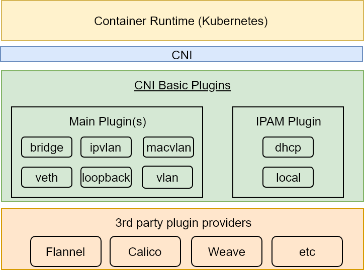
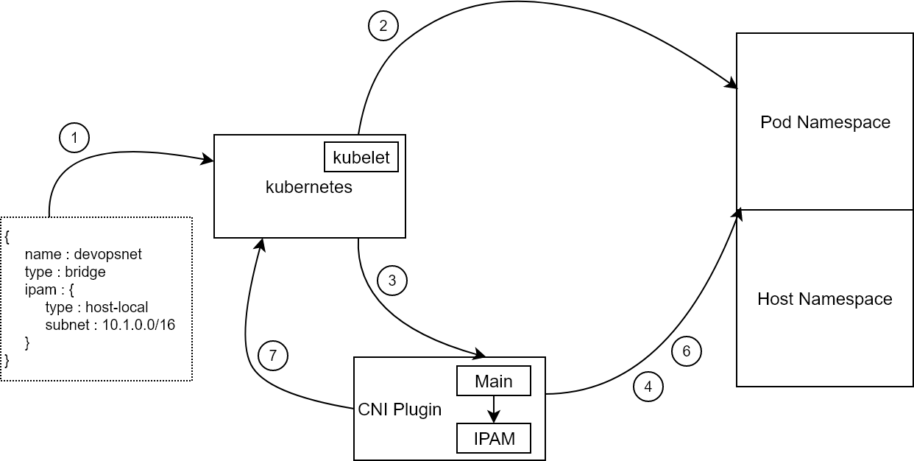

# Kubernetes Networking

T> Networking is the backbone of distributed applications. Without dynamically created software-defined networks and service discovery, distributed applications would not be able to find each other.

Our applications becoming more and more distributed in nature in recent years with advent of micro-services and containers are changing the way we deploy and run our applications. By distributed means you need to connect these containers which makes container networking a essential component in your architectural decisions. Since there are several ways you can connect containers it makes container networking difficult to understand at first place and then you need to make a decision which one best suited to your application infrastructure.

Before we go deep into kubernetes networking I think it's important to understand how we reach here. A single Container alone can't do much of it's own to serve a request, most of the time it either need to reach other container or some external service. That means it need to connect and probably need to connect to container hosted on some other host. Also, containers are ephemeral by design which makes networking more complicated. At core, container networking uses linux kernel features like network namespace, IPAM, NAT, bridges, Veth, etc. Containers can be connected to the same network stack as the host or they can be connected to their own network namespace and then connected to the externally in different ways. Initial container networking solutions were limited to connect containers running on a single host and make them reachable on the network.

Host networking mode was one of the early container networking modes which uses host network namespace and port mapping to provide connectivity to a container. This approach put onus on the users to manage the port for the containers, if you have several applications and developers then it become complex port management task and difficult to avoid port conflicts. It was not scalable solution.

Bridge mode solves the problem of port management. It is based on linux bridge and uses virtual bridge to have container their own network namespace. Each container gets the IP from bridge subnet and have own port space. But for external communication, containers need to use host IP and NAT is required to translate containerIp:Port to hostIp:Port. NAT translations are performed using linux IP tables which increase the performance overhead in comparison to host networking mode.

However, these solutions are limited to single host connectivity and don’t solve the problem of multi-host container networking. In reality your application containers going to run on multi-host environment. At same time, Container projects start working on a model where networking was decoupled from the container runtime since every organization going to have their own networking flavor. In this evolved networking model, container networking is implemented by a plugin that manages the network stack for the containers and assign IP addresses. Container runtime uses well defined API to interact with network plugins. There are two popular container networking model available i.e. Container Network Model (CNM) by Docker and Container Network Interface (CNI) by CNCF. More detail on CNI later in the chapter. Kubernetes team decided to use CNI over CNM. There is long post [here](https://kubernetes.io/blog/2016/01/why-kubernetes-doesnt-use-libnetwork/) to explain this but in short CNI is more in line with kubernetes philosophy and fit well to support multiple container runtimes.

Kubernetes has pluggable architecture. The team behind it (probably) made a right decision to keep networking (just as almost everything else) as pluggable modules. Each organization is free to choose the type of networking that suits specific goals. Selecting the correct type is one of the critical decisions we need to make when setting up a Kubernetes cluster.

One of the main benefits of architecture like Kubernetes' is that anyone can develop a module and plug it in. As a result, we got a myriad of projects (some open source and some enterprise) we can choose. Having a choice is both a blessing and a curse. We can pick the pieces we want, but we need to spend a considerable time exploring which option suits us better. That is, unless we choose to use one of the opinionated distributions that already come with (mostly) predefined modules and ways of operating the cluster.

We'll focus on providing you with the information about some of the most commonly used networking solutions. The objective is to prepare you so that you can navigate the maze. You won't get the experience with every networking solution available in the market. That would be impossible. There are too many available today, and we can expect many more to come. Still, we hope is that you will gain knowledge about those that are gaining the most attention. Even if none of those we'll explore ends up being your choice, you will know what to look for and how to evaluate networking providers.

Kubernetes' approach to the communication problem in the container world is using components like Services, Ingress, kubeDNS, etc. For Pod-to-Pod communication, Kubernetes doesn't dictate how networking is implemented. However, it does impose some basic requirements which providers need to fulfill.

At its core, Kubernetes networking model guarantees a few things.

* All Pods can communicate with all other pods without NAT.
* All nodes can communicate with all pods (and vice-versa) without NAT.
* The IP that a Pod sees is the same IP others can use to communicate with it.

Currently, Kubernetes provides networking using either *kubenet* or *Container Network Interface (CNI)* plugins. The latter is used as an interface between network providers and Kubernetes networking.

Kubernetes' default networking driver is kubenet. It is a very basic networking plugin typically useful for single node environments or in the cloud with routing rules. It has limited features, and it is often not a good option for a vast majority of implementations, especially when running bigger clusters. As an example, kubenet used in AWS is limited to 50 nodes. Such a limitation is imposed by the limits of routing tables. While fifty nodes are more than many smaller companies need, the moment we decide to scale that number, we need to start thinking about other solution.

Even if you do run your cluster in, let's say, AWS, and you do not need more than fifty nodes, you will still find kubenet limiting when compared with some other solutions. Even if the limitation in the maximum number of nodes is not enough and you discover that you do not need the additional features, there is still the fact that Kubernetes roadmap plans to move away from kubenet. It is deprecated in favor of CNI.

Considering all that, we'll skip exploring kubenet and focus on CNI.

## What Is Container Network Interface (CNI)?

Container Network Interface (CNI) consists of a specification and libraries which can be used for writing plugins. It also contains a few basic plugins. CNI is a straightforward specification which concerns only with network connectivity of containers and removing networking resources when containers are deleted.

CNI specification was developed initially by CoreOS for [rkt](https://coreos.com/rkt) project and are now managed by [Cloud Native Computing Foundation (CNCF)](https://www.cncf.io/) under the [ContainerNetworking team](https://github.com/containernetworking). It has two branches. The first one is in charge of defining CNI specifications, while the second branch is working on plugins reference implementation of CNI specs.

CNI and container runtimes are intricately tied together. Container runtime creates network namespace and hands it over to a set of CNI plugin(s) which setup interfaces, iptables, routing, etc.

CNI plugins are categorized into two groups. The main plugins are responsible for setting up a network interface into the container network namespace as well as assigning IP to the interface and setting the routes. The routes are set up by invoking appropriate IPAM plugin which determines the interface IP/subnet, gateway and routes, and it returns that information to the *main* plugin which applies them.

The ContainerNetworking team created several basic plugins as reference implementations. We are going to use some of those later. If you are impatient, please visit [containernetworking/plugins](https://github.com/containernetworking/plugins) repository for more info.

The steps that follow describe how a Pod gets its network.

1. User supplies network configuration file which contains plugin type and IP.
2. Kubelet works with CNI plugins on each host in a Kubernetes cluster. It creates Pod namespace with pause container. Pause container is constructed for each Pod. It serves network namespace to other containers in the Pod.
3. Kubelet has CNI library which invokes CNI main plugin and hands over namespace and other network information.
4. CNI plugin sets network elements like interfaces, iptables, routing, etc. for Pod and host network namespace.
5. CNI main plugin invokes IPAM plugin for IP allocation, and IPAM returns IP information in json format to the main plugin.
6. The main plugin uses the information obtained from the IPAM plugin to configure the network interface.
7. The main plugin updates API server with network information for the Pod.

The most commonly used networking options can be grouped into *Overlay*, *Layer 2*, and *Layer 3* solutions. Some third-party providers are even extending the core networking features. A good example is NetworkPolicy which can be defined only through a few networking solutions.

Choosing the right networking is one of the essential tasks. The choice should be based on a few criteria which we'll explore through practical examples.

First things first. We cannot explore networking through hands-on examples without having a cluster. So, our first task will be to create one.
