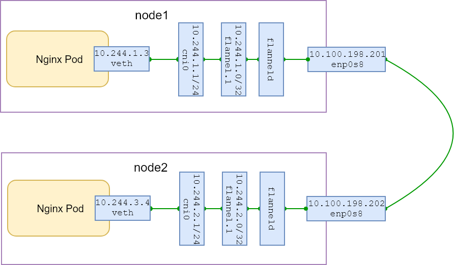

## TODO

- [ ] Code (neerajkothari)
- [ ] Code review (vfarcic)
- [ ] Write (neerajkothari)
- [ ] Text review (vfarcic)
- [ ] Diagrams (neerajkothari)
- [ ] Gist (neerajkothari)
- [ ] Review the title (neerajkothari)
- [ ] Proofread (vfarcic)
- [ ] Add to Book.txt (vfarcic)
- [ ] Publish on LeanPub.com (vfarcic)

# Setup Network Using Flannel

In this chapter we going to use Flannel plugin to setup pod network where pods can communicate across nodes. Lets create kubernetes cluster using our *create local cluster with kubadmn guide*. You need to supply pod network when initializing kubernetes master, Use below command to initialize the master instead.

```bash
sudo kubeadm init --apiserver-advertise-address 10.100.198.200 --pod-network-cidr 10.244.0.0/16
```

Next step, we going to create pod network with provider Flannel. Flannel establishes an overlay network using VXLAN that helps to connect containers across multiple hosts. The flannel manifest defines four things:

1. A ClusterRole and ClusterRoleBinding for role based access control (RBAC).
2. A service account for flannel to use.
3. A ConfigMap containing both a CNI configuration and a flannel configuration. The network in the flannel configuration should match the pod network CIDR. The backend is VXLAN.
4. A DaemonSet to deploy the flannel pod on each Node. 

When you run pods, they will be allocated IP addresses from the pod network CIDR. No matter which node those pods end up on, they will be able to communicate with each other. Lets create pod network using `flannel.yml`,

```bash
kubectl --kubeconfig ./admin.conf apply -f flannel.yml
```

To validate if network installed properly, 

```bash
kubectl --kubeconfig ./admin.conf get pods -n kube-system -l app=flannel

NAME                    READY     STATUS    RESTARTS   AGE
kube-flannel-ds-59hmh   1/1       Running   0          45s
kube-flannel-ds-v8m8f   1/1       Running   0          45s
kube-flannel-ds-zzkf7   1/1       Running   0          45s
```

Once pod network is established, all nodes in the cluster should be in the ready state. It may take some time. 

```bash
kubectl --kubeconfig ./admin.conf get nodes

NAME      STATUS    ROLES     AGE       VERSION
master    Ready     master    8m        v1.10.0
node1     Ready     <none>    3m        v1.10.0
node2     Ready     <none>    3m        v1.10.0
```

## Testing pod network

Now, we should be deploying some pods to see if kubernetes network working fine or not. We will use simple nginx deployment with two replicas.

```bash
kubectl --kubeconfig ./admin.conf apply -f nginx-deployment.yaml

deployment "nginx-deployment" created`
```

Below command will tell us if both pods are running and deployed on two different nodes.

```bash
kubectl --kubeconfig ./admin.conf get pods -o wide

NAME                                READY     STATUS    RESTARTS   AGE       IP           NODE
nginx-deployment-75675f5897-4dm42   1/1       Running   0          2m        10.244.1.2   node1
nginx-deployment-75675f5897-rfj56   1/1       Running   0          2m        10.244.3.3   node2
```

With the help of ping and curl we can test whether flannel was able to meet kubernetes network requirements,

* All nodes can communicate with all pods (and vice-versa) without NAT

```bash
vagrant ssh node1

ping 10.244.1.2  (same node)

PING 10.244.1.2 (10.244.1.2) 56(84) bytes of data.
64 bytes from 10.244.1.2: icmp_seq=1 ttl=64 time=0.054 ms
64 bytes from 10.244.1.2: icmp_seq=2 ttl=64 time=0.060 ms

ping 10.244.3.3 (across node)

PING 10.244.3.3 (10.244.3.3) 56(84) bytes of data.

exit (from node1)
```

`ping` test tell us that pods are not reachable across host. We can ping pod deployed on node1 but not on node2. 

* All pods can communicate with all other pods without NAT

Lets see if pod on node1 can reach to pod on node2.

```bash
kubectl --kubeconfig ./admin.conf exec -it nginx-deployment-75675f5897-4dm42 ping 10.244.3.3

PING 10.244.3.3 (10.244.3.3): 48 data bytes
60 bytes from 10.244.1.1: Destination Net Unreachable
```

## Trobuleshoot

We have problem somewhere and need to troubleshoot with help of some networking tools. Remember, above in the chapter we mentioned that networking abstraction is good but you should not take it grantedly. It is important that you should have some networking expertise in your team.

Check if subnet is conflicting,

```bash
kubectl --kubeconfig ./admin.conf get pods -n kube-system -l app=flannel -o wide

NAME                    READY     STATUS    RESTARTS   AGE       IP               NODE
kube-flannel-ds-v8m8f   1/1       Running   0          1h        10.100.198.200   master
kube-flannel-ds-zzkf7   1/1       Running   0          1h        10.100.198.201   node1
kube-flannel-ds-59hmh   1/1       Running   0          1h        10.100.198.202   node2

kubectl --kubeconfig ./admin.conf exec -n kube-system kube-flannel-ds-v8m8f cat //run//flannel//subnet.env
FLANNEL_NETWORK=10.244.0.0/16
FLANNEL_SUBNET=10.244.0.1/24

kubectl --kubeconfig ./admin.conf exec -n kube-system kube-flannel-ds-zzkf7 cat //run//flannel//subnet.env
FLANNEL_NETWORK=10.244.0.0/16
FLANNEL_SUBNET=10.244.1.1/24

kubectl --kubeconfig ./admin.conf exec -n kube-system kube-flannel-ds-59hmh cat //run//flannel//subnet.env
FLANNEL_NETWORK=10.244.0.0/16
FLANNEL_SUBNET=10.244.3.1/24
```

No issue here, all nodes got different subnet. Next, check if routes configured properly,

```bash
kubectl --kubeconfig ./admin.conf exec -n kube-system kube-flannel-ds-zzkf7 -- route -n

Destination     Gateway         Genmask         Flags Metric Ref    Use Iface
0.0.0.0         10.0.2.2        0.0.0.0         UG    0      0        0 enp0s3
10.0.2.0        0.0.0.0         255.255.255.0   U     0      0        0 enp0s3
10.100.198.0    0.0.0.0         255.255.255.0   U     0      0        0 enp0s8
10.244.0.0      10.244.0.0      255.255.255.0   UG    0      0        0 flannel.1
10.244.1.0      0.0.0.0         255.255.255.0   U     0      0        0 cni0
10.244.3.0      10.244.3.0      255.255.255.0   UG    0      0        0 flannel.1
172.17.0.0      0.0.0.0         255.255.0.0     U     0      0        0 docker0
```

Flannel configured routes properly, node2(10.244.3.0) traffic is being handle by flannel.1 interface. Next, lets capture traffic on  flannel.1 interface with tcmdump utility. Open another session to watch tcpdump.

```bash
vagrant ssh node1
ping 10.244.3.3

vagrant ssh node1

sudo tcpdump -i flannel.1
tcpdump: verbose output suppressed, use -v or -vv for full protocol decode
listening on flannel.1, link-type EN10MB (Ethernet), capture size 262144 bytes
20:55:02.971181 IP 10.244.1.0 > 10.244.3.3: ICMP echo request, id 5874, seq 1, length 64
```

The output from tcpdump suggest that flannel.1 interface is receiving traffic. Next, look at the flannel pod logs on node 1.


```bash
kubectl --kubeconfig ./admin.conf logs -n kube-system kube-flannel-ds-zzkf7

(removed lines for brevity, only top few lines)
Determining IP address of default interface
Using interface with name enp0s3 and address 10.0.2.15
Defaulting external address to interface address (10.0.2.15)
```

We have problem here, flannel decided to use enp0s3 instead of enp0s8 and enp0s3 is configured with same IP on all nodes for NATed external traffic. This is not the right interface we want to use with flannel. Vagrant creates two interfaces and flannel picked the first interface by default unless you provide configuration to flannel. 

## Fix the issue

We need to clean up, remove nginx deployment and flannel before we can apply the fix.

```
kubectl --kubeconfig ./admin.conf delete -f nginx-deployment.yaml

deployment "nginx-deployment" deleted

kubectl --kubeconfig ./admin.conf delete -f flannel.yml
```

We need to pass additional parameter to Flannel for interface enp0s8. `flannel_fix.yml` file has this fix as `--iface=enp0s8`. Lets recreate pod network and nginx.

```bash
kubectl --kubeconfig ./admin.conf apply -f flannel_fix.yml

kubectl --kubeconfig ./admin.conf get pods --all-namespaces -l app=flannel

NAMESPACE     NAME                    READY     STATUS    RESTARTS   AGE
kube-system   kube-flannel-ds-4mwc7   1/1       Running   0          35s
kube-system   kube-flannel-ds-fj8dg   1/1       Running   0          35s
kube-system   kube-flannel-ds-tjz4c   1/1       Running   0          35s

kubectl --kubeconfig ./admin.conf apply -f nginx-deployment.yaml

deployment "nginx-deployment" created

kubectl --kubeconfig ./admin.conf get pods -o wide

NAME                                READY     STATUS    RESTARTS   AGE       IP           NODE
nginx-deployment-75675f5897-46tfh   1/1       Running   0          12m       10.244.3.4   node2
nginx-deployment-75675f5897-rq75g   1/1       Running   0          12m       10.244.1.3   node1
```

Lets visualize our pod network,




Lets do our ping test again to validate kubernetes network requirement,

* All nodes can communicate with all pods (and vice-versa) without NAT

```bash
vagrant ssh node1

ping 10.244.1.3 (same node)

PING 10.244.1.3 (10.244.1.3) 56(84) bytes of data.
64 bytes from 10.244.1.3: icmp_seq=1 ttl=64 time=0.137 ms

ping 10.244.3.4 (across node)

PING 10.244.3.4 (10.244.3.4) 56(84) bytes of data.
64 bytes from 10.244.3.4: icmp_seq=1 ttl=63 time=0.403 ms

exit (from node1)
```

`ping` test tell us that now pod deployed on node2 is reachable from node1. 


* All pods can communicate with all other pods without NAT

Lets see if pod on node1 can reach to pod on node2.

```bash
$ kubectl --kubeconfig ./admin.conf exec -it nginx-deployment-75675f5897-rq75g ping 10.244.3.4

PING 10.244.3.4 (10.244.3.4): 48 data bytes
56 bytes from 10.244.3.4: icmp_seq=0 ttl=62 time=0.947 ms
```

This `ping` test tell us that now pod deployed on node2 is reachable from the pod deployed on node1. 


## What now?

We have explored the Flannel plugin for pod network and performed various test. Lets delete the cluster,

```bash
vagrant destroy -f
```
