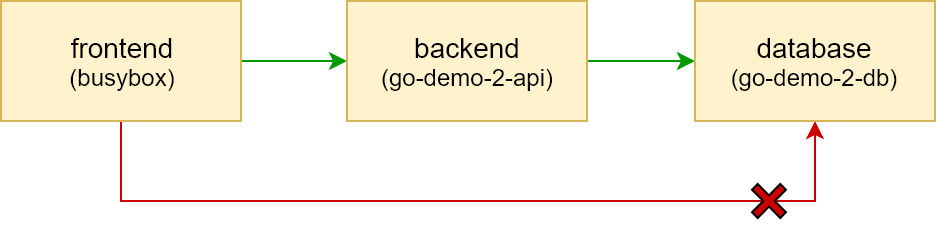

## TODO

- [ ] Code (neerajkothari)
- [ ] Code review (vfarcic)
- [ ] Write (neerajkothari)
- [ ] Text review (vfarcic)
- [ ] Diagrams (neerajkothari)
- [ ] Gist (neerajkothari)
- [ ] Review the title (neerajkothari)
- [ ] Proofread (vfarcic)
- [ ] Add to Book.txt (vfarcic)
- [ ] Publish on LeanPub.com (vfarcic)

# Network Policy using Calico

By default, there is no restriction on pods traffic in the kubernetes cluster which means all pods can communicate with each other. Kubernetes introduced since 1.7 new object type NetworkPolicy which applies traffic restrictions on a pod. By using NetworkPolicy you can apply restrictions on pods if you have multiple applications running in same cluster or multi layer architecure for example frontend pod should not have access to database pod. Network policies are implemented by network plugins but not all networking plugins supports network policy. So if you need this feature you need to select one of the networking plugin provider i.e. Calico, Romana, and Weave Net or you can choose two providers one for general networking for example Flannel and Calico for network policies. 

NetworkPolicy is defined in two parts, set of pods a policy apply to and other pods have access to this pod. NetworkPolicy also has some other features like egress restrictions, IP ranges, port restrictions, etc. 

Lets create kubernetes cluster using our *create local cluster with kubadmn guide*. You need to supply pod network when initializing kubernetes master, Use below command to initialize the master instead.

```bash
sudo kubeadm init --apiserver-advertise-address 10.100.198.200 --pod-network-cidr 192.168.0.0/16
```

Once cluster is setup we need create pod network. We going to use Calico since it provides both networking and network policies. We going to use one yaml file typical way of installing network in kubernetes. It has all the required components of Calico. 

```bash
kubectl --kubeconfig ./admin.conf apply -f calcio.yaml

configmap "calico-config" created
daemonset "calico-etcd" created
service "calico-etcd" created
daemonset "calico-node" created
deployment "calico-kube-controllers" created
clusterrolebinding "calico-cni-plugin" created
clusterrole "calico-cni-plugin" created
serviceaccount "calico-cni-plugin" created
clusterrolebinding "calico-kube-controllers" created
clusterrole "calico-kube-controllers" created
serviceaccount "calico-kube-controllers" created
```
This yaml file will create several kubenetes objects for Calico to work. Calico uses BIRD as routing daemon which runs on every host to propagate the routes. Lets check if all the pods are runing,

```bash
kubectl --kubeconfig ./admin.conf get pods -n kube-system

NAME                                      READY     STATUS    RESTARTS   AGE
calico-etcd-pr4zn                         1/1       Running   0          3m
calico-kube-controllers-5449fdfcd-hq45n   1/1       Running   0          3m
calico-node-49s5p                         2/2       Running   0          3m
calico-node-crc7p                         2/2       Running   0          3m
calico-node-dhrm2                         2/2       Running   0          3m
etcd-master                               1/1       Running   0          9m
kube-apiserver-master                     1/1       Running   0          9m
kube-controller-manager-master            1/1       Running   0          9m
kube-dns-86f4d74b45-zk9dh                 3/3       Running   0          43m
kube-proxy-nx577                          1/1       Running   0          8m
kube-proxy-qcxrl                          1/1       Running   0          43m
kube-proxy-tt5f7                          1/1       Running   0          9m
kube-scheduler-master                     1/1       Running   0          9m  
```

Once all the calico pods are running, lets create *go demo* app with database, we will not go in detail of go-demo app yaml as we are familiar with this app through previous books. We will be running 3 replicas of `go-demo-2-api` and one replica of `go-demo-2-db`.  

```bash
kubectl --kubeconfig ./admin.conf create -f go-demo-2.yml

deployment "go-demo-2-db" created
service "go-demo-2-db" created
deployment "go-demo-2-api" created
service "go-demo-2-api" created

kubectl --kubeconfig ./admin.conf get pods -o wide

NAME                             READY     STATUS    RESTARTS   AGE       IP                NODE
go-demo-2-api-558c6cbf6d-cqdfm   1/1       Running   2          1m        192.168.104.2     node2
go-demo-2-api-558c6cbf6d-kffd7   1/1       Running   0          1m        192.168.166.131   node1
go-demo-2-api-558c6cbf6d-v8hxc   1/1       Running   2          1m        192.168.104.1     node2
go-demo-2-db-5d98f87ff8-l7dch    1/1       Running   0          1m        192.168.166.130   node1
```

Once all go demo pods are running, we will test whether we can access these pods from some other pod to prove that there is not restriction on pod traffic. Below command will create busybox container and launch you inside the busybox container. We going to do ping test with go demo pods.

```bash
kubectl --kubeconfig ./admin.conf run busybox --rm -ti --image=busybox sh

# ping 192.168.104.1
PING 192.168.104.1 (192.168.104.1): 56 data bytes
64 bytes from 192.168.104.1: seq=0 ttl=62 time=1.144 ms

# ping 192.168.166.130
PING 192.168.166.130 (192.168.166.130): 56 data bytes
64 bytes from 192.168.166.130: seq=0 ttl=63 time=0.798 ms

exit (from busybox)
```

As you have seen we can ping both *app* and *db* pods from busybox that proves no restrictions on pods. Next, we going to restrict the traffic on all the pods in the cluster by default using `deny-all-policy.yaml`. This is actually best practice to deny traffic to start with and then add policy to allow traffic at each pod level in cluster. This way we will have explicit control on pod traffic. Below is `deny-all-policy.yaml` definition, if we define empty selector as `{}` then all pods are selected and empty policy as `[]` means all pods are not allowed to access each other.

```
kind: NetworkPolicy
apiVersion: networking.k8s.io/v1
metadata:
  name: deny-all
spec:
  podSelector: {}
  ingress: []
```

```bash
kubectl --kubeconfig ./admin.conf apply -f deny-all-policy.yaml
networkpolicy "deny-all" created

kubectl --kubeconfig ./admin.conf get networkpolicy
NAME       POD-SELECTOR   AGE
deny-all   <none>         31s

kubectl --kubeconfig ./admin.conf run busybox --rm -ti --image=busybox sh

# ping -w 2 192.168.104.1
PING 192.168.104.1 (192.168.104.1): 56 data bytes
--- 192.168.104.1 ping statistics ---
2 packets transmitted, 0 packets received, 100% packet loss

# ping -w 2 192.168.166.130
PING 192.168.166.130 (192.168.166.130): 56 data bytes
--- 192.168.166.130 ping statistics ---
2 packets transmitted, 0 packets received, 100% packet loss

exit (from busybox)
```

Since we have *deny-all* network policy in place, we can't ping same pods we tried earlier before policy. We now going to open traffic selectively. Our ingress traffic should look like below, 



We will apply some labels on existing pods to understand the concept little bit easier. We will apply `tier=backend` to *api* pods and `tier=db` to *db* pod

```bash
$ kubectl --kubeconfig ./admin.conf label pods -l type=api tier=backend
pod "go-demo-2-api-558c6cbf6d-8l62g" labeled
pod "go-demo-2-api-558c6cbf6d-drwjl" labeled
pod "go-demo-2-api-558c6cbf6d-kdzh9" labeled

$ kubectl --kubeconfig ./admin.conf label pods -l type=db tier=db
pod "go-demo-2-db-5d98f87ff8-zdmdl" labeled

$ kubectl --kubeconfig ./admin.conf get pods --show-labels
NAME                             READY     STATUS    RESTARTS   AGE       LABELS
go-demo-2-api-558c6cbf6d-8l62g   1/1       Running   0          1h        language=go,pod-template-hash=1147276928,service=go-demo-2,tier=backend,type=api
go-demo-2-api-558c6cbf6d-drwjl   1/1       Running   3          1h        language=go,pod-template-hash=1147276928,service=go-demo-2,tier=backend,type=api
go-demo-2-api-558c6cbf6d-kdzh9   1/1       Running   2          1h        language=go,pod-template-hash=1147276928,service=go-demo-2,tier=backend,type=api
go-demo-2-db-5d98f87ff8-zdmdl    1/1       Running   0          1h        pod-template-hash=1854943994,service=go-demo-2,tier=db,type=db,vendor=MongoLabs
```

Below are two policy definitions, `backend-policy` applies to any pods which has label `tier=backend` and only allow traffic from pods which has label `tier=frontend`. `db-policy` applies to any pods which has label `tier=db` and only allow traffic from pods which has label `tier=backend`.  

```
kind: NetworkPolicy
apiVersion: networking.k8s.io/v1
metadata:
  name: backend-policy
spec:
  podSelector:
    matchLabels:
      tier: backend
  ingress:
  - from:
    - podSelector:
        matchLabels:
          tier: frontend

---

kind: NetworkPolicy
apiVersion: networking.k8s.io/v1
metadata:
  name: db-policy
spec:
  podSelector:
    matchLabels:
      tier: db
  ingress: 
  - from:
    - podSelector:
        matchLabels:
          tier: backend

```

Lets apply these new policies to allow traffic to backend and db pods as shown in the diagram above.

```bash
kubectl --kubeconfig ./admin.conf apply -f go-demo-policy.yaml
networkpolicy "backend-policy" created
networkpolicy "db-policy" created
```

After policies are created we going to ping test from busybox again. This time we going to label it as `tier=frontend` so that backend pod can allow traffic from this pod. We will also ping db pod to test if traffic is allowed from this pod, as per policy it should not.

```bash
kubectl --kubeconfig ./admin.conf run busybox --rm -ti --labels="tier=frontend" --image=busybox sh

# ping -w 2 192.168.104.1
PING 192.168.104.1 (192.168.104.1): 56 data bytes
64 bytes from 192.168.104.1: seq=0 ttl=62 time=0.476 ms

# ping -w 2 192.168.166.130
PING 192.168.166.130 (192.168.166.130): 56 data bytes
--- 192.168.166.130 ping statistics ---
2 packets transmitted, 0 packets received, 100% packet loss

exit (from busybox)
```

Lets ping db pod from backend pod. You can choose any backend pod, 

```bash
kubectl --kubeconfig ./admin.conf exec -it go-demo-2-api-558c6cbf6d-v8hxc ping 192.168.166.130

PING 192.168.166.130 (192.168.166.130): 56 data bytes
64 bytes from 192.168.166.130: seq=0 ttl=62 time=0.690 ms
```

## What now?

We have explored the Calico plugin for pod network and network policy. Lets delete the cluster,

```bash
vagrant destroy -f
```

