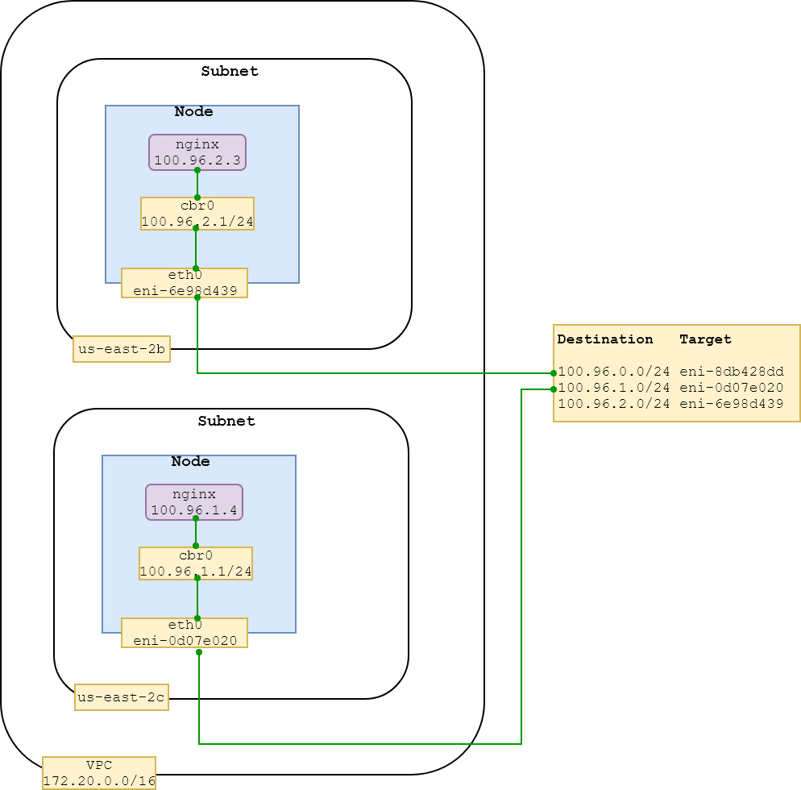

# cloud options
As kubernetes adoption and popularity is growing, we having more options to install and manage kubernetes cluster in simpler way in the cloud. All major cloud providers now provide kubernetes as managed service so you don't need to manage control plane. There are other solutions like kops which also simplify kubernetes installation which we going to use in this chapter. If you have multiple cloud strategy, in my opinion terraform plus kubeadmn is better option. Terraform is very good at infrastructure provisioning and kubeadmn is becoming standard to bootstrap kubernetes cluster.             

kops delete cluster     --name $NAME --yes
aws s3api delete-bucket --bucket $BUCKET_NAME

# AWS networking using kubenet

We going to use kops to create kubernetes cluster which uses kubenet as default networking provider. Kubenet is very simple networking solution for kubernetes and uses main vpc route table to build pod network. It creates routes for each node participating into cluster.     
If this is first time you creating kubernetes cluster AWS, Please use `Appendix B - Creating A Kubernetes Cluster In AWS` for preparation and creating cluster. 

TODO: Need updated kops version in vfarcic/kops docker image

There are some configuration changes in `create cluster` command to reduce number of machines to save some cost. For purpose of this chapter it don't need to be high available so we will only create one master and also we will create nodes in seperate zones from master zone to see our node network more clearly.

```bash
kops create cluster \
    --name $NAME \
    --node-count 2 \
    --node-size t2.small \
    --master-size t2.small \
    --zones us-east-2b,us-east-2c \
    --master-zones us-east-2a \
    --ssh-public-key devops23.pub \
    --networking kubenet \
    --kubernetes-version v1.9.2 \
    --yes
```

We used --kubernetes-version to specify version v1.9.2, we choose this version to use some of the CNI plugin later in this chapter which were not available before.  

Now, lets confirm that all nodes are in ready state. It may take few minutes to spin up whole cluster. Make sure that context is set correctly.

```bash
export KUBECONFIG=$PWD/config/kubecfg.yaml
``` 

```bash
kubectl get nodes
```

```
NAME                                           STATUS    ROLES     AGE       VERSION
ip-172-20-119-231.us-east-2.compute.internal   Ready     node      4m        v1.9.2
ip-172-20-58-200.us-east-2.compute.internal    Ready     master    5m        v1.9.2
ip-172-20-78-73.us-east-2.compute.internal     Ready     node      4m        v1.9.2
```

We have assigned name to the cluster during cluster creation command. Which we will use to identify the AWS VPC our cluster is using. AWS creates default VPC on each account so if you don't pass our cluster name as filter then it will show two VPCs in output.    

```bash
echo $NAME
```

```
devops23.k8s.local
```

```bash
aws ec2 describe-vpcs --filters Name=tag:Name,Values=$NAME --query Vpcs[].[VpcId,CidrBlock] --output text
```

```
vpc-699cb601    172.20.0.0/16
```

We used `$NAME` as filter to know only VPC we have our cluster and also listed VPC CIDR. Below command will output VPC id in `MYVPC`variable which we going to use to list other AWS resources in our VPC.    

```bash
MYVPC=`aws ec2 describe-vpcs --filters Name=tag:Name,Values=$NAME --query Vpcs[].[VpcId] --output text`
```

Below command going to find pod network CIDR or in other words which network range our pods going to use. kops assigns this range and can be configured differently. Since we using `kuebnet` plugin for networking, it is going to create bridges and pods in this network and assign IPs from this network range.

```bash
kops get cluster --full --name $NAME --output yaml | grep -m1 clusterCIDR
```

```
clusterCIDR: 100.96.0.0/11
```

AWS enables networking in VPC by virtual network interfaces called elastic network interface (ENI). When AWS creating an instance It creates and assign default network interface to an instance, called the primary network interface (eth0). You can attach multiple ENI to an instance to build secondary network, We will cover more in detail this topic later in this chapter.  


```bash
aws ec2 describe-route-tables \
    --query "RouteTables[?VpcId=='$MYVPC'].Routes[*].{Destination:DestinationCidrBlock,Target:NetworkInterfaceId}" \
    --output text | grep -v None
```

```
100.96.0.0/24   eni-8db428dd
100.96.1.0/24   eni-0d07e020
100.96.2.0/24   eni-6e98d439
```

We have listed all the routes in our VPC being used by our nodes in the kubernetes cluster. Second value in above output for example `eni-8db428dd` is primary ENI attach to an instance `eth0` and first value is pod subnet on each node. All pods and pod bridge IPs on a node are determined from this network range. Since kops decided to use cluster CIDR as `100.96.0.0/11` all our pod traffic will fall in this range so It created routes to enable cross node network communication in the cluster.

Lets confirm that all the ENI we listed above are assigned to some EC2 node in our cluster. 

```bash
aws ec2 describe-instances \
    --query 'Reservations[].Instances[].[NetworkInterfaces[0].NetworkInterfaceId,PublicIpAddress,Placement.AvailabilityZone,Tags[?Key==`Name`].Value]' --output text
```

```
eni-8db428dd    18.217.45.237   us-east-2a  master-us-east-2a.masters.devops23.k8s.local
eni-6e98d439    18.191.155.116  us-east-2b  nodes.devops23.k8s.local
eni-0d07e020    18.188.63.203   us-east-2c  nodes.devops23.k8s.local
```

We have three EC2 instances running i.e. one master and two nodes each in separate zone and also above output showing `ENI` for each instance which is mapped into route table. 

Now, lets login into one of the node and check the IP addresses and bridge information. We will ssh with `devops23.pem` into instance in zone `us-east-2b` and list IP addresses.   

```bash
ssh -i devops23.pem admin@18.191.155.116

ip addr
```

Removed some output for brevity.

```
2: eth0: <BROADCAST,MULTICAST,UP,LOWER_UP>
    inet 172.20.78.73/19 brd 172.20.95.255 scope global eth0
4: cbr0: <BROADCAST,MULTICAST,PROMISC,UP,LOWER_UP>
    inet 100.96.2.1/24 scope global cbr0
```

kops created `cbr0` bridge on each node in the cluster which is responsible for pods communication on a node and routing to `eth0` if destination IP is outside of the network range configured for the bridge. If we summarize all the details we have observed so far either pods going to communicate on same node with other pods via `cbr0` bridge or if pods on different nodes then `eth0` and vpc route table going to involve in the communication.   

```bash
exit
```

Now, lets create pods to see what IP they are assigned and whether they can communicate across nodes. 

```bash
kubectl apply -f nginx-deployment.yaml
```

```
deployment "nginx-deployment" created
```

Below command will tell us if both pods are running and deployed on two different nodes.

```bash
kubectl get pods -o wide
```

```
NAME                                READY     STATUS    RESTARTS   AGE       IP           NODE
nginx-deployment-6c54bd5869-ltmlv   1/1       Running   0          49s       100.96.2.3   ip-172-20-78-73.us-east-2.compute.internal
nginx-deployment-6c54bd5869-vd8lm   1/1       Running   0          49s       100.96.1.4   ip-172-20-119-231.us-east-2.compute.internal
```

If you noticed each of above pod created on different node and got the IP from respective pod network subnet range assigned to that node by kops. Pod `nginx-deployment-6c54bd5869-ltmlv` created on instance with IP in zone `us-east-2b` whereas `nginx-deployment-6c54bd5869-vd8lm` created in zone `us-east-2c`. Lets visualize this whole setup to see more clearly that how traffic will flow between pods.    



TODO - flow how we got pod network

Lets do a test to confirm wether these pods can communicate to each other. We are going to enter into pod `nginx-deployment-6c54bd5869-ltmlv` hosted on `us-east-2b` and ping pod `100.96.1.4` hosted on `us-east-2c`.

```bash
PODNAME=`kubectl get pods -o jsonpath="{.items[0].metadata.name}"`

PODIP=`kubectl get pods -o jsonpath="{.items[1].status.podIP}"`

$ kubectl exec -it $PODNAME ping $PODIP
```

```
PING 100.96.1.4 (100.96.1.4): 48 data bytes
56 bytes from 100.96.1.4: icmp_seq=0 ttl=62 time=0.771 ms
```

ENIs for the instance type * (the number of IPs per ENI - 1) 

example, t2.small - 2 ENI (4 IPs - 1) = 6 IPs